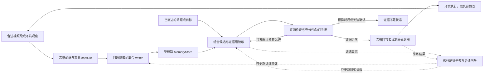

# CVPR 2027 方案设计：面向长视频与长时程具身任务的闭环组合证据记忆

> 设计版本：2026-09-06。目标：CVPR 2027。资源边界：2 张、每张 80GB 显存的 GPU。
>
> 本文继续发展 [BundleMem CVPR 初稿](../../writing/drafts/fqr_bundle_memory_cvpr/main.tex)，将“完整证据组的保留”扩展为“保留、取回、使用和反馈”的完整方法。文献事实、源码核查和数据统计均附来源；算法收益、超参数、工时和继续门槛属于待验证设计。本轮没有运行模型或模拟器。

## 1. 方案结论与范围

推荐主线是 **BundleMem：以未来任务中可取回、可使用的完整证据为目标，学习预算受限的视觉记忆写入和读取策略**。写入端继续使用不看未来问题的集合 critic；读取端新增面向证据组合的检索、缺口检测和预算内补取；训练端用自动构造的历史恢复任务、同预算集合干预和有限任务结果反馈，替代大规模人工最小证据链标注。

研究假设不是“所有历史都能完整保存”，而是：**对预先声明的任务族，在相同持久存储和读取计算预算下，优化完整证据的端到端可用性，比独立重要性打分加固定 top-k 更有效。** 被删除或编码时丢失的证据无法由 reader 恢复；读预算容不下一条完整路径时也无法保证成功。充分性模块输出经校准的判断，不提供无条件正确性保证。

| 层次 | 本轮推荐内容 | 完成标准 |
|---|---|---|
| 主方法 | 来源可追踪的固定容量 capsule；集合写入 critic；组合读取；充分性/缺口控制；离线反馈训练 | Writer 和 reader 可以独立替换，并有端到端及交叉消融 |
| 主证据 | 受控 Video Memory Gym + 自然多证据视频 + 真实长视频外部测试 | 同字节、同前端、同消费者，分别测存储、读取和使用 |
| 具身必做补充 | 一套导航与具身问答适配器，优先 3D-Mem / GOAT-Bench / A-EQA | 包含真实环境交互，及固定观察历史上的记忆隔离实验 |
| 具身优先扩展 | EmbodiedBench 的 EB-ALFRED 高层操作与规划 | 固定技能执行器，测长程目标完成及历史状态使用 |
| 条件扩展 | CALVIN 连续动作操作；更强主动探索；大模型 LoRA/RL | 只有主线成立、环境与权重可运行且预算有余量时开展 |

“导航、长程操作、具身问答、规划”均给出实现和验证设计，但不承诺在两张卡上重训四套智能体。导航/EQA 共享环境，操作/规划共享环境；主要训练对象是小型记忆模块。

本方案参考 [组合保留的既有分析](../../research/ideas/fqr_candidate_motivation_and_nearest_work_2026-09-02.md)、[9 月 5 日方案与数据审计](../../research/ideas/visual_memory_three_proposals_2026-09-05.md)、[9 月 6 日读取和资源讨论](../../research/ideas/visual_memory_cvpr2027_reassessment_2026-09-06.md) 及 [早期文献表](../../research/literature/fqr_mem_2026_literature_evidence.md)。仓库历史提交 `2aa6932` 中的闭环工作规划也作为工程参考；本文件进一步固定组合读取算法、弱标签生成、延迟价值与双预算协议。原稿和历史调研保留。

## 2. 原稿的保留项与必须修改的问题

| 原稿设计 | 继续保留的价值 | 本次修改 |
|---|---|---|
| 最小充分 evidence bundle：组内 AND、组间 OR | 解释“单条召回高，但没有一条完整答案路径” | 从存活率扩展到读预算内的完整路径可达率 |
| 不看未来问题的 set critic | 体现当前集合中的互补性和替代性 | 学习经过 reader 和消费者后的效用；补充前缀的延迟价值 |
| 人工证据标注 + teacher 验证 | 可用于小规模校准和评测 | 主训练不依赖新增人工链标注；已有 QA、伪标签、仿真真值分别披露 |
| 固定 reader | 有利于隔离 writer 的收益 | 保留为隔离实验，完整方法增加组合补取，并做 W×R 交叉比较 |
| 单步 insert/replace 最大化当前 coverage | 动作空间小、工程简单 | 防止未闭合的前缀证据过早被丢弃；使用后续回放价值训练 |
| Stored / Accessed / Used 审计 | 能定位收益来源 | 增加候选/编码上限、读预算不可行、证据过时和动作执行失败 |

两个容易遗漏的结构问题必须在方法中处理：

1. **读取端也有 AND 障碍。** 若问题需要 `{a,b,c}`，当前只取到 `{a}`，分别加入 `b` 或 `c` 都可能不立即提高答案概率。仅按单条即时收益补取，仍会失败，因此要允许小集合扩展与有限 beam search。
2. **写入端有时间上的 AND 障碍。** 流中先看到 `a`、很久后才看到 `b`，只评估“当前已经完成几组证据”会在 `b` 到来前丢掉 `a`。终局 coverage critic 不能未经修改就视为在线长期价值函数。

此外，集合函数可以由一个标量输出表示。论文应比较“不看集合上下文的独立 item scorer”与“看当前集合的条件策略”，不能声称一切标量评分都无法表达互补性，也不能套用普通次模覆盖的贪心近似保证。

## 3. 文献定位：已有方法限制了哪些创新主张

本节为截至 2026-09-06 核查的一手资料摘要。2026 arXiv 文献默认按预印本处理；不将作者实验结果当作本项目复现结果。

| 直接近邻 | 已有工作覆盖的事实 | 本方案需要额外证明什么 |
|---|---|---|
| [EMBER][ember] | 问题隐藏的预算保留；source-backed capsule；Survive–Read–Answer 结果反馈训练 | 视觉证据组的互补/替代结构能带来独立收益；严格总字节与读成本核算；更低成本训练。不能称其为纯 item-wise 或没有闭环 |
| [OSL-MR][osl] | 明确建模非可分的长期记忆效用；采用逐 memory 的 evidence-membership 学习以降低难度 | 低成本集合监督是否比逐条 membership 有用，尤其在多段联合必要时 |
| [REVEAL][reveal] | 显式充分性判断、缺口分析及针对性再检索；有自动 rubric 构造 | 在不可回放、已经被压缩的有限记忆中识别可补取收益；不能把一般 retrieve–verify 循环当新贡献 |
| [CausalMem][causalmem] | 用在线语义基更新固定容量视觉 token memory，支持 Qwen2.5-VL / LLaVA | 组合效用优于语义残差/新颖性，并在原生实现和统一表示两层说明差别 |
| [Mem-T][memt] | 通过操作树和 hindsight credit 联合优化记忆构建与多轮检索 | 本项目不能宣称首次联合优化读写；应证明视觉来源、完整组与预算约束下的轻量学习价值 |
| [TaskMem][taskmem] | 根据环境任务反馈学习多模态记忆重点，并在无原视频回看的流式设置评估 | 对完整视觉证据的可访问性、弱监督效率及跨任务迁移做更直接测量 |
| [Memo][memo] | 用 RL 学习具身任务中记忆的形成与访问，包括多对象导航 | “将记忆用于具身”和“读写 RL”均已存在；补充实验应检验同一组合机制 |
| [3D-Mem][3dmem-paper] / [MemoryVLA][memoryvla] | 分别提供多视图场景记忆与具身探索，以及操作中的感知/认知记忆 | 保留既有控制与感知能力，在可核算预算下证明记忆选择与取回的贡献 |
| [WorldMemArena][wma] | 将多模态记忆放入行动与世界交互中考察 | 沿用阶段诊断思想，并将它用于反驳“存得好就一定用得好”的假设 |

可辩护的新意应收敛为三点，均以实验成立为前提：

- **问题与证据：**完整组“存下但读不全”是独立于 item recall 和纯 storage coverage 的瓶颈；在自然视觉、长时间间隔和具身再利用中可观测。
- **方法：**一套以可取回、可使用的组合效用为共同训练目标的轻量读写策略，在固定持久预算和总读取成本下改善任务表现；明确处理前缀价值与组合补取。
- **训练：**不新增大规模人工 evidence-chain 标注，利用来源可验证的自监督代理、集合干预和自动反馈学出有效策略，并给出监督来源和总成本的消融。

仅把现有 writer、REVEAL 式 verifier 和图记忆拼接起来，或只证明自动造题能降低标注量，不足以支撑主要创新。

## 4. 统一协议与优化目标

### 4.1 区分视频与具身的信息条件

| 协议 | 写入端当时可见 | 请求与再观察规则 | 科学用途 |
|---|---|---|---|
| V：query-after-write 视频 | 当前及已观察流、合法侧信息、预算内记忆；无测试问题/答案 | 流结束或检查点后公布 q；只读冻结记忆，不回看原视频 | 主协议，直接延续初稿 |
| E0：先探索、后请求 | 探索观察和动作；未来目标未揭示 | 在检查点公布导航目标/EQA；固定快照模式下不再观察 | 与 V 最接近的具身记忆隔离实验 |
| E1：原生交互任务 | 已公开的当前指令、当前观察、允许的动作反馈；无后续隐藏目标 | 可导航/操作并产生新观察；每一步都计动作和感知成本 | GOAT、A-EQA、EB-ALFRED 的补充性闭环验证 |

E1 中“知道当前任务”是合法信息，不能将其结果标成完全 query-free。GOAT 的后续目标逐个揭示，不能一次把整条任务列表交给 writer。探索轨迹受当前目标影响时，即使 writer 不显式接收目标，也不能据此声称观察过程与目标无关。

V/E0 的每个视频/场景检查点只生成一个 `snapshot_id`，所有问题共享该快照，问题之间重置 reader 临时状态；测试权重固定。E1 允许同一 episode 内记忆更新，但不能从隐藏金标、测试评分或其他测试 episode 学习参数。终局 scoring 与在线可见 feedback 分离。

### 4.2 记忆表示：固定载荷优先

一个 capsule 保存真实观测载荷与有上限的检索元数据：

```text
capsule_id, observed_time_start/end, payload, payload_codec
visual_key, optional_text_key, source_observation_ids
optional_pose, observed_entity_links, version_links, confidence
serialized_bytes, checksum
```

`source_observation_ids` 是来源标识，不是重新访问已删除原图的路径；视频/场景文件名、绝对 ID 和标签组 ID 不进入学习特征。对象/关系由部署前端从可见输入估计；仿真 object ID、金标事件边界和人工 evidence description 不得作为免费检索键。所有额外文字、索引、状态和关联都计入预算。

**MVP 的建议默认值，需先经候选召回 pilot 调整并冻结：**

- 视频每 2 秒形成一候选段，从该段内按固定规则采 4 帧，分辨率先用 224×224。不跨越当前时刻取未来帧；最多接受 2 秒分段等待，单列 ingest lag。
- 使用可由任意消费者重新编码的 RGB 载荷，先不学习 latent codec。每槽建议上限 640 KiB：4 帧 RGB uint8 为 602,112 bytes，余下 53,248 bytes 用于 key、元数据和确定性填充。
- 共用索引/目录预留 64 KiB；`K = 32/64/128` 槽对应上限约 `20.0625/40.0625/80.0625 MiB`。这些是设计字节，不是模型实测显存。索引放不下时减少可用槽，不能免费溢出。
- 主实验采用固定码率槽，以隔离选择算法。JPEG/WebP、分辨率变化、动作片段编码和 VLM latent payload 放在独立 codec 实验中，按实际序列化成本比较；不由 token 数换算不同方法的存储公平性。
- 4 帧可能漏掉快速动作、小字和细小状态变化。先测候选/codec 上限；若不足，统一提高采样率或改固定片段规则，重新冻结所有方法输入，不能只给本方法补帧。

同一实体的历史状态和最新观察并存时用时间/版本链接关联。新观察可以标记旧断言已被后续观察取代，但不能凭“未再看到”断言对象已消失，也不能把计划中的动作写成已发生事实。状态更新机制是操作验证所需的最小支持，不另做大型知识图谱主张。

### 4.3 两类预算，外加完整成本账本

持久预算在每个更新后的可继续执行状态上满足：

$$
\operatorname{Bytes}(M_t^{payload},M_t^{keys},M_t^{index},M_t^{state},M_t^{buffer})\le B_M.
$$

当前输入段可作为固定大小的临时 ingest buffer；若跨下一段继续保留，必须转为上述预算内状态。模型共享权重不算 episode 记忆，但跨步 KV、对话消息、生成摘要、动作历史和未清理的特征缓存算持久信息。内存对象开销与磁盘文件大小另报，不以序列化预算伪装峰值 RAM/VRAM。

读取至少同时限制：单次上下文 `L_ctx`、每个问题累计处理 tokens `C_read`、加载 payload 字节、VLM 调用次数 `J` 和延迟。重复提交同一证据给 verifier/answerer 的 tokens 仍计累计成本；缓存命中单独报告。建议起点为 `L_ctx≤8K`、`C_read≤24K`、`J≤4`，不是所有问题都花满预算。

具身模式额外记录 `B_map`、导航/动作数、路径长度和新观察成本。首轮使用同一个有上限的几何导航地图控制器，固定 `B_map` 并扫描 `B_M`；同时报告 `B_total=B_map+B_M`。对象语义、身份和属性不得偷偷进入不计费地图。地图本身可完成任务的程度用 map-only 基线测量；原生无界地图结果另列为系统参考。

### 4.4 从“存活”到“可用”的目标

令 `C` 是固定候选/codec 后的证据宇宙，`E_q={E_q,1,...}` 是问题 q 的充分组族。受控 Gym 可有精确结构；真实视频只掌握经核验的若干路径，不默认穷尽。

$$
A_{store}(q,M)=\mathbf1[\exists E\in\mathcal E_q:E\subseteq M],
$$

$$
A_{access}(q,M;R)=\mathbf1[\exists E\in\mathcal E_q:E\subseteq Z_R(q,M)],
\qquad Z_R(q,M)\subseteq M.
$$

定义 `s_D(q,Z)` 为固定消费者的答案与来源 grounding 联合得分；在具身回放中换为经真实执行测得的任务效用。写入与读取共同优化：

$$
\max_{\phi,\psi}\;\mathbb E_{(O,q)\sim P_{train}}
[s_D(q,R_\psi(W_\phi(O),q)) - \lambda C_{read}]
\quad\text{s.t. }B_M,L_{ctx},C_{read},J\text{ 的硬上限}.
$$

Gym 中 `s_D` 可替换为精确 `A_access`；真实数据的软得分只能当操作性近似。模型可能在证据不足时猜对，所以普通 answer accuracy 不满足上述嵌套关系，必须另报 joint-grounded success 与干预结果。完整族下有 `A_access≤A_store`，不意味着所有“答对”都是真正使用证据。

关键扩展是**可解码且可取回的任务效用**：存下一组极难检索或远超 read budget 的证据，应当与存下一条紧凑可用路径区别对待。但 reader 弱不能成为永久丢弃困难任务的理由：同时保留 storage 辅助标签、任务组均衡和诊断上界。

## 5. 部署方法：读取必须具体到动作、状态和停止条件

### 5.1 模块与数据流



视频测试时不走环境回环，且不由正确答案更新记忆。图中的训练回路只在训练数据上使用；部署回路只使用真实可见的新观察/动作反馈。

### 5.2 写入：集合决策与延迟价值

`W` 从当前 `M` 和候选 `c_t` 中选择 `skip / insert / replace(j)`；只对合法预算内动作评分。MVP 使用冻结视觉特征、时间、质量、占用率和可见关系，输入一个 5M–20M 参数级的集合网络。组别先设身份关联、时间顺序、状态变化、空间关系、计数/覆盖、一般描述，最终按训练数据合并。

纯终局版本可预测 `V_phi(M)`：从这个快照经固定 reader 后的平均任务效用。在线版本必须学习：

$$
V_\phi(m,t)=\mathbb E_{\omega,q}
[s_D(q,R_\psi(M_{end}^{\pi}(m,\omega),q))\mid\text{截至 }t\text{ 的可见状态}],
$$

其中 `omega` 是训练分布中的后续流，`pi` 是固定版本的续写策略。训练时通过后续回放给前缀打标签；部署时只输入 `m`、已过时间、预算与当前观测，不能输入具体未来片段、未来目标或 teacher 构造的组 ID。函数表达训练分布下的后续期望，不声称求得真实因果最优。

执行时先用共享便宜分数提出 8 个可淘汰候选，再用集合 critic 比较最多 10 个动作；`K≤32` 时同时测全动作版本，报告预筛选动作覆盖率。集合 encoder 用显式时间特征保持时序语义，并对输入排列等变/不变；不能通过数组位置偷读 gold 排序。

若前缀价值 pilot 不稳定，使用一个**计入 B_M 的短期保留区**作为工程保底，例如固定保留最近 `max(1,floor(0.1K))` 槽，再对剩余槽学习长期选择；所有关键基线给予相同保留区。它能推迟删除，却不能解决任意长延迟。比较“无缓冲 / 同缓冲 / 延迟价值”，防止把 FIFO 的效果算成集合学习效果。

组均衡先使用固定采样配额和均值效用，确认主现象后再加入较弱的 worst-group 项。初稿中的 soft-min 作为消融，暂不将分布鲁棒优化做第二条主线。

### 5.3 读取状态与候选生成

对每个新请求维护临时状态：

```text
request, requirement_hypotheses, selected_ids, visited_ids
unsupported_requirements, conflicts, remaining_read_budget
attempted_queries, predicted_sufficiency, stop_reason
```

第一轮通过冻结图文检索键及可选文本检索得到最多 32 个候选 ID；以时间邻接、同实体不同时间/视角和版本关系提出额外 ID。索引仅覆盖仍存活的 capsule；缺失依赖只能成为“可能缺证”的元信息，不能替代被删除的 payload。

需求拆解先采用固定任务槽模板加一次短输出解析，避免每轮自由规划。例：“后来打开门的人从谁手里拿到钥匙”包含人/物关联、交接和使用三个待支持关系。槽是模型提出的假设，不是金标准。留出一个时间覆盖/全库轻量检索分支，防止需求拆解错误后所有搜索都锁死在同一假设。

### 5.4 组合读取：避免 top-k 与单步 gain 的共同缺陷

读取头 `F_psi(q,Z)` 估计**这个证据集合**的可用性，而不是只预测各条与 q 的相似度。建议采用 beam width 4、最大 3 次扩展：

1. 用前 4 个高质量候选建立不同 seed；候选质量相近时保留不同实体/时间假设。
2. 每个 beam 同时考察单 capsule 扩展与来自关系/时间邻接的 2–3 capsule 组合扩展，避免“每条单独零增益”的 AND 障碍。
3. 每步最多重排 16 个有来源且可装入剩余读预算的集合；共享缓存特征，集合头完成筛选，VLM 不逐个调用。
4. 对最佳集合加载真实 payload，按时间、实体及来源 ID 打包；在 VLM 看到的 token 数超上限时淘汰整个候选组或选择另一条路径，不任意截断一条必要组。
5. 检查真实 payload 的支持关系，再决定下一轮。集合分数只能缩小搜索，不能让未加载图像成为已验证证据。

组内扩展上限不是语义限制；更大的证据组可跨轮累积，但超过允许读取预算仍可能失败。候选集和 beam 均可能漏掉路径，应对小实例提供全子集搜索参考，并在真实子集检查“已存完整组是否进入过 shortlist”。

### 5.5 充分性、补取收益与停止

保留三个可审计输出：

- `sufficiency_score`：在给定消费者下，当前真实 payload 是否支持回答/行动前置条件。
- `missing_requirements`：尚无来源支持的身份、顺序、状态、位置等关系；同时返回冲突与时效问题。
- `recoverable_gain`：从**剩余存活记忆**继续读取的预期净收益；区别于一般答案熵。

规则先确定性执行：所有 ID 存活、时间未越界、来源可追踪、引用确实在 packet 内、预算充足。语义判断先用冻结 VLM 和固定短 rubric，再蒸馏到小头；两者交叉校准。训练分别构造“证据已在库但未取到”和“当前库/预算下找不到已知可行路径”的情况。

读取动作包括 `expand_relation / expand_time / try_alternative / broaden / stop`。只有当预期补取收益大于读成本阈值、预算允许且还有新候选时继续；达到充分性阈值并通过来源检查才进入正常回答/规划；无新来源、预算耗尽或相互矛盾时返回 `insufficient / unresolved`。自然数据中无已知路径时只能说“尚未找到支持”，不能断言真实世界不存在证据。

标准 benchmark 若要求强制答案，仍输出最佳答案并报告原指标，同时保存不足标志；另报风险—覆盖曲线，不能靠大量拒答提高“选择后准确率”而隐藏覆盖率下降。具身模式下不足状态可以触发重访/再观察，但属于有成本的行动，不属于免费记忆读取。

最终 packet 包含 `payloads / evidence_ids / timestamps / supported_relations / unresolved_relations / conflicts / costs`。消费者必须在答案/子目标上绑定来源 ID；绑定本身只证明引用存在，是否真正使用仍需删除、替换和注入实验验证。

### 5.6 具身更新与行动反馈

每次真实执行后，将“执行动作、观测结果、允许的成功/失败信号”形成新候选，再调用同一个 writer。动作请求与动作结果分字段记录，未知结果不填成成功；历史状态与最新观察分版本，当前任务不应误用旧状态。

为隔离记忆作用，主具身实验固定高层规划提示、低层控制器、检测器和动作集合。在线权重不更新。若后续研究测试时效用自适应，应另设协议，明确 feedback 来源和 episode 边界，不混入主结果。

## 6. 弱监督与自监督：文献结论和可执行训练配方

### 6.1 采用混合自动监督，而不是无条件承诺纯自监督

大规模人工最小充分链既贵，也不完整。可以取消其作为默认训练前提，但仅靠像素/特征重建无法识别未来任务偏好，也不保证源证据被真正利用。

推荐论文表述是：**记忆模块主要从未标注观察序列、来源绑定的自动探测任务和环境反馈学习，不需要新增大规模人工证据组标注。** 是否能进一步称为自监督方法，取决于 S0 单独训练的真实结果。已有基础模型、已有 QA 和人工演示的监督不能消失在“零标注”措辞中。

| 方法族与一手依据 | 可利用的信号 | 本方案取舍与局限 |
|---|---|---|
| [TCN][tcn] 的时间/多视角对比 | 同时刻不同视角的对应，邻近但不同状态的对照 | 训练跨视角 key 和同实例关联；时间相近不等于状态相同，自然单目跟踪结果属于伪标签 |
| [V-JEPA 2][vjepa] 的潜空间预测 | 未标注视频中的时空预测任务 | 可冻结既有表征，用小头做辅助恢复；不重训世界模型，也不把预测损失当任务充分性 |
| [MemTrain][memtrain] 的终局与中间记忆恢复 | 不依赖下游 QA 的遮蔽历史目标 | 借鉴多检查点恢复与终局记忆约束；其文本结论迁移到视觉需独立验证，GRPO 训练配方不直接照搬 |
| 弱监督 temporal grounding，[CPL][cpl] | 视频—句子配对，无精确时间边界；视频内难负例 | 用 MIL 提出潜在证据组，降低边界标注需求；高相关片段不必是充分组，需干预复核 |
| [HER][her] | 根据轨迹实际达到的结果重标训练目标 | 从自然重访/完成状态构造 hindsight 请求；未来只供生成标签，不进入过去 writer；成功 relabel 不等于原任务成功 |
| [MemRL][memrl] | 冻结推理模型，利用环境反馈更新记忆效用和检索 | 作为 relevance+utility 简单基线；单条效用不足以证明组合性，文本任务结果不能替代视觉验证 |
| [Mem-T][memt]、[Memo][memo]、[TaskMem][taskmem] | 延迟结果、读写操作或具身任务回报 | 支持无需逐操作人工标签；完整 RL 成本和探索方差较高，放在小型离散策略的可选后续阶段 |

### 6.2 四种监督等级与数据账本

| 标识 | 可用输入与目标 | 是否新增人工 evidence | 术语 |
|---|---|---|---|
| S0 | 未标注训练视频；确定的增强/同步对应；遮蔽后恢复已有观察的特征/关系结构 | 否 | 自监督代理任务 |
| S1 | 冻结模型产生的对象、描述、问题、答案、关系与置信度 | 否，但有 teacher 推理成本 | 伪标签/模型弱监督 |
| S2 | 训练模拟器状态、事件日志、任务成功、动作执行结果 | 否，但有环境设计和生成成本 | 自动监督/特权训练 |
| S3 | 已有训练 QA，或已有时间证据/演示 | 取决于数据来源；本项目新增量可为零 | 任务弱监督或已有强监督，分别报 |

主配方推荐 **S0 预热 + S1/S2 配对效用训练**；已有 QA-only 的 S3 是便于落地的平行支线，已有 evidence 的 S3 是训练上限参考。训练、校准和人工审计各自按 video/scene 隔离。审计真值不回流训练或选择阈值。

公开结果至少记账：新增人工 QA/链数量、已有人工 QA/演示规模、S0 样本量、伪标签数和通过率、仿真轨迹数、VLM 总调用和 GPU 小时、人工审计小时。仿真 state ID 只由 teacher/evaluator 使用，student 只能看到 RGB/合法传感器和可见反馈。

### 6.3 代理任务：让“取回历史”成为完成任务的必要步骤

| 自动任务 | 构造与目标 | 防捷径条件 |
|---|---|---|
| 延迟重现检索 | 训练流后部选择 anchor，检索早期同实例/同事件来源 | 去掉文件名/序号对应；同类不同对象为负例；anchor 本身不能直接给出目标历史属性 |
| 遮蔽历史恢复 | 把早期对象的颜色、位置、先前状态或事件角色作为待恢复量 | 输入遮蔽目标字段；测试无记忆、只看当前帧、只看时间键，若可轻易回答则剔除或降权 |
| 前后状态与顺序 | 两个已观察时点之间恢复状态差异、动作顺序和参与对象 | 随机化绝对时间/对象命名；反转顺序或换同类对象；关联不可靠时标 unknown |
| 组合补全 | 在可靠的多个来源中构造完整组、缺一项、错身份、旧版本及替代组 | 自然数据先验证“共同必要”，不能把任意两帧强行标 AND |
| 中间检查点 recall | 每个训练流采多个检查点，从当前预算内记忆恢复历史目标 | query/probe 只进入训练标签通道；不允许检查点后信息用于前端特征 |
| 仿真 hindsight 任务 | 从已经观测到的达成状态构造位置/对象/子目标请求 | 目标必须可实现、对应真实轨迹；不可见世界状态不当作已观测证据 |

S0 中纯特征恢复主要训练来源检索和局部表征；由 VLM 命名的“红杯子、已清洗”等语义目标归 S1，由模拟器命名归 S2。不能因为训练数据是视频就把所有标签都叫自监督。

### 6.4 弱标签生成：从潜在证据组到可用的集合偏好

建议以 2,000 个训练 probe 起步，每个 probe 最多 8 次短 VLM 调用，复杂组进入后续小额复核池。缓存冻结前端特征，尽量让多数样本无需反复调用 VLM。

1. **先按 video/scene 划分。** 只从训练源产生 probe；所有后续组合、反事实和变体继承同一 split。
2. **提出组。** 用 query-known 检索在训练视频上取最多 12 个候选，以 beam 提出 2–4 个、每组通常 2–4 capsule 的集合；query-known 只在 teacher 中合法。
3. **验证来源和完整表现。** 保留能回答/恢复目标且有来源支持的集合。只做“模型答案相同”会保留语言猜测，需无记忆、视觉替换或状态扰动控制。
4. **做局部删除/替换。** 优先测试最关键 2–3 项；高置信的小集合才做完整 leave-one-out 或所有真子集检查。无法在调用上限内验证的样本留 `partial_verification`，不授予精确最小组标签。
5. **保留替代路径。** 若删掉一条后仍能成功，先搜索其他已存路径，不强制判成噪声；不同来源的成功组都可保留。观察不到替代组不是其不存在的证据。
6. **构造预算匹配的偏好。** 用无关但长度/视觉相似度接近的 capsule 填补删除项，得到同槽数/同 token 上限的 `C+ / C-`；完整性不同、item recall 相近的 pair 优先。
7. **unknown 单独保存。** 未核实的组、不稳定回答、模型分歧和无法判断的“无证据”不强行当负例；低置信样本只用于检索对比或给低权重。

leave-one-out 失败只给出“在该验证器下逐项不可删”的操作性结论。真实消费者可能非单调：一条信息删除后失败，并不排除删掉更多干扰项又成功。因此自然数据默认称“经局部干预核验的充分组”，不称数学上全部最小充分集合。

若使用 QA-only 训练，可把组作为潜变量做 multiple-instance 学习：

$$
\mathcal L_{MIL}=-\log\sum_{E\in\widehat{\mathcal E}_q}
p_\psi(E\mid q,M)\,p_D(y\mid q,\operatorname{payload}(E)).
$$

MVP 不反传整个消费者，只用缓存的组级评分训练小 reranker。MIL 易偏向语言可猜、单条显著、但不完整的证据，因此加来源检查、同视频难负例及完整/缺一对照；它是候选和弱训练机制，不是充分性证明。

### 6.5 Reader 和 writer 的训练目标

读取头学习三类任务：来源匹配/组排序、当前组充分性、补取动作的净收益。对同一 `(q,M,Z)` 实际尝试小量合法读取动作 `a`，以固定消费者测：

$$
\Delta_R(a)=s_D(q,Z\cup E_a)-s_D(q,Z)-\lambda\Delta C(a).
$$

`E_a` 可为 2–3 个 capsule，因此读动作不会被单项零收益锁死。`stop` 的回报基线为 0；拟合收益与偏好即可，先不做大模型 RL。读预算容不下一组、即使遍历现有库也无已知路径、以及来源冲突，分别提供停止训练实例。

写入头使用两类标签：快照在固定 reader 下的组均衡效用；同一前缀采取不同记忆动作后、经相同续写策略和后续流回放得到的终局差异：

$$
\Delta_W(a,b)=\frac1{|Q_{train}|}\sum_q
[s_D(q,R(M_{end}^{a},q))-s_D(q,R(M_{end}^{b},q))].
$$

训练 query 及未来流只提供离线标签。相同前缀、相同后续序列/随机数降低方差；动作改变会影响未来观察的交互环境，必须复制模拟器状态后真实执行各分支。只有离线视频时能比较记忆操作，不能把未执行的机器人替代动作当反事实结果。

总损失建议保持简单：

$$
\mathcal L=\lambda_0\mathcal L_{self}
+\lambda_1\mathcal L_{value}
+\lambda_2\log(1+\exp[-\operatorname{sign}(\Delta)(V(C^+)-V(C^-))])
+\lambda_3\mathcal L_{read/suff/gain}.
$$

损失按可用标签 mask；`|Delta|` 太小或评价不稳定时不生成偏好。保留一项可靠的 storage coverage 辅助监督，防止固定 reader 的短板让 writer 放弃整个困难组。先用固定配额平衡题型/延迟；不在第一版叠加多个鲁棒损失。

这些干预估计的是给定模型/策略对输入记忆变化的响应，不证明真实物理事件的因果关系。作者在论文中必须保持这个用语边界。

### 6.6 交替训练、标注质量与数据效率

| 阶段 | 执行方案 | 结束条件 |
|---|---|---|
| T0 | FIFO/多样性 writer + top-k/组合 reader；冻结全部模型 | 流、存储、读取、结果和成本日志跑通 |
| T1 | S0 训练来源 key/组表征，使用多检查点代理任务 | 优于无记忆和时间键捷径基线，未见轨迹也有效 |
| T2 | 固定混合 writer 快照，S1/S2/S3-QA 训练 reader 与 suff/gain | 在同快照同预算下提高 Accessed 和真实任务效用 |
| T3 | 冻结 reader，用预算匹配集合和前缀后续回放训练 writer | 两个以上预算点的 Stored/Accessed/任务结果趋势一致 |
| T4 | 以当前策略补采状态，最多 2–3 轮交替更新 | 优于独立训练；若无增益保留 T3，避免无止境重标 |
| 可选 | 小型离散策略的 contextual bandit / 短程 RL | 已证实是动作探索/延迟 credit 瓶颈且 GPU 预算允许 |

每轮冻结 teacher、消费者和数据版本；旧标签记录对应 reader 版本，不能无说明地混合非平稳奖励。训练尽量覆盖简单 writer 和当前 writer 的混合状态，避免 reader 只适应自己训练时生成的快照。

最低质量控制：来源绑定、同视频/同类对象难负例、无记忆可回答过滤、人工盲审及第二消费者复验。第二模型同意仍可能共同犯错，因此不能替代审计。建议最终人工审计 200 个自然 probe，每例两人各 3–6 分钟，另留分歧复核时间，合计约 20–40 人时加复核；这是规划估算。

必须报告 `S0 only / S1-S2 only / S0+S1-S2 / QA-only / evidence-supervised reference`。进一步比较 0、100、500 个已有训练 evidence 问题的适配收益；标签来源、调用量和训练规模都要匹配/报告。主配方可以不新增人工链，但上限实验若使用已有标注，不能仍记为零监督。

### 6.7 首轮小模块配置与训练记录

以下是可直接用于 pilot 的起始配置，未经实验验证；在训练/开发 split 上调整后冻结。冻结图文编码器输出的视觉/文本向量分别过小投射层；不把冻结 VLM 的任意隐藏向量当作另一家族消费者可直接解码的 payload。

| 配置 | 起始值 |
|---|---|
| 集合编码器 | hidden 384、4 层、6 heads、FFN 1536；显式相对时间/质量特征；按来源槽 mask |
| Writer head | query-free pooling + 组别价值；prefix/terminal 样本用类型标记区分 |
| Reader head | 2 层 query-to-set attention，输出组分数、sufficiency 与 action gain；query 只在此路径进入 |
| 参数与精度 | 目标总可训练参数 5M–20M，实际创建后统计；缓存 BF16/FP16，损失累计 FP32 |
| 优化 | AdamW，学习率先试 `1e-4 / 3e-4`，weight decay 0.01，gradient clip 1.0 |
| 批量与步数 | 有效 batch 64 组/配对样本；最多 10K update，按 video/scene 留出效用早停 |
| 损失起点 | value/rank/read 各 1，self 辅助 0.1；按标签 mask 和组采样归一化，之后只做小网格 |
| 种子与存档 | 17/29/43；保存配置、数据 manifest、teacher/reader 版本、样本来源及模型选择依据 |

每条监督记录至少含 `source_split / video_or_scene_id / prefix_end / visible_fields / memory_action / retained_ids / reader_version / probe_origin / reward_components / verification_status / teacher_version / seed`。训练状态中每个 retained ID 都必须属于当时可见且尚存的来源；teacher 的完整历史缓存放在独立进程/路径。验证 checkpoint 的主要准则是留出任务效用与预算，不用训练 reconstruction loss 替代下游效果。

## 7. 数据与下游任务：让每项实验回答一个明确问题

### 7.1 视频主线与数据可获得性

| 数据/任务 | 推荐使用方式 | 证据与局限 |
|---|---|---|
| 自建 Video Memory Gym | 自动生成身份交接、状态变化、顺序、替代路径；主要 CPU 枚举 | 精确组标签来自生成规则；用实际视觉渲染验证感知，纯符号版本只能测优化 |
| [EG-VQA][egvqa-code] | 开发数据和真实组合机制评测；train 内再分校准集 | 公开 QA/时间证据、评分代码；原视频需从源数据取得；不默认每个标注段都必要 |
| [LongVideoBench][lvb] | 优先真实长视频外部测试，预先分层覆盖时长/任务类型 | 官方提供视频、字幕和 loader；不是完整 bundle 数据，机制分析需审计小子集 |
| [S-EMBER][sember-code] | 可选第一视角流式检索外部测试 | [数据页][sember-data]要求申请访问；不作为必须取得的训练依赖，不混同文本 EMBER |
| [OpenEQA][openeqa] | 固定历史具身问答，连接自然视频和环境交互 | 历史/问题/评测可复用；静态 EQA 不证明主动导航或操作能力 |

本次重新获取了 EG-VQA 固定仓库版本的 `train.json`、`test.json` 并计算以下统计，复核了既有报告的时长结论：

| 元数据统计 | 训练 split | 测试 split |
|---|---:|---:|
| 视频数 / QA 数 | 1,731 / 8,949 | 336 / 2,889 |
| 至少两段 evidence 的 QA | 7,592（84.8%） | 2,490（86.2%） |
| 最大相邻证据间隙 ≥60 秒的 QA | 567 | 230 |
| 最大相邻证据间隙 ≥180 秒的 QA | 37 | 6 |
| 视频时长中位数 / 最大值，秒 | 140.88 / 917.0 | 162.59 / 616.3 |
| 视频时长 ≥30 分钟 | 0 | 0 |

来源：[训练 JSON][eg-train]、[测试 JSON][eg-test]。计算按 `evidence.timestamp` 起点排序，用后一段起点减前一段终点求相邻间隙最大值；不是合并区间后的最大无覆盖空隙。此处只做元数据审计，没有测试模型。**EG-VQA 适合组合机制，不能单独支撑超长视频主张。**

首批训练只处理约 20–50 小时可取得的视频/轨迹，生成 20K–50K 廉价 S0 样本、2K 需要 VLM 复核的 probe；这些是配额而非已取得数据。开发初期用约 200 个多证据问题做现象审计，最终扩至独立留出视频上的足够样本。可用原视频低于预选 manifest 的约 80% 时公布缺失分布并调整来源，不默默删掉难例。

EG-VQA `metadata.segments`、`evidence.description` 和金标时间边界仅供训练/评估，不作为测试 caption 或事件检测输入。LongVideoBench 原 loader 将问题/选项与帧和字幕组合；接入时必须先单独 ingest 视频，封存快照后再加载问题。全视频字幕只有在逐时到达且纳入预算时才可作为 writer 输入。

### 7.2 导航：先观测、后目标，再测真实任务链

优先复用 [3D-Mem][3dmem-code] 的 Habitat/GOAT 入口，并对照 [GOAT-Bench 原任务][goat-paper]：其 episode 包含 5–10 个连续目标，目标可为类别、语言或图像。它适合研究跨子任务经验，但完整表现还受地图、探索和识别影响。

设计两组互补实验：

1. **固定探索历史（E0）。** 每个场景用同一轨迹采集观察，按相同规则冻结不同 writer 的记忆；之后公布目标，测目标实例/位置检索与 packet 充分性，E0 测量到此结束。若继续用固定导航器执行到目标，则作为后续 E1 测量；导航中的新观察不能重新计入“最初记忆检索成功”。
2. **原生顺序交互（E1）。** 从相同场景、起点、任务序列与随机种子开始，保留跨子任务记忆，真正执行各方法。只给当前目标，后续目标不可见；报告整体 SR、SPL、每个子任务位置的 SR/SPL、重复探索距离及首次取回正确目标的时刻。

重点切片是“目标以前见过但当前不可见”“外观相近实例”“很久后重访”“曾见位置与当前观察冲突”。固定布局的导航不能充分验证状态更新；动态对象变化放到单列派生任务或操作环境，不在原生 GOAT 分数中混入改动。

基线包括原生 3D-Mem、同预算多样性快照、相同几何地图但无语义记忆、独立 item writer，以及完整 BundleMem。原生系统未施加相同预算时只作为系统参考；所有主要对比用同一本地消费者和执行器。

### 7.3 具身问答：历史读取与主动找证分别测

- **静态历史 EQA：**从 OpenEQA 历史产生一个共享快照，问题后到；测可追踪历史的回答、错误引用和读取成本。沿用官方 judge 才能与其分数直接比较；改为本地 judge 时命名并校准，另报人工一致性。
- **主动 EQA：**用 3D-Mem 的 A-EQA 接口，允许读取失败后导航到候选位置获取新观察；分别记账记忆补取次数和物理再观察成本，报告质量—路径长度曲线。
- **强对照候选：**[Pred-EQA][pred-eqa] 已提供本地 VLM 服务方式，可作为主动 EQA 备选及更强搜索对照。它知道当前问题，属于 E1。

A-EQA 与同一 Habitat 场景上的 GOAT 不是两个独立领域，论文不要夸大跨域数量。固定历史 EQA、多目标导航和高层操作应各有清楚的协议标签。

### 7.4 长程操作与规划：先做高层动作链

首选 [EmbodiedBench][embodiedbench] 的 EB-ALFRED：复用感知、动作接口、执行器和成功判据，在 planner 输入前插入 evidence packet。它降低控制训练成本，但其高层技能执行不等于本项目获得了新的低层操作能力。

关注的问题包括：先前把哪个相似对象放入哪个容器、某物体是否已加热/清洗、子目标是否已经执行、动作失败后应保留哪段反馈。任务成功由环境真实执行判定；不只让模型离线写一段看似合理的计划。

分开两种配置：

- **原生反馈配置：**完整保留基准默认允许的反馈，使结果可以与原任务比较，同时测 text-feedback-only 基线，识别文本是否已替代视觉证据。
- **严格视觉记忆配置：**只提供 RGB、已公开指令、当前可用动作、执行成功/失败等预先声明的字段；隐藏 `object_states`、`task_progress` 和泄露隐藏对象位置的详细文本。这是本项目派生协议，不能称原生 leaderboard 成绩。

最终指标包括任务成功率、子目标完成率、额外/无效动作数、旧状态误用率、长程链全部完成率和按链长/干扰步数分层结果。用场景和任务组合划分，禁止对完整公开测试集合训练记忆模块；仿真新任务从训练场景/训练模板生成。

若有稳定的冻结连续动作策略和公开权重，再接 [CALVIN][calvin]：报告连续完成 1–5 个任务的成功率和平均完成链长，记忆只影响高层子目标/输入上下文。CALVIN 的连续控制接口不能用 EB-ALFRED 高层技能调用冒充。MemoryVLA 是重要对照，但其仓库训练示例为 8×A100，且若干 checkpoint（含 CALVIN 表）仍标 TBD；当前不把完整训练或未发布权重纳入硬依赖。[仓库][memoryvla-code]

### 7.5 防止长任务等同于记忆任务

所有具身任务先做无历史、最近窗口、文本反馈、地图和完整历史对照。若当前帧/动作菜单/地图已能决定下一步，长任务也未必依赖长期视觉记忆。主要机制子集应要求：关键观察此前出现、当前不可见、存在实际延迟/干扰，且替换相关历史会影响结果。

固定观察的离线回放能隔离写入/读取，却不能评估策略改变后的观察分布。原生在线评估能测闭环任务能力，却会引入探索差异。两者一起报告，并用相同起点/episode 配对，而非强行让不同行动策略使用同一后续视频。

## 8. 实验矩阵、指标、统计与继续门槛

### 8.1 核心 W×R 交叉实验

|  | R0：固定 top-k | R1：等成本多轮相关性检索 | R2：组合读取 + 缺口/收益控制 |
|---|---|---|---|
| W0：强多样性/残差 writer | 主简单基线 | 测“多读几次”效果 | 测 reader 独立收益 |
| W1：初稿 storage-only set critic | 复现初稿设计 | 测固定存储收益能否传递 | 测组合 writer + reader 的直接拼接 |
| W2：端到端可用性/延迟价值 writer | 测 writer 独立收益与迁移 | 测对普通 reader 的泛化 | 完整方法 |

最终主表可保留其中 6 个关键组合，9 格矩阵先在同快照的机制子集完成。W0 包含 FIFO、reservoir、多样性、CausalMem-style residual 中开发集最强者，同时保留这些简单基线的结果记录，不能用挑弱对手制造空间。

再加入独立 learned item scorer、看集合上下文的 conditional item scorer、普通加性覆盖和“单条检索相关性+效用”基线。它们共享特征、训练数据与大致参数量，防止把更大模型或更多 teacher 数据误算为组合结构优势。

原生 CausalMem / TaskMem / 3D-Mem 另作系统级对照，报告其原生表示和资源；移植评分到固定 capsule 时标 `adapted`，不声称原生复现。query-known 全视频选择、可回放全库检索、未受限地图等是特权参考，不进入公平主排名。

### 8.2 上界和失败归因

| 层次 | 操作性诊断 | 避免的错误解释 |
|---|---|---|
| 未被前端捕获 | 原视频人工/标注证据存在，但统一候选中没有可用载荷 | 不归咎 writer |
| codec 丢失 | 原片段可答，固定编码后不可答 | 不归咎 reader |
| 未存下完整组 | 已核验组在候选中存在，冻结记忆中没有 | storage failure；自然数据只针对已知组 |
| 读预算不可行 | 至少一组存活，但所有已知组都装不下读取预算 | 不混作搜索算法失败 |
| 未取回 | 存在预算内可读完整组，但正常 reader 没找到；oracle packet 可修复 | access failure |
| 未使用 | 完整 packet 注入后消费者仍答错/规划错，或只凭先验作答 | consumer failure |
| 环境/执行失败 | packet 足够但技能失败、目标不可达或感知受限 | 不把全部失败算作记忆问题 |

小 Gym 建议 `N≤16`，枚举容量和已知 evidence hypergraph；较大实例用整数规划，记录最优性 gap。分别求 post-query、offline pre-query 参考；只有生成分布已知且状态足够小，才用动态规划求 causal pre-query oracle。真实视频 hindsight 最好集合属于离线特权参考，不称在线 oracle。

添加读阶段的预算可行上界：枚举 `Z⊆M` 中可容纳完整组的集合，测存储上界与读上界的差距；这比只报告初稿的存活率更接近实际目标。

### 8.3 必做消融和反事实诊断

1. **组合本身：**去掉集合上下文、去掉组合扩展、固定调用数、等 item recall / 等槽数偏好对照；可控 `bundle size=1/2/3/4`、替代路径 `1/2/4`。
2. **闭环反馈：**storage-only、access-only、task-only、完整效用；读写分别训练与交替更新；延迟价值和同容量短期缓冲各自贡献。
3. **自动监督：**第 6 节监督等级与标签效率；同总 teacher 调用预算下，随机取标签与置信度/分歧优先取标签比较。
4. **迁移：**reader 跨 writer 快照；未见证据延迟、预算、视频域/场景和任务组合；固定一组已声明的任务族，不声称任意未来问题泛化。
5. **真实使用：**相关组删除、同类视觉替换、时序反转、旧版本替换、无关删除控制；同 token 长度的 oracle evidence 注入。
6. **替代路径：**删除单条或单个组可能仍有另一完整组，应做覆盖全部已知路径的删除/置换；不因“不掉分”就断言未使用记忆。
7. **资源解释：**固定读取预算比较质量、固定质量比较成本；分别报告总 tokens、VLM 调用和延迟，不只报告 top-k。

### 8.4 指标与统计

主指标建议为 joint answer-and-evidence success（优先沿用数据集正式指标）及其质量—预算曲线，辅以完整已核验组存活率、预算可行组取回率、Stored→Accessed 条件成功率、grounding 分项、最差结构组和干预敏感度。没有充分组标注的数据只报答案/原生指标和审计子集结果，不制造完整组真值。

reader 另报不足判断的 precision/recall、校准误差、成功补取率、无效读取成本及拒答风险—覆盖曲线。语义 verifier 的模型/提示版本固定，开发集选阈值，测试集只测结果。

至少 3 个小模型训练随机种子，建议 `17/29/43`；自然视频按 video 聚类配对 bootstrap，具身按 scene/episode 聚类，报告 95% CI 和绝对提升。相同视频的多个问题、同场景多个子目标不能当独立样本。固定主比较并对额外多重检验校正；小样本门槛只用于研究分流，不当统计显著性结论。

最终样本量由 pilot 的方差和目标效应估计决定。若只有几百问题而区间很宽，应报告不确定性或扩大样本，不能反复筛子集直到显著。所有解码失败、环境 crash、缺失视频和重试都进 denominator/coverage 报告；不以默认回退答案填成方法完成的结果。

LongVideoBench 等公开 validation 若承担最终外部测试，则不用于阈值选择、训练或反复挑模型；无法访问隐藏测试时如实称“冻结配置后的公开验证集评测”。原生基准与本项目采样/派生协议分别报告，附抽样 seed、时长/场景分层和实际有效样本数。

### 8.5 预先声明的内部继续/收缩门槛

下列数值是工程筛选标准，需在首轮开发集登记，不能看测试结果后修改。

| 时间/门槛 | 继续条件 | 不通过时的处置 |
|---|---|---|
| 首周：机制存在 | 200 个候选中约 ≥30% 有至少两个不可随意替代的联合证据；完整/缺一干预明显不同 | 调整候选粒度/任务定义；若自然现象仍稀少，收缩组合主张 |
| 首周：上界有空间 | 在可行完整组子集，正常读取与 oracle packet 差距约 ≥5 个百分点 | 若大部分已取回，reader 仅作必要工程模块，不包装为贡献 |
| 第 2–3 周：闭环有效 | 两个预算点上 W2/R2 优于 W1/R0，且相对 W1/R2 有可解释收益；目标参考值约 ≥2 个百分点 joint success | 若只靠多调用改善，匹配成本后重新判断；若联合反馈无用，停止交替训练 |
| 第 3 周：弱监督有效 | 无新增链标注的方案优于同成本简单基线，并接近已有证据监督参考 | 若只有 S3-evidence 有效，如实改称监督方法或收缩论文目标 |
| 具身入口 3–5 工作日 | 本地模型至少跑通一个训练/开发 scene 的真实 episode，反馈白名单明确 | 切换备选接口；不把数周耗在重建上游依赖 |
| 10 月上旬：具身验证 | 提升集中于先前观察再利用，map/text/current-only 控制不能解释全部收益 | 将具身结果定位为边界/负结果；不启动 CALVIN 大扩展 |
| 10 月下旬：主张冻结 | 自然视频、真实长时和至少一种交互任务证据足够，成本/统计可信 | 缩小标题和结论；小时级没完成就不写超长小时级能力 |

## 9. 工程基础调研与复用决策

### 9.1 推荐组合

**不用单个上游大工程承载全部科学变量。** 建议本仓库保留一个小型独立 `MemoryStore + writer + reader` 核心：视频侧复用数据 loader/评分器与 CausalMem 对照；具身侧用 3D-Mem 作为第一环境基座，EmbodiedBench 作为第二适配器。这样可以复用模拟器、导航技能和模型服务，同时让 W/R/codec/预算可以独立控制。

| 仓库 | 实际可复用部分 | 需要补的部分 / 接入预估 | 推荐角色 |
|---|---|---|---|
| [3D-Mem][3dmem-code] | Habitat、A-EQA/GOAT runner、快照、对象关联、探索/导航 | 本地 VLM、硬预算 store、历史缓存重定向；约 3–5 工作日 | **导航/EQA 首选开发基座** |
| [EmbodiedBench][embodiedbench] | Gym 风格环境、planner/evaluator 分离、本地模型和动作反馈 | 先接一个 EB-ALFRED 环境；截断历史旁路、反馈分流；约 3–5 日 | **高层操作/规划基座** |
| [CausalMem][causal-code] | Qwen/LLaVA streaming 视觉缓存和原生评测 | 模型内部改动、环境版本、统一表示适配；约 2–4 日 | 现代无训练基线和视频接口参考 |
| [EG-VQA][egvqa-code] / [LongVideoBench][lvb] | 数据格式、评分和加载 | ingest 与 QA 解耦、严格 no-replay、版本固定；约 1–3 日 | 视频评测基础，不复制其全套训练框架 |
| [Pred-EQA][pred-eqa] | 主动 EQA、本地 VLM 服务、结果评分 | 固定预算、处理缺失结果回退；约 2–4 日 | EQA 备选和强对照 |
| [OpenEQA][openeqa] | 固定历史、QA 和评分协议 | 已归档；本地评分需校准；约 1–2 日 | 静态 EQA 桥接，不作为持续维护主框架 |
| [GOAT-Bench][goat-code] | 原生任务/划分/基线、SR/SPL 依据 | 场景访问和原版评测一致性；不重训大导航策略 | 标准协议依据 |
| [TaskMem][taskmem-code] | 流式记忆对象与 QA 管线 | 默认复杂音频/身份处理，需预算/因果审计；约 2–4 日 | 系统对照，按需借接口 |
| [MemRL][memrl-code] | 相关性+效用检索及 updater | 原生文本/服务依赖，直接引入全栈收益低 | 小型效用基线参考 |
| [CALVIN][calvin] / [MemoryVLA][memoryvla-code] | 操作任务、冻结策略接口、连续链评价 | 权重、低层动作和环境适配成本高；至少另预留一周 | 条件扩展 |

以上是静态核查后的接入估算，从数据/权重和 Linux GPU 环境可用时开始算；不是已经跑通的工期保证。代码仓库可见不等于场景、模型权重和训练数据都可以直接获得。

### 9.2 本次核查的版本快照

对下列 11 个仓库实际读取了默认分支元数据、目录树、README，并通过远端分支引用复核 SHA。根级许可栏来自可识别元数据及根文件；“未确认”不等于所有文件均无许可，权重、数据及依赖需另查。未安装或运行这些仓库。

| 仓库 / 分支 | 核查 commit | 根级许可/状态 |
|---|---|---|
| 3D-Mem / main | [`f445e0828a2c`](https://github.com/UMass-Embodied-AGI/3D-Mem/commit/f445e0828a2c5d5845ccdbd0992fc5eed871d19a) | MIT |
| EmbodiedBench / master | [`9be4e980e9cd`](https://github.com/EmbodiedBench/EmbodiedBench/commit/9be4e980e9cd6bcb38373cd4aab7c32724bdd401) | 未确认统一根级许可 |
| CausalMem / main | [`640104b37861`](https://github.com/hktk07/CausalMem/commit/640104b3786125c4918924f9b666ff7fe04d81de) | 未确认统一根级许可 |
| EG-VQA / main | [`05a620316e49`](https://github.com/HCPLab-SYSU/EG-VQA/commit/05a620316e496f5893a53fc84b7a9c9df65c14c8) | 未确认统一根级许可 |
| LongVideoBench / main | [`fc3c553250cf`](https://github.com/longvideobench/LongVideoBench/commit/fc3c553250cfee6853a722f9b181f1b69f478426) | 未确认统一根级许可 |
| Pred-EQA / main | [`e4c6565857fa`](https://github.com/yuanrr/Pred-EQA/commit/e4c6565857fa2122fe4234d02f9ca42c858d031a) | MIT |
| OpenEQA / main | [`cfa3fce4595c`](https://github.com/facebookresearch/open-eqa/commit/cfa3fce4595c1622bb2f8a38ae2ca9aae9eb685b) | MIT；archived |
| GOAT-Bench / main | [`74c41d19d4a4`](https://github.com/Ram81/goat-bench/commit/74c41d19d4a4c3608d1575b512087b5a529aee0e) | 未确认统一根级许可 |
| TaskMem / main | [`dfc20dbda118`](https://github.com/ByteDance-Seed/TaskMem/commit/dfc20dbda118a08bceae9d83d57dab2f1b0948b2) | Apache-2.0 |
| MemRL / main | [`c1b322ca43de`](https://github.com/MemTensor/MemRL/commit/c1b322ca43de36ddf64c6712f89d0095bfc35ce0) | MIT |
| CALVIN / main | [`fa03f01f19c6`](https://github.com/mees/calvin/commit/fa03f01f19c65920e18cf37398a9ce859274af76) | MIT |

另外读取 MemoryVLA 的 `openvla-codebase` README 和论文，但未把其完整目录纳入上述 11 仓库审计。实际开发固定 model/data revision、下载校验和、upstream SHA 和适配 diff；不以“main 最新”作为复现实验版本。

### 9.3 源码中已确认的关键接入点

**3D-Mem 的内存旁路。** [Scene][3d-scene] 维护 `objects / snapshots / frames / all_observations`；[查询函数][3d-query] 会从 `scene.all_observations` 取历史图像。必须统一重定向到有预算的 MemoryStore，淘汰后无法从原图字典再次加载。对象/几何状态按第 4 节计费。只限制传给 VLM 的图片张数，不能称限制了持久记忆。

**3D-Mem 的环境真值与评测范围。** [GOAT runner][3d-run] 有 semantic sensor、`gt_target_obj_ids` 和检测目标匹配路径。需要追踪其在评估和在线决策中的作用，在适配器分出 evaluator 通道；不因出现这些变量就断言原论文有泄漏。README 默认每场景只评第一个 explore episode，最终必须公布实际 episode manifest，不能把默认子集称为完整 GOAT 测试。

**EmbodiedBench 的反馈与历史。** [VLMPlanner][eb-planner] 的 `act / update_info` 是 packet 接入点，`episode_messages` 和 `episode_act_feedback` 需要上限并计费；[EBAlfEnv][eb-env] 的 `info` 同时含 `task_progress / object_states / env_feedback`，某些详细失败信息会给出物体所在容器。adapter 不整体转发 `info`，而按第 7.4 节分别开放标准/严格配置。

**CausalMem 的原生单位。** [Qwen streaming 源码][causal-src] 的 `FOSSCache`、`process_frame`、`FOSS_BUDGET` 是审计入口，保留视觉 token 并维护在线语义基及位置索引。原生预算应加上基/索引等状态；把残差打分移到 capsule 是 adapted 对照。其 README 安装配方涉及内部模型文件和旧依赖，不能视为无需适配的即插即用组件。

**TaskMem/MemRL 的复用边界。** 已读 [LongTermMemory][taskmem-src]、[retrievers][memrl-ret] 和 [updater][memrl-update]；它们可指导接口和效用基线，但无需在本项目之外再保存一份完整记忆数据库。TaskMem 的主仓以推理管线为主，Phase One 训练另有入口，默认 30B-A3B 级配置不应直接成为双卡主训练方案。

**Pred-EQA 的评分回退。** 官方 README 明确部分缺失问题在默认聚合中会回退到 Blind-LLM；本项目必须显式输出“未运行/失败”的覆盖率，用固定 manifest 聚合，不把回退答案记为方法预测。[说明][pred-eqa]

### 9.4 环境隔离与最小模块

3D-Mem 原配方为 Python 3.9、Torch 2.0.1、CUDA 11.8、Habitat-Sim 0.2.5；EmbodiedBench 的部分 Habitat 配方不同。模拟器、现代 VLM 服务与小模块训练分环境，通过规范数据接口通信，避免为了接记忆模块升级整套模拟器依赖。

```text
src/visual_memory/
  schema.py           # observation、capsule、request、packet、可见/特权反馈
  store.py            # 序列化预算、索引、快照、版本、物理淘汰
  writer.py           # 简单基线、集合价值与动作选择
  reader.py           # shortlist、组合 beam、缺口与停止
  supervision.py      # S0/S1/S2/S3、集合干预、前缀续写标签
  evaluator.py        # 阶段指标、任务评分、成本与失败覆盖率
  adapters/
    video_replay.py
    habitat_memory.py
    embodiedbench.py
experiments/EXP-YYYYMMDD-short-name/
  README.md           # 假设、版本、配置、命令、指标、结果、结论
  config.yaml
  manifests/          # 小型 split / video / episode / checkpoint 清单
  results_summary.json
```

这是后续结构，当前不创建空目录。模型/缓存/场景/原始日志留在计算设备；Git 只记录实现、版本、配置、manifest 和简洁结果。纯库内 `K≤128` 的索引可先用 CPU 矩阵检索，不必引入向量数据库服务。

接口建议：`observe(visible_obs)`、`write(candidate)`、`snapshot()`、`read(request,budget)`、`act(packet,current_obs)`、`record_effect(visible_feedback)`。只读 evaluator 可持金标和完整数据，部署对象不能持整个 episode 或任意原视频路径。视频与具身共用 schema，未来目标揭示逻辑放在 adapter。

必要自动检查包括：

- 替换未来问题/未来片段后，过去写入哈希不变；训练特权字段被 student schema 拒绝。
- 预算在所有持久状态上成立；淘汰 capsule 后所有路径均不可读取；原视频/离线特征目录不挂载时正常读取仍可执行。
- 相同快照多 query 的临时状态互不污染；跨 episode 清空记忆/模型历史/KV。
- 读预算不足、来源缺失、冲突版本、完整组/缺一组/替代组和空检索都有明确行为。
- 场景状态复制及 RNG 可复原，无法复制时不运行伪反事实控制；原生日志评分和适配评分对同预测一致。

这些检查验证科学协议，后续应自动化。本轮仅检查文档，不声称上述实现已经存在或测试通过。

## 10. 两张 80GB GPU 的资源方案

### 10.1 模型与显存边界

优先用已有接口支持的 Qwen2.5-VL-3B/7B 作为 pilot 候选，7B 级冻结消费者作为主配置候选；第二消费者选择另一家族的 4B–8B 模型，或先进行跨版本对照再补跨家族结果。模型最终由加载、视觉证据和推理稳定性小实验决定，不永久绑定项目。

两张卡主要运行独立进程：GPU0 做 teacher/评测，GPU1 做小模块训练或第二批推理；具身时预留模拟器渲染资源。**2×80GB 不是单进程可直接使用的 160GB。** 首版不依赖张量并行、不对完整 VLM 反向传播、不训练视觉塔，也不从零训练 VLA/世界模型。

7B 参数主体 BF16 约 14GB，不能直接当峰值显存。官方 [Qwen2.5-VL-7B 配置][qwen-config]含 28 层、4 个 KV heads、head dim 128，batch 1、8,192 token 的文本解码 KV 量级约为：

$$
2\times28\times4\times128\times2\times8192\approx0.438\;\mathrm{GiB}.
$$

视觉编码、prefill、临时激活、框架预分配和并发才可能成为主要额外开销；此计算不代表实测总显存。起步 batch=1、限制帧数和输入长度，实测后再增并发。若做 VLM LoRA/latent 接口反传，重新量显存，不能沿用冻结推理预算。

### 10.2 计算预算按调用和完整实验网格估算

统一公式：

$$
H_{GPU}=\sum_j N_jt_jg_j/3600,
$$

`N_j` 是包括生成、验证、失败重试、读取、回答和评分的调用数，`t_j` 是对应输入长度的实测秒数，`g_j` 是每次占用卡数。不得只统计小 critic 的训练时间。

| 项目 | 初始规模/计算方式 | 限额策略 |
|---|---|---|
| 性能 pilot | 100 次有代表性的短/长输入调用、10 段视频编码、1 个具身 episode | 先测吞吐、峰值和渲染；总计预留 15–30 GPU 小时，按实测修订 |
| 自动弱标签 | 2,000 probe × 最多 8 次调用 ≈16K | 低成本 S0 不调用 VLM；不通过筛选就停；额外多子集检查设单独限额 |
| 前缀延迟标签 | 1,000 prefix ×2 动作×2 query×2 轮 ≈8K | writer 续写用缓存特征；仅终局 VLM 评分；不能枚举所有前缀/动作/问题 |
| 视频核心矩阵示例 | 1,500 QA ×6 组合×3 B×平均 1.5 次调用 ≈40.5K | 1.5 只是算账假设；实际单轮 verifier+answer 可能更多，必须由 pilot 修正 |
| 关键三种子增量 | 2 个 learned 组合×2 个额外 seed×1,500 QA×3 B×1.5 ≈27K | 确定性基线只计算一次；不对全部 9 格机械跑三遍 |
| 第二消费者/关键消融 | 预留约 10K–20K 调用 | 使用预先选定独立子集；主比较不以事后挑题缩费 |
| 导航/EQA/操作 | 先预留 20K–40K 调用 | 按 episode 数×平均决策步×每步调用数预算，不按“任务数”估算 |
| 特征提取/小模型训练 | 另预留约 60–150 GPU 小时 | 顺序缓存；三个小模型种子成本通常小于反复 VLM 评估，但仍实测 |

上表约为 **120K–150K 次 VLM 调用**。若每次单卡平均 12–25 秒，调用部分约 **400–1,042 GPU 小时**；加特征/训练并留 30% 重跑余量，建议总资源包络约 **600–1,550 GPU 小时**。这些秒数和包络是规划情景，尚未实测；若平均每题调用超过假设、视觉输入更长或模拟器瓶颈明显，成本会增加。

两卡连续可用 71 天的理论容量为 3,408 GPU 小时，按 50% 可用率约 1,704 GPU 小时；真实卡型、可用时段、CPU/RAM/磁盘和环境安装尚未知。因此双卡可行的前提是冻结消费者、缓存特征、限制搜索与只做关键矩阵。资源不足时依次缩减 CALVIN、全量主动 EQA、次要消融/额外模型，保留公平基线、三种子和主要长时结果。

### 10.3 数据、CPU 与失败成本

20–50 小时视频按 2 秒段、每段 4 帧 224×224 uint8 全缓存，未计其他字段约 20–50 GiB 量级；冻结向量、源视频、备份和模型权重另计。固定槽缓存若每段 640 KiB，50 小时约 55 GiB。实际先测 1 小时清单，再确定磁盘配额；不缓存所有层 KV，也不默认下载数百 GB 全量场景。

模拟器的 CPU、RAM、GPU 渲染和场景加载也进入工时。建议按需取得开发/留出场景、少量原视频和模型，保持模型服务与模拟器分进程。默认不依赖付费闭源 API；若采用官方模型 judge，其调用成本单列，不能把本地替代评分当完全相同指标。

所有 OOM/超时/解码失败记录原因和输入规模；先降 batch、单次帧数或非关键分支，再调整实验范围。任何改变候选/codec 的降本方案必须对所有方法同步应用并重新固定配置。

## 11. 从当前日期到 CVPR 2027 的推进安排

2026-09-06 核查的 [官方日期页][cvpr-dates]给出注册、正文和补充材料的截止时间。页面动态表格在抓取文本中可能缺失，本次同时核对了官方 HTML 的 UTC 倒计时字段。

| 事项 | 官方 AoE 日期 | 北京时间截止 |
|---|---|---|
| Paper registration | 2026-11-10 | 2026-11-11 19:59:59 |
| 正文提交 | 2026-11-16 | 2026-11-17 19:59:59 |
| 补充材料 | 2026-11-23 | 2026-11-24 19:59:59 |

9 月 6 日到 11 月 16 日相差 71 个日历日。按官方后续更新复核，内部提前完成，不以北京时间最后时刻安排关键实验。

| 时段 | 主要交付 | 决策 |
|---|---|---|
| 9/6–9/12 | 方案固定；100-call profiling；候选/codec pilot；EG-VQA 可用率；3D-Mem 单 episode；CPU Gym | 确认真实组合现象、Stored→Accessed 缺口与环境可运行性 |
| 9/13–9/23 | 统一 store/预算/快照；无训练组合读取；S0 与有限弱标签；W0/W1/R0 基线 | 不加新 backbone；确定 reader 和自动监督是否值得学习 |
| 9/24–10/4 | W2/R2、延迟标签、一次交替更新、完整 W×R 子集实验 | 效果失败则按第 8.5 节收缩；稳定后冻结主超参数 |
| 10/5–10/18 | 真实长视频外测；GOAT/EQA；EB-ALFRED 小规模规划/操作；第二消费者 | 先完成一套交互验证，再决定是否扩大操作；不启动大 VLA 训练 |
| 10/19–10/31 | 三种子、CI、成本曲线、视觉使用干预、负结果与失败分析 | 冻结主张范围，完成论文实验主体 |
| 11/1–11/8 | 完整论文、方法图和补充材料骨架；配置/结果追溯复查 | 不新增方法模块；需要重跑的仅限关键错误 |
| 11/9–11/15 | 完成注册、论文复核、匿名化与主表一致性；内部正文提交 | 不把必需证据留到截止前一晚 |
| 11/16–11/22 | 补充细节、复现说明、必要额外审计 | 核查当年规则，补充材料不替代正文核心论据 |

日程以一名主要实施者、两张卡为默认条件；数据访问或依赖受阻会挤占实验时间。最终提交前重新核查最接近的 2026 新论文，更新定位，但不因新命名不断扩展范围。

## 12. 论文需要呈现的结果与下一步启动项

建议暂用工作标题：**Learning to Preserve and Retrieve Complete Evidence in Budgeted Visual Memory**。标题仅为工作命名；若具身结果扎实，可在摘要中强调长时程决策迁移；若自监督只有辅助收益，标题不写 self-supervised。

主图应展示：独立高分项留下的几条断链、完整但未被取回的链、组合写入与补取后进入消费者的完整路径；训练区明确画出未来请求只用于离线标签。主表至少包含质量/grounding/完整组读取/存储和读成本，图表由实验日志生成，禁止手填改善数据。

正文贡献依次由“自然视觉失败现象 → 预算内组合目标和轻量策略 → 自动监督与数据效率 → 视频和具身验证”支撑。初稿保持历史状态，新论文方法和实验稳定后另开版本，不提前把 pending 表格填成假设数值。

下一步最小启动任务按依赖顺序为：

1. 在 GPU 设备建立首个 `EXP-YYYYMMDD-bundlemem-pilot`，记录卡型、实际可用时段、软件版本与数据获取情况。
2. 跑通 10 段自然视频、100 次模型调用和 1 个 Habitat 开发 episode，冻结候选规则并实测预算。
3. 实现可脱离原视频读取的 MemoryStore、固定 top-k、简单 writer 和日志，先通过信息隔离检查。
4. 用 200 个自然候选 probe 和小 Gym 测“有完整组却读不到”及“未闭合前缀被丢弃”；据结果决定优先优化哪一层。
5. 只在上述现象成立后扩大弱标签与小模型训练；继而接共享 reader 的 W×R 和具身补充验证。

## 13. 本轮完成情况与追溯说明

**已完成：**阅读原始 CVPR 初稿和既有调研；核查直接近邻、自监督/弱监督与具身文献；读取 11 个仓库元数据/目录/README 和远端版本；静态阅读 3D-Mem、EmbodiedBench、CausalMem、TaskMem、MemRL 接口；重新统计 EG-VQA 公开 train/test 元数据；核对官方投稿日期；落成本设计文件并检查文档结构、链接与算账。

**未运行：**任何模型训练或效果复现、GPU 峰值/吞吐实测、模拟器或机器人闭环、原视频/场景/模型权重下载、完整 benchmark、所有后续工程测试。本文的可行性是带明确验收门槛的设计判断，不能代替实验结果。

EG-VQA 审计输入的 SHA-256：

```text
train.json  f4992b0d3e239dd3e809b2feecb7bef41f1507153a358c40e9e271ae010622e6
test.json   673560f4a3076321f9da8a2b57422fd04cf3645e0bd5aa0a6d8b92427a740f8b
```

再现第 7.1 节统计时，从第 9.2 节指定 commit 获取两个 JSON，核对哈希；视频数为顶层列表长度，QA 数为 `questions` 总长度，多段数为 `len(evidence)≥2`，时长取 `duration`。所有统计和论文数字最终归入对应实验 README 与可运行分析脚本；本轮没有把下载的 JSON 或上游代码加入 Git。

## 参考来源

文献入口用于事实核查与定位，固定源码链接用于接入追溯。主要关系已在正文逐项引用；不以相关文献的存在替代本方案的效果证明。

- 直接近邻：[EMBER][ember]、[OSL-MR][osl]、[REVEAL][reveal]、[CausalMem][causalmem]、[Mem-T][memt]、[TaskMem][taskmem]。
- 自动学习：[TCN][tcn]、[V-JEPA 2][vjepa]、[MemTrain][memtrain]、[CPL][cpl]、[HER][her]、[MemRL][memrl]。
- 具身与审计：[Memo][memo]、[3D-Mem][3dmem-paper]、[GOAT-Bench][goat-paper]、[MemoryVLA][memoryvla]、[WorldMemArena][wma]。
- 数据和工程：见第 7、9 节及下列固定源码链接。

[ember]: https://arxiv.org/html/2606.05894v2
[osl]: https://arxiv.org/html/2606.10616v6
[reveal]: https://arxiv.org/html/2608.08612v1
[causalmem]: https://arxiv.org/abs/2606.25658
[memt]: https://arxiv.org/abs/2601.23014v2
[taskmem]: https://arxiv.org/abs/2605.31075
[memo]: https://arxiv.org/abs/2510.19732
[3dmem-paper]: https://arxiv.org/abs/2411.17735v5
[memoryvla]: https://arxiv.org/abs/2508.19236
[wma]: https://arxiv.org/abs/2605.29341
[tcn]: https://arxiv.org/abs/1704.06888
[vjepa]: https://arxiv.org/abs/2506.09985
[memtrain]: https://arxiv.org/html/2606.03197v1
[cpl]: https://openaccess.thecvf.com/content/CVPR2022/html/Zheng_Weakly_Supervised_Temporal_Sentence_Grounding_With_Gaussian-Based_Contrastive_Proposal_Learning_CVPR_2022_paper.html
[her]: https://arxiv.org/abs/1707.01495
[memrl]: https://arxiv.org/abs/2601.03192v2
[goat-paper]: https://mukulkhanna.github.io/goat-bench/
[egvqa-code]: https://github.com/HCPLab-SYSU/EG-VQA
[eg-train]: https://github.com/HCPLab-SYSU/EG-VQA/blob/05a620316e496f5893a53fc84b7a9c9df65c14c8/data/train.json
[eg-test]: https://github.com/HCPLab-SYSU/EG-VQA/blob/05a620316e496f5893a53fc84b7a9c9df65c14c8/data/test.json
[lvb]: https://github.com/longvideobench/LongVideoBench
[sember-code]: https://github.com/facebookresearch/S-EMBER
[sember-data]: https://huggingface.co/datasets/facebook/S-EMBER
[openeqa]: https://github.com/facebookresearch/open-eqa
[3dmem-code]: https://github.com/UMass-Embodied-AGI/3D-Mem
[embodiedbench]: https://github.com/EmbodiedBench/EmbodiedBench
[pred-eqa]: https://github.com/yuanrr/Pred-EQA
[goat-code]: https://github.com/Ram81/goat-bench
[causal-code]: https://github.com/hktk07/CausalMem
[taskmem-code]: https://github.com/ByteDance-Seed/TaskMem
[memrl-code]: https://github.com/MemTensor/MemRL
[calvin]: https://github.com/mees/calvin
[memoryvla-code]: https://github.com/shihao1895/MemoryVLA/tree/openvla-codebase
[3d-scene]: https://github.com/UMass-Embodied-AGI/3D-Mem/blob/f445e0828a2c5d5845ccdbd0992fc5eed871d19a/src/scene_goatbench.py
[3d-query]: https://github.com/UMass-Embodied-AGI/3D-Mem/blob/f445e0828a2c5d5845ccdbd0992fc5eed871d19a/src/query_vlm_goatbench.py
[3d-run]: https://github.com/UMass-Embodied-AGI/3D-Mem/blob/f445e0828a2c5d5845ccdbd0992fc5eed871d19a/run_goatbench_evaluation.py
[eb-planner]: https://github.com/EmbodiedBench/EmbodiedBench/blob/9be4e980e9cd6bcb38373cd4aab7c32724bdd401/embodiedbench/planner/vlm_planner.py
[eb-env]: https://github.com/EmbodiedBench/EmbodiedBench/blob/9be4e980e9cd6bcb38373cd4aab7c32724bdd401/embodiedbench/envs/eb_alfred/EBAlfEnv.py
[causal-src]: https://github.com/hktk07/CausalMem/blob/640104b3786125c4918924f9b666ff7fe04d81de/qwen2_5_vl/modeling_qwen2_5_vl_streaming_time.py
[taskmem-src]: https://github.com/ByteDance-Seed/TaskMem/blob/dfc20dbda118a08bceae9d83d57dab2f1b0948b2/memory/long_term_memory.py
[memrl-ret]: https://github.com/MemTensor/MemRL/blob/c1b322ca43de36ddf64c6712f89d0095bfc35ce0/memrl/service/retrievers.py
[memrl-update]: https://github.com/MemTensor/MemRL/blob/c1b322ca43de36ddf64c6712f89d0095bfc35ce0/memrl/service/updater.py
[qwen-config]: https://huggingface.co/Qwen/Qwen2.5-VL-7B-Instruct/raw/main/config.json
[cvpr-dates]: https://cvpr.thecvf.com/Conferences/2027/Dates
