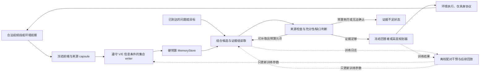
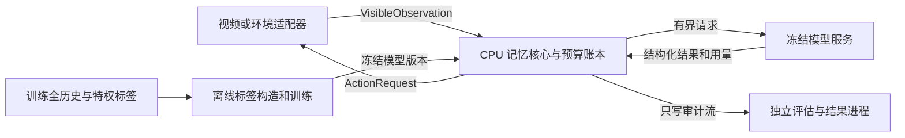

# BundleMem 完整研究与工程方案：预算受限的视觉证据保留、取回、使用与更新

> 版本：v2.0，2026-09-07。目标：CVPR 2027。规划资源：最多 2 张、每张 80GB 显存的 GPU，一名主要实施者；实际卡型、时段与数据条件由 D0 核验。
>
> 本文是后续实施的主方案，独立说明研究动机、原论文方法、扩展算法、数据、工程契约、实验、资源与论文交付。无需先读旧稿或聊天记录；外部链接用于查证和取得依赖。所有新增算法收益、超参数、工时及继续门槛均为待验证设计。此版本只完成方案与静态核查，尚未实现本文规划的模块，也未运行模型或模拟器。

## 0. 接手入口与文档约定

**一句话任务：**在未来问题未知、历史被删除后不能免费回看的条件下，学习哪些视觉观察应一起保留；问题到来后，在读取预算内取齐支持回答或行动的证据，并用训练期结果改进下一次保留。具身任务额外处理新观察、旧状态和真实动作反馈。

阅读路径：研究理解看第 1–4 节；算法与训练看第 5–6 节；数据与实验看第 7–8 节；实现、配置、命令及验收看第 9 节；资源和进度看第 10–12 节。第 13 节区分已完成核查与未运行事项。

| 名称 | 本文中的具体含义 |
|---|---|
| capsule，证据单元 | 一个固定容量槽里的真实视觉载荷、来源、时间、检索键及有限关系 |
| bundle，证据组 | 支持一条答案路径的多个来源；路径内各项共同必要，其他完整路径可以替代它 |
| coalition，候选记忆集合 | 给 critic 打分或训练的整份候选记忆，不等同于某个问题的一个 bundle |
| writer，写入器 | 在合法可见输入下决定 skip、insert 或 replace；V 协议看不到具体问题 |
| set critic，集合价值模型 | 根据当前集合及可见上下文，预测完整路径覆盖或未来实际效用 |
| reader，读取器 | 在问题已知时从存活记忆选择证据、补取和停止 |
| verifier，验证器 | 检查来源、时效与操作性充分性；其语义判断不是数学证明 |
| consumer，消费者 | 冻结的回答模型或高层规划器；低层动作由既有控制器执行 |
| W1 / W2 | W1 是完整复现的原稿 storage-only writer；W2 是读感知、含延迟价值的扩展 writer |
| R0 / R1 / R2 | 固定 top-k / 等成本多轮相关性读取 / 组合读取及缺口控制 |

本文中的**必须**表示 P0 科学协议或相应工作包的验收要求；**起始值**可在开发集 pilot 后登记修改；**P1/P2**不阻塞 P0。配置字段为 `null` 或文中写“待选”时，该字段必须在 D0/D1 的决定记录中填入实际值，程序应拒绝以空值启动对应阶段，而不能偷偷选择默认模型或数据。

本版主要依据 `work/bundlemem-closed-loop-plan@1f6d6dfb4d1af8e7722084b4039bb402985dd214`，吸收 `work/cvpr27-plan@e0a241d489a869aad854c481be8d877f795c9339` 的任务分级、工程工作包和近期近邻；原稿方法来自 `writing/drafts/fqr_bundle_memory_cvpr/main.tex`。两份参考方案和原稿均保留为历史记录，后续修改实施设计以本文件为准；新实验记录不能回写成旧方案已经完成的结果。

## 1. 方案结论与范围

推荐主线是 **BundleMem：以未来任务中可取回、可使用的完整证据为目标，学习预算受限的视觉记忆写入和读取策略**。写入端继续使用不看未来问题的集合 critic；读取端新增面向证据组合的检索、缺口检测和预算内补取；训练端用自动构造的历史恢复任务、同预算集合干预和有限任务结果反馈，替代大规模人工最小证据链标注。

研究假设不是“所有历史都能完整保存”，而是：**对预先声明的任务族，在相同持久存储和读取计算预算下，优化完整证据的端到端可用性，比独立重要性打分加固定 top-k 更有效。** 被删除或编码时丢失的证据无法由 reader 恢复；读预算容不下一条完整路径时也无法保证成功。充分性模块输出经校准的判断，不提供无条件正确性保证。

| 层次 | 本版推荐内容 | 完成标准 |
|---|---|---|
| P0 主方法 | 固定容量 capsule；W1 原稿基线；W2 集合写入；R2 组合读取；不足判断；自动监督训练 | W/R 可替换；完整组的保留与读取、任务结果和成本均可追溯；交替训练无收益时保留分别训练版本 |
| P0 视频证据 | CPU/视觉 Gym + 自然多证据审计 + 至少一个真实长视频评测 | 同字节、同前端、同消费者；自然组合机制不能只由合成 AND 题支撑；EG-VQA 用于机制，长时评测可选 StreamArena HR / LongVideoBench |
| P0 具身证据 | 一套真实交互环境，优先 3D-Mem / GOAT-Bench 导航 | 真实 rollout 与固定历史隔离实验分别报告；至少一种交互任务的结果及失败解释 |
| P1 优先扩展 | 同导航底座的主动 EQA；EB-ALFRED 操作/规划；第二消费者复验与跨任务迁移 | 先保证 P0；第二消费者可先做小规模标签/证据复核，完整排行榜扩展不阻塞主线；10 月 18 日决定其去留 |
| P2 条件扩展 | CALVIN 连续控制、真机、自适应 codec、VLM LoRA/RL、部署时参数更新 | 环境/权重可运行且 P0 成立后独立立项，不纳入首版关键路径 |

“导航、长程操作、具身问答、规划”均给出实现和验证设计，但不承诺在两张卡上重训四套智能体。导航/EQA 共享环境，操作/规划共享环境；主要训练对象是小型记忆模块。

### 1.1 可证伪假设与交付边界

| 假设 | 应获得的证据 | 否定或收缩条件 |
|---|---|---|
| H1：组合破碎是真实瓶颈 | 等 item recall 时，自然样本的完整路径与 grounded success 仍有差别 | 只有人为构造的 AND 题有效，或完整视觉证据本身不能支持消费者 |
| H2：写入需要实际可取回的效用 | W2 在固定 R 下优于 W1；R2 在同快照同累计成本下改善完整组读取 | 改善仅来自增加图像、调用、免费地图或更强消费者 |
| H3：低人工 evidence 依赖可行 | 无新增人工链标注的版本优于同成本简单策略；监督来源和成本可审计 | 必须大量人工链标注才有收益，则调整监督表述和研究目标 |
| H4：缺口类型影响补救 | 区分库内补取与有成本重访，改善成功率或降低无效开销 | 总是多取几帧/总是重访即可获得同样收益 |
| H5：机制能迁移 | 未见场景、证据结构或任务组合仍有效；第二消费者/适配成本透明 | 依赖场景 ID、固定模板或评价器偏好，限制泛化主张 |

H1–H3 是核心判据。H4 在 P0 的真实交互及固定历史条件下测基础版本，更复杂的主动 EQA 放 P1；H5 的未见视频/场景必须做，跨任务统一权重属于 P1。新颖性、实验有效性和工程可运行性是三个不同的关卡。

本方案参考 [组合保留的既有分析](../../research/ideas/fqr_candidate_motivation_and_nearest_work_2026-09-02.md)、[9 月 5 日方案与数据审计](../../research/ideas/visual_memory_three_proposals_2026-09-05.md)、[9 月 6 日读取和资源讨论](../../research/ideas/visual_memory_cvpr2027_reassessment_2026-09-06.md) 及 [早期文献表](../../research/literature/fqr_mem_2026_literature_evidence.md)。仓库历史提交 `2aa6932` 中的闭环工作规划也作为工程参考；本文件进一步固定组合读取算法、弱标签生成、延迟价值与双预算协议。原稿和历史调研保留。

## 2. 思想来源、原论文的完整方法与扩展边界

### 2.1 从任务相关记忆到完整证据

视觉记忆包含选择/编码、存储、读取、面向消费者的输入构造，以及持续更新。任务分布决定哪些历史差异值得占用字节；消费者决定这些信息应如何呈现。第一版用固定 RGB capsule 与带来源的 packet 表达这两层约束，不训练“完美世界编码器”，也不把跨模型投射退化为任意 hidden-state 拼接。

部署关系写成：

$$
\widetilde M_{t-1}=R_w(M_{t-1},O_t),\quad
M_t=W_\phi(M_{t-1},\widetilde M_{t-1},O_t,S_t,g_t),
$$
$$
Z_k=R_r(M_T,q,Z_{<k}),\quad X_k=P_D(q,Z_k),\quad
\widehat y=D(X_k).
$$

`R_w` 只取仍存活、供身份/状态更新使用的上下文；`S_t` 是允许的原生字幕/OCR/传感器信息，其持久部分也计费；`g_t` 仅在当前目标已经合法公开的具身协议出现，V/E0 为 `null`。`P_D` 把真实图像、时间和来源组装成消费者可用输入，其 token/调用成本进入账本。不同模型的视觉特征不能假定可互相直接解码。未知未来问题只进入离线标签通道。

例：问题“后来用钥匙打开门的人，从谁手中接过钥匙？”可能需要身份对应、交接、开门三个观察；另一独立观察可能同时直接揭示这些事实。单个高相似帧未必支持答案，一条完整路径可以替代另一条。示例只解释结构；自然视频是否真有这种共同必要性，由 H1 审计决定。

### 2.2 统一符号和 AND/OR 结构

| 符号 | 定义 |
|---|---|
| `O_1:T, S_1:T` | 因果到达的观察流和合法侧信息 |
| `C={c_1,...,c_N}` | 统一前端/codec 后的候选宇宙；部署端不拥有未来候选 |
| `M_t` | 预算内持久状态；讨论集合覆盖时用其中存活 capsule ID 的集合 |
| `q, P_train, G` | 请求、声明的训练任务分布、开发前固定的结构组 |
| `E_q={E_q,1,...}` | 对 q 足够的证据路径族；真值族仅 teacher/evaluator 可用 |
| `B_M, L_ctx, C_read, J` | 持久字节、单次上下文 token 上限、累计输入 token 上限、累计模型调用上限 |

对声明的验证器，路径内成员共同支持答案和 grounding；不同路径可重叠。精确路径族满足：

$$
A(q,M)=\mathbf1[\exists E\in\mathcal E_q:E\subseteq M],\quad
U_P(M)=\mathbb E_{q\sim P}[A(q,M)],\quad
U_g(M)=\mathbb E_{q\sim P(\cdot\mid g)}[A(q,M)].
$$

路径内是 AND，路径之间是 OR。Gym 的生成规则可定义精确最小充分组；真实视频仅有核验的部分路径，删除测试至多给出指定消费者下的局部不可删性，不默认穷尽或全局最小。全记忆有干扰时消费者可能非单调，所以符号覆盖的单调性不能直接套到答案得分上。

### 2.3 原稿的两个反例与其正确含义

**高 item recall 可以没有一条完整路径。** 设 n 个互不相交的组各含 r 项，每组删掉一项，则 item recall 为 `n(r−1)/(nr)=1−1/r`，完整组覆盖为 0。对任意正数 ε，取 `r>1/ε` 即可使 recall 高于 `1−ε`；前提是这些确为全部充分路径，且没有额外侧信息补齐它们。

**相同单项边缘频率可以有不同最优选择。** 容量为 2 时，一组等频任务分别需要 `{a,b}`、`{c,d}`，另一组需要 `{a,c}`、`{b,d}`。四个 item 的出现频率相同，但可以完整覆盖任务的最佳二元集合不同。只看独立边缘分数无法辨别这两种结构；看当前集合上下文的条件评分则可能做到，必须作为强基线。

AND 覆盖也不必是次模函数：令唯一必要组为 `{a,b}`，向空集加 b 收益为 0，向 `{a}` 加 b 收益为 1，违背边际收益递减。因此不声称普通最大覆盖贪心保证适用于本问题；集合 critic 输出标量也不妨碍表达交互。

### 2.4 原稿的训练 teacher 与 coalition 标签

原方法有三部分：训练期可见问题的 bundle teacher、部署期看不到具体问题的 set critic、因果局部分配器。原版先固定候选、codec、reader 和消费者，隔离写入目标的贡献。

1. Gym 从生成规则得到完整路径族；真实训练视频从已有时间/空间 evidence 提出组，映射到所有方法共享的候选边界。
2. teacher 只给候选组的真实载荷，按冻结阈值检查答案及 grounding；做逐项删除并记录失败项。其他可能路径仅在验证后加入。
3. 从随机预算集合、简单 writer、当前策略、缺一项的困难组四种来源采样 coalition。初始可各占 1/4，pilot 后冻结配额，不用测试集调节。
4. 对每个结构组 `g` 生成整集合标签，而非只给逐条 membership：

$$
y_g(C')=\frac1{|Q_g|}\sum_{q\in Q_g}
\mathbf1[\exists E\in\mathcal E_q:E\subseteq C'].
$$

`C'` 是候选记忆 coalition。`Q_g` 为空时 mask；真实数据的标签称为已知路径覆盖，未知不能自动变负例。构造等槽数、等预算、近似相同 item recall 而完整路径数不同的 `C+ / C−`，配对变体继承源视频 split。人工审计另取留出样本，检查完整组是否足够、删除是否破坏该路径、是否漏掉明显替代路径。

### 2.5 原稿 set critic、损失与组均衡目标

$$
\widehat{\mathbf U}_\phi(C',S)=
f_\phi(\{h(c):c\in C'\},h(S),b(C')).
$$

`h(c)` 含冻结表征、显式时间、质量和合法可观察关系；来源 ID 用于索引与追溯，文件名、场景绝对 ID、gold bundle ID 不作为数值特征。`h(S)` 仅编码已到达且仍在预算内的侧信息；`b` 含占用率和时间覆盖。Set Transformer 为起点，DeepSets 与 independent/conditional item scorer 为消融；集合重排不应改变分数，时间语义由特征保留。

完整复现原稿 W1 时使用：

$$
\mathcal L_{set}=\mathcal L_{cov}
+\lambda_{rank}\mathcal L_{rank}
+\lambda_{hard}\mathcal L_{partial},
$$
$$
\mathcal L_{rank}=\log(1+\exp[-\operatorname{sign}(\Delta y)(J(C^+)-J(C^-))]).
$$

`cov` 先用有 mask 的组均衡 MSE，`partial` 是完整/缺一困难配对的加权 rank 项，不能把未核验负例硬加入。起始 `lambda_rank=lambda_hard=1`，报告每类配对的有效权重，避免重复采样又加权而无意放大。标签相同/不稳定的 pair 不训练偏好。

原稿的保留分数为：

$$
J_\phi(C')=(1-\alpha)\sum_g p_g\widehat U_{\phi,g}(C')
+\alpha\operatorname{softmin}_{\tau}(\widehat{\mathbf U}_\phi(C')),
$$
$$
\operatorname{softmin}_{\tau}(u)=-\tau\log\left(|G|^{-1}\sum_g e^{-u_g/\tau}\right).
$$

`p_g` 是登记的训练先验，`alpha=0` 为均值版；`alpha>0` 保护低覆盖结构组，不能宣称对任意任务分布鲁棒。W1 首版先固定 `alpha=0`，之后在开发集比较 `alpha=0.1/0.3, tau=0.1` 的小网格。扩展 W2 的首版也先做固定配额均衡，不同时引入新的鲁棒目标。

### 2.6 原稿的在线分配与固定 reader

新 capsule 到达后，枚举 `skip / insert / replace(j)`；insert 仅在有空槽时合法，replace 仅能淘汰存活可替换槽。对动作后的整集合评分：

$$
a_t^*=\arg\max_{a\in\mathcal A_t^{feasible}}J_\phi(M_t^a).
$$

原稿以 `K+2` 表示候选动作数量上界；过滤非法动作后通常更少。一次 batch 可以评估多个集合，不等于需要 `K+2` 次 VLM 调用。分数差小于 `1e-6` 时先保留 skip，再按固定槽序打破平局。大 K 用共享便宜分数筛 8 个淘汰对象，报告预筛的候选上限；小 K 的全动作结果区分 critic 误差和动作搜索误差。

写完后冻结一个快照，用同一个 R0 和消费者答全部问题，分别报告 Stored、Accessed 和 grounded success。删除/随机删除/阻断 reader/语义替换四类干预验证来源使用，不能仅用模型引用了 ID 来证明使用。W1 是扩展方案必须保留的基线，不能换名后省略。

### 2.7 三种 oracle、两个不确定性代价和求解范围

| 参考 | 允许看见的信息 | 在相同字节预算内求什么 |
|---|---|---|
| Post-query | 完整候选流及实际 q | 每题分别选择最优记忆 |
| Offline pre-query | 完整候选流、任务分布，不知道实际 q | 对整个题族共享一份最优记忆 |
| Causal pre-query | 当前/过去可见输入和有界状态，未知未来流与 q | 同信息条件下最优在线策略的期望效用 |

$$
\Pi_Q(B)=U^*_{post}(B)-U^*_{off}(B),\qquad
\Pi_H(B)=U^*_{off}(B)-U^*_{causal}(B).
$$

`Pi_Q` 分离问题未知的代价，`Pi_H` 分离因果观察与不可逆写入的代价。原稿重点是前者及组合结构；本版延迟价值尝试降低实际在线损失，仍不声称消除 `Pi_H`。只有同表示、效用、信息、预算的精确最优解才报告上述差值为严格代价。

Gym 小实例先取 `N≤16` 枚举所有合法记忆。较大离线问题可用二元变量 `x_i` 表示保留，`z_qk` 表示组完整，`y_q` 表示至少一路完整；施加 `sum bytes_i*x_i≤B`、`z_qk≤x_i` 对组内每项、`y_q≤sum_k z_qk`，最大化 `sum_q p_q*y_q`，记录求解 gap。因果 oracle 另在已知有限生成分布上枚举策略或动态规划，同一合法可观察状态必须有相同决定；不能在一条已知测试未来上逐步挑最优冒充因果策略。

扩展读阶段还枚举 `Z⊆M` 的可读集合：固定读取/上下文预算，估计“已存完整组中实际装得下多少”。真实视频 teacher、完整历史消费者、hindsight packet 都只是特权诊断；完整历史存在干扰时并非性能上界。

### 2.8 本版保留与修改的边界

| 原稿设计 | 继续保留的价值 | 本次修改 |
|---|---|---|
| 最小充分 evidence bundle：组内 AND、组间 OR | 解释“单条召回高，但没有一条完整答案路径” | 从存活率扩展到读预算内的完整路径可达率 |
| 不看未来问题的 set critic | 体现当前集合中的互补性和替代性 | 学习经过 reader 和消费者后的效用；补充前缀的延迟价值 |
| 人工证据标注 + teacher 验证 | 可用于小规模校准和评测 | 主训练不依赖新增人工链标注；已有 QA、伪标签、仿真真值分别披露 |
| 固定 reader | 有利于隔离 writer 的收益 | 保留为隔离实验，完整方法增加组合补取，并做 W×R 交叉比较 |
| 单步 insert/replace 最大化当前 coverage | 动作空间小、工程简单 | 防止未闭合的前缀证据过早被丢弃；使用后续回放价值训练 |
| Stored / Accessed / Used 审计 | 能定位收益来源 | 增加候选/编码上限、读预算不可行、证据过时和动作执行失败 |

两个容易遗漏的结构问题必须在方法中处理：

1. **读取端也有 AND 障碍。** 若问题需要 `{a,b,c}`，当前只取到 `{a}`，分别加入 `b` 或 `c` 都可能不立即提高答案概率。仅按单条即时收益补取，仍会失败，因此要允许小集合扩展与有限 beam search。
2. **写入端有时间上的 AND 障碍。** 流中先看到 `a`、很久后才看到 `b`，只评估“当前已经完成几组证据”会在 `b` 到来前丢掉 `a`。终局 coverage critic 不能未经修改就视为在线长期价值函数。

此外，集合函数可以由一个标量输出表示。论文应比较“不看集合上下文的独立 item scorer”与“看当前集合的条件策略”，不能声称一切标量评分都无法表达互补性，也不能套用普通次模覆盖的贪心近似保证。

## 3. 文献定位：已有方法限制了哪些创新主张

本节继承两份参考方案截至 2026-09-06 的一手资料核查，并于 2026-09-07 补查近期近邻入口。2026 arXiv 文献默认按预印本处理；不将作者实验结果当作本项目复现结果。

| 直接近邻 | 已有工作覆盖的事实 | 本方案需要额外证明什么 |
|---|---|---|
| [EMBER][ember] | 问题隐藏的预算保留；source-backed capsule；Survive–Read–Answer 结果反馈训练 | 视觉证据组的互补/替代结构能带来独立收益；严格总字节与读成本核算；更低成本训练。不能称其为纯 item-wise 或没有闭环 |
| [OSL-MR][osl] | 明确建模非可分的长期记忆效用；采用逐 memory 的 evidence-membership 学习以降低难度 | 低成本集合监督是否比逐条 membership 有用，尤其在多段联合必要时 |
| [REVEAL][reveal] | 显式充分性判断、缺口分析及针对性再检索；有自动 rubric 构造 | 在不可回放、已经被压缩的有限记忆中识别可补取收益；不能把一般 retrieve–verify 循环当新贡献 |
| [CausalMem][causalmem] | 用在线语义基更新固定容量视觉 token memory，支持 Qwen2.5-VL / LLaVA | 组合效用优于语义残差/新颖性，并在原生实现和统一表示两层说明差别 |
| [Mem-T][memt] | 通过操作树和 hindsight credit 联合优化记忆构建与多轮检索 | 本项目不能宣称首次联合优化读写；应证明视觉来源、完整组与预算约束下的轻量学习价值 |
| [TaskMem][taskmem] | 根据环境任务反馈学习多模态记忆重点，并在无原视频回看的流式设置评估 | 对完整视觉证据的可访问性、弱监督效率及跨任务迁移做更直接测量 |
| [LatentStream][latentstream] | 固定预算、query-agnostic 分层流记忆；迭代检索并内化为 latent working memory，以分层预测熵构造优化信号 | 迭代读取或置信度控制已不是新意；需证明来源可核验的组合 packet、不可逆删除与低成本读写效用学习的额外价值 |
| [Memo][memo] | 用 RL 学习具身任务中记忆的形成与访问，包括多对象导航 | “将记忆用于具身”和“读写 RL”均已存在；补充实验应检验同一组合机制 |
| [RAVEN][raven] / [STaR][star] | 以视觉/空间/时间记忆和任务条件检索支持长时程问答、导航或机器人任务 | 不把连接记忆与导航当贡献；主对比需要有限持久字节、读取成本、淘汰与组合完整性约束 |
| [3D-Mem][3dmem-paper] / [MemoryVLA][memoryvla] | 分别提供多视图场景记忆与具身探索，以及操作中的感知/认知记忆 | 保留既有控制与感知能力，在可核算预算下证明记忆选择与取回的贡献 |
| [WorldMemArena][wma] | 将多模态记忆放入行动与世界交互中考察 | 沿用阶段诊断思想，并将它用于反驳“存得好就一定用得好”的假设 |

可辩护的新意应收敛为三点，均以实验成立为前提：

- **问题与证据：**完整组“存下但读不全”是独立于 item recall 和纯 storage coverage 的瓶颈；在自然视觉、长时间间隔和具身再利用中可观测。
- **方法：**一套以可取回、可使用的组合效用为共同训练目标的轻量读写策略，在固定持久预算和总读取成本下改善任务表现；明确处理前缀价值与组合补取。
- **训练：**不新增大规模人工 evidence-chain 标注，利用来源可验证的自监督代理、集合干预和自动反馈学出有效策略，并给出监督来源和总成本的消融。

仅把现有 writer、REVEAL 式 verifier 和图记忆拼接起来，或只证明自动造题能降低标注量，不足以支撑主要创新。

## 4. 统一协议与优化目标

### 4.1 区分视频与具身的信息条件

| 协议 | 写入端当时可见 | 请求与再观察规则 | 科学用途 |
|---|---|---|---|
| V：query-after-write 视频 | 当前及已观察流、合法侧信息、预算内记忆；无测试问题/答案 | 流结束或检查点后公布 q；只读冻结记忆，不回看原视频 | 主协议，直接延续初稿 |
| E0：先探索、后请求 | 探索观察和动作；未来目标未揭示 | 在检查点公布导航目标/EQA；固定快照模式下不再观察 | 与 V 最接近的具身记忆隔离实验 |
| E1：原生交互任务 | 已公开的当前指令、当前观察、允许的动作反馈；无后续隐藏目标 | 可导航/操作并产生新观察；每一步都计动作和感知成本 | GOAT、A-EQA、EB-ALFRED 的补充性闭环验证 |

E1 中“知道当前任务”是合法信息，不能将其结果标成完全 query-free。GOAT 的后续目标逐个揭示，不能一次把整条任务列表交给 writer。探索轨迹受当前目标影响时，即使 writer 不显式接收目标，也不能据此声称观察过程与目标无关。

V/E0 的每个视频/场景检查点只生成一个 `snapshot_id`，所有问题共享该快照，问题之间重置 reader 临时状态；测试权重固定。E1 允许同一 episode 内记忆更新，但不能从隐藏金标、测试评分或其他测试 episode 学习参数。终局 scoring 与在线可见 feedback 分离。

### 4.2 记忆表示：固定载荷优先

一个 capsule 保存真实观测载荷与有上限的检索元数据；第 9.5 节给出工程字段、生命周期和异常语义：

```text
capsule_id, observed_time_start/end, payload, payload_codec
visual_key, optional_text_key, source_observation_ids
optional_pose, observed_entity_links, version_links, confidence
serialized_bytes, checksum
```

`source_observation_ids` 是来源标识，不是重新访问已删除原图的路径；视频/场景文件名、绝对 ID 和标签组 ID 不进入学习特征。对象/关系由部署前端从可见输入估计；仿真 object ID、金标事件边界和人工 evidence description 不得作为免费检索键。所有额外文字、索引、状态和关联都计入预算。

**MVP 的建议默认值，需先经候选召回 pilot 调整并冻结：**

- 视频每 2 秒形成一候选段，从该段内按固定规则采 4 帧，分辨率先用 224×224。不跨越当前时刻取未来帧；最多接受 2 秒分段等待，单列 ingest lag。
- 使用可由任意消费者重新编码的 RGB 载荷，先不学习 latent codec。每槽建议上限 640 KiB：4 帧 RGB uint8 为 602,112 bytes，余下 53,248 bytes 用于 key、元数据和确定性填充。
- 共用索引/目录预留 64 KiB；`K = 32/64/128` 槽对应上限约 `20.0625/40.0625/80.0625 MiB`。这些是设计字节，不是模型实测显存。索引放不下时减少可用槽，不能免费溢出。
- 主实验采用固定码率槽，以隔离选择算法。JPEG/WebP、分辨率变化、动作片段编码和 VLM latent payload 放在独立 codec 实验中，按实际序列化成本比较；不由 token 数换算不同方法的存储公平性。
- 4 帧可能漏掉快速动作、小字和细小状态变化。先测候选/codec 上限；若不足，统一提高采样率或改固定片段规则，重新冻结所有方法输入，不能只给本方法补帧。

同一实体的历史状态和最新观察并存时用时间/版本链接关联。新观察可以标记旧断言已被后续观察取代，但不能凭“未再看到”断言对象已消失，也不能把计划中的动作写成已发生事实。状态更新机制是操作验证所需的最小支持，不另做大型知识图谱主张。

### 4.3 两类预算，外加完整成本账本

持久预算在每个更新后的可继续执行状态上满足：

$$
\operatorname{Bytes}(M_t^{payload},M_t^{keys},M_t^{index},M_t^{state},M_t^{buffer})\le B_M.
$$

当前输入段可作为固定大小的临时 ingest buffer；若跨下一段继续保留，必须转为上述预算内状态。模型共享权重不算 episode 记忆，但跨步 KV、对话消息、生成摘要、动作历史和未清理的特征缓存算持久信息。内存对象开销与磁盘文件大小另报，不以序列化预算伪装峰值 RAM/VRAM。

读取至少同时限制：单次上下文 `L_ctx`、每个问题累计处理 tokens `C_read`、加载 payload 字节、VLM 调用次数 `J` 和延迟。重复提交同一证据给 verifier/answerer 的 tokens 仍计累计成本；缓存命中单独报告。建议起点为 `L_ctx≤8K`、`C_read≤24K`、`J≤4`，不是所有问题都花满预算。

`C_read` 的工程定义为服务端确认的累计输入 tokens；同时限制 `C_out` 累计生成 tokens，初值 2,048。每请求真实载荷加载累计上限 `B_read_bytes=16 MiB` 为 pilot 起点；字节、输入、输出、调用及单次上下文任一超限均拒绝继续，不能将 16 MiB 自动换算为固定视觉 token 数。缓存不减少已经提交给模型的 token 计数。读取前为最终答案保留一次调用与其输入/输出配额；需求解析、验证、回答、重试均进入同一请求账本。参考起点使用规则需求模板（0 次 VLM 解析），最多 3 次验证加 1 次回答；若启用一次 VLM 解析，相应减少验证配额。轻量集合打分不占 VLM 调用，但计真实 CPU/GPU 时间。

写入前 `R_w` 的载荷访问与视觉重编码另计 `write_bytes / write_calls / write_latency`，首版只读取全部存活键，禁用逐段 VLM 语义更新；需要语义核验时先在开发集固定每段调用/载荷上限，所有基线共享。临时输入队列最多一个当前段；上游过快时离线回放阻塞，实时流按固定丢帧规则报告 coverage 和 ingest lag，不能无限排队成为免费记忆。

具身模式额外记录 `B_map`、导航/动作数、路径长度和新观察成本。首轮使用同一个有上限的几何导航地图控制器，固定 `B_map` 并扫描 `B_M`；同时报告 `B_total=B_map+B_M`。对象语义、身份和属性不得偷偷进入不计费地图。地图本身可完成任务的程度用 map-only 基线测量；原生无界地图结果另列为系统参考。

### 4.4 从“存活”到“可用”的目标

令 `C` 是固定候选/codec 后的证据宇宙，`E_q={E_q,1,...}` 是问题 q 的充分组族。受控 Gym 可有精确结构；真实视频只掌握经核验的若干路径，不默认穷尽。

$$
A_{store}(q,M)=\mathbf1[\exists E\in\mathcal E_q:E\subseteq M],
$$

$$
A_{access}(q,M;R)=\mathbf1[\exists E\in\mathcal E_q:E\subseteq Z_R(q,M)],
\qquad Z_R(q,M)\subseteq M.
$$

`Z_R` 指最终实际提供给消费者、能在合法上下文内共同使用的 packet，而不是此前访问过的 ID 并集。已经轮流看过却不能共同放入 packet 的证据不自动算完整取回；压缩成中间事实可能丢失视觉支持，单独作为工作区表示实验评估。所有已加载临时 payload、已确认事实与搜索状态均受请求级上限约束，不能跨请求保留。

定义 `s_D(q,Z)` 为固定消费者的答案与来源 grounding 联合得分；在具身回放中换为经真实执行测得的任务效用。写入与读取共同优化：

首版 QA 训练得分明确取 `s_D=a*g`：`a∈[0,1]` 是固定答案评分器结果，`g∈[0,1]` 是对实际 packet 的来源有效性与语义/时间支持评分，存在无效来源则 g=0。Gym 使用精确完整路径指示；有正式 grounding 指标的数据，记录该指标到 g 的映射，不能把本地乘积奖励冒充官方指标。无可靠支持评分的自然样本 mask 充分性标签。具身优先用真实终局任务成功 0/1，子目标成功作为单列辅助标签，不随意混成新排行榜分数。

成本项先只惩罚规范化累计输入 `c_read=C_read_used/C_read_limit`，`r_D=s_D−lambda*c_read`；其他成本受硬上限约束并逐项报告。初始 `lambda=0.01`，开发集只比较 `0 / 0.01 / 0.05`，冻结后 W2 与 R2 共用，不能用不同单位或不同 lambda 训练两端。E1 的动作/新观察成本如加入奖励，使用独立声明的归一化项与系数，并保留纯任务成功率对照。

$$
\max_{\phi,\psi}\;\mathbb E_{(O,q)\sim P_{train}}
[s_D(q,R_\psi(W_\phi(O),q)) - \lambda c_{read}]
\quad\text{s.t. }B_M,L_{ctx},C_{read},J\text{ 的硬上限}.
$$

Gym 中 `s_D` 可替换为精确 `A_access`；真实数据的软得分只能当操作性近似。模型可能在证据不足时猜对，所以普通 answer accuracy 不满足上述嵌套关系，必须另报 joint-grounded success 与干预结果。完整族下有 `A_access≤A_store`，不意味着所有“答对”都是真正使用证据。

关键扩展是**可解码且可取回的任务效用**：存下一组极难检索或远超 read budget 的证据，应当与存下一条紧凑可用路径区别对待。但 reader 弱不能成为永久丢弃困难任务的理由：同时保留 storage 辅助标签、任务组均衡和诊断上界。

## 5. 部署方法：读取必须具体到动作、状态和停止条件

### 5.1 模块与数据流



视频测试时不走环境回环，且不由正确答案更新记忆。图中的训练回路只在训练数据上使用；部署回路只使用真实可见的新观察/动作反馈。

### 5.2 写入：集合决策与延迟价值

`W` 从当前 `M` 和候选 `c_t` 中选择 `skip / insert / replace(j)`；只对合法预算内动作评分。MVP 使用冻结视觉特征、时间、质量、占用率和可见关系，输入一个 5M–20M 参数级的集合网络。组别先设身份关联、时间顺序、状态变化、空间关系、计数/覆盖、一般描述，最终按训练数据合并。

写入前用 `R_w` 取尚存实体/时间/位置键，形成有界更新上下文；必要载荷必须经 MemoryStore 加载并计写入成本。新候选与旧状态的关联是预测结果，不能借 evaluator 的 object ID 做身份合并。W1 使用第 2 节终局 coverage；W2 使用下面的后续效用。V/E0 的 `goal_context=null`，E1 可以编码已经公开的当前目标，但没有后续隐藏目标；配置切换必须体现在协议标签和模型输入 schema 中。

纯终局版本可预测 `V_phi(M)`：从这个快照经固定 reader 后的平均任务效用。在线版本必须学习：

$$
V_\phi(m,t)=\mathbb E_{\omega,q}
[r_D(q,R_\psi(M_{end}^{\pi}(m,\omega),q))\mid\text{截至 }t\text{ 的可见状态}],
$$

其中 `omega` 是训练分布中的后续流，`pi` 是固定版本的续写策略。训练时通过后续回放给前缀打标签；部署时只输入 `m`、已过时间、预算、当前观测和 E1 中已经公开的当前目标，不能输入具体未来片段、未来目标或 teacher 构造的组 ID。函数表达训练分布下的后续期望，不声称求得真实因果最优。

执行时先用共享便宜分数提出 8 个可淘汰候选，再用集合 critic 比较最多 10 个动作；`K≤32` 时同时测全动作版本，报告预筛选动作覆盖率。集合 encoder 用显式时间特征保持时序语义，并对输入排列等变/不变；不能通过数组位置偷读 gold 排序。

若前缀价值 pilot 不稳定，使用一个**计入 B_M 的短期保留区**作为工程保底，例如固定保留最近 `max(1,floor(0.1K))` 槽，再对剩余槽学习长期选择；所有关键基线给予相同保留区。它能推迟删除，却不能解决任意长延迟。比较“无缓冲 / 同缓冲 / 延迟价值”，防止把 FIFO 的效果算成集合学习效果。

组均衡先使用固定采样配额和均值效用，确认主现象后再加入较弱的 worst-group 项。初稿中的 soft-min 作为消融，暂不将分布鲁棒优化做第二条主线。

### 5.3 读取状态与候选生成

对每个新请求维护临时状态：

```text
request, requirement_hypotheses, selected_ids, visited_ids
unsupported_requirements, conflicts, remaining_read_budget
attempted_queries, predicted_sufficiency, stop_reason
```

第一轮通过冻结图文检索键及可选文本检索得到最多 32 个候选 ID；以时间邻接、同实体不同时间/视角和版本关系提出额外 ID。每步合并去重后的候选仍截为最多 32 个，截断规则固定；不能通过额外关系分支无限扩大搜索。索引仅覆盖仍存活的 capsule；缺失依赖只能成为“可能缺证”的元信息，不能替代被删除的 payload。

需求拆解先采用固定任务槽模板，只有模板无法覆盖时才按第 4.3 节配额启用一次短输出解析，避免每轮自由规划。例：“后来打开门的人从谁手里拿到钥匙”包含人/物关联、交接和使用三个待支持关系。槽是模型提出的假设，不是金标准。留出一个时间覆盖/全库轻量检索分支，防止需求拆解错误后所有搜索都锁死在同一假设。

### 5.4 组合读取：避免 top-k 与单步 gain 的共同缺陷

读取头 `F_psi(q,Z)` 估计**这个证据集合**的可用性，而不是只预测各条与 q 的相似度。建议采用 beam width 4、最大 3 次扩展：

1. 用前 4 个高质量候选建立不同 seed；候选质量相近时保留不同实体/时间假设。
2. 每个 beam 同时考察单 capsule 扩展与来自关系/时间邻接的 2–3 capsule 组合扩展，避免“每条单独零增益”的 AND 障碍。
3. 每步最多重排 16 个有来源且可装入剩余读预算的集合；共享缓存特征，集合头完成筛选，VLM 不逐个调用。
4. 对最佳集合加载真实 payload，按时间、实体及来源 ID 打包；在 VLM 看到的 token 数超上限时淘汰整个候选组或选择另一条路径，不任意截断一条必要组。
5. 检查真实 payload 的支持关系，再决定下一轮。集合分数只能缩小搜索，不能让未加载图像成为已验证证据。

组内扩展上限不是语义限制；更大的证据组可跨轮累积，但超过允许读取预算仍可能失败。候选集和 beam 均可能漏掉路径，应对小实例提供全子集搜索参考，并在真实子集检查“已存完整组是否进入过 shortlist”。

### 5.5 充分性、补取收益与停止

保留三个可审计输出：

- `sufficiency_score`：在给定消费者下，当前真实 payload 是否支持回答/行动前置条件。
- `missing_requirements`：尚无来源支持的身份、顺序、状态、位置等关系；同时返回冲突与时效问题。
- `recoverable_gain`：从**剩余存活记忆**继续读取的预期净收益；区别于一般答案熵。

规则先确定性执行：所有 ID 存活、时间未越界、来源可追踪、引用确实在 packet 内、预算充足。语义判断先用冻结 VLM 和固定短 rubric，再蒸馏到小头；两者交叉校准。训练分别构造“证据已在库但未取到”和“当前库/预算下找不到已知可行路径”的情况。

读取动作包括 `expand_relation / expand_time / try_alternative / broaden / stop`。只有当预期补取收益大于读成本阈值、预算允许且还有新候选时继续；达到充分性阈值并通过来源检查才进入正常回答/规划；无新来源、预算耗尽或相互矛盾时返回 `insufficient / unresolved`。自然数据中无已知路径时只能说“尚未找到支持”，不能断言真实世界不存在证据。

标准 benchmark 若要求强制答案，仍输出最佳答案并报告原指标，同时保存不足标志；另报风险—覆盖曲线，不能靠大量拒答提高“选择后准确率”而隐藏覆盖率下降。具身模式下不足状态可以触发重访/再观察，但属于有成本的行动，不属于免费记忆读取。

最终 packet 包含 `payloads / evidence_ids / timestamps / supported_relations / unresolved_relations / conflicts / costs`。消费者必须在答案/子目标上绑定来源 ID；绑定本身只证明引用存在，是否真正使用仍需删除、替换和注入实验验证。

### 5.6 具身更新与行动反馈

每次真实执行后，将“执行动作、观测结果、允许的成功/失败信号”形成新候选，再调用同一个 writer。动作请求与动作结果分字段记录，未知结果不填成成功；历史状态与最新观察分版本，当前任务不应误用旧状态。

为隔离记忆作用，主具身实验固定高层规划提示、低层控制器、检测器和动作集合。在线权重不更新。若后续研究测试时效用自适应，应另设协议，明确 feedback 来源和 episode 边界，不混入主结果。

### 5.7 主路径伪代码与边界行为

以下是实现规格，当前尚无对应可运行模块。`Store` 是部署对象唯一的历史载荷入口；Evaluator、LabelBuilder 与训练全历史缓存不注入该对象。

```text
INGEST(visible_observation, visible_feedback, disclosed_goal):
    validate protocol, monotonic observed time, feedback allowlist
    candidate = Frontend.encode_current_segment(visible_observation)
    update_context = Rw.lookup_live_keys(Store, candidate)  # bounded and charged
    candidate = attach_predicted_links(candidate, update_context, visible_feedback)
    actions = Writer.legal_actions(Store.summary(), candidate, shared_recent_quota)
    action = Writer.choose(actions, disclosed_goal_if_E1, deterministic_tie_break)
    Store.apply_atomic(action, candidate)                   # validate bytes before commit
    emit_actor_audit_to_write_only_sink()
    release current segment, nonretained features and update_context

ANSWER(snapshot_handle, request, budget):
    view = Store.open_readonly(snapshot_handle)
    state = new_request_state()                           # no previous query state
    ledger.reserve_final_answer_capacity(request)
    beams = seed_from_live_shortlist(view.keys(), request)
    while search_steps_remain and ledger.can_verify_and_answer():
        beams = bounded_single_and_group_expansions(beams, live_keys, remaining_budget)
        packet = build_best_feasible_packet(beams, Store.load_live, ledger)
        verdict = Verifier.check_payloads(packet, request, ledger)
        if verdict.sufficient_and_source_valid: break
        if no_new_candidates or predicted_future_gain_below_threshold: break
        state.update_supported_missing_conflicts(verdict)
    result = Consumer.answer(best_verified_packet_or_empty, request, ledger)
    emit result, uncertainty, stop_reason, snapshot_hash, full cost/failure record
    release all request state; close view

ACT_E1(current_observation, current_goal):
    packet = bounded_read_of_current_live_memory(current_goal)
    proposed_action = frozen_planner(packet, current_observation)
    executed_action, next_observation, allowed_feedback = Adapter.execute(proposed_action)
    INGEST(next_observation, allowed_feedback, currently_disclosed_goal)
```

Consumer 的最终调用仍要由 ledger 批准；不足时强制作答的 benchmark 输出最佳可行/空 packet 的答案并保留不足标志，调用完全不可执行则记失败，不冒用 blind baseline。Planner/控制器失败不触发隐式增加记忆或读取预算。动作反馈重复投递通过 `observation_id + action_id` 幂等去重，不能把一次执行记为两次成功。

E1 中最后预留的一次消费者调用就是高层 planner 调用，不能在 read 结束后另开未计费的 planner 请求。一个 episode 从 reset 的初始可见观察执行一次 INGEST，再进入“读—行动—新观察—写”的循环；终局评分只进入 evaluator，测试权重不更新。

没有必要组标注时，线上只维护预测的 supported/missing/conflict 和置信度，不能伪造 bundle ground truth。读到的来源若在当前版本不存在，立即拒绝，不尝试原图回退。对固定 V/E0 快照用只读隔离保证查询期间不会被写入；E1 同一决策先读完再执行写入，首版采用单线程 episode actor 避免并发版本竞态。

## 6. 弱监督与自监督：文献结论和可执行训练配方

### 6.1 采用混合自动监督，而不是无条件承诺纯自监督

大规模人工最小充分链既贵，也不完整。可以取消其作为默认训练前提，但仅靠像素/特征重建无法识别未来任务偏好，也不保证源证据被真正利用。

推荐论文表述是：**记忆模块主要从未标注观察序列、来源绑定的自动探测任务和环境反馈学习，不需要新增大规模人工证据组标注。** 是否能进一步称为自监督方法，取决于 S0 单独训练的真实结果。已有基础模型、已有 QA 和人工演示的监督不能消失在“零标注”措辞中。

| 方法族与一手依据 | 可利用的信号 | 本方案取舍与局限 |
|---|---|---|
| [TCN][tcn] 的时间/多视角对比 | 同时刻不同视角的对应，邻近但不同状态的对照 | 训练跨视角 key 和同实例关联；时间相近不等于状态相同，自然单目跟踪结果属于伪标签 |
| [V-JEPA 2][vjepa] 的潜空间预测 | 未标注视频中的时空预测任务 | 可冻结既有表征，用小头做辅助恢复；不重训世界模型，也不把预测损失当任务充分性 |
| [MemTrain][memtrain] 的终局与中间记忆恢复 | 不依赖下游 QA 的遮蔽历史目标 | 借鉴多检查点恢复与终局记忆约束；其文本结论迁移到视觉需独立验证，GRPO 训练配方不直接照搬 |
| 弱监督 temporal grounding，[CPL][cpl] | 视频—句子配对，无精确时间边界；视频内难负例 | 用 MIL 提出潜在证据组，降低边界标注需求；高相关片段不必是充分组，需干预复核 |
| [HER][her] | 根据轨迹实际达到的结果重标训练目标 | 从自然重访/完成状态构造 hindsight 请求；未来只供生成标签，不进入过去 writer；成功 relabel 不等于原任务成功 |
| [MemRL][memrl] | 冻结推理模型，利用环境反馈更新记忆效用和检索 | 作为 relevance+utility 简单基线；单条效用不足以证明组合性，文本任务结果不能替代视觉验证 |
| [Mem-T][memt]、[Memo][memo]、[TaskMem][taskmem] | 延迟结果、读写操作或具身任务回报 | 支持无需逐操作人工标签；完整 RL 成本和探索方差较高，放在小型离散策略的可选后续阶段 |

### 6.2 四种监督等级与数据账本

| 标识 | 可用输入与目标 | 是否新增人工 evidence | 术语 |
|---|---|---|---|
| S0 | 未标注训练视频；确定的增强/同步对应；遮蔽后恢复已有观察的特征/关系结构 | 否 | 自监督代理任务 |
| S1 | 冻结模型产生的对象、描述、问题、答案、关系与置信度 | 否，但有 teacher 推理成本 | 伪标签/模型弱监督 |
| S2 | 训练模拟器状态、事件日志、任务成功、动作执行结果 | 否，但有环境设计和生成成本 | 自动监督/特权训练 |
| S3 | 已有训练 QA，或已有时间证据/演示 | 取决于数据来源；本项目新增量可为零 | 任务弱监督或已有强监督，分别报 |

主配方推荐 **S0 预热 + S1/S2 配对效用训练**；已有 QA-only 的 S3 是便于落地的平行支线，已有 evidence 的 S3 是训练上限参考。训练、校准和人工审计各自按 video/scene 隔离。审计真值不回流训练或选择阈值。

公开结果至少记账：新增人工 QA/链数量、已有人工 QA/演示规模、S0 样本量、伪标签数和通过率、仿真轨迹数、VLM 总调用和 GPU 小时、人工审计小时。仿真 state ID 只由 teacher/evaluator 使用，student 只能看到 RGB/合法传感器和可见反馈。

### 6.3 代理任务：让“取回历史”成为完成任务的必要步骤

| 自动任务 | 构造与目标 | 防捷径条件 |
|---|---|---|
| 延迟重现检索 | 训练流后部选择 anchor，检索早期同实例/同事件来源 | 去掉文件名/序号对应；同类不同对象为负例；anchor 本身不能直接给出目标历史属性 |
| 遮蔽历史恢复 | 把早期对象的颜色、位置、先前状态或事件角色作为待恢复量 | 输入遮蔽目标字段；测试无记忆、只看当前帧、只看时间键，若可轻易回答则剔除或降权 |
| 前后状态与顺序 | 两个已观察时点之间恢复状态差异、动作顺序和参与对象 | 随机化绝对时间/对象命名；反转顺序或换同类对象；关联不可靠时标 unknown |
| 组合补全 | 在可靠的多个来源中构造完整组、缺一项、错身份、旧版本及替代组 | 自然数据先验证“共同必要”，不能把任意两帧强行标 AND |
| 中间检查点 recall | 每个训练流采多个检查点，从当前预算内记忆恢复历史目标 | query/probe 只进入训练标签通道；不允许检查点后信息用于前端特征 |
| 仿真 hindsight 任务 | 从已经观测到的达成状态构造位置/对象/子目标请求 | 目标必须可实现、对应真实轨迹；不可见世界状态不当作已观测证据 |

S0 中纯特征恢复主要训练来源检索和局部表征；由 VLM 命名的“红杯子、已清洗”等语义目标归 S1，由模拟器命名归 S2。不能因为训练数据是视频就把所有标签都叫自监督。

### 6.4 弱标签生成：从潜在证据组到可用的集合偏好

建议以 2,000 个训练 probe 起步，每个 probe 最多 8 次短 VLM 调用，复杂组进入后续小额复核池。缓存冻结前端特征，尽量让多数样本无需反复调用 VLM。

1. **先按 video/scene 划分。** 只从训练源产生 probe；所有后续组合、反事实和变体继承同一 split。
2. **提出组。** 用 query-known 检索在训练视频上取最多 12 个候选，以 beam 提出 2–4 个、每组通常 2–4 capsule 的集合；query-known 只在 teacher 中合法。
3. **验证来源和完整表现。** 保留能回答/恢复目标且有来源支持的集合。只做“模型答案相同”会保留语言猜测，需无记忆、视觉替换或状态扰动控制。
4. **做局部删除/替换。** 优先测试最关键 2–3 项；高置信的小集合才做完整 leave-one-out 或所有真子集检查。无法在调用上限内验证的样本留 `partial_verification`，不授予精确最小组标签。
5. **保留替代路径。** 若删掉一条后仍能成功，先搜索其他已存路径，不强制判成噪声；不同来源的成功组都可保留。观察不到替代组不是其不存在的证据。
6. **构造预算匹配的偏好。** 用无关但长度/视觉相似度接近的 capsule 填补删除项，得到同槽数/同 token 上限的 `C+ / C-`；完整性不同、item recall 相近的 pair 优先。
7. **unknown 单独保存。** 未核实的组、不稳定回答、模型分歧和无法判断的“无证据”不强行当负例；低置信样本只用于检索对比或给低权重。

leave-one-out 失败只给出“在该验证器下逐项不可删”的操作性结论。真实消费者可能非单调：一条信息删除后失败，并不排除删掉更多干扰项又成功。因此自然数据默认称“经局部干预核验的充分组”，不称数学上全部最小充分集合。

若使用 QA-only 训练，可把组作为潜变量做 multiple-instance 学习：

$$
\mathcal L_{MIL}=-\log\sum_{E\in\widehat{\mathcal E}_q}
p_\psi(E\mid q,M)\,p_D(y\mid q,\operatorname{payload}(E)).
$$

MVP 不反传整个消费者，只用缓存的组级评分训练小 reranker。MIL 易偏向语言可猜、单条显著、但不完整的证据，因此加来源检查、同视频难负例及完整/缺一对照；它是候选和弱训练机制，不是充分性证明。

只有能返回冻结消费者条件 log-probability 的后端才实现上式对数似然；普通 judge 的 0–1 分数不自动等于 `p_D`。无此能力时默认使用已核验的组偏好/回归训练，记录为 preference 路线，不把启发式分数代入公式冒称 MIL likelihood。

### 6.5 Reader 和 writer 的训练目标

读取头学习来源匹配/组排序、当前组充分性及剩余预算内补取的后续净收益。对同一 `(q,M,Z)` 实际尝试小量合法读取动作 `a`，先记录即时诊断：

$$
\Delta_R(a)=s_D(q,Z\cup E_a)-s_D(q,Z)-\lambda\Delta c_{read}(a).
$$

`E_a` 可为 2–3 个 capsule，允许跨过一部分单条零增益，但即时 `Delta_R` 仍可能误删需要多轮才补齐的路径，不能作为唯一训练目标。主动作价值采用固定后续读取策略 `rho` 的有界回放：

$$
G_R(a\mid q,M,Z,b)=s_D(q,Z_{end}^{a,\rho})-s_D(q,Z)
-\lambda\sum_{k\ge0}\Delta c_{read,k},\qquad
Z_{end}^{a,\rho}\subseteq M.
$$

这里 `b` 是剩余各类预算，后续只读当前存活库，最终 packet 必须实际容纳该组。`stop` 相对当前可答状态的增量为 0。对相同前缀固定候选、随机数和后续策略，初始每状态最多试 2 个动作分支、每分支最多 2 次继续扩展；两个分支共用已验证的当前 packet，teacher 配额超限则截断并标 `truncated_rollout`，不把截断导致未成功直接标成无价值。终局来源/任务得分加小权重的可靠需求覆盖，训练组排序与 action head；比较“即时 gain / 后续 gain / 规则补取”验证必要性。

小 Gym 用精确搜索产生延迟读标签，真实数据用已知可验证组和有界回放；不知道是否仍有路径时保留 unknown，不教模型以确定语气声称已永久丢失。预算容不下一组、库中无已知可行路径、来源冲突分别提供停止/不足实例。优先拟合回报及配对偏好，不做大模型 RL；所有分支验证调用计入第 10 节标签配额。

写入头使用两类标签：快照在固定 reader 下的组均衡效用；同一前缀采取不同记忆动作后、经相同续写策略和后续流回放得到的终局差异：

$$
\Delta_W(a,b)=\frac1{|Q_{train}|}\sum_q
[r_D(q,R(M_{end}^{a},q))-r_D(q,R(M_{end}^{b},q))].
$$

训练 query 及未来流只提供离线标签。相同前缀、相同后续序列/随机数降低方差；动作改变会影响未来观察的交互环境，必须复制模拟器状态后真实执行各分支。只有离线视频时能比较记忆操作，不能把未执行的机器人替代动作当反事实结果。

总损失建议保持简单：

$$
\mathcal L=\lambda_0\mathcal L_{self}
+\lambda_1\mathcal L_{value}
+\lambda_2\log(1+\exp[-\operatorname{sign}(\Delta)(V(C^+)-V(C^-))])
+\lambda_3\mathcal L_{read/suff/gain}.
$$

损失按可用标签 mask；`|Delta|` 太小或评价不稳定时不生成偏好。保留一项可靠的 storage coverage 辅助监督，防止固定 reader 的短板让 writer 放弃整个困难组。先用固定配额平衡题型/延迟；不在第一版叠加多个鲁棒损失。

这些干预估计的是给定模型/策略对输入记忆变化的响应，不证明真实物理事件的因果关系。作者在论文中必须保持这个用语边界。

原稿 `L_set` 完整保留于 W1；W2 的 `L_value` 学后续读写效用，`L_read/suff/gain` 分别用组偏好、已验证充分性二分类与后续回报回归，来源不可靠时 mask。`L_self` 的最小版本是同步/增强正例与不同来源难负例的对比损失，加遮蔽冻结特征的 cosine 恢复；由 teacher 命名的语义属性改归 S1。不得只用这一辅助损失声称已经学到任务充分性。

### 6.6 交替训练、标注质量与数据效率

| 阶段 | 执行方案 | 结束条件 |
|---|---|---|
| T0 | FIFO/多样性 writer + top-k/组合 reader；冻结全部模型 | 流、存储、读取、结果和成本日志跑通 |
| T1 | S0 训练来源 key/组表征，使用多检查点代理任务 | 优于无记忆和时间键捷径基线，未见轨迹也有效 |
| T2 | 固定混合 writer 快照，S1/S2/S3-QA 训练 reader 与 suff/gain | 在同快照同预算下提高 Accessed 和真实任务效用 |
| T3 | 冻结 reader，用预算匹配集合和前缀后续回放训练 writer | 两个以上预算点的 Stored/Accessed/任务结果趋势一致 |
| T4 | 以当前策略补采状态，默认最多 2 轮交替更新；第 3 轮需开发证据和单独成本记录 | 优于独立训练；若无增益保留 T3，避免无止境重标 |
| 可选 | 小型离散策略的 contextual bandit / 短程 RL | 已证实是动作探索/延迟 credit 瓶颈且 GPU 预算允许 |

每轮冻结 teacher、消费者和数据版本；旧标签记录对应 reader 版本，不能无说明地混合非平稳奖励。训练尽量覆盖简单 writer 和当前 writer 的混合状态，避免 reader 只适应自己训练时生成的快照。

最低质量控制：来源绑定、同视频/同类对象难负例、无记忆可回答过滤、人工盲审及第二消费者复验。第二模型同意仍可能共同犯错，因此不能替代审计。建议最终人工审计 200 个自然 probe，每例两人各 3–6 分钟，另留分歧复核时间，合计约 20–40 人时加复核；这是规划估算。

必须报告 `S0 only / S1-S2 only / S0+S1-S2 / QA-only / evidence-supervised reference`。进一步比较 0、100、500 个已有训练 evidence 问题的适配收益；标签来源、调用量和训练规模都要匹配/报告。主配方可以不新增人工链，但上限实验若使用已有标注，不能仍记为零监督。

### 6.7 首轮小模块配置与训练记录

以下是可直接用于 pilot 的起始配置，未经实验验证；在训练/开发 split 上调整后冻结。冻结图文编码器输出的视觉/文本向量分别过小投射层；不把冻结 VLM 的任意隐藏向量当作另一家族消费者可直接解码的 payload。

| 配置 | 起始值 |
|---|---|
| 集合编码器 | hidden 384、4 层、6 heads、FFN 1536；显式相对时间/质量特征；按来源槽 mask |
| Writer head | V/E0 用 query-free pooling；E1 增加当前已公开目标；输出组别价值；prefix/terminal 样本用类型标记区分 |
| Reader head | 2 层 query-to-set attention，输出组分数、sufficiency 与 action gain；query 只在此路径进入 |
| 参数与精度 | 目标总可训练参数 5M–20M，实际创建后统计；缓存 BF16/FP16，损失累计 FP32 |
| 优化 | AdamW，学习率先试 `1e-4 / 3e-4`，weight decay 0.01，gradient clip 1.0 |
| 批量与步数 | 有效 batch 64 组/配对样本；最多 10K update，按 video/scene 留出效用早停 |
| 损失起点 | value/rank/read 各 1，self 辅助 0.1；按标签 mask 和组采样归一化，之后只做小网格 |
| 种子与存档 | 17/29/43；保存配置、数据 manifest、teacher/reader 版本、样本来源及模型选择依据 |

每条监督记录至少含 `source_split / video_or_scene_id / prefix_end / visible_fields / memory_action / retained_ids / reader_version / probe_origin / reward_components / verification_status / teacher_version / seed`。训练状态中每个 retained ID 都必须属于当时可见且尚存的来源；teacher 的完整历史缓存放在独立进程/路径。验证 checkpoint 的主要准则是留出任务效用与预算，不用训练 reconstruction loss 替代下游效果。

## 7. 数据与下游任务：让每项实验回答一个明确问题

### 7.1 视频主线与数据可获得性

| 数据/任务 | 推荐使用方式 | 证据与局限 |
|---|---|---|
| 自建 Video Memory Gym | 自动生成身份交接、状态变化、顺序、替代路径；主要 CPU 枚举 | 精确组标签来自生成规则；用实际视觉渲染验证感知，纯符号版本只能测优化 |
| [EG-VQA][egvqa-code] | 开发数据和真实组合机制评测；train 内再分校准集 | 公开 QA/时间证据、评分代码；原视频需从源数据取得；不默认每个标注段都必要 |
| [StreamArena][streamarena-code] | 优先核查 Historical Retrospection（HR）用于真实长时流式测试；复用统一 JSONL 和 streaming driver | 官方工具包列出 243 个长视频、3,646 个开放任务；全量约 300GB，先取单视频；完整 StreamMind agent 的发布状态与 driver 分开核查 |
| [LongVideoBench][lvb] | 优先真实长视频外部测试，预先分层覆盖时长/任务类型 | 官方提供视频、字幕和 loader；不是完整 bundle 数据，机制分析需审计小子集 |
| [S-EMBER][sember-code] | 可选第一视角流式检索外部测试 | [数据页][sember-data]要求申请访问；不作为必须取得的训练依赖，不混同文本 EMBER |
| [OpenEQA][openeqa] | 固定历史具身问答，连接自然视频和环境交互 | 历史/问题/评测可复用；静态 EQA 不证明主动导航或操作能力 |

以下 EG-VQA 统计来自参考方案的固定版本 `train.json / test.json`，本会话比较两方案时独立下载并复算，计数及 SHA-256 均一致：

| 元数据统计 | 训练 split | 测试 split |
|---|---:|---:|
| 视频数 / QA 数 | 1,731 / 8,949 | 336 / 2,889 |
| 至少两段 evidence 的 QA | 7,592（84.8%） | 2,490（86.2%） |
| 最大相邻证据间隙 ≥60 秒的 QA | 567 | 230 |
| 最大相邻证据间隙 ≥180 秒的 QA | 37 | 6 |
| 视频时长中位数 / 最大值，秒 | 140.88 / 917.0 | 162.59 / 616.3 |
| 视频时长 ≥30 分钟 | 0 | 0 |

来源：[训练 JSON][eg-train]、[测试 JSON][eg-test]。计算按 `evidence.timestamp` 起点排序，用后一段起点减前一段终点求相邻间隙最大值；不是合并区间后的最大无覆盖空隙。此处只做元数据审计，没有测试模型。**EG-VQA 适合组合机制，不能单独支撑超长视频主张。**

首批训练只处理约 20–50 小时可取得的视频/轨迹，生成 20K–50K 廉价 S0 样本、2K 需要 VLM 复核的 probe；这些是配额而非已取得数据。开发初期用约 200 个多证据问题做现象审计，最终扩至独立留出视频上的足够样本。可用原视频低于预选 manifest 的约 80% 时公布缺失分布并调整来源，不默默删掉难例。

EG-VQA `metadata.segments`、`evidence.description` 和金标时间边界仅供训练/评估，不作为测试 caption 或事件检测输入。LongVideoBench 原 loader 将问题/选项与帧和字幕组合；接入时必须先单独 ingest 视频，封存快照后再加载问题。全视频字幕只有在逐时到达且纳入预算时才可作为 writer 输入。

StreamArena 接入先限定 HR：按其问题时刻建立因果快照、请求到来后停止写入，仅从当前快照回答。RTP、外部工具和主动交互不能直接混入同一个 query-after-write 分数；改动事件时序/反馈时标派生协议。其 driver 是评测基础，不能替代尚未取得的原论文 agent。优先复用一个视频评测驱动，用小 adapter 兼容 EG-VQA/LongVideoBench，避免维护三套模型与预算实现。[官方工具包][streamarena-code]

训练先使用确认具备训练资格的源：EG-VQA train 内按视频拆 train/calibration，或合法仿真 train 场景的探索/任务轨迹；另保留独立审计源。StreamArena、OpenEQA 以及其他仅有评测用途的轨迹默认只用于评估，不因公开可下载就生成训练伪题。最终测试样本由 manifest 预先冻结；审计发现偏差不能通过事后删掉不利样本修饰结果。自然 H1 机制结论争取在两个独立来源复核；若只有一个来源，论文明确收窄证据范围。

### 7.2 导航：先观测、后目标，再测真实任务链

优先复用 [3D-Mem][3dmem-code] 的 Habitat/GOAT 入口，并对照 [GOAT-Bench 原任务][goat-paper]：其 episode 包含 5–10 个连续目标，目标可为类别、语言或图像。它适合研究跨子任务经验，但完整表现还受地图、探索和识别影响。

设计两组互补实验：

1. **固定探索历史（E0）。** 每个场景用同一轨迹采集观察，按相同规则冻结不同 writer 的记忆；之后公布目标，测目标实例/位置检索与 packet 充分性，E0 测量到此结束。若继续用固定导航器执行到目标，则作为后续 E1 测量；导航中的新观察不能重新计入“最初记忆检索成功”。
2. **原生顺序交互（E1）。** 从相同场景、起点、任务序列与随机种子开始，保留跨子任务记忆，真正执行各方法。只给当前目标，后续目标不可见；报告整体 SR、SPL、每个子任务位置的 SR/SPL、重复探索距离及首次取回正确目标的时刻。

重点切片是“目标以前见过但当前不可见”“外观相近实例”“很久后重访”“曾见位置与当前观察冲突”。固定布局的导航不能充分验证状态更新；动态对象变化放到单列派生任务或操作环境，不在原生 GOAT 分数中混入改动。

基线包括原生 3D-Mem、同预算多样性快照、相同几何地图但无语义记忆、独立 item writer，以及完整 BundleMem。原生系统未施加相同预算时只作为系统参考；所有主要对比用同一本地消费者和执行器。

### 7.3 具身问答：P1 中历史读取与主动找证分别测

- **静态历史 EQA：**从 OpenEQA 历史产生一个共享快照，问题后到；测可追踪历史的回答、错误引用和读取成本。沿用官方 judge 才能与其分数直接比较；改为本地 judge 时命名并校准，另报人工一致性。
- **主动 EQA：**用 3D-Mem 的 A-EQA 接口，允许读取失败后导航到候选位置获取新观察；分别记账记忆补取次数和物理再观察成本，报告质量—路径长度曲线。
- **强对照候选：**[Pred-EQA][pred-eqa] 已提供本地 VLM 服务方式，可作为主动 EQA 备选及更强搜索对照。它知道当前问题，属于 E1。

A-EQA 与同一 Habitat 场景上的 GOAT 不是两个独立领域，论文不要夸大跨域数量。固定历史 EQA、多目标导航和高层操作应各有清楚的协议标签。

### 7.4 长程操作与规划：P1 先做高层动作链

首选 [EmbodiedBench][embodiedbench] 的 EB-ALFRED：复用感知、动作接口、执行器和成功判据，在 planner 输入前插入 evidence packet。它降低控制训练成本，但其高层技能执行不等于本项目获得了新的低层操作能力。

关注的问题包括：先前把哪个相似对象放入哪个容器、某物体是否已加热/清洗、子目标是否已经执行、动作失败后应保留哪段反馈。任务成功由环境真实执行判定；不只让模型离线写一段看似合理的计划。

分开两种配置：

- **原生反馈配置：**完整保留基准默认允许的反馈，使结果可以与原任务比较，同时测 text-feedback-only 基线，识别文本是否已替代视觉证据。
- **严格视觉记忆配置：**只提供 RGB、已公开指令、当前可用动作、执行成功/失败等预先声明的字段；隐藏 `object_states`、`task_progress` 和泄露隐藏对象位置的详细文本。这是本项目派生协议，不能称原生 leaderboard 成绩。

最终指标包括任务成功率、子目标完成率、额外/无效动作数、旧状态误用率、长程链全部完成率和按链长/干扰步数分层结果。用场景和任务组合划分，禁止对完整公开测试集合训练记忆模块；仿真新任务从训练场景/训练模板生成。

若有稳定的冻结连续动作策略和公开权重，再接 [CALVIN][calvin]：报告连续完成 1–5 个任务的成功率和平均完成链长，记忆只影响高层子目标/输入上下文。CALVIN 的连续控制接口不能用 EB-ALFRED 高层技能调用冒充。MemoryVLA 是重要对照，但其仓库训练示例为 8×A100，且若干 checkpoint（含 CALVIN 表）仍标 TBD；当前不把完整训练或未发布权重纳入硬依赖。[仓库][memoryvla-code]

### 7.5 防止长任务等同于记忆任务

所有具身任务先做无历史、最近窗口、文本反馈、地图和完整历史对照。若当前帧/动作菜单/地图已能决定下一步，长任务也未必依赖长期视觉记忆。主要机制子集应要求：关键观察此前出现、当前不可见、存在实际延迟/干扰，且替换相关历史会影响结果。

固定观察的离线回放能隔离写入/读取，却不能评估策略改变后的观察分布。原生在线评估能测闭环任务能力，却会引入探索差异。两者一起报告，并用相同起点/episode 配对，而非强行让不同行动策略使用同一后续视频。

## 8. 实验矩阵、指标、统计与继续门槛

### 8.1 核心 W×R 交叉实验

|  | R0：固定 top-k | R1：等成本多轮相关性检索 | R2：组合读取 + 缺口/收益控制 |
|---|---|---|---|
| W0：强多样性/残差 writer | 主简单基线 | 测“多读几次”效果 | 测 reader 独立收益 |
| W1：初稿 storage-only set critic | 复现初稿设计 | 测固定存储收益能否传递 | 测组合 writer + reader 的直接拼接 |
| W2：端到端可用性/延迟价值 writer | 测 writer 独立收益与迁移 | 测对普通 reader 的泛化 | 完整方法 |

最终主表可保留其中 6 个关键组合，9 格矩阵先在同快照的机制子集完成。W0 包含 FIFO、reservoir、多样性、CausalMem-style residual 中开发集最强者，同时保留这些简单基线的结果记录，不能用挑弱对手制造空间。

六格固定为 `W0R0 / W0R2 / W1R0 / W1R2 / W2R0 / W2R2`；R1 等成本多轮对照在机制子集完成，若它与 R2 接近则扩大其主比较。`W1R2` 检验“原 writer 加新 reader”即可获得多少收益，`W2R0` 检验写入独立贡献。对 W0/W2、R0/R2 的四格可报告交互差 `(S_W2R2−S_W2R0)−(S_W0R2−S_W0R0)` 及配对 CI；没有正交互不否定独立收益，但不能宣称协同是必要贡献。

再加入独立 learned item scorer、看集合上下文的 conditional item scorer、普通加性覆盖和“单条检索相关性+效用”基线。它们共享特征、训练数据与大致参数量，防止把更大模型或更多 teacher 数据误算为组合结构优势。

原生 CausalMem / TaskMem / 3D-Mem 另作系统级对照，报告其原生表示和资源；移植评分到固定 capsule 时标 `adapted`，不声称原生复现。query-known 全视频选择、可回放全库检索、未受限地图等是特权参考，不进入公平主排名。

### 8.2 上界和失败归因

| 层次 | 操作性诊断 | 避免的错误解释 |
|---|---|---|
| 未被前端捕获 | 原视频人工/标注证据存在，但统一候选中没有可用载荷 | 不归咎 writer |
| codec 丢失 | 原片段可答，固定编码后不可答 | 不归咎 reader |
| 未存下完整组 | 已核验组在候选中存在，冻结记忆中没有 | storage failure；自然数据只针对已知组 |
| 读预算不可行 | 至少一组存活，但所有已知组都装不下读取预算 | 不混作搜索算法失败 |
| 未取回 | 存在预算内可读完整组，但正常 reader 没找到；oracle packet 可修复 | access failure |
| 未使用 | 完整 packet 注入后消费者仍答错/规划错，或只凭先验作答 | consumer failure |
| 环境/执行失败 | packet 足够但技能失败、目标不可达或感知受限 | 不把全部失败算作记忆问题 |

小 Gym 建议 `N≤16`，枚举容量和已知 evidence hypergraph；较大实例用整数规划，记录最优性 gap。分别求 post-query、offline pre-query 参考；只有生成分布已知且状态足够小，才用动态规划求 causal pre-query oracle。真实视频 hindsight 最好集合属于离线特权参考，不称在线 oracle。

添加读阶段的预算可行上界：枚举 `Z⊆M` 中可容纳完整组的集合，测存储上界与读上界的差距；这比只报告初稿的存活率更接近实际目标。

### 8.3 必做消融和反事实诊断

1. **组合本身：**去掉集合上下文、去掉组合扩展、固定调用数、等 item recall / 等槽数偏好对照；可控 `bundle size=1/2/3/4`、替代路径 `1/2/4`。
2. **闭环反馈：**storage-only、access-only、task-only、完整效用；读写分别训练与交替更新；延迟价值和同容量短期缓冲各自贡献。
3. **自动监督：**第 6 节监督等级与标签效率；同总 teacher 调用预算下，随机取标签与置信度/分歧优先取标签比较。
4. **迁移：**reader 跨 writer 快照；未见证据延迟、预算、视频域/场景和任务组合；固定一组已声明的任务族，不声称任意未来问题泛化。
5. **真实使用：**相关组删除、同类视觉替换、时序反转、旧版本替换、无关删除控制；同 token 长度的 oracle evidence 注入。
6. **替代路径：**删除单条或单个组可能仍有另一完整组，应做覆盖全部已知路径的删除/置换；不因“不掉分”就断言未使用记忆。
7. **资源解释：**固定读取预算比较质量、固定质量比较成本；分别报告总 tokens、VLM 调用和延迟，不只报告 top-k。

8. **原稿覆盖性：**W1 均值/soft-min、随机/混合策略 coalition、困难缺一 pair、替代路径标签、合法侧信息各自消融。oracle critic+相同局部分配器区分评分与动作限制；小 Gym 的离线选择+learned critic 区分因果分配与价值学习。

原稿的代理质量分析保留：在同一候选集合上比较 surprise、semantic residual、伪问题相似度、独立未来值与集合分数，报告 Spearman/Kendall 排序关联、nDCG 和预算价值恢复率。它们是解释性指标，不能代替同预算端到端质量。Gym 额外控制任务族熵、稀有组比例、替代路径重叠、侧信息可靠性以及当前收益/未来互补程度，生成器不得让颜色、位置、运动幅度或 ID 暗示 evidence membership。

### 8.4 指标与统计

主指标建议为 joint answer-and-evidence success（优先沿用数据集正式指标）及其质量—预算曲线，辅以完整已核验组存活率、预算可行组取回率、Stored→Accessed 条件成功率、grounding 分项、最差结构组和干预敏感度。没有充分组标注的数据只报答案/原生指标和审计子集结果，不制造完整组真值。

reader 另报不足判断的 precision/recall、校准误差、成功补取率、无效读取成本及拒答风险—覆盖曲线。语义 verifier 的模型/提示版本固定，开发集选阈值，测试集只测结果。

至少 3 个小模型训练随机种子，建议 `17/29/43`；自然视频按 video 聚类配对 bootstrap，具身按 scene/episode 聚类，报告 95% CI 和绝对提升。相同视频的多个问题、同场景多个子目标不能当独立样本。固定主比较并对额外多重检验校正；小样本门槛只用于研究分流，不当统计显著性结论。

最终样本量由 pilot 的方差和目标效应估计决定。若只有几百问题而区间很宽，应报告不确定性或扩大样本，不能反复筛子集直到显著。所有解码失败、环境 crash、缺失视频和重试都进 denominator/coverage 报告；不以默认回退答案填成方法完成的结果。

LongVideoBench 等公开 validation 若承担最终外部测试，则不用于阈值选择、训练或反复挑模型；无法访问隐藏测试时如实称“冻结配置后的公开验证集评测”。原生基准与本项目采样/派生协议分别报告，附抽样 seed、时长/场景分层和实际有效样本数。

### 8.5 预先声明的内部继续/收缩门槛

下列数值是工程筛选标准，需在首轮开发集登记，不能看测试结果后修改。

| 时间/门槛 | 继续条件 | 不通过时的处置 |
|---|---|---|
| G0，9/13：可运行 | D0 至少一个真实开发 episode、10 段视频和初始 profiling，字段白名单明确；D1 核心有最小闭环 | 环境探路超过 3 工作日即换备选；剩余只有离线 QA 时暂停具身主张 |
| G1，9/20：机制和读取空间 | 约 200 个预先分层候选中 ≥15% 有可信联合必要证据；≥30% 为强继续信号；可行组子集中普通读取与 oracle packet 差距参考 ≥5 pp | 15%–30% 扩大独立审计而不直接扩大训练；低于 15% 修前端/任务或收缩；读差距小则 reader 仅作工程模块 |
| G2，10/04：闭环有效 | 两个预算点上 W2R2 相对 W1R2 有可归因收益，参考 ≥2 pp joint success；或相近质量下降低 ≥20% 读取成本 | 仅多调用带来的收益不通过；交替无益则停在分别训练；成本相近由开发集固定容差 |
| G3，10/18：低标注与具身 | 无新增链标注版本优于同成本简单策略；已有真实交互试验，map/text/current-only 不能解释全部收益 | 监督来源如实更名；具身失败保留负结果；P1 只有此时有稳定原型才继续 |
| G4，11/01：可成篇 | 自然视频、长时测试和一种 live 交互有可信结果；主要六格、三 seed、成本和干预完成 | 缩小标题与结论；未完成的域、小时级或跨任务能力不写入贡献 |

门槛是内部资源分流条件，不是显著性标准或预期成功率。15%/30% 与 2 pp/5 pp 不能来自最终测试调参；开发 pilot 后最多一次有理由的调整并记录。主指标的置信区间及样本量按第 8.4 节处理，不用跨过门槛代替统计证据。

## 9. 工程基础调研与复用决策

### 9.1 推荐组合

**不用单个上游大工程承载全部科学变量。** 建议本仓库保留一个小型独立 `MemoryStore + writer + reader` 核心：视频侧复用数据 loader/评分器与 CausalMem 对照；具身侧用 3D-Mem 作为第一环境基座，EmbodiedBench 作为第二适配器。这样可以复用模拟器、导航技能和模型服务，同时让 W/R/codec/预算可以独立控制。

| 仓库 | 实际可复用部分 | 需要补的部分 / 接入预估 | 推荐角色 |
|---|---|---|---|
| [3D-Mem][3dmem-code] | Habitat、A-EQA/GOAT runner、快照、对象关联、探索/导航 | 本地 VLM、硬预算 store、历史缓存重定向；约 3–5 工作日 | **导航/EQA 首选开发基座** |
| [EmbodiedBench][embodiedbench] | Gym 风格环境、planner/evaluator 分离、本地模型和动作反馈 | 先接一个 EB-ALFRED 环境；截断历史旁路、反馈分流；约 3–5 日 | **高层操作/规划基座** |
| [CausalMem][causal-code] | Qwen/LLaVA streaming 视觉缓存和原生评测 | 模型内部改动、环境版本、统一表示适配；约 2–4 日 | 现代无训练基线和视频接口参考 |
| [EG-VQA][egvqa-code] / [LongVideoBench][lvb] | 数据格式、评分和加载 | ingest 与 QA 解耦、严格 no-replay、版本固定；约 1–3 日 | 视频评测基础，不复制其全套训练框架 |
| [StreamArena][streamarena-code] | streaming driver、统一 JSONL、媒体读取与 judge | 仅取 HR 协议，接本地小模型/有界 store；先单视频，约 1–2 日 | 长时视频评测驱动候选，不等待完整 StreamMind agent |
| [Pred-EQA][pred-eqa] | 主动 EQA、本地 VLM 服务、结果评分 | 固定预算、处理缺失结果回退；约 2–4 日 | EQA 备选和强对照 |
| [OpenEQA][openeqa] | 固定历史、QA 和评分协议 | 已归档；本地评分需校准；约 1–2 日 | 静态 EQA 桥接，不作为持续维护主框架 |
| [GOAT-Bench][goat-code] | 原生任务/划分/基线、SR/SPL 依据 | 场景访问和原版评测一致性；不重训大导航策略 | 标准协议依据 |
| [TaskMem][taskmem-code] | 流式记忆对象与 QA 管线 | 默认复杂音频/身份处理，需预算/因果审计；约 2–4 日 | 系统对照，按需借接口 |
| [MemRL][memrl-code] | 相关性+效用检索及 updater | 原生文本/服务依赖，直接引入全栈收益低 | 小型效用基线参考 |
| [CALVIN][calvin] / [MemoryVLA][memoryvla-code] | 操作任务、冻结策略接口、连续链评价 | 权重、低层动作和环境适配成本高；至少另预留一周 | 条件扩展 |
| [RAVEN][raven-code] / [STaR][star-code] | 具身时空检索、地图/任务接口 | 默认持久状态/服务依赖不同；先单独系统对照或提炼同表示读取规则 | 近邻对照；P0 不引入全套向量库/地图栈 |

以上是静态核查后的接入估算，从数据/权重和 Linux GPU 环境可用时开始算；不是已经跑通的工期保证。代码仓库可见不等于场景、模型权重和训练数据都可以直接获得。

### 9.2 参考方案记录的版本快照

下表汇总两份参考方案在 2026-09-06 记录的 16 个仓库/分支快照。本版整合其静态审计结果，未重新安装或运行上游，也不把历史 SHA 描述为永远最新。根级许可栏沿用参考方案的元数据/根文件检查；“未确认”不等于所有文件均无许可，权重、数据及依赖需另查。D0 可选择其中固定版本，升级时保存新 SHA 和适配 diff。

| 仓库 / 分支 | 核查 commit | 根级许可/状态 |
|---|---|---|
| 3D-Mem / main | [`f445e0828a2c`](https://github.com/UMass-Embodied-AGI/3D-Mem/commit/f445e0828a2c5d5845ccdbd0992fc5eed871d19a) | MIT |
| EmbodiedBench / master | [`9be4e980e9cd`](https://github.com/EmbodiedBench/EmbodiedBench/commit/9be4e980e9cd6bcb38373cd4aab7c32724bdd401) | 未确认统一根级许可 |
| CausalMem / main | [`640104b37861`](https://github.com/hktk07/CausalMem/commit/640104b3786125c4918924f9b666ff7fe04d81de) | 未确认统一根级许可 |
| EG-VQA / main | [`05a620316e49`](https://github.com/HCPLab-SYSU/EG-VQA/commit/05a620316e496f5893a53fc84b7a9c9df65c14c8) | 未确认统一根级许可 |
| LongVideoBench / main | [`fc3c553250cf`](https://github.com/longvideobench/LongVideoBench/commit/fc3c553250cfee6853a722f9b181f1b69f478426) | 未确认统一根级许可 |
| Pred-EQA / main | [`e4c6565857fa`](https://github.com/yuanrr/Pred-EQA/commit/e4c6565857fa2122fe4234d02f9ca42c858d031a) | MIT |
| OpenEQA / main | [`cfa3fce4595c`](https://github.com/facebookresearch/open-eqa/commit/cfa3fce4595c1622bb2f8a38ae2ca9aae9eb685b) | MIT；archived |
| GOAT-Bench / main | [`74c41d19d4a4`](https://github.com/Ram81/goat-bench/commit/74c41d19d4a4c3608d1575b512087b5a529aee0e) | 未确认统一根级许可 |
| TaskMem / main | [`dfc20dbda118`](https://github.com/ByteDance-Seed/TaskMem/commit/dfc20dbda118a08bceae9d83d57dab2f1b0948b2) | Apache-2.0 |
| MemRL / main | [`c1b322ca43de`](https://github.com/MemTensor/MemRL/commit/c1b322ca43de36ddf64c6712f89d0095bfc35ce0) | MIT |
| CALVIN / main | [`fa03f01f19c6`](https://github.com/mees/calvin/commit/fa03f01f19c65920e18cf37398a9ce859274af76) | MIT |
| MemoryVLA / openvla-codebase | [`d732ea9072bc`](https://github.com/shihao1895/MemoryVLA/commit/d732ea9072bc063399ccc817aed74ab172eb50be) | 未确认统一根级许可；原参考方案未复现 |
| StreamArena / main | [`392f809d3ee9`](https://github.com/JIA-Lab-research/StreamArena/commit/392f809d3ee9c24294d7205fea7e5e9b032daecb) | 代码 Apache-2.0；标注 CC-BY-NC-4.0；原视频来源许可另查 |
| RAVEN / main | [`3479ff822cf6`](https://github.com/princeton-prism/RAVEN/commit/3479ff822cf6d52a2ae64a8c58efa2ed39901eff) | NVIDIA License，参考方案记录为限非商业研究/评测 |
| STaR / main | [`b296ab956211`](https://github.com/TRAILab/STaR/commit/b296ab9562114f79e31b5d916922241bba5afc45) | MIT |
| LatentStream / main | [`849156ac2f28`](https://github.com/quhongyu/LatentStream/commit/849156ac2f28507f47e5ba7e752ef638bd5af38e) | 此快照仅 README，未确认根级许可 |

实际开发固定 model/data revision、下载校验和、upstream SHA 和适配 diff；不以“main 最新”作为复现实验版本。环境/数据若无法取得指定版本，在 D0 记录替代版本并重跑接口检查，不能沿用旧版本的运行结果。

### 9.3 源码中已确认的关键接入点

**3D-Mem 的内存旁路。** [Scene][3d-scene] 维护 `objects / snapshots / frames / all_observations`；[查询函数][3d-query] 会从 `scene.all_observations` 取历史图像。必须统一重定向到有预算的 MemoryStore，淘汰后无法从原图字典再次加载。对象/几何状态按第 4 节计费。只限制传给 VLM 的图片张数，不能称限制了持久记忆。

**3D-Mem 的环境真值与评测范围。** [GOAT runner][3d-run] 有 semantic sensor、`gt_target_obj_ids` 和检测目标匹配路径。需要追踪其在评估和在线决策中的作用，在适配器分出 evaluator 通道；不因出现这些变量就断言原论文有泄漏。README 默认每场景只评第一个 explore episode，最终必须公布实际 episode manifest，不能把默认子集称为完整 GOAT 测试。

**EmbodiedBench 的反馈与历史。** [VLMPlanner][eb-planner] 的 `act / update_info` 是 packet 接入点，`episode_messages` 和 `episode_act_feedback` 需要上限并计费；[EBAlfEnv][eb-env] 的 `info` 同时含 `task_progress / object_states / env_feedback`，某些详细失败信息会给出物体所在容器。adapter 不整体转发 `info`，而按第 7.4 节分别开放标准/严格配置。

**CausalMem 的原生单位。** [Qwen streaming 源码][causal-src] 的 `FOSSCache`、`process_frame`、`FOSS_BUDGET` 是审计入口，保留视觉 token 并维护在线语义基及位置索引。原生预算应加上基/索引等状态；把残差打分移到 capsule 是 adapted 对照。其 README 安装配方涉及内部模型文件和旧依赖，不能视为无需适配的即插即用组件。

**TaskMem/MemRL 的复用边界。** 已读 [LongTermMemory][taskmem-src]、[retrievers][memrl-ret] 和 [updater][memrl-update]；它们可指导接口和效用基线，但无需在本项目之外再保存一份完整记忆数据库。TaskMem 的主仓以推理管线为主，Phase One 训练另有入口，默认 30B-A3B 级配置不应直接成为双卡主训练方案。

**Pred-EQA 的评分回退。** 官方 README 明确部分缺失问题在默认聚合中会回退到 Blind-LLM；本项目必须显式输出“未运行/失败”的覆盖率，用固定 manifest 聚合，不把回退答案记为方法预测。[说明][pred-eqa]

### 9.4 环境隔离与最小模块

3D-Mem 原配方为 Python 3.9、Torch 2.0.1、CUDA 11.8、Habitat-Sim 0.2.5；EmbodiedBench 的部分 Habitat 配方不同。模拟器、现代 VLM 服务与小模块训练分环境，通过规范数据接口通信，避免为了接记忆模块升级整套模拟器依赖。

```text
src/visual_memory/
  schema.py           # observation、capsule、request、packet、可见/特权反馈
  store.py            # 序列化预算、索引、快照、版本、物理淘汰
  writer.py           # 简单基线、集合价值与动作选择
  reader.py           # shortlist、组合 beam、缺口与停止
  supervision.py      # S0/S1/S2/S3、集合干预、前缀续写标签
  evaluator.py        # 阶段指标、任务评分、成本与失败覆盖率
  adapters/
    video_replay.py
    habitat_memory.py
    embodiedbench.py
experiments/EXP-YYYYMMDD-short-name/
  README.md           # 假设、版本、配置、命令、指标、结果、结论
  config.yaml
  manifests/          # 小型 split / video / episode / checkpoint 清单
  results_summary.json
```

这是后续结构，当前不创建空目录。模型/缓存/场景/原始日志留在计算设备；Git 只记录实现、版本、配置、manifest 和简洁结果。纯库内 `K≤128` 的索引可先用 CPU 矩阵检索，不必引入向量数据库服务。

接口建议：`observe(visible_obs)`、`write(candidate)`、`snapshot()`、`read(request,budget)`、`act(packet,current_obs)`、`record_effect(visible_feedback)`。只读 evaluator 可持金标和完整数据，部署对象不能持整个 episode 或任意原视频路径。视频与具身共用 schema，未来目标揭示逻辑放在 adapter。

必要自动检查包括：

- 替换未来问题/未来片段后，过去写入哈希不变；训练特权字段被 student schema 拒绝。
- 预算在所有持久状态上成立；淘汰 capsule 后所有路径均不可读取；原视频/离线特征目录不挂载时正常读取仍可执行。
- 相同快照多 query 的临时状态互不污染；跨 episode 清空记忆/模型历史/KV。
- 读预算不足、来源缺失、冲突版本、完整组/缺一组/替代组和空检索都有明确行为。
- 场景状态复制及 RNG 可复原，无法复制时不运行伪反事实控制；原生日志评分和适配评分对同预测一致。

这些检查验证科学协议，后续应自动化。本轮仅检查文档，不声称上述实现已经存在或测试通过。

### 9.5 工程模块、依赖方向与数据契约

第 9.4 节的最小目录在实际工作包开始时创建。`schema.py / store.py / budget.py / metrics.py` 保持 CPU 可用，不导入 Habitat、模型权重或 teacher；`writer.py / reader.py / verifier.py` 依赖这些核心接口，`adapters/` 负责外部数据/环境转换，`model_service/` 负责后端。训练由 `supervision.py / training.py` 驱动；`cli.py` 统一任务入口。`tests/` 对应第 9.9 节科学协议检查。不要先创建尚无人实现的空目录。



部署 actor 不持有上游完整 episode 对象、全历史文件句柄或 evaluator 引用。视频适配器可以读取完整源文件，但只按因果时刻发布当前段，不能处理 reader 的“再打开过去时间段”请求；它与 actor 分进程。RPC 在单机上也可用本地 HTTP/Unix socket，先实现一种序列化协议，避免一次引入多套消息中间件。

| 结构 | 必填字段和类型/语义 | 权限与边界 |
|---|---|---|
| `VisibleObservation` | `schema_version, episode_id, observation_id, observed_seq, time_start_ms, time_end_ms, rgb_uint8, camera_info?, pose_estimate?, native_side_info?, visible_feedback?, goal_context?` | `observed_seq` 单调；当前段内 RGB；可选字段有明确来源；V/E0 不含问题/答案/未来目标 |
| `Capsule` | `capsule_id, observed_seq, time_range_ms, payload_codec, payload_shape, payload_bytes, visual_key, text_key?, links[], confidence, serialized_bytes, checksum` | 真实载荷；定长键；links 仅有界预测关系；字段、索引、填充全部计费；不能含原图路径 |
| `WriteDecision` | `expected_store_version, action, candidate_id, evicted_id?, predicted_value, estimated_bytes, reason_code` | action 只允许当前策略登记集合；没有检索历史文件的动作 |
| `StoreView` | `store_version, live_ids, bounded_keys, bounded_links, used_bytes, shared_state_summary` | 无 `load_original` 或全历史访问函数；keys/summary 本身属于持久状态 |
| `Request` | `request_id, snapshot_id, protocol, text, choices?, disclosed_goal?, requested_time?, budget` | 问题只进入读路径；选项、prompt、工具定义也计模型输入 |
| `EvidencePacket` | `request_id, snapshot_id, store_version, evidence_ids, payloads, timestamps, supported_requirements, unresolved_requirements, conflicts, costs` | 所有证据 ID 仍存活且真实加载；不把预测关系当已核验事实 |
| `VerificationResult` | `source_valid, sufficiency_score, supported_requirements, missing_requirements, conflict_ids, predicted_future_gain, status` | `status=supported/insufficient/unresolved`；schema 无 gold bundle 字段 |
| `ModelRequest/Response` | 模型 revision、prompt hash、payload+text、最大输出、request hash；结构化输出、实际 token 用量、时延、错误码 | 无后台聊天历史；一次请求只能看到显式输入；服务不自动重试或增加上下文 |
| `ActionResult` | `action_id, executed_action, observed_success?, next_observation_id, visible_feedback` | “计划动作”和“执行结果”区分；隐藏状态/终局评分归 evaluator |
| `TrainingExample` | 源 split/视频/场景、合法前缀 hash、动作、留存 ID、probe 来源、标签等级、reader/teacher revision、reward 分项、mask、seed | 仅离线训练服务读取完整历史、未来请求和仿真真值；不传给 actor |

使用固定单位：字节为整数 bytes（MiB 为 `2^20` bytes）、时间戳为 episode-relative int64 毫秒、时延为毫秒、token 为模型实际计数；不能混用绝对墙钟、秒和 frame index。运行定位的 episode ID 可进日志但不进模型；packet 中只使用请求内映射的短来源 ID 与相对时间，避免模型学数据集 ID 捷径。若要使用真实时间语义，另登记特征版本和合法性。

未知字段默认拒绝，不能 `dict.update(info)` 整包透传。缺失 pose/文本/反馈采用显式 `null`，不填模拟器 gold；常量合法字段与实测字段分开。所有 schema 带版本，模型、数据或字节格式变化必须在 run manifest 中可见。

### 9.6 MemoryStore：序列化预算、生命周期与恢复

**预算定义和布局。** MVP 使用 `K` 个 655,360 bytes 固定槽和一个 65,536 bytes 的公共状态区。公共区包含 live directory、索引、近期槽队列、RNG 状态、当前进度、版本计数、必要头部等全部跨步信息；槽内留 53,248 bytes 给 key/links/元数据，不能用完槽空间后将它们外移到免费字典。规范编码固定 dtype、端序、字段顺序、长度和填充，避免以某次 JSON 空格数定义公平预算；先选简单确定性的二进制字段加定长数组，schema/编码版本写入 manifest。

`B_M=K*655360+65536` 是可继续执行的逻辑状态上限。slot 载荷校验和与头部也在其中，episode 恢复需要的任何状态都不能在未计费 sidecar 中。若公共区放不下，调整配置中的 K 或每槽关系配额并重跑所有同协议方法，不允许溢出。actor 的 RAM/VRAM、解码 RGB、临时 action views 和存储事务峰值另报，不将该逻辑预算等同物理峰值。

**写入事务。** 顺序为 `validate → estimate/canonicalize → propose → verify_expected_version → commit → invalidate_old_handles → emit_audit`。先保证结果状态合法再提交，超字节、非法依赖或重复 observation 不产生半更新。并发版本不符返回 `STALE_VERSION`，由当前最新状态重算合法动作；首版 episode actor 单写，避免不必要的并发复杂度。

比较动作使用对同一合法当前段的临时视图，不复制持久历史。事务临时块有固定上限（最多一个 capsule 加公共区）；actor API 始终只暴露一个已提交版本。替换提交后旧载荷和 key/解码缓存立即失效，不可重新打开；崩溃日志只含恢复当前提交需要的有界事务信息，不能无限保留历史版本。实现首版可在单进程内做原子状态交换，定时输出当前规范 checkpoint，由评估隔离进程持有历史快照。

**对象和版本。** 同一实体的新旧观察可同时占槽。新观察支持的 `supersedes` 关系只影响“当前状态”解读，不删除历史事实；新状态不确定时保留冲突，不能强行覆盖。淘汰后移除对应 key 和载荷索引；存活 capsule 中的失效链接仅保留有界 `missing_source` 标志及来源类型，不能保留已删属性全文。墓碑最多 K 条且计公共区；没有永不清理的历史 ID 列表。

**快照和恢复。** `snapshot_id = hash(canonical_budgeted_state + writer_config_identity)`；这里的配置身份只包含写入相关的 schema、codec/key encoder/writer revision、协议、预算和 seed，排除问题 manifest、reader/answer prompt 及评估数据 hash。完整运行配置另在 run manifest 追溯；不能因为换了未来问题文件而使过去 snapshot ID 改变。模型共享权重本身不计 episode bytes。

前缀内 `observation_id/capsule_id` 必须由稳定 episode 标识、已观察序号或当前已见内容构造，不能依赖整条视频文件的内容 hash，否则替换未来帧会改变过去 ID。完整源文件 hash 只放数据/评估 manifest。C03 在同一已解码过去观察上替换未来序列，避免把视频重编码对过去像素的变化误当 writer 泄漏。

V/E0 每视频/检查点一个快照，全部问题使用同一状态，禁止读到之前/之后的其他快照。外部离线审计可保存多个版本，但 actor 的访问权限只允许当前评估快照；若部署系统真的可以回读所有快照，则这些快照总量必须计入持久预算。

`restore` 校验 schema、配置、checksum、已存 payload 和 RNG，不能重新从原视频补回缺项。重启推理只能从当前 checkpoint 恢复：跨步 KV、聊天、检索缓存归零，预算账本从受控 run checkpoint 恢复。无可用 checkpoint 时标 `FAILED_RESTORE` 并从同一 episode 起点重跑，记录 attempt；不拼接不同尝试的成功子任务。

### 9.7 BudgetLedger、模型服务与失败语义

一个 episode 有持久/写入账本；每个 request 新建读取账本；E1 的整条 episode 额外累计动作、地图、总模型调用和新观察成本。request 可以按步重置，但不能用创建更多请求绕过已登记的 episode 总额度。最终实验先在开发集固定步数和 episode 调用上限，再比较质量—成本曲线。

每次调用执行 `estimate → reserve → execute → settle`：后端预处理器根据真实图像、prompt、选项及 chat template 计算输入 token，上下文检查为 `input_tokens + max_output_tokens ≤ L_ctx`；无可靠输入计数的 backend 不进入同预算主表。最终答案预留的是预算容量，不是提前收费，发生调用时才结算。请求的 `C_read / C_out / J / payload_bytes` 各自约束，输出提前停止释放未用配额。

当使用跨请求缓存时，V/E0 默认禁用包含 episode 信息的模型 prefix cache；模型权重缓存允许。请求内编码缓存只对当前 packet 使用，淘汰或结束后释放；实际减少的重复编码时间可报告，但重复 VLM 输入 token 仍收费。离线训练的全特征缓存与部署加载路径物理隔离，不能作为透明 cache fallback。

| 失败/边界 | actor 行为 | 结果记录 |
|---|---|---|
| `BUDGET_EXCEEDED` | 拒绝该操作，尝试已批准的更小集合或停止；不自动放宽上限 | 哪项预算、预计/实际用量、stop reason |
| `MISSING_PAYLOAD / CHECKSUM_MISMATCH` | 不读原图，当前请求失败或输出明确不足；数据损坏与正常遗忘分开 | capsule、当前版本、coverage、失败类型 |
| `NO_CANDIDATE / CONFLICT / UNRESOLVED` | 走第 5 节不足/停止流程；只有 E1 可考虑真实重访 | 强制答案及不足标志、风险—覆盖数据 |
| `MODEL_TIMEOUT / OOM / TRANSIENT_SERVICE_ERROR` | 每次调用最多一次受 ledger 约束的重试；相同 prompt/payload，不临时换模型/分辨率 | 每个 attempt 的卡时、错误和已消耗配额 |
| 服务端已开始但用量未知 | 保守结算预留输入、输出上限和一次调用；保留 measured/estimated 标志 | 不能按 0 成本算；主表同时报告未知用量比例 |
| 请求未发送前本地拒绝 | 释放调用预留；本地准备时间仍计入 | 非模型调用拒绝原因 |
| `INVALID_MODEL_OUTPUT` | 本地确定性 schema 解析；一次修复调用仅在剩余额度足够时进行 | 原始输出保留在 evaluator 日志；失败不伪装有效答案 |
| `ENV_CRASH / FAILED_RESTORE` | 保存当前终止原因；按固定重跑政策从 episode 起点再执行 | 原 attempt 不删除；同一逻辑 episode 只计一个最终结果并报告技术失败 |

技术失败的主报告采用预先声明的 intent-to-evaluate denominator：有效方法失败与未完成均保留；另外列数据不可获取/损坏覆盖率及完整完成子集分数。环境随机扰动下不要只重跑本方法的失败直到成功；所有方法遵守相同上限和采用首个完整技术运行的规则。算法性错误或答错不构成重跑理由。

### 9.8 训练流水线、运行记录与配置

依赖顺序固定为 `source manifest → video/scene split → causal candidates → mixed-policy snapshots → probes/pairs → verification → train → calibrate → frozen evaluation`。先拆分源再生成变体；任何派生样本继承 parent IDs 和 split。训练缓存键至少含源文件 hash、前缀结束时刻、candidate/codec、teacher/reader/consumer revision、prompt hash、seed；缺一会混用不同 reward。

| 产物 | 内容 | 存放和使用边界 |
|---|---|---|
| `source_manifest.jsonl` | 来源、许可/获取位置、视频/场景、split、时长、文件校验和、缺失原因 | Git 可放小清单；访问凭据仅环境变量，不写清单 |
| `candidate_manifest` | 因果采样规则、每段时刻、candidate/codec/key 版本 | 大载荷/特征在计算设备；完整 manifest 不传 actor 作为免费历史 |
| `supervision.jsonl` | prefix/pair、S0–S3、验证状态、mask、reward 分项、相关版本、成本 | 小摘要入 Git，完整训练样本留设备；未知和截断样本可过滤但不能丢失原因 |
| `run_manifest.json` | Git SHA、dirty=false、配置/数据 hash、模型与环境 lock、seed、协议、上游 SHA、开始/结束、硬件、运行状态 | 每次独立 run 必填；同一配置不同 seed/attempt 有独立 ID |
| `episodes.jsonl / requests.jsonl` | 每逻辑样本的 snapshot hash、结果、证据、用量、失败和 attempt | append-only 给 evaluator；actor 只有写权限；按 ID 幂等汇总 |
| `summary.json / figures` | 样本分母、三 seed、配对 CI、分组、预算及源 run IDs | 数字完全由原始记录计算，禁止手工补值 |

训练 checkpoint 包含小模型、optimizer、scheduler、RNG、采样器位置、global step、输入 manifest hash 与 teacher/reader 版本；恢复必须匹配。标签刷新在阶段边界产生新版本，旧标签保留其 reward 版本，不能在训练中静默替换。最终评测权重、prompt、阈值和 baseline 选择冻结，完成后做一次汇总；探索性重分析另外标注。

下面 YAML 是 D1 必须支持的**配置契约与起始值**，未实现 CLI 前不是现成命令。预留字段由 D0 决定记录填入；CPU Gym 阶段可省略真实模型/仿真字段，模型阶段不得接受空 revision。字节与 token 上限在 pilot 后一致调整并冻结。

```yaml
plan_version: bundlemem-v2.0
protocol: V
seed: 17
stage: cpu_gym
gym:
  events: 12
  slots_grid: [2, 4, 6]
  bundle_sizes: [1, 2, 3, 4]
  alternative_paths: [1, 2]
  exact_solver: enumeration
source_manifest: null
artifact_root: null
model:
  consumer_id: null
  consumer_revision: null
  key_encoder_id: null
  key_encoder_revision: null
  prompt_manifest: null
  deterministic_decode: true
frontend:
  segment_ms: 2000
  frames_per_segment: 4
  image_height: 224
  image_width: 224
  pixel_format: rgb_uint8
  future_frames: false
  ingest_queue_segments: 1
store:
  slots: 64
  slot_bytes: 655360
  shared_state_bytes: 65536
  max_persistent_bytes: 42008576
  recent_slots: 6
  links_per_capsule: 8
  tombstones_max: 64
writer:
  kind: diversity
  eviction_shortlist: 8
  tie_epsilon: 0.000001
  use_goal_context: false
  semantic_vlm_update_calls_per_segment: 0
reader:
  kind: topk
  topk: 4
  shortlist: 32
  beam_width: 4
  search_expansions: 3
  group_extension_max: 3
  reranked_sets_per_step: 16
  vlm_requirement_parse_calls: 0
  max_loaded_payload_bytes: 16777216
  max_context_tokens: 8192
  max_input_tokens_total: 24576
  max_output_tokens_total: 2048
  max_vlm_calls_total: 4
  reserve_final_answer_calls: 1
  timeout_seconds_per_call: 120
  max_retries_per_call: 1
training:
  hidden_dim: 384
  set_layers: 4
  attention_heads: 6
  ffn_dim: 1536
  effective_batch: 64
  learning_rate: 0.0001
  weight_decay: 0.01
  grad_clip: 1.0
  max_updates: 10000
  group_alpha: 0.0
  group_tau: 0.1
  max_alternations: 2
  normalized_read_cost_weight: 0.01
  total_verification_call_quota: 16000
evaluation:
  training_seeds: [17, 29, 43]
  bootstrap_confidence: 0.95
  primary_matrix_cells: [W0R0, W0R2, W1R0, W1R2, W2R0, W2R2]
  primary_storage_slots: [32, 64]
  additional_storage_slots: [128]
  frozen_test_manifest: null
embodied:
  adapter: null
  upstream_revision: null
  dataset_revision: null
  allowed_feedback_fields: null
  map_bytes_limit: null
  episode_step_limit: null
  episode_vlm_call_limit: null
  goal_reveal_policy: null
```

`topk` 使用可装入预算的前 k 项，k 从 4 起步、由开发集选择并写入最终配置；不能通过省略 k 在测试时自由调节。`diversity` 的第一版定义为冻结归一化 visual key 上的最远点/去冗余选择，固定确定性平局规则；reservoir/FIFO 是另外的明确策略。`group_alpha` 只控制需要组目标的策略，其他无关字段被 schema 标为 inactive，不能悄悄改变行为。

矩阵展开时，每个 run 都生成一份独立的 resolved config：根据 K 重算 `max_persistent_bytes=K*slot_bytes+shared_state_bytes`、`recent_slots=max(1,floor(0.1K))` 和墓碑上限，所有同协议方法共享；显式无缓冲消融才取 recent=0。CPU Gym 使用自己的 K=2/4/6 网格而非真实视频示例的 K=64，避免 N=12 时所有证据都能保存导致实验退化。N≤16 的符号 Gym 可对语义 membership 精确求解，视觉 Gym 再加入实际渲染/感知，不能将符号成功等同模型看图成功。

### 9.9 必须实现的检查和最小可运行入口

这些测试验证科学协议与关键失败行为，随对应模块实现，不为这份文档本身构造形式化“单元测试”。CPU 层应能在普通开发机运行，GPU/模拟器测试标环境条件，未具备时 CI 状态为 skipped/未运行，不能等同通过。

| 检查 ID | 构造 | 验收判据 |
|---|---|---|
| C01 字节边界 | 空库、刚好满、超一字节、元数据爆满、替换 | 规范状态永不超过 B_M；拒绝无半更新；临时峰值另计 |
| C02 不可回放 | 淘汰真实载荷，关闭原视频/全特征路径，尝试旧 ID 与旧索引 | 所有部署路径拒绝；剩余合法证据正常读出 |
| C03 因果隔离 | 置换未来帧、问题、答案、gold timestamp | 所有较早状态 hash 不变；语义相同输入重放一致 |
| C04 请求/episode 隔离 | 同快照多问题置换顺序；连续两个不同 episode | 每题结果输入状态相同；无历史消息、KV、缓存污染 |
| C05 组合/替代路径 | 完整组、缺一、两条替代、仅单项、组超过 L_ctx | 精确指标正确；替代路径不误判失败；超上下文单列 |
| C06 更新/时效 | 同实体前后状态、冲突、未看到、动作失败、重复 feedback | 不把动作请求当事实；当前/历史查询版本正确；重复不增写 |
| C07 账本/重试 | 重复输入相同图像、解析+验证+回答、超时、修复输出 | 全部实际/保守用量计入；任何重试不绕过硬上限 |
| C08 快照/恢复 | checkpoint 后中断、checksum 错、版本错、旧 handle | 恢复等价或明确失败；不能向旧版本回读已删信息 |
| C09 训练通道 | student 注入未来 query/gold object ID，变体跨 split | schema 拒绝；同 parent 不跨源划分；未知 mask 生效 |
| C10 干预可重放 | 同 prefix 两动作、同后续流/随机数；模拟器 state 复制 | 标签可复算；模拟器无法复制时只报离线代理结果 |
| C11 聚合/覆盖率 | 多次 attempt、失败、缺数据、重复日志、中断恢复 | 每逻辑样本只进分母一次；失败覆盖率和摘要可独立重算 |
| C12 强基线公平 | W/R 配置互换，候选、codec、地图、解析与消费用量比较 | 主表各方法共享科学条件；原生/适配/特权结果分表 |

D1 的 CLI 需输出机器可读运行状态、失败码和绝对 artifact 路径，长任务支持按逻辑样本恢复；以下为实现完成后的验收调用形式，当前均为**待实现、未运行**：

```bash
# 先在所需工作包中实现 pyproject.toml、cli 和 config，再运行。
python -m visual_memory.cli validate-config --config experiments/EXP-YYYYMMDD-bundlemem-pilot/config.yaml
python -m visual_memory.cli doctor --config experiments/EXP-YYYYMMDD-bundlemem-pilot/config.yaml
python -m visual_memory.cli gym --config experiments/EXP-YYYYMMDD-bundlemem-pilot/config.yaml
python -m visual_memory.cli ingest --config experiments/EXP-YYYYMMDD-bundlemem-pilot/config.yaml
python -m visual_memory.cli evaluate --config experiments/EXP-YYYYMMDD-bundlemem-pilot/config.yaml
python -m visual_memory.cli make-labels --config experiments/EXP-YYYYMMDD-bundlemem-pilot/config.yaml
python -m visual_memory.cli train --config experiments/EXP-YYYYMMDD-bundlemem-pilot/config.yaml
python -m visual_memory.cli rollout --config experiments/EXP-YYYYMMDD-bundlemem-pilot/config.yaml
python -m visual_memory.cli summarize --config experiments/EXP-YYYYMMDD-bundlemem-pilot/config.yaml
```

命令不能依靠对目录“取最新文件”选 checkpoint/data；输入 manifest 决定版本和 run ID。`doctor` 只检查资产、接口、观测白名单和服务能否按配置加载，不自动下载全量数据或修改环境。实施者先建 CPU 核心 Python 环境并锁依赖，模型服务与模拟器按上游配方分环境，通过第 9.5 节协议连接。

每个实验 README 至少写：目标/H 编号；数据/模型与上游 SHA；种子和配置 hash；实际命令；指标/分母；已运行/未运行检查；结果、负结果、限制；下一步/继续判断；大文件在计算设备的路径。仅有这一方案文件即可知道应实现什么；具体下载授权和机器路径由 D0 manifest 提供，不能在尚未验证时假装已经具备。

### 9.10 工作包、依赖和交接准则

| 工作包 | 前置 | 建议工时 | 交付及退出条件 |
|---|---|---|---|
| D0 环境/数据探路 | 本文；计算设备/数据访问 | 最多 3 工作日 | 10 段视频可解码、100-call profile、一个 train/dev 真实 episode；固定 revision/许可/白名单/资源；不通即换备选并保留阻塞证据 |
| D1 CPU 最小核心 | 可见 schema 已定；不依赖 GPU 服务跑通 | 约 3 日 | store、ledger、FIFO/reservoir/diversity、top-k、snapshot/restore、CLI；C01–C04/C07/C08/C11 通过，CPU Gym 可运行 |
| D2 无训练完整链 | D1；至少一种模型服务 | 约 3–4 日 | bounded shortlist/组扩展、packet、来源/不足/版本、日志；C05/C06/C12；W0R0/W0R2 和候选/consumer 诊断 |
| D3 数据与原稿复现 | D1/D2；train/calibration split 冻结 | 约 1 周 | S0/S1/S2/S3 标签账本；W1 完整原稿、固定 reader 对照；C09/C10；自然 H1 审计与 label 质量报告 |
| D4 扩展学习 | D3；H1/读取差距成立 | 约 1 周 | 先混合 writer 快照训 R2，再冻结 R2 训 W2；有界延迟标签；六格主矩阵；至多两轮交替刷新 |
| D5 真实交互集成 | D0 episode 可跑；D1核心可用 | 约 1 周，分阶段穿插 | GOAT/备选一套 live 环境；同地图与控制器；固定轨迹/真实执行分表；P1 接入先获得明确 go 判断 |
| D6 最终评测与发布 | G2/G3；主配置冻结 | 持续 | 三 seed、配对 CI、成本、干预、长时测试、失败分析、可重算图表；G4；论文/复现清单 |

可把 D0 等待下载的时间用于 D1，但排期不假定额外人手同时完成所有工作包。一人实施优先 D0/D1→D2→D3→D4，D5 从已跑通环境逐步接入；若总工时超出日程，按 P1/P2 先收缩，不压缩公平性、三 seed 和数据隔离检查。

每次交付要有一个能审阅的最小变更、对应 C 检查、实验 README 和下一工作包入口。工程实现使用 `work/<short-name>`，同一任务只在一台设备继续；切换设备前提交并推送代码、配置、小 manifest 和简洁结果。模型/场景/全量日志留产出设备，不把路径存在当作另一设备已具备资产。若由其他人或智能体接手，直接读本文件、该工作包的 README 和当前会话 note 即可定位剩余任务；团队维护哪一个工作包正在执行，避免两个设备同时写同一任务。

## 10. 两张 80GB GPU 的资源方案

### 10.1 模型与显存边界

优先用已有接口支持的 Qwen2.5-VL-3B/7B 作为 pilot 候选，7B 级冻结消费者作为主配置候选；第二消费者选择另一家族的 4B–8B 模型，或先进行跨版本对照再补跨家族结果。模型最终由加载、视觉证据和推理稳定性小实验决定，不永久绑定项目。

两张卡主要运行独立进程：GPU0 做 teacher/评测，GPU1 做小模块训练或第二批推理；具身时预留模拟器渲染资源。**2×80GB 不是单进程可直接使用的 160GB。** 首版不依赖张量并行、不对完整 VLM 反向传播、不训练视觉塔，也不从零训练 VLA/世界模型。

7B 参数主体 BF16 约 14GB，不能直接当峰值显存。官方 [Qwen2.5-VL-7B 配置][qwen-config]含 28 层、4 个 KV heads、head dim 128，batch 1、8,192 token 的文本解码 KV 量级约为：

$$
2\times28\times4\times128\times2\times8192\approx0.438\;\mathrm{GiB}.
$$

视觉编码、prefill、临时激活、框架预分配和并发才可能成为主要额外开销；此计算不代表实测总显存。起步 batch=1、限制帧数和输入长度，实测后再增并发。若做 VLM LoRA/latent 接口反传，重新量显存，不能沿用冻结推理预算。

### 10.2 计算预算按调用和完整实验网格估算

统一公式：

$$
H_{GPU}=\sum_j N_jt_jg_j/3600,
$$

`N_j` 是包括生成、验证、失败重试、读取、回答和评分的调用数，`t_j` 是对应输入长度的实测秒数，`g_j` 是每次占用卡数。不得只统计小 critic 的训练时间。

| 项目 | 初始规模/计算方式 | 限额策略 |
|---|---|---|
| 性能 pilot | 100 次有代表性的短/长输入调用、10 段视频编码、1 个具身 episode | 先测吞吐、峰值和渲染；总计预留 15–30 GPU 小时，按实测修订 |
| 自动弱标签及后续读回报 | 2,000 probe × 平均最多 8 次调用 ≈16K 总配额 | S0 不调用 VLM；组验证/删除/两个动作分支共用此配额，不能各记一次“最多 8”；复杂样本减少数量或登记额外配额 |
| 前缀延迟标签 | 1,000 prefix ×2 动作×2 query×2 轮 ≈8K | writer 续写用缓存特征；仅终局 VLM 评分；不能枚举所有前缀/动作/问题 |
| 视频六格，首个 seed | 1,500 QA ×2 主预算×(3 个 R0×1 调用 +3 个 R2×2 调用) =27K | R2 的 2 次仅假设一次验证加一次回答；真实多轮按 profiling 增加 |
| 五个 learned 单元的额外两 seed | 1,500 QA ×2 主预算×2 额外 seed×(2 个 R0×1 +3 个 R2×2) =48K | W0R2、W1R0、W1R2、W2R0、W2R2 都含学习模块；不能只给最终组合算多 seed |
| 第三预算、第二消费者与关键消融 | 预留约 10K–20K 调用 | 用预先选定的机制/独立子集；第三预算不默认全量；W0 若含随机性也补 seed 成本 |
| 导航/EQA/操作 | 先预留 20K–40K 调用 | 按 episode 数×平均决策步×每步调用数预算，不按“任务数”估算 |
| 特征提取/小模型训练 | 另预留约 60–150 GPU 小时 | 顺序缓存；三个小模型种子成本通常小于反复 VLM 评估，但仍实测 |

上述大项合计约 **129K–159K 次 VLM 调用**。若每次单卡平均 12–25 秒，调用部分约 **430–1,104 GPU 小时**；加特征/训练 60–150 和 pilot 15–30 GPU 小时，再留 30% 重跑余量，资源包络约 **660–1,670 GPU 小时**。这是本版对原参考方案只给两个 learned 组合追加 seed 的修正；所有主要 learned 单元都纳入多 seed 预算。GPU0/GPU1 进程共享同一算账口径，不把并行墙钟节约再次减掉 GPU 小时。

这些秒数和包络均未实测；R2 两次调用是偏简的情景，不是已经测出的均值。D0 记录按请求类型的 P50/P95 和总用量，D2 有真实读取轨迹后再算一次完整网格；若最保守可用卡时不足，先删 P1/次要消融，再在开发阶段重新冻结较小主样本规模或预算网格，并报告精度代价。不能在跑过最终测试后挑题缩费，也不能减掉失败、judge 或前端成本。

以 9 月 7 日至 11 月 16 日的 70 天估算，两卡连续可用的理论容量为 3,360 GPU 小时，按 50% 可用率约 1,680 GPU 小时；真实卡型、可用时段、CPU/RAM/磁盘和环境安装尚未知。因此双卡可行的前提是冻结消费者、缓存特征、限制搜索与只做关键矩阵。1,670 GPU 小时的高成本情景几乎耗尽该假设容量，若真实平均调用更多就必须收缩。资源不足时依次缩减 CALVIN、全量主动 EQA/操作、次要消融和额外模型，保留公平基线、三种子与主要长时结果。

### 10.3 数据、CPU 与失败成本

20–50 小时视频按 2 秒段、每段 4 帧 224×224 uint8 全缓存，未计其他字段约 20–50 GiB 量级；冻结向量、源视频、备份和模型权重另计。固定槽缓存若每段 640 KiB，50 小时约 55 GiB。实际先测 1 小时清单，再确定磁盘配额；不缓存所有层 KV，也不默认下载数百 GB 全量场景。

模拟器的 CPU、RAM、GPU 渲染和场景加载也进入工时。建议按需取得开发/留出场景、少量原视频和模型，保持模型服务与模拟器分进程。默认不依赖付费闭源 API；若采用官方模型 judge，其调用成本单列，不能把本地替代评分当完全相同指标。

所有 OOM/超时/解码失败记录原因和输入规模；先降 batch、单次帧数或非关键分支，再调整实验范围。任何改变候选/codec 的降本方案必须对所有方法同步应用并重新固定配置。

## 11. 从当前日期到 CVPR 2027 的推进安排

2026-09-07 再次核查的 [官方日期页][cvpr-dates]给出下列注册、正文和补充材料截止日期；北京时间按 AoE（UTC−12）当日结束换算。正式提交前再次核对官方更新。

| 事项 | 官方 AoE 日期 | 北京时间截止 |
|---|---|---|
| Paper registration | 2026-11-10 | 2026-11-11 19:59:59 |
| 正文提交 | 2026-11-16 | 2026-11-17 19:59:59 |
| 补充材料 | 2026-11-23 | 2026-11-24 19:59:59 |

9 月 7 日到 11 月 16 日相差 70 个日历日。内部 11 月 8 日完成完整可读稿，11 月 13 日形成提交版本，不以北京时间最后时刻安排关键实验。

| 时段 | 主要交付 | 决策 |
|---|---|---|
| 9/7–9/13，W1 | D0/D1；100-call profiling；候选/codec pilot；视频可用率；真实单 episode；CPU Gym | G0；环境与数据可取得；核心预算/接口成立 |
| 9/14–9/20，W2 | D2；无训练链；200 个自然 probe 与小 Gym；独立 split 和已知组审计 | G1；确认自然组合现象与 Stored→Accessed 缺口 |
| 9/21–9/27，W3 | D3；S0 和有限弱标签；W1 原稿复现；固定 reader 下 writer 对照 | 数据/标签版本冻结；方法 v0.1 与第一张机制表 |
| 9/28–10/4，W4 | D4；R2、W2 后续价值、一次交替更新、六格子集；D5 导航接入 | G2；无益机制及时停；profiling 更新总配额 |
| 10/5–10/18，W5–W6 | 真实长视频外测；GOAT live；首轮三 seed；第二消费者小审计；有余量才做 EQA/EB 操作 | G3；冻结核心算法与主数据；10/18 P1 去留；不启动大 VLA 训练 |
| 10/19–10/31 | 三种子、CI、成本曲线、视觉使用干预、负结果与失败分析 | 冻结主张范围，完成论文实验主体 |
| 11/1–11/8 | 完整论文、方法图和补充材料骨架；配置/结果追溯复查 | 不新增方法模块；需要重跑的仅限关键错误 |
| 11/9–11/16，W10 | 11/10 AoE 前注册；11/13 内部提交版；11/16 AoE 前正文 | 只修明确错误，冻结正文表格对应 run manifest |
| 11/17–11/23 | 补充细节、复现说明、必要额外审计；11/23 AoE 前提交补充 | 补充材料不替代正文核心论据，不静默改变正文结论 |
| 11/24–2027/1/24 | 整理证据索引、匿名复现、必要稳健性复核 | 保留正文和后续实验的独立版本，不预设审稿意见 |
| 2027/1/25 起 | 按实际评审问题做针对性验证和回复 | 官方列此日发布 reviews；rebuttal 具体截止另核查 |
| 2027/2/25 起 | 按决定安排修订；录用则准备 camera-ready 和公开材料 | 未录用保留全部结果后分析差距，不自动换目标 |
| Camera-ready 至 6 月会议 | 冻结公开实现/配置、演示、海报与报告 | 最终期限以官方为准；会议 6/20–6/25，主会 6/22–6/25 |

日程以一名主要实施者、两张卡为默认条件；数据访问或依赖受阻会挤占实验时间。最终提交前重新核查最接近的 2026 新论文，更新定位，但不因新命名不断扩展范围。

## 12. 论文、发布与启动交付

### 12.1 论文叙事与图表

建议暂用工作标题：**Learning to Preserve and Retrieve Complete Evidence in Budgeted Visual Memory**。标题仅为工作命名；若具身结果扎实，可在摘要中强调长时程决策迁移；若自监督只有辅助收益，标题不写 self-supervised。

主图应展示：独立高分项留下的几条断链、完整但未被取回的链、组合写入与补取后进入消费者的完整路径；训练区明确画出未来请求只用于离线标签。主表至少包含质量/grounding/完整组读取/存储和读成本，图表由实验日志生成，禁止手填改善数据。

正文贡献依次由“自然视觉失败现象 → 预算内组合目标和轻量策略 → 自动监督与数据效率 → 视频和具身验证”支撑。初稿保持历史状态，新论文方法和实验稳定后另开版本，不提前把 pending 表格填成假设数值。

| 章节 | 应写清的内容 | 本方案中的依据 |
|---|---|---|
| Introduction | 自然任务为什么会保留很多 item 却无法使用完整证据；本文解决哪个瓶颈 | 第 1–2 节及 H1 自然审计 |
| Related Work | 与 EMBER/OSL-MR/REVEAL/LatentStream/具身近邻的具体机制差异 | 第 3 节；原生/适配/特权对照分开 |
| Formulation | AND/OR、三种信息条件、预算、完整组与消费者效用 | 第 2、4 节；oracle 适用范围 |
| Method | W1 原稿参照、W2 延迟效用、R2 组合读取与后续动作价值、状态维护 | 第 5 节；训练与部署输入分离图 |
| Training | S0–S3、coalition、难负例、未来标签、置信度、人工与教师成本 | 第 6 节；全部来源和阶段版本 |
| Experiments | 六格 W×R、监督/缓冲/延迟消融、长视频、live 具身、使用干预 | 第 7–8 节；C 检查、CI、失败分母 |
| Limitations | 候选/codec 上限、不可逆丢失、任务族、弱标签不完备、迁移与资源失败 | 实际负结果；不能将充分性预测写成无条件保证 |

最低图表包：自然案例与两个闭环的概览图；主六格结果表；存储×读取预算曲线；Stored→Accessed→grounded 的阶段损耗；监督来源/人工数量—成本效率图；证据延迟/互补阶数/替代路径和状态过时的机制图；真实具身执行轨迹。原稿的三 oracle 曲线、组合结构热图、代理分数—集合效用分析先在 Gym 完成，必要时进补充材料。

所有图表由带版本的结果生成，caption 写 split、有效/总样本、seed、误差线、资源和协议。符号示意图、渲染 Gym 和真实环境截图分别标注；不得拼接不同 rollout 做成一次未发生的成功过程。

### 12.2 主张—证据和原稿完整性映射

| 拟写入的主张 | 必需证据 | 不成立时的处理 |
|---|---|---|
| 组合证据是独立瓶颈 | Gym 精确反例 + 自然等 item recall 干预；争取两个真实来源 | 自然只有一来源就限制适用范围；只有合成现象就停止扩大视觉方法主张 |
| Set critic 有价值 | 同 R/codec/预算，强独立与条件 item baseline，三 seed/CI | 不用模型更大或数据更多解释为组合结构收益 |
| 读感知写入/组合读取有价值 | W1R2、W2R0、R1 等成本对照和已存可读组诊断 | 仅简单拼接有效则如实描述，撤下联合机制贡献 |
| 低人工监督可行 | S0/S1/S2/混合/S3 参考、监督成本与独立审计 | 无 S0 单独有效结果不称纯自监督 |
| 平衡尾部覆盖有价值 | 固定组、alpha 消融、均值与最差组数据 | 无收益则均值版作为最终方法 |
| 记忆被实际使用 | 相关/随机删除、reader 阻断、视觉/时间替换与替代路径控制 | 引用 ID 或单次猜对不构成证据 |
| 具身/跨模型泛化 | 实际环境执行、map/text/current-only、未见场景、独立消费者 | 仅离线 QA 或高层技能不得推为低层连续控制能力 |

原论文独有内容在本文件的落点：动机和反例（2.1–2.3）；teacher/coalition（2.4）；critic/损失/组均衡（2.5）；在线 allocator/固定 reader（2.6）；三 oracle 与 `Pi_Q/Pi_H`（2.7）；Gym 因子、排序质量、oracle critic/allocator 消融（8.2–8.3）；原稿四类使用干预和统计（8.3–8.4）；审计字段与恢复复现（6.4、9.8–9.9）。接手者可以据此实现完整 W1，无需返回 `main.tex` 补算法。

### 12.3 投稿与发布清单

新稿放 `writing/drafts/closed_loop_memory_cvpr2027/`，在真正开始写作时创建。原稿和结果占位保留；2027 官方模板、页数和匿名要求发布/确认后重新核对，不把现有 CVPR2026 样式可编译等同新年度合规。

正文提交时每个数字可追溯到冻结 run；补充材料包含全部预算/标签/超参、baseline 改动、来源/失败审计和最小复现。Rebuttal 分清原实验与针对性新增实验，不覆盖旧表；camera-ready 修正主张与引用并冻结最终版本。公开代码、配置、小 manifest、可发布衍生数据和模型说明；受限视频/场景/权重只提供正式获取方式，不将大资产或凭据推入 Git。演示和论文使用同一算法/数据版本。

### 12.4 下一步启动与人员分工

下一步最小启动任务按依赖顺序为：

1. 在 GPU 设备建立首个 `EXP-YYYYMMDD-bundlemem-pilot`，记录卡型、实际可用时段、软件版本与数据获取情况。
2. 跑通 10 段自然视频、100 次模型调用和 1 个 Habitat 开发 episode，冻结候选规则并实测预算。
3. 实现可脱离原视频读取的 MemoryStore、固定 top-k、简单 writer 和日志，先通过信息隔离检查。
4. 用 200 个自然候选 probe 和小 Gym 测“有完整组却读不到”及“未闭合前缀被丢弃”；据结果决定优先优化哪一层。
5. 只在上述现象成立后扩大弱标签与小模型训练；继而接共享 reader 的 W×R 和具身补充验证。

研究/方法负责人维护 H1–H5 和主张边界，工程负责人维护 schema/ledger/复现，数据/分析负责人维护 split/来源/统计，论文负责人维护证据与图表索引；可以由同一人承担。每次接手先确定当前最早未通过的 D/C/G 项，再做该项的最小闭环，不因本文列出很多能力就同时启动全部环境或训练支线。

## 13. 本版完成情况与追溯说明

**本会话已完成的核查：**比较两个参考方案；读取原论文正文/附录及形式化笔记；独立复算固定版本 EG-VQA 元数据和哈希；复核 LatentStream 等选定近邻与 CVPR 官方日期；将原稿方法、闭环扩展、工程契约和分阶段验收整合到本文件。两个参考分支中的原文件保持历史内容，分支合并保留其 Git 来历。

**继承的历史核查：**第 9 节各上游目录、源码接入点与许可状态来自两份参考方案的 2026-09-06 静态审计，不冒称本次又逐仓执行了一遍。D0 仍需在实际 GPU 设备逐项验证可获取和可运行性。

**未运行/未实现：**本文新增 `src/visual_memory` 模块与 CLI、任何模型训练或效果复现、GPU 峰值/吞吐实测、模拟器或机器人闭环、原视频/场景/权重下载、完整 benchmark、C01–C12 工程测试。配置和伪代码是交付契约，不能当成已经通过的实现。本文的可行性是带明确验收门槛的设计判断，不能代替实验结果。

EG-VQA 审计输入的 SHA-256：

```text
train.json  f4992b0d3e239dd3e809b2feecb7bef41f1507153a358c40e9e271ae010622e6
test.json   673560f4a3076321f9da8a2b57422fd04cf3645e0bd5aa0a6d8b92427a740f8b
```

再现第 7.1 节统计时，从第 9.2 节指定 commit 获取两个 JSON，核对哈希；视频数为顶层列表长度，QA 数为 `questions` 总长度，多段数为 `len(evidence)≥2`，时长取 `duration`。所有统计和论文数字最终归入对应实验 README 与可运行分析脚本；本轮没有把下载的 JSON 或上游代码加入 Git。

## 参考来源

文献入口用于事实核查与定位，固定源码链接用于接入追溯。主要关系已在正文逐项引用；不以相关文献的存在替代本方案的效果证明。

- 直接近邻：[EMBER][ember]、[OSL-MR][osl]、[REVEAL][reveal]、[CausalMem][causalmem]、[Mem-T][memt]、[TaskMem][taskmem]。
- 自动学习：[TCN][tcn]、[V-JEPA 2][vjepa]、[MemTrain][memtrain]、[CPL][cpl]、[HER][her]、[MemRL][memrl]。
- 具身与审计：[Memo][memo]、[3D-Mem][3dmem-paper]、[GOAT-Bench][goat-paper]、[MemoryVLA][memoryvla]、[WorldMemArena][wma]。
- 数据和工程：见第 7、9 节及下列固定源码链接。

[ember]: https://arxiv.org/html/2606.05894v2
[osl]: https://arxiv.org/html/2606.10616v6
[reveal]: https://arxiv.org/html/2608.08612v1
[causalmem]: https://arxiv.org/abs/2606.25658
[memt]: https://arxiv.org/abs/2601.23014v2
[taskmem]: https://arxiv.org/abs/2605.31075
[memo]: https://arxiv.org/abs/2510.19732
[3dmem-paper]: https://arxiv.org/abs/2411.17735v5
[memoryvla]: https://arxiv.org/abs/2508.19236
[wma]: https://arxiv.org/abs/2605.29341
[tcn]: https://arxiv.org/abs/1704.06888
[vjepa]: https://arxiv.org/abs/2506.09985
[memtrain]: https://arxiv.org/html/2606.03197v1
[cpl]: https://openaccess.thecvf.com/content/CVPR2022/html/Zheng_Weakly_Supervised_Temporal_Sentence_Grounding_With_Gaussian-Based_Contrastive_Proposal_Learning_CVPR_2022_paper.html
[her]: https://arxiv.org/abs/1707.01495
[memrl]: https://arxiv.org/abs/2601.03192v2
[goat-paper]: https://mukulkhanna.github.io/goat-bench/
[egvqa-code]: https://github.com/HCPLab-SYSU/EG-VQA
[eg-train]: https://github.com/HCPLab-SYSU/EG-VQA/blob/05a620316e496f5893a53fc84b7a9c9df65c14c8/data/train.json
[eg-test]: https://github.com/HCPLab-SYSU/EG-VQA/blob/05a620316e496f5893a53fc84b7a9c9df65c14c8/data/test.json
[lvb]: https://github.com/longvideobench/LongVideoBench
[sember-code]: https://github.com/facebookresearch/S-EMBER
[sember-data]: https://huggingface.co/datasets/facebook/S-EMBER
[openeqa]: https://github.com/facebookresearch/open-eqa
[3dmem-code]: https://github.com/UMass-Embodied-AGI/3D-Mem
[embodiedbench]: https://github.com/EmbodiedBench/EmbodiedBench
[pred-eqa]: https://github.com/yuanrr/Pred-EQA
[goat-code]: https://github.com/Ram81/goat-bench
[causal-code]: https://github.com/hktk07/CausalMem
[taskmem-code]: https://github.com/ByteDance-Seed/TaskMem
[memrl-code]: https://github.com/MemTensor/MemRL
[calvin]: https://github.com/mees/calvin
[memoryvla-code]: https://github.com/shihao1895/MemoryVLA/tree/openvla-codebase
[3d-scene]: https://github.com/UMass-Embodied-AGI/3D-Mem/blob/f445e0828a2c5d5845ccdbd0992fc5eed871d19a/src/scene_goatbench.py
[3d-query]: https://github.com/UMass-Embodied-AGI/3D-Mem/blob/f445e0828a2c5d5845ccdbd0992fc5eed871d19a/src/query_vlm_goatbench.py
[3d-run]: https://github.com/UMass-Embodied-AGI/3D-Mem/blob/f445e0828a2c5d5845ccdbd0992fc5eed871d19a/run_goatbench_evaluation.py
[eb-planner]: https://github.com/EmbodiedBench/EmbodiedBench/blob/9be4e980e9cd6bcb38373cd4aab7c32724bdd401/embodiedbench/planner/vlm_planner.py
[eb-env]: https://github.com/EmbodiedBench/EmbodiedBench/blob/9be4e980e9cd6bcb38373cd4aab7c32724bdd401/embodiedbench/envs/eb_alfred/EBAlfEnv.py
[causal-src]: https://github.com/hktk07/CausalMem/blob/640104b3786125c4918924f9b666ff7fe04d81de/qwen2_5_vl/modeling_qwen2_5_vl_streaming_time.py
[taskmem-src]: https://github.com/ByteDance-Seed/TaskMem/blob/dfc20dbda118a08bceae9d83d57dab2f1b0948b2/memory/long_term_memory.py
[memrl-ret]: https://github.com/MemTensor/MemRL/blob/c1b322ca43de36ddf64c6712f89d0095bfc35ce0/memrl/service/retrievers.py
[memrl-update]: https://github.com/MemTensor/MemRL/blob/c1b322ca43de36ddf64c6712f89d0095bfc35ce0/memrl/service/updater.py
[qwen-config]: https://huggingface.co/Qwen/Qwen2.5-VL-7B-Instruct/raw/main/config.json
[cvpr-dates]: https://cvpr.thecvf.com/Conferences/2027/Dates
[latentstream]: https://arxiv.org/abs/2609.04131
[raven]: https://arxiv.org/abs/2606.25206
[star]: https://arxiv.org/abs/2602.09255
[streamarena-code]: https://github.com/JIA-Lab-research/StreamArena
[raven-code]: https://github.com/princeton-prism/RAVEN
[star-code]: https://github.com/TRAILab/STaR
