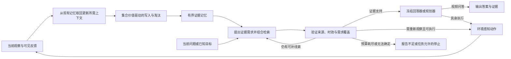

# CVPR 2027 工作规划：面向长时程视觉与具身任务的闭环证据记忆

> 版本：v1.1，2026-09-06（补充最新近邻与仓库复核）。目标会议：CVPR 2027。
> 本轮重点：方法设计、训练信号、实验设计、开发基础与实施路径。
> 状态：研究与工程规划，尚未开展本方案的训练或基准复现。文献结论属于作者报告；本文方法、收益门槛、算力和工期均为待验证设计或内部估算。

## 1. 本次决定与工作范围

**在已有 BundleMem / FQR 的 CVPR 初稿上继续推进，把研究对象从“保留完整证据”扩展为“在有限存储和读取预算内，使完整且时效正确的视觉证据真正支持下游决策”。** 保留原稿的组合证据思想，但不再假设固定 reader 能自然取回这些证据，也不把人工标注的最小证据组合设为规模化训练的前提。

本规划以[原 CVPR 初稿](../../writing/drafts/fqr_bundle_memory_cvpr/main.tex)及其[状态说明](../../writing/drafts/fqr_bundle_memory_cvpr/README.md)为基础。原稿是实验前初稿，结果表仍为占位。既有调研和其他候选方案保留为历史材料；本次明确选择继续原稿，不沿用其他选题稿的推荐顺序。

### 1.1 推荐主线

1. **方法：**查询到来前学习保留互补证据；查询或当前任务到来后，按未满足的证据需求进行组合检索、验证、补取和停止；具身执行反馈触发记忆更新。
2. **训练：**以轨迹自监督和自动任务反馈为主，少量模型伪标签为辅。人工证据标注用于独立审计及强监督参考，不作为部署到新领域的必要训练材料。
3. **实验：**可控 Gym 检验机制，真实视频检验自然视觉证据，导航和具身任务检验决策价值。离线轨迹重放与真实环境交互必须分开报告。
4. **工程：**本仓库实现独立的记忆核心；优先通过适配器复用 StreamArena 的视频评测驱动、3D-Mem 的导航/EQA 环境和 EmbodiedBench 的长程任务接口。RAVEN/STaR 用作具身读取系统对照，不作为有界 writer 的直接底座。视觉骨干和底层控制器先冻结。
5. **论文：**主张由实验决定。不能把“有 memory、有 retrieval、有 RL、有 embodied benchmark”四件事相加视为创新。

### 1.2 必做、优先扩展与后续工作

| 层级 | 内容 | 完成标准 |
|---|---|---|
| P0：核心投稿包 | 双预算闭环；无需新增人工 evidence 标注的训练版本；可控机制实验；一个真实视频评测；一个真实交互的长时程具身评测，优先导航 | 同表示公平对照成立；至少在真实视觉任务和交互任务上有可归因的收益 |
| P1：优先扩展 | 长程操作/任务规划；利用同一导航基础接入主动 EQA；第二消费者；跨任务迁移 | 不另起大型训练体系；最晚 10 月 18 日有稳定原型，否则不阻塞主实验 |
| P2：投稿后或资源充足时 | CALVIN/LIBERO 上的低层 VLA 接入、真机、跨月记忆、自适应 codec、部署时参数更新 | 独立验证资源和数据条件；不进入第一版关键路径 |

**范围边界：**高层操作规划成功不等于已经验证低层连续操作控制；预录具身视频上的 QA 不等于闭环具身任务；导航上的收益不自动推广到任意操作任务。P1 若顺利，应争取成为论文的第二类具身证据，而非装饰性 demo。

### 1.3 官方时间与倒排原则

截至本次核查，CVPR 2027 官方日期页列出：注册 **2026-11-10**，正文 **2026-11-16**，补充材料 **2026-11-23**，评审发布 **2027-01-25**，决定 **2027-02-25**，均按页面注明的 AoE；会议为 2027-06-20 至 06-25。[官方日期][cvprdates]

从现在到正文截止约十周。内部目标设为 **11 月 8 日完成完整可读稿、11 月 13 日完成提交版本**。Rebuttal 的具体期限、camera-ready 日期、2027 模板与页数规则在对应官方说明明确后核对，不照搬初稿里的 CVPR 2026 字段。

## 2. 原稿应保留什么、修改什么

| 原稿内容 | 本轮处理 | 原因 |
|---|---|---|
| 查询未知时写入，删除后不能回放原始视频 | 保留，作为严格视频协议 | 这是不可逆记忆分配与普通全库 RAG 的关键区别 |
| evidence bundle 的内部 AND、替代路径之间 OR | 保留为分析对象和可控评测真值 | 单项证据召回高不意味着存在完整可用路径 |
| query-free set critic | 保留集合交互结构，修改预测目标 | 从“标注组合存活率”转向“合法 reader 与消费者实际可实现的未来效用” |
| 固定 reader，仅做 Stored/Accessed/Used 审计 | 扩展为可执行读取策略，仍保留固定 reader 消融 | 需要学习如何补取缺失证据，并验证训练反馈是否改善 writer |
| 从人工时空 evidence 构建组合监督 | 降为审计与强监督参考路线 | 规模化路线不能依赖逐任务人工证据链和替代路径枚举 |
| 仅 QA 消费者 | 扩展为答案、子目标、动作与计划前提 | 同一个记忆模块应支持“回答”与“采取下一步行动” |
| 三类 oracle 与 regret | 保留，但严格限制可计算条件 | 真实数据上的启发式 teacher 不能冒充严格 oracle |
| 新颖性来自组合证据与闭环 | 重新审查并收窄 | EMBER、OSL-MR、Mem-T、Memo 等已覆盖相当一部分概念 |

**重要边界：有限记忆无法保证支持任意未来问题。** 本项目能提供的是：在预先声明的任务族、观察条件、消费者和资源预算内，提高完整证据的保留、取回及使用概率；对不足给出经校准的判断与合法补救。不能把 VLM 输出的“证据充分”写成形式化完备性保证。

## 3. 文献定位与可辩护的研究问题

本节为截至 2026-09-06 的定向调研，优先核查论文原文、作者项目页与官方代码。它不是覆盖所有相关工作的系统综述；2026 年新预印本的可复现性仍需实验检查。

### 3.1 最接近的工作及其限制了哪些主张

| 工作 | 已核查事实 | 对本项目的约束与可研究差异 |
|---|---|---|
| [EMBER][ember]，2026 预印本 | 已有 pre-query 保留、source-backed capsules、保留库读取和 answer-gated evidence-chain 反馈；训练奖励使用支持证据信息 | 不能声称首次闭合写入—读取—回答链。本项目需检验视觉互补集合、缺失补取和无需人工 evidence 的学习能否带来额外收益 |
| [OSL-MR][osl]，2026 预印本 | 研究可观测性约束下的顺序记忆分配，包含遗漏、重新获取和过时成本 | 延迟价值、重访成本、离线监督与在线特征分离均非新概念；应比较其启发式与学习目标，而非只比较 FIFO |
| [REVEAL][reveal]，2026 预印本 | 无额外训练，按自动 rubric 验证充分性并定向重新检索 | “需求分解—验证—补取”必须作为强基线；我们的 reader 只可读预算内存活载荷，补取能力受之前遗忘限制 |
| [Mem-T][memt]，2026 预印本 | 树式 credit assignment 把延迟反馈转成步骤监督，并联合优化记忆构建与多轮检索 | 联合训练不是贡献本身。优先采用轻量的配对回放，检验集合互补及视觉证据失效是否是必要机制 |
| [TaskMem][taskmem]，2026 预印本 | 学习多模态 memorization policy，以 memory-only 视频 QA 评测，并区分通用记忆训练和任务适配 | “按未来任务学习记什么”已有直接近邻；本项目需要明确的证据访问、组合交互与低标注实验 |
| [LatentStream][latentstreampaper]，2026-09 预印本 | 已提出固定预算的 query-agnostic 分层流记忆，并在读取时迭代检索、内化为 latent working memory，以分层预测熵构造优化信号 | “迭代读取”“latent 内化”“置信度驱动继续读”均不能作为本项目的新意；必须比较来源可核验的组合 packet，并证明低成本读写头在不可逆删除下的额外价值 |
| [Memo][memo]，NeurIPS 2025 | 将记忆生成和读取纳入 RL 训练，并在长程多目标导航等任务上评测 | 具身记忆闭环已有先例；需要与压缩 recurrent/summary memory 比较 |
| [3D-Mem][3dmempaper]，CVPR 2025；[Pred-EQA][predeqa]，CVPR 2026 官方代码 | 已通过场景/视觉记忆支持探索和 EQA；Pred-EQA 结合预测规划与结构/证据双记忆 | 空间记忆、双系统规划、主动补看都不是独立新颖点；适合复用和对照 |
| [RAVEN][ravenpaper]、[STaR][starpaper]，2026 | 都已把长时视觉/空间/时间记忆、任务条件检索、问答与导航连接起来，并报告仿真或真机结果 | “视觉记忆支持具身问答和导航”已是直接近邻；本项目必须强调固定存储/读取预算、不可逆淘汰、组合证据存活及弱/自监督读写反馈 |
| [MemoryVLA][memoryvla]，ICLR 2026；[EventVLA][eventvla]、[NativeMEM][nativemem]、[HiMe][hime]，2026 预印本 | 分别研究感知/认知记忆、预测性关键帧证据、原生记忆压缩、分层执行与记忆管理 | 不能以“把视觉记忆用于长程操作”作为贡献；尤其要区分 EventVLA 的未来关键帧预测与本方案的集合可用性目标 |
| [WorldMemArena][wmapaper]，2026 预印本 | 分别诊断写入、维护、检索与使用，涵盖多会话多模态任务 | 阶段审计借鉴其思想；其轨迹任务不能替代本项目的环境交互实验 |

### 3.2 推荐的核心问题

> 在历史不可免费回放、存储和读取都受限的条件下，能否从轨迹自身与任务反馈学习**可被消费者取回并利用的互补视觉证据价值**，同时区分“仍可从记忆补齐”和“需要重新观察/无法恢复”的缺口，并使这种能力迁移到长时程具身决策？

**研究推断，而非已确认空白：**最值得检验的是“集合互补性 × 有限读取 × 不可逆遗忘”之间的相互作用，以及能否用低人工成本学到这种相互作用。只有相对上述近邻的机制实验成立，才有充分理由把它写成新方法。

### 3.3 可证伪假设

| 编号 | 假设 | 必须观察到的证据 | 反例/否定条件 |
|---|---|---|---|
| H1 | 自然长时视觉任务中，证据组合破碎是独立于单项召回的瓶颈 | 控制单项召回后，组合完整性仍解释 grounded answer/decision 的差异 | 现象只出现在人工 AND 题，真实任务不成立 |
| H2 | 写入应优化实际可取回的效用 | 双预算下，读感知 writer 优于仅存活率 writer；相同 reader 下仍可见写入收益 | 收益完全来自增加读取轮数或更强消费者 |
| H3 | 不需要新增人工 evidence 链标注也能学到有效集合价值 | 0 新增人工 evidence 训练版本在真实测试上击败等算力简单策略，并接近强监督参考 | 自监督只改善重建；任务收益必须依赖大量人工链标注 |
| H4 | 读取与环境重访是不同补救动作，值得区分 | 相同动作与读取预算下，提高成功率或减少无效重访/无效检索 | 总是多看几帧或总是重访即可达到相同效果 |
| H5 | 收益来自可迁移的记忆机制 | 场景/任务组合外推，冻结 writer 或少量无标签适配后仍有效 | 依赖场景 ID、固定动作模板或评价器特征 |

## 4. 方法设计：形成两个闭环

### 4.1 先区分两种部署信息条件

| 协议 | writer 能看到什么 | 请求何时可见 | 用途 |
|---|---|---|---|
| V：严格 query-after-write | 当前/过去观察、合法侧信息、已存记忆 | 视频检查点之后才出现 | 延续初稿；同一快照服务多个问题 |
| E：在线具身任务 | 当前观察、已执行动作、可观察反馈、当前已知目标 | 当前目标可见；未来子任务只在官方规定时刻揭示 | 导航、操作、规划；这是 goal-conditioned memory，不冒称 query-free |
| E-pre：探索后给任务 | 探索阶段目标隐藏；之后允许按目标读取与行动 | 探索完成或子任务切换后 | 连接 V 与 E，检验未知未来需求下的具身记忆 |

E 协议不能人为隐藏原任务本来提供的整条指令；V 协议也不能因训练时知道任务族而偷看实际测试题。每条结果注明所属协议。参数训练与测试期记忆状态更新分开：第一版测试期间冻结模型参数。

### 4.2 统一状态、证据单元与预算

观察记为 $o_t$，当前合法任务记为 $g_t$，动作与环境反馈记为 $a_t,f_t$。持久状态为：

$$
M_t=(C_t,I_t,D_t,H_t),\quad \operatorname{bytes}(M_t)\le B_s.
$$

- $C_t$：固定规格 evidence capsules，包括视觉载荷、时间、可观察实体/位置锚点与来源。
- $I_t$：检索键和索引；$D_t$：有界关系与版本信息；$H_t$：近期缓冲、任务进度等跨步状态。
- 原生音频/OCR、模型生成文本、对象轨迹、地图、隐藏状态，只要未来仍可访问，就必须计费。不允许“删图但免费保留全量图特征”。

**第一版表示：**统一帧采样与事件边界，冻结视觉编码器，每个单元保存固定数量、固定分辨率的真实图像/短帧序列，加定长键、时间和少量关系。逻辑槽位按实际序列化大小上限分配；变长 JPEG 用填充或显式字节打包，不能用“同样 16 帧”代替同字节比较。视觉内容不能全部变成 caption，否则容易退化为文本记忆研究。

读取阶段另约束累计读取字节 $B_r$、消费者累计输入量 $B_i$、调用/计算预算 $B_c$；具身还有动作/路程预算 $B_a$。反复输入同一证据的 token 和计算重复计入。模型权重属于固定基础开销单列；任何测试中增长的适配状态计入持久状态。

导航控制器若必须有占据地图，采用**相同、有上限的控制状态配额**，报告 $B_{total}=B_s+B_{nav}$。任务相关语义地图不得藏在免费控制状态里。模拟器内部世界状态不是智能体记忆，策略不能读取其隐含真值。

### 4.3 证据组合：用于解释，不要求部署时得到真值图

对任务请求 $q$，定义相对于明确验证器的可观察充分集合族 $\mathcal E_q$。

$$
A_s(q,M)=\mathbf1[\exists E\in\mathcal E_q:E\subseteq M],\qquad
A_r(q,Z)=\mathbf1[\exists E\in\mathcal E_q:E\subseteq Z].
$$

这里的集合包含支持决定所需的观察；具身情况下必须加上时间有效性和当前决策前提。**一条专家动作轨迹不是唯一充分证据集合**，任务可能有不同路线、技能或证据来源。

真实数据通常只有不完整路径标注，故“未找到已标注路径”不等于“没有任何充分路径”。VLM 删除检验只能获得特定消费者下的操作性标签；逐项删除失败至多说明单项删除意义下的局部最小，不能在模型可能受干扰的非单调情形下宣称全局最小。精确最小集合仅在有完备规则的 Gym 中使用。

### 4.4 部署闭环：写入、读取、使用与更新



**写入前取回 $R_w$。** 新观察可能改变旧状态，也可能是旧事件的补充证据。先用当前实体、位置、时间从尚存记忆取回相关上下文，再做身份绑定、版本更新和淘汰；不能为了更新访问已删除历史。小容量原型允许读全部键，但载荷解码与计算仍记账。

**组合读取 $R_r$。**

1. 把请求转成短的可验证需求，如“同一对象的身份”“最近一次位置”“操作前置状态”，不生成冗长推理轨迹。
2. 用冻结语义检索、时间条件和实体锚点得到候选；按“补足已有集合的边际效用”重排，而非每个需求各自 top-1 后直接作答。
3. 将证据组织成带 ID、时间、实体和来源的 packet。验证器输出：有来源支持的事实、冲突、尚未满足的需求。
4. 对未满足需求，选择继续取回另一组合、展开仍存的局部邻居、重新观察环境或停止。查询阶段不能打开外部历史文件恢复被淘汰载荷。
5. 第一版设最多 3 轮检索和固定累计预算；完整组合大于读取预算时记录“读取容量不足”，不能把证据窗口轮流看过就自动视为共同可用。跨轮事实工作区也计入预算。

读动作可用轻量头估计：

$$
v_\psi(u\mid q,Z,M)=\mathbb E[\Delta S_{task}\mid q,Z,M,u]-\lambda_r c_r(u)-\lambda_c c_c(u),
$$

其中 $u$ 是读取动作，$\Delta S_{task}$ 是经教师/任务验证的收益；输入只包含当前合法状态。组合可能需要多次读取才能生效，故训练目标评估剩余预算内后续读取的回报，辅以可验证需求覆盖，不能把“下一片还未让答案变对”一律标成零价值。先实现规则版“缺口补取 + 去重 + 固定停止”，再决定学习头是否值得加入。

**不足判断必须分层。** 从已保留载荷可以确认“支持了哪些需求”；对余下部分只能估计“继续读可能有用/可能需要重访/当前无法确定”。仅凭压缩状态一般无法证明某事实从未发生或已永久丢失。训练时可以通过受控删除获得这些标签，测试时不能读取删除记录中的答案内容来判断。

**具身重访与历史事实。** 重访看到的是现在的世界；它可能恢复当前物体位置，却不能恢复“谁刚才拿走物体”等不可逆历史事实。给“重新观察”单独的动作与时间成本，不视为免费检索。

**使用后更新。** 冻结 planner 基于 packet 提出短计划或下一动作，并记录依赖证据 ID。执行后把可见变化、失败反馈写回；“尝试关门”不能直接变成“门已关上”。过时事实保留时间范围、被新证据替代关系；当前状态查询选有效版本，历史查询仍可访问尚未被淘汰的旧版本。暂时看不到对象不能自动推断它已不存在。V 协议答题不修改共享快照，读后反馈仅在训练中更新参数；E 协议才沿实际新观察推进在线状态。

### 4.5 训练闭环：把读与使用结果反馈给 writer

不再只回归人工路径存活率。以固定 reader/consumer 的可实现效用为主要目标：

$$
U^{R,F}(M)=\mathbb E_{q\sim P_{train}}\left[S_{task}(F(q,R(M,q)))
-\lambda_r C_r-\lambda_c C_c-\lambda_a C_a\right].
$$

QA 的 $S_{task}$ 使用答案与证据联合质量；具身使用环境成功、子目标完成及证据一致性，分别报告各项，不用任意加权总分替代主指标。V 中期望针对未知请求分布，E 中则条件于当前已知目标和合法后续任务分布。Gym 中额外用精确组合覆盖监督；真实弱标签样本按置信度赋权。允许不足输出的任务同时约束回答覆盖率并校准停止阈值；官方不允许弃权的任务把停止按官方规则计为失败，不能靠全部拒答获得低风险分数。

Writer 仍是小型集合编码器：冻结视觉/文本特征，加入时间、有效性、当前配额、可观察关系和任务条件（仅 E 协议），对 skip/insert/replace 等动作后的集合预测效用。采用约 5M–30M 参数的 Set Transformer 作为起点；DeepSets 与独立 item scorer 为消融。参数量为设计区间，实现在 profiling 后确定。

**必须解决延迟互补，而不只解决已成形组合。** 如果早期 A 只有与未来 B 联合才有价值，用“当前可回答率”贪心打分会提前删掉 A。为此采用以下分层实现：

- 基线保留一个所有方法共享、计入预算的近期缓冲，避免单个事件被采样边界截断；不能无限保护所有未闭合路径。
- 主 critic 用训练轨迹的后续观察继续执行 writer/reader，学习候选更新的**后续实际回报**，而非只看当步组合数。教师可用训练未来，部署特征不可用。
- 第一版在同一 prefix 上采样 4 个同预算更新，固定后续策略、未来流和请求集，构造配对效用差；定期用当前策略产生的新状态更新训练集。
- 仅当单步替换无法保留互补集的局部最优问题明显时，加入最多两个单元的替换动作。先与同样动作空间的 item/coverage 基线比较，避免把更大搜索空间当作目标函数收益。

训练先固定 reader 训练 writer，再固定 writer 训练/校准 reader，最后做少量交替更新。每轮更新都重新生成合法回放；不要第一天就端到端微调 VLM、控制器、codec 和两个记忆模块。

## 5. 弱监督与自监督：调研结论及训练配方

### 5.1 结论：降低标注依赖可行，完全无任务信号并不合理

仅靠像素/特征重建，无法知道有限字节应优先服务哪种未来任务；这还需要任务分布假设、代理任务或环境反馈。推荐的对外表述是：**记忆模块无需新增人工证据链标注，主要从未标注观察序列和自动反馈学习。** 基础 VLM 的既有预训练监督、仿真任务设计和任何已有 QA/演示均须披露。

| 训练来源/近邻 | 文献事实 | 本项目如何借鉴 | 不应混淆的边界 |
|---|---|---|---|
| [MemTrain][memtrain] | 未标注文本上的终局遮蔽恢复与中间记忆召回，优化长期维护能力 | 从视频/轨迹构造跨段关系、对象重现与状态恢复任务，兼顾中间检查点 | 原论文是文本；迁移到视觉是本文假设，不能直接复述其效果 |
| [Time-Contrastive Networks][tcn] | 同时刻多视角匹配与时间邻域对比用于自监督视觉表示 | 已有同步视角、可靠轨迹提供同实例正例；构造外观相似但身份/状态不同的难负例 | 相近时间不一定同状态，同对象变化前后不应强行当语义等价正例 |
| [V-JEPA 2][vjepa] | 以视频自监督学习预测表征，并以交互数据适配动作条件模型 | 冻结已有表征，训练小头恢复任务相关 latent/关系，提供低成本辅助信号 | 预测能力不等于记忆充分性；不在本项目重做大规模世界模型训练 |
| [EPOS-VLM][epos] | 用仿真采集、伪描述和多视角一致性训练对象级记忆/关联 | 可借鉴自动采集与一致性筛选，而不是标注每条必要证据链 | 教师伪描述包含模型监督；一致错误仍可能跨视角自洽 |
| [Hindsight Experience Replay][her] | 用实际达到的目标重标失败轨迹，提高稀疏奖励利用率 | 从已观察的达成状态构造训练请求，重放早期记忆决策 | 重标目标必须可执行且与轨迹一致；未来目标不能成为前缀 writer 的输入 |
| [Memory-R1][memoryr1] | 以结果 RL 优化记忆操作与使用，论文报告少量 QA 可训练 | 说明不必提供每次 ADD/DELETE 的人工动作标签；先学离散记忆动作 | 少量人工 QA 并非无监督，其结果不能证明视觉场景同样数据高效 |
| [MemRL][memrlpaper] | 冻结推理模型，以环境反馈更新记忆条目效用并进行两阶段检索 | 廉价 relevance + utility baseline；小头训练前的无参数更新参考 | 条目效用不是集合互补效用；文本 ALFWorld 不能替代视觉操作 |
| [Mem-T][memt]、[Memo][memo] | 分别处理长程记忆 credit assignment、具身记忆读写 RL | 在配对训练不足时加入少量回报更新，延迟回报在同一 prefix 上比较 | RL 描述优化算法，并不说明奖励是否来自人工标注 |

### 5.2 三类监督通道，分别记账

**S0：轨迹自监督，最低依赖。** 只用合法训练视频、动作记录与自然再观察，不用人工 QA/evidence；训练目标来自被遮蔽的既有观察或确定的时序/同步关系。自然视频中的伪身份、属性由模型产生时，另标为 S1，不能混入纯 S0。

**S1：模型或现有任务提供的弱监督。** 冻结教师生成短问题、答案、候选支持关系；或者只用已有 QA 结果，不用 evidence 链。所有伪标签记录教师版本、prompt、置信度和来源。验证成功才作为正例，无法判断的样本保留 unknown，不能当负例。

**S2：仿真器/环境自动监督。** 利用任务成功、动作执行结果、对象状态转移生成 reward 或训练用证据。隐藏世界状态仅位于 teacher/evaluator 通道；这称为自动监督或特权训练，不称纯自监督。真实机器人仅能用传感器/可观察反馈的版本需单独测试。

训练报告必须同时给出新增人工 evidence 数、新增人工 QA 数、已有人工演示规模、伪标签量、仿真轨迹量、教师调用成本与人工审计工时。禁止只写“0 labels”。

### 5.3 推荐自动构造任务

| 任务 | 生成方式与目标 | 主要训练模块 | 防止学到捷径 |
|---|---|---|---|
| 遮蔽历史关系恢复 | 隐藏后段请求中的身份/位置/前态，从保留历史恢复；用源片段或仿真事实验证 | writer + reader | 请求不能泄漏被恢复字段；仅重建键/时间索引不计成功 |
| 跨视角/重访关联 | 同步相机或高置信轨迹提供来源匹配；隔开干扰段后再识别 | retrieval key、关系头 | 错配、遮挡和变化状态设 unknown；视觉相似不能替代身份真值 |
| 状态更新与冲突 | 观察 A→B 的自然动作，辨别旧状态和新状态，随后查询两种时间范围 | 更新读取、版本维护 | 不把“执行动作成功”自动等同于所有后置条件成立 |
| 组合补全 | 选来源可验证的两个以上观察；构造完整、缺一、错身份、旧版本、替代路径等集合 | set critic、组合 reader | 自然样本不凭模型想象强行赋予 AND；精确标签只来自 Gym/S2 |
| Hindsight 请求 | 用已达成的可验证状态定义训练目标，在原始前缀重新写入记忆 | writer 后续价值 | 不改轨迹事实；不把失败轨迹伪装为原目标成功 |
| 稀疏成功/失败 | 相同起点、相同策略骨干下改变记忆操作，执行至子目标/任务终止 | 效用校准、交替训练 | 区分感知失败、动作不可执行和缺历史；共享随机数降低方差 |

每条训练记录至少包含：`source_split / scene_or_video_id / prefix_end / visible_inputs / memory_action / retained_ids / probe_type / target_origin / reward_components / teacher_version / confidence / seed`。训练缓存允许保存原轨迹；部署进程不挂载该缓存。

### 5.4 配对干预与小模型学习

在同一训练前缀，从同预算集合 $C^+,C^-$ 运行合法 reader 和冻结消费者；只改变记忆内容，固定请求、模型、解码与后续回放。得到：

$$
\Delta = \widehat U(C^+) - \widehat U(C^-),\quad
\mathcal L=\lambda_v\mathcal L_{value}+\lambda_p\mathcal L_{pair}
+\lambda_m\mathcal L_{masked}+\lambda_d\mathcal L_{dependency}.
$$

`value` 拟合后续效用，`pair` 学同资源下的偏好，`masked` 提供 S0 辅助信号，`dependency` 仅在可靠组合/关联标签存在时启用。各项权重先在开发集小网格确定，缺标签使用 mask，不强凑全监督。

这种干预估计的是**固定消费者对可用上下文改变的响应**，不等同于证明真实物理世界的因果关系。动作改变后后续世界会分叉：可在模拟器复制同状态执行时才估计动作长期效果；只有离线视频时只做离线代理评估，不把未经执行的替代动作当真实 reward。

为避免教师自我确认，至少做到：来源绑定；遮蔽/替换/时序反转负例；开发集校准；一部分样本由不同消费者复验；小规模独立人工审计。两个模型一致不是正确性的证明，不以提高伪标签数量替代审计。

### 5.5 分阶段训练与必须提供的对照

| 阶段 | 推荐实施 | 进入下一阶段的条件 |
|---|---|---|
| T0：无训练闭环 | 均匀/多样性 writer + 组合检索 + 固定来源验证 | 有记忆依赖样本和可观察的 Stored→Accessed 缺口 |
| T1：S0 自监督 | 冻结前端，在缓存特征上训练小型 writer/reader 头 | 留出轨迹上关系恢复、状态更新提升，且并非索引捷径 |
| T2：S1/S2 校准 | 以同预算配对回放加入任务效用与少量伪标签 | 真实视觉/任务指标也提升，伪标签错误率可控 |
| T3：交替更新 | 固定一端更新另一端，刷新 current-policy 状态；最多先做 2–3 轮 | 优于分别训练且成本合理，否则保留 T2 |
| T4：可选 RL | 对离散读取/写入动作做小规模策略优化 | 延迟 credit assignment 明确是瓶颈，且资源允许 |

最终至少比较：随机初始化；只 S0；只 S1；只 S2；S0+S1/S2；人工 evidence 强监督参考。尽量匹配训练轨迹数、冻结骨干、训练/教师总成本。补充 0/少量/较多人工 evidence 的数据效率曲线，**人工审计集不回流训练或调参**。没有 S0 单独有效的结果，就把论文称为弱监督/自动监督，不包装成纯自监督。

## 6. 任务与数据：从视频走向真实交互

### 6.1 数据分工与推荐顺序

下表是选型建议，不是已锁定的数据栈。第一个工程关卡检查获取、许可、划分和观测接口后再冻结选择。

| 数据/环境 | 用途与训练信号 | 原生能力与记忆问题 | 优先级/局限 |
|---|---|---|---|
| 自建小型 Video Memory Gym | 规则生成事件和请求；S0/S2，精确组合及替代路径 | 控制证据延迟、身份、状态更新和互补阶数 | P0；不能独自证明自然视频有效 |
| [StreamArena][streamarenacode] | 优先核查 Historical Retrospection 子集；提供统一 JSONL、流式驱动和时间证据，可从单视频开始 smoke test | 243 个长视频、3,646 个开放任务，直接考察连续写入和历史回忆 | P0 协议首选候选；全量约 300GB，论文 StreamMind agent 尚未发布，先验证小模型吞吐与数据许可 |
| [LongVideoBench][lvb] | 作为真实长视频兼容性评测；可用公开 validation 做预先划定的开发/最终留出 | 长上下文视觉与字幕推理；与原始先给问题协议分开 | P0 备选；没有完备最小证据链，需独立审计集；不可把 validation 同时用于反复调参和最终检验 |
| [EG-VQA][egvqa] | 有支持时间段，适合 grounded 评测和强监督参考 | 可检查答案与时间证据一致性 | 论文已核查；本次未确认可用官方数据下载与训练划分，不作为关键路径前提 |
| [OpenEQA][openeqa] | 具身场景历史上的 QA，作为真实空间记忆桥接 | 同一环境历史支持多个问题 | 原始主仓已归档；历史评测为离线，不代替 live navigation；QA 不是训练数据的默认来源 |
| [GOAT-Bench][goat] | 多目标导航；train 场景自动探索/回放提供 S0/S2 | 顺序访问 5–10 个类别、语言或图像目标；历史探索可减少重复搜索 | P0 具身首选；保留原生结果，并另报双预算及目标揭示协议 |
| [3D-Mem A-EQA][3dmemcode] / [Pred-EQA][predeqa] | 已有主动 EQA 的环境循环、问题列表和评分接口 | 边探索边回答；读取与再次观察可比较 | P1，能复用导航基础；问题从开始可见时属于 E 协议 |
| [RAVEN-QA / NaVQA / FindingDory][ravencode] | 外部具身 QA、视觉回忆和导航系统对照 | 图像/视觉 embedding 结合位置与时间索引；FindingDory 基于 Habitat | P1 补充；原实现不是固定预算 writer，且代码为限非商业用途的 NVIDIA License |
| [EmbodiedBench EB-ALFRED / EB-Habitat][embench] | 高层长程操作和重排；自动成功/进度信号 | 子目标顺序、对象当前状态、先前执行结果与失败恢复 | P1 优先争取；原生任务未必都依赖长期视觉记忆，必须先筛查历史依赖 |
| [CALVIN][calvin] / [MemoryVLA + LIBERO][memvlacode] | 操作序列与低层策略接口 | 更接近连续操作控制，可作为第二阶段外部验证 | P2；额外动作/模型适配成本较高，长任务不自动等于非马尔可夫记忆任务 |
| [WorldMemArena][wmacode] | 写入、更新、检索、使用的外部生命周期诊断 | 有多模态轨迹与证据链 | 补充评测；不从其测试证据链训练 critic，不宣称完成环境交互 |

**训练数据的可执行入口：**先从有许可的仿真 train 场景收集随机/覆盖探索及任务轨迹；其次接入明确具有训练划分的既有视频/交互语料。公开测试轨迹、OpenEQA 问题、EmbodiedBench 发布的评测模型轨迹，不因可下载就自动获得训练资格。若只能获得评测集，整集保留用于评测，训练改用不重叠场景生成数据。

### 6.2 导航：重点考察“看过后能否用上”

主路径为 GOAT 的顺序目标导航，冻结感知、当前观测、导航控制和动作空间，在目标切换时保留同预算记忆。按之前是否见过目标、再次访问间隔、对象歧义程度分组。

实验分两层：

1. **固定轨迹重放：**所有方法接收相同探索轨迹，比较写入、取回及目标证据是否完整。由此隔离记忆机制，不以离线模拟成功率替代真实 SR。
2. **真实交互 rollout：**相同场景、起点、目标序列、步数上限与控制器，记忆影响后续探索/路线；执行每一步后获取真实新观察，比较 SR、SPL、重复访问和决策成本。

可加一个清晰命名的 E-pre 变体：先完成不知目标的固定探索，再依次给请求。若扩展到“回到先前放置物体的位置”等事件任务，需要可交互动态环境；不能把静态 HM3D 场景假装成具有自然物体搬移的环境。

### 6.3 长程操作与规划：从高层闭环开始

推荐先接 EB-ALFRED 的高层技能接口，或同等成本的 EB-Habitat 重排；memory packet 提供“对象证据、已确认状态、已完成子目标、未验证前提”。冻结 planner 与技能执行器，算法只改变跨步记忆和读动作。

重点测试三类困难：先看到的对象属性后来不可见；多个相似对象需要跨时身份绑定；操作失败或状态变化导致旧计划前提失效。规划指标必须落到执行：最终任务成功、完成子目标数、首个失败位置、无效动作和恢复成功，而非只让语言模型评价计划合理性。

若原生任务凭当前图像或环境反馈即可解决，先保留原生全集结果，再在训练/开发场景构造明确命名的 **Memory-Stress 派生集**：加入无关子任务、延迟回访、条件指令或可验证遮挡，保证任务可完成且答案/指令不泄漏历史条件。不能只挑有利测试样本，也不能把派生集成绩写成原生排行榜成绩。

低层操作暂不训练新 VLA。后续若接 MemoryVLA/CALVIN，冻结已有执行模型，先验证 packet/记忆 token 的接口兼容，再决定是否需要小适配层。当前图像能够揭示所有任务状态的样本也要保留，用来衡量额外记忆是否增加无谓成本。

### 6.4 具身问答：离线历史与主动探索分别证明什么

- **EM-EQA：**历史写完再问，检验证据跨视角组合和空间关系；属于 V/E-pre 桥接。
- **A-EQA：**任务开始即知问题，边走边取证；检验“继续检索”与“继续探索”的效用判断，属于 E。
- 对同一问题设“只读存活记忆”与“允许有成本重访”两档。回答质量、证据质量、路程、调用次数共同报告。
- 不可回答情况中，区分环境本身无法提供、原轨迹未观察到、记忆已遗忘、reader 未找到。前三者在真实测试中未必可判定，未知情况保留 unknown；精确分类依赖诊断真值。

### 6.5 数据划分与污染控制

按视频、物理场景、对象布局和任务模板来源分组划分，而不是随机拆 QA。来自同一场景或同一演示的裁剪/改写/伪题不得跨集合。开发集用于阈值、预算点和超参数；最终留出集冻结后只做预先登记的分析。

跨任务迁移至少包含：视频/S0 预训练→导航；导航训练→未见场景；导航记忆头→操作/EQA 的冻结迁移与少量无标签适配。第三项若失败，明确说明需任务适配，不声称统一权重通吃所有任务。

## 7. 实验设计与决策门槛

### 7.1 先确定瓶颈，再扩大训练

开发集首轮建议：约 200 个视觉问题或决策检查点、20–30 条导航轨迹、20–30 条操作轨迹；它们是诊断规模，不足以支撑最终微小增益的显著性结论。人工审计约 150–200 个分层样本，仅判断观察是否可见、组合是否必要、伪标签是否有依据；抽取一部分双人审计并记录分歧。

每个样本先比较：当前观测；采样后的完整历史；人工/仿真核验的可见证据；预算记忆 + 普通读取。分别定位采样/感知、写入、读取、消费者、控制执行五类瓶颈。完整历史消费者不必优于短证据输入，因此不能把其模型分数称为严格性能上界。

### 7.2 可控 Gym 与 oracle 的正确用法

生成可见原子事件，改变组合大小 1–4、替代路径数、跨路径重叠、跨度、干扰密度、状态更新和 side-information 可靠性。加入组合大小为 1 的负对照，避免只构造有利于 set critic 的任务。

小问题用枚举/整数规划计算 post-query 和 offline pre-query 最优保留；后一种对整个任务分布共用一个快照。因果最优仅在已知有限生成分布和相同在线接口下计算：使用策略枚举或满足可观测状态等价约束的动态规划，相同当前记忆/合法输入必须作相同决定，不允许以教师知道整条测试流逐步贪心充当 causal oracle。

$\Pi_Q=U^*_{post}-U^*_{offline}$、$\Pi_H=U^*_{offline}-U^*_{causal}$ 只对相同表示、预算、效用与信息条件下的精确解报告。大实例求解超时则报告可行解及 gap；真实视频 teacher 的结果标为“特权参考”，不把差值写成严格 regret。

### 7.3 关键实验矩阵

| 实验 | 改变的变量 | 固定的条件 | 主判断 |
|---|---|---|---|
| E0 现象与前端上限 | 有/无完整组合，证据缺一，替代路径，当前观测/历史 | 消费者、题目、候选池、预算 | H1 是否在自然数据成立 |
| E1 writer 机制 | 独立 item、加性 coverage、仅存活 set critic、读感知后续价值 | 同 reader、codec、动作空间、输入 | 集合价值及读反馈是否必要 |
| E2 reader 机制 | top-k、MMR/覆盖、规则补取、学习补取、oracle read | 同一冻结快照、累计读取/调用预算 | 改善是否来自正确补齐而非更多调用 |
| E3 写读交叉 | W0R0、W1R0、W0R1、W1R1 | 同骨干、训练数据量、预算点 | 单独贡献及相互作用；不能只给最终组合 |
| E4 训练信号 | S0/S1/S2、混合、强监督、去掉配对/延迟回报 | 参数规模、训练规模及教师成本对齐 | H3，新增人工 evidence 成本与质量的关系 |
| E5 具身决策 | 无记忆/近期记忆/本方法；读取/重访策略 | 同起点、目标揭示时刻、控制器、动作预算 | H4，真实 SR、效率和恢复 |
| E6 更新与使用 | 旧版本替换、随机删除、错身份/时间交换、无效行动反馈 | 干预规模与载荷格式匹配 | 是否使用正确时效证据，是否出现错误状态覆盖 |
| E7 分布迁移 | 未见场景/组合、2×/4×更长跨度、不同任务混合、第二消费者 | 冻结主模型与阈值；适配另表 | H5 及适用边界 |
| E8 成本与退化 | 存储×读取二维网格、边索引有无、shortlist 宽度 | 输入质量与后台可访问资源 | 质量—字节—计算 Pareto 曲线 |

E3 的交互可报告 $(S_{11}-S_{10})-(S_{01}-S_{00})$ 及置信区间；没有正交互也可分别解释写、读的收益，但不能声称协同是必要贡献。E1 中共享缓冲和候选 shortlist，额外报告 shortlist 对 oracle 候选的召回上限。

### 7.4 基线分层，避免不公平比较

**同协议、同表示机制基线：**FIFO、reservoir/uniform、语义多样性、surprise、时间覆盖、独立未来价值 scorer、加性证据覆盖、旧稿 set critic、简单依赖保护、EMBER-style 结果反馈、规则版充分性补取、相关性+效用两阶段检索。采用这些论文思路重新实现的版本标为 `adapted` 或 `-style`，不称原论文完整复现。

**原生系统对照：**优先 3D-Mem / Pred-EQA，具身读取另考虑 RAVEN / STaR，视频考虑 TaskMem / CausalMem，操作考虑环境原 planner 和可运行的 MemoryVLA。原生系统可能使用不同表示、字节、模型和观测条件，单独列表。不能直接拿论文数字与本地结果相减证明领先。

**特权诊断：**全候选池、完整历史、当前问题已知的选择、gold 可见证据、oracle reader、无动作噪声控制器。区分资源特权、信息特权和执行特权；它们不参与公平主排名。

不穷举“所有基线×所有任务×所有预算×所有消融”。先在开发集筛出每类最强代表，冻结选择理由；最终优先完成 W×R 四格、最强简单策略、独立 item 与旧稿 writer 的两个主预算点和三 seed，再补关键扩展。被筛掉的候选及其开发结果保留，最终测试不用于选基线或阈值。

### 7.5 指标：不能只看最终正确率

| 层级 | 必报指标 |
|---|---|
| 采样与存储 | candidate evidence recall；item recall；可核验路径的完整存活率；状态/身份正确率；每字节收益 |
| 取回 | 已存充分证据条件下的检索成功率；检索后组合完整率；缺口减少；无效读取次数；停止错误 |
| 使用 | 答案正确率、时间/空间 grounding、联合正确率；当前任务决策质量；删除/替换后变化 |
| 导航 | 官方 SR、SPL；子任务序号曲线；已见目标与首次目标分组；重访距离、步数、碰撞/失败 |
| 操作/规划 | task success、子目标完成率、连续成功长度、无效动作、前提过时导致的失败与恢复率 |
| EQA/不足判断 | 官方答案指标；证据支持；回答覆盖率—错误风险曲线、错误自信率、校准误差；主动探索成本 |
| 资源 | 持久总字节及分项、读字节、累计模型输入、写/读 P50/P95 延迟、峰值显存、教师 GPU 时、模拟器时间与调用数 |

在可靠组合真值子集上定义 $S=$stored、$A=$accessed、$G=$grounded correct，则统计 $P(S)$、$P(A\mid S)$、$P(G\mid A,S)$，并单列“不在已知路径内却答对”的样本。分母为 0 时报告 N/A。正确答案或一次删除敏感性都不能单独证明真实证据使用；冗余替代路径会使删除无影响，因此同时做无关内容删除和证据替换对照。

预算先在开发集测量单元的真实字节；确定小/中/大三个存储点与两个读取点，再冻结。可用 8/16/32 个统一大小单元作工程起点，但最终横轴为实际总字节，且读取 budget 不得大到总能全读。不能将索引/地图费用置零获得虚假的压缩率。

### 7.6 统计与最终验证

训练主比较至少 3 个 seed；环境 rollout 使用相同 episode manifest 和随机种子，按视频/场景做配对、分组 bootstrap 95% CI，不把同一视频的多题或同一场景的多步当独立样本。主要假设、主预算点、容差和多重比较方案在最终评测前登记；其余标为探索性分析。

最终样本规模根据 pilot 的方差与配对差值做功效/精度估计；优先跑选定标准 split 的完整合格集合。若只能采样，先冻结分层 manifest 和排除原因，再运行模型，不按结果删失败场景。基础模型/教师/评价器 checkpoint、prompt、温度、分辨率、采样率和随机 seed 一并记录。

### 7.7 内部继续/收缩门槛

以下数值是开发决策阈值，不是预期结果或发表保证。允许在**看最终测试之前**依据 pilot 方差调整一次并记录原因。

| 关卡 | 建议门槛 | 未通过时如何处理 |
|---|---|---|
| G0：可运行且有记忆需求，9/13 | 至少一种具身环境完成 reset→观察→动作→反馈；历史干预改变部分决策，且非环境泄漏 | 换成本更低的适配器；若只剩离线 QA，明确暂停具身泛化主张 |
| G1：现象成立，9/20 | 审计样本中至少约 15% 有可信的跨观察互补/遗忘问题；前端与消费者能处理核验后的证据 | 优先修前端或选更合适任务；不能只靠构造 AND 题继续放大方案 |
| G2：闭环收益，10/04 | 两个预算点上改善 grounded 质量/任务成功，或相近质量下降低至少约 20% 读取成本；点增益目标约 2–3 pp | 若普通 top-k+多看即可解释全部增益，缩减 reader 创新主张 |
| G3：低标注学习，10/18 | 无新增人工 evidence 的版本优于强简单策略；不明显牺牲视觉 grounding；记录距强监督参考的差距 | 改称弱监督/任务监督方法；若必须大量链标注，重新评估立项目标 |
| G4：可成篇，11/01 | 真实视频和 live embodied 至少各有可信结果；主要机制、成本和三 seed 检查完整 | 收缩声明和任务覆盖；宁可报告限制，不用未运行结果填表 |

任何显著收益若依赖未来问题泄漏、免费原图回放、环境隐状态、测试集伪题训练或不同计算预算，必须撤回该结论并重新实验。

## 8. 工程选型：复用环境，独立实现记忆核心

### 8.1 本次实际核查范围

本次在线读取了以下 14 个仓库的默认分支元数据、目录树与 README，并检查可识别许可；对 3D-Mem、EmbodiedBench、CausalMem、TaskMem、MemRL、RAVEN、STaR 的相关源码做了静态阅读。**尚未安装依赖、下载模型/场景、运行任何上游模型或模拟器。** 下表工期是从拿到数据、Linux/NVIDIA 环境后计算的接入估算，不代表已证明可运行。

| 仓库 | 已有资源与建议复用 | 主要改动/成本 | 推荐角色 |
|---|---|---|---|
| [StreamArena][streamarenacode] | 数据加载、媒体处理、统一结果 JSONL、共享 judge 和流式 agent driver；支持单视频下载 | 论文 StreamMind agent 尚未发布；全量视频约 300GB，评测所用超大 backbone 不适合双卡直接照搬；约 1–2 日接入本地小模型与 MemoryStore | **视频主评测驱动候选**；复用协议和输出，不等待其完整 agent |
| [3D-Mem][3dmemcode] | A-EQA、GOAT 评测入口；场景对象/快照、探索和空间控制接口 | 原生持久图像/对象/地图需纳入预算；默认 API 消费者需接统一本地 VLM；约 3–5 个工作日完成首轮接入 | **导航主适配器候选**，同时覆盖 EQA |
| [Pred-EQA][predeqa] | 主动 EQA、Express-Bench、本地 VLM 服务调用与评分脚本 | 仍需双预算化与拆开当前问题/未知未来任务；缺失结果的评分回退逻辑需显式处理；约 2–4 日 | EQA 强对照与备选；本地服务接口参考 |
| [EmbodiedBench][embench] | 4 类具身环境、planner/evaluator 分离、长程任务和反馈接口 | 先只接 EB-ALFRED 或 EB-Habitat；过滤环境信息；跨环境依赖不能一次全部安装；约 3–5 日 | **高层操作/规划适配器候选** |
| [GOAT-Bench][goat] | 原任务、划分、基线及模型/目标 embedding 下载说明 | 核对原生评价与 3D-Mem 派生入口的一致性；独立训练导航策略成本较高 | 任务定义和原生 SR/SPL 的依据，不重训完整导航模型 |
| [OpenEQA][openeqa] | QA、历史获取说明和评价器；MIT；主仓已归档 | 可独立接静态历史；原评价器依赖模型调用；约 1–2 日 | 轻量桥接与评分；不作为持续维护主框架 |
| [TaskMem][taskmemcode] | 流式处理、记忆对象、QA 脚本；推理与 PhaseOne 训练仓分开 | 原生记忆与音视频处理需审计因果性/容量；默认多处 API；约 2–4 日 | 视频系统对照、流处理参考；不整套移植身份/音频管线 |
| [CausalMem][causalcode] | Qwen2.5-VL/LLaVA 的固定 token memory 与评测脚本 | 有内部模型改动和依赖版本；转换到 capsule 是 adapted 基线；约 2–4 日 | 强无训练对照；不作为第一版通用核心 |
| [MemoryVLA][memvlacode] | 模型、LIBERO/SimplerEnv 评测及训练入口；多个代码分支 | 动作接口、权重和环境耦合；README 训练配方为 8×A100；CALVIN 表中的 checkpoint 仍标 TBD | P2 低层操作对照；不能把完整训练放进默认预算 |
| [CALVIN][calvin] | 长程语言条件操作、数据/模型和多步评测入口 | 需适配连续动作策略，另查数据规模、控制接口及可用权重；约 4–7 日起 | 操作扩展备选，优先级低于高层闭环 |
| [MemRL][memrlcode] | retrieval/updater 接口、utility 思路及 ALFWorld runner | 原生文本记忆且存在额外服务依赖；抽取思想比引入全栈轻 | relevance+utility 低成本对照 |
| [RAVEN][ravencode] | RAVEN-QA、NaVQA、FindingDory；视觉 embedding、位置/时间 FAISS 索引和问答/导航脚本 | `VideoMemory` 原生为 append-only，未实现固定容量淘汰；NVIDIA License 限研究/评测；约 2–4 日做只读系统对照 | 具身多模态读取强对照；不直接作为有界核心 |
| [STaR][starcode] | OmniMem、信息瓶颈聚类、Milvus 检索、NaVQA/仓库场景接口；MIT | ROS、Milvus、LiDAR/深度与 scene graph 依赖较重；约 4–7 日做独立系统或抽取 retrieval baseline | 读取/规划实现参考；不放进 P0 关键路径 |
| [LatentStream][latentstreamcode] | 最新 retrieve-and-internalize 方法的官方仓库入口 | 当前默认分支只有 README，无代码和根级许可，无法估算可运行成本 | 仅作新颖性边界与滚动跟踪；现阶段不是开发基础 |

**不推荐直接 fork 某个大系统后无限增补。** 主实验要能独立切换 writer/reader/codec，并严格封住原系统历史缓存；这更适合小型核心加环境适配器。无须自研模拟器、导航技能、VLM 训练框架、向量数据库和大规模视觉 encoder。

### 8.2 版本与许可快照

以下 SHA 为 2026-09-06 实际读取的默认分支快照，不等于已复现版本。“未确认”表示根级许可信息不足，不表示代码确定没有任何文件级授权；代码、权重、数据和依赖的许可需分别记录。

| 仓库 | 核查 commit | 默认分支最后提交日期（UTC） | 根级许可/状态 |
|---|---|---|---|
| 3D-Mem | [`f445e0828a2c`](https://github.com/UMass-Embodied-AGI/3D-Mem/commit/f445e0828a2c5d5845ccdbd0992fc5eed871d19a) | 2025-10-02 | MIT |
| Pred-EQA | [`e4c6565857fa`](https://github.com/yuanrr/Pred-EQA/commit/e4c6565857fa2122fe4234d02f9ca42c858d031a) | 2026-06-04 | MIT |
| EmbodiedBench | [`9be4e980e9cd`](https://github.com/EmbodiedBench/EmbodiedBench/commit/9be4e980e9cd6bcb38373cd4aab7c32724bdd401) | 2026-05-30 | 未确认统一根级许可；含上游环境许可文件 |
| GOAT-Bench | [`74c41d19d4a4`](https://github.com/Ram81/goat-bench/commit/74c41d19d4a4c3608d1575b512087b5a529aee0e) | 2024-07-09 | 未确认根级许可 |
| OpenEQA | [`cfa3fce4595c`](https://github.com/facebookresearch/open-eqa/commit/cfa3fce4595c1622bb2f8a38ae2ca9aae9eb685b) | 2024-09-20 | MIT；archived |
| TaskMem | [`dfc20dbda118`](https://github.com/ByteDance-Seed/TaskMem/commit/dfc20dbda118a08bceae9d83d57dab2f1b0948b2) | 2026-06-02 | Apache-2.0 |
| CausalMem | [`640104b37861`](https://github.com/hktk07/CausalMem/commit/640104b3786125c4918924f9b666ff7fe04d81de) | 2026-06-26 | 未确认统一根级许可；部分继承代码有许可头 |
| MemoryVLA | [`d732ea9072bc`](https://github.com/shihao1895/MemoryVLA/commit/d732ea9072bc063399ccc817aed74ab172eb50be) | 2026-06-13 | 未确认统一根级许可；本次为 openvla-codebase 分支 |
| CALVIN | [`fa03f01f19c6`](https://github.com/mees/calvin/commit/fa03f01f19c65920e18cf37398a9ce859274af76) | 2025-09-08 | MIT |
| MemRL | [`c1b322ca43de`](https://github.com/MemTensor/MemRL/commit/c1b322ca43de36ddf64c6712f89d0095bfc35ce0) | 2026-07-17 | MIT |
| RAVEN | [`3479ff822cf6`](https://github.com/princeton-prism/RAVEN/commit/3479ff822cf6d52a2ae64a8c58efa2ed39901eff) | 2026-07-18 | NVIDIA License；仅限非商业研究/评测 |
| STaR | [`b296ab956211`](https://github.com/TRAILab/STaR/commit/b296ab9562114f79e31b5d916922241bba5afc45) | 2026-07-13 | MIT |
| StreamArena | [`392f809d3ee9`](https://github.com/JIA-Lab-research/StreamArena/commit/392f809d3ee9c24294d7205fea7e5e9b032daecb) | 2026-08-11 | 评测代码 Apache-2.0；标注 CC-BY-NC-4.0；视频版权归原上传者 |
| LatentStream | [`849156ac2f28`](https://github.com/quhongyu/LatentStream/commit/849156ac2f28507f47e5ba7e752ef638bd5af38e) | 2026-09-04 | 当前仅 README；未见根级许可 |

落地前补齐数据/权重 revision 和校验和，固定上游 commit，保留原环境后创建独立适配分支；许可不明确时先采用独立接口与自行实现的机制，不把上游代码直接纳入计划公开的仓库。HM3D/ScanNet 等场景访问条件另外核查，代码可见不等于场景资产可直接获得。

### 8.3 已发现、会直接影响实验的接入点

**3D-Mem。** [Scene 源码][3dscene]有 `snapshots`、`frames`、`objects` 等状态；[查询接口][3dquery]从 `scene.all_observations` 获取历史图像。接入时应把持久载荷迁移到统一 MemoryStore，让 writer 淘汰后任何路径都不能再取回它；对象关联和地图也按角色纳入预算。保留 TSDF/导航接口作为共享控制器，分别测试 map-only 和 image-memory 的作用。

其 GOAT 流程还包含 semantic sensor 与目标对象 ID 的匹配代码，需逐项追踪哪些只用于评估、哪些可能影响在线选择；本文不据静态关键词就断言原论文泄漏。[运行入口][3drun]的观测与评价必须在适配器中分离。README 默认每场景只评第一个探索 episode；本项目最终报告明确 episode manifest，不能把默认子集称为完整 GOAT 评测。

**EmbodiedBench。** [VLMPlanner][ebplanner]有 `act`、`update_info` 和历史消息路径，是插入 memory packet 的位置；[EBAlfEnv][ebenv]的 `info` 同时有执行反馈、`task_progress` 和 `object_states`，且部分失败信息可能指出物体所在容器。`info` 不能整体传入 writer/planner：只开放协议声明的反馈，其余进入 scorer。动作菜单中动态对象实例名也应审计，避免任务所需历史被菜单直接泄漏。

EmbodiedBench README 记录过 EB-Habitat long-horizon 数据原地更新、EB-ALFRED 指令/环境修复。因此代码 SHA、HF 数据 revision 和本地文件哈希要成套固定；“最新仓库”不足以复现某张表。标准反馈版与严格视觉反馈版分表，后者属于本项目派生协议。[仓库说明][embench]

**CausalMem。** 已读的 [Qwen streaming 源码][causalfoss]中 `FOSSCache` 和 `FOSS_BUDGET` 是复用/审计入口；原生单位是视觉 token。先做原生无训练复现，再把语义残差思想移植成统一 capsule scorer。README 的环境路径/模型文件组织仍须 smoke test 验证，不把静态存在代码称为即插即用。

**TaskMem 与 MemRL。** TaskMem 的 [LongTermMemory][taskmemory]及流处理可作为视频接口参考，但需加总预算、事件版本和禁回放约束；MemRL 的 [retrievers][memretrievers]/[updater][memupdater]用于理解结果效用基线。无需将两者的完整记忆数据库与本项目并行持久化。

**Pred-EQA。** README 已提供本地 VLM 服务方式，可减少重写 API 包装；其缺失预测的评分可能回退到 blind baseline。适配时显式记录失败/未运行样本和覆盖率，禁止由默认回退生成看似完整的本方法结果。[原仓说明][predeqa]

**RAVEN 与 STaR。** RAVEN 的 [VideoMemory][ravenvideo] 当前直接追加全部观察，[FAISS memory][ravenfaiss]分别维护文本、位置和时间索引；它适合验证检索/导航接口，但不能原样参与固定容量 writer 排名。STaR 已提供视觉关键帧、3D primitive、caption、Milvus 与信息瓶颈聚类的完整目录，更适合做独立读取系统或提炼一个同表示的 task-conditioned retrieval baseline；把全栈引入 P0 会同时改变地图、表示、检索和 planner，无法归因。

**StreamArena 与 LatentStream。** StreamArena 的共享 schema 和流式 driver 可以直接承载本方法，且支持先下载约 1–2GB 的单视频做 smoke test；其 README 明示论文 StreamMind agent 仍待发布，因此不能把 driver 当完整基线。LatentStream 当前仓库只有 README；代码与许可补齐前只跟踪论文，不把“官方仓库存在”写成可复用实现。[StreamArena][streamarenacode]、[LatentStream][latentstreamcode]

### 8.4 进程和依赖边界

第一版分成“环境进程—记忆核心—模型服务—只读评分器”。环境通过规范 observation/action 数据结构交互；teacher/evaluator 有独立特权接口，部署模块不持有完整 episode 对象。

3D-Mem 的 README 配方为 Python 3.9 / Torch 2.0.1 / CUDA 11.8 / Habitat-Sim 0.2.5；EmbodiedBench 的 EB-Habitat 使用 Habitat 0.3.0；MemoryVLA 示例为 Python 3.10 / Torch 2.2.0 / CUDA 12.1。**这些是上游配方，不应硬塞进同一个环境。** 模拟器、现代 VLM 服务和小模型训练各建环境，固定通信 schema。桌面端负责文档/代码，Linux GPU 端才承担仿真与模型实验，具体设备在启动时确认。[3D-Mem][3dmemcode]、[EmbodiedBench][embench]、[MemoryVLA][memvlacode]

### 8.5 本仓库需要新增的最小模块

以下是后续开发结构，不表示本轮已创建或实现：

```text
src/visual_memory/
  schema.py                 # capsule、观察、请求、反馈、证据 packet
  store.py                  # 字节预算、索引、版本、快照、淘汰
  writer.py                 # 简单策略、set critic、更新前读取
  reader.py                 # 候选检索、组合补取、停止
  verifier.py               # 来源/时效校验与可校准缺口输出
  supervision.py            # S0/S1/S2、配对前缀与后续回放
  evaluation.py             # 生命周期、任务与成本指标
  adapters/                 # 首先 streamarena/video_replay、goat；之后 embodiedbench
experiments/EXP-YYYYMMDD-short-name/
  README.md
  config.yaml
  manifests/                # 小型 split / episode / checkpoint 清单
  results_summary.json      # 简洁结果；大日志保存在计算设备
data/                       # 获取说明、版本和本地路径约定
writing/drafts/             # 保留原稿；新稿在独立目录迭代
```

核心接口应稳定为：`observe(observation, visible_feedback, goal_context)`、`write(candidate)`、`retrieve(request, remaining_budget)`、`verify(packet, request)`、`record_effect(observation, executed_action, visible_feedback)`、`snapshot()/restore()`。名字可随实现简化，关键是输入不混入 teacher/evaluator 字段。

packet 至少返回 `evidence_ids / payloads / timestamps / supported_requirements / unresolved_requirements / conflicts / read_cost`。planner 只消费 packet 与当前可见输入；过去聊天、生成计划、API messages 和模型跨步 KV 不得另开无限记忆。

### 8.6 开发工作包与验收

| 工作包 | 交付物 | 必须通过的验收 |
|---|---|---|
| D0：3 日环境探路 | 固定上游版本、取得 train/held-out 场景、单 episode 运行记录、观测字段白名单 | 一条真实闭环完成；清楚哪些输出是传感器、哪些是评估真值 |
| D1：约 3 日最小核心 | capsule/store、FIFO/多样性、top-k、快照与成本日志 | 任意更新后容量不超；删除载荷后所有读取路径均拒绝访问 |
| D2：约 3–4 日无训练完整链 | 需求拆解、组合 packet、补取/停止、状态版本与反馈 | 可控完整/缺一/旧证据/替代路径样例行为正确；成本可追踪 |
| D3：约 1 周数据与学习 | S0/S2 生成、配对 coalition、集合 critic、固定 reader 回放 | 同 prefix 标签可复算；任务置换不会影响 V 协议写入；超预算/未来字段注入被拒绝 |
| D4：约 1 周交互接入 | GOAT 流程及首个操作/EQA 适配器；W×R 交叉实验 | 同起点真正执行；原始历史/特权状态不可通过旁路读取 |
| D5：持续结果工程 | 固定 manifests、批量运行、失败重试策略、图表与结果归档 | 摘要数字可由逐 episode 输出重算；中断恢复不污染累计指标 |

工期存在重叠，但默认由一名主要实施者也能顺序推进；不把未明确的额外人手当作排期前提。D0 超过 3 个工作日仍未跑通时，保留阻塞证据并换备选适配器，而不是用数周重建上游运行环境。

### 8.7 真正需要的工程检查

- **信息隔离：**改变/置换 V 协议测试题后快照哈希不变；更换未到达的未来片段不影响之前任何写入；E 协议按目标揭示时刻校验。
- **容量与旁路：**序列化字节、视觉/文本键、地图/索引、近期缓冲与跨步状态全部可追踪；删掉原图目录和离线特征后仍可评估已存记忆。
- **生命周期：**替代旧事实、空检索、多版本、重复观察、被淘汰依赖、完整组合超读取预算均有明确处理；不存在的载荷 ID 不能被 reader 当作证据。
- **重放与隔离：**每个 query 重置临时工作区；测试 episode 间重置记忆；多题共用冻结快照；模拟器状态复制时校验物理状态与 RNG，复制不了则不做伪反事实 rollout。
- **公平性：**同候选池、可见反馈、动作空间、预算和 seed；对基线也执行同样读取/索引费用统计。

这些检查验证的是核心科学协议，值得自动化；无需为规划文档或低影响展示改动另造测试。本轮仅完成静态调研和文档核查，上述模型/环境检查均为 **未运行**。

## 9. 资源、成本与失败处置

### 9.1 预算假设与低成本路径

暂按项目已有资源讨论中的 **最多 2 张、每张 80GB 显存 GPU** 做保守规划，尚未核验本任务的实际可用机器、卡型、磁盘或排队时间；资源变化时按下列成本公式重排。第一版不训练基础 VLM/VLA，使用一种 3B–8B 开放 VLM 作为候选消费者，具体型号经视觉多图能力、许可和速度测试后确定。

缓存训练集视觉特征，训练 5M–30M 参数的头；一张卡用于 VLM/teacher，另一张按阶段用于小模型训练或模拟器 rollout。显存足够不代表吞吐满足要求：高分辨率多图、长输出和仿真渲染要分别 profiling。若单卡消费者不能承受预算，降低输入分辨率/轮数须对所有方法一致。

### 9.2 教师和 rollout 成本先测量再扩张

初始可用 2,000 个训练前缀、每个 4 个候选集合、每集合 2 个请求、每请求平均 2 次模型调用，约 **32,000 次调用**。这是规模示例，不是样本量承诺。

若单次调用平均耗时 $t$ 秒，串行模型服务时间为 $32000t/3600$ 小时：3 秒约 26.7 小时，30 秒约 266.7 小时。再乘实际占用 GPU 数，并加前端、验证、重试、仿真与训练成本；不能把墙钟小时直接称为 GPU 小时。行动反事实需执行整个未来分支，成本可能显著高于静态 QA。

先用约 20 个 episode 测 P50/P95、调用失败率与仿真耗时，冻结可承受的教师配额。先启发式预筛、优先打分接近的集合、缓存相同 packet，限制替代路径候选数；不得为省调用而把全量测试输入偷偷传给教师进行在线“校正”。

计算预算分配建议：15% 环境/基线探路，30% 数据与教师，15% 小模型训练，30% 最终评测，10% 重跑缓冲。各阶段只有达到 G0–G3 才扩大配额。磁盘按实际轨迹数量与采样规则估算，原视频、模型、场景、日志留在产出设备，不进 Git。

### 9.3 主要风险与替代路线

| 风险 | 首个检查 | 应对与主张变化 |
|---|---|---|
| 新颖性不足 | 与 EMBER/OSL-MR/REVEAL/Memo/EventVLA 的逐机制对照 | 收窄为可验证的视觉集合问题；不能靠加任务数量掩盖方法重叠 |
| 伪标签自洽但错误 | 来源审计、错证据替换、独立消费者 | 增加 S0/S2 权重，降低不可靠 S1；公开错误分析 |
| writer 提升、消费者不使用 | oracle read、gold packet、W×R 表 | 先检查接口；必要时少量 reader 适配，保留冻结消费者对照 |
| 早期互补线索被删 | 延迟跨度实验、当前效用/后续回报对照 | 加后续回报；若仍无效，承认在线不确定性的代价 |
| 具身成绩由地图/环境提示支撑 | map-only、反馈白名单、无历史对照 | 重新设定信息边界；派生协议与原生结果分表 |
| 跨任务迁移失败 | 冻结记忆头的首轮迁移 | 报告任务适配成本；限制适用范围 |
| 仿真/模型工程拖延 | D0 的 3 日探路记录 | 优先一个 live 环境；可用 Pred-EQA 备选，不同时重训多个执行器 |
| 状态重访不能恢复历史 | 当前状态/历史事件分组 | 允许正确不足判断；不能声称“主动探索修复所有遗忘” |
| 关键数据或许可未就绪 | 获取小样本、检查版本和许可 | 使用已获许可的 train 场景与开放接口；EG-VQA 等不做关键依赖 |

研究负责人维护假设、基线与范围；实现负责人维护接口、复现和预算；数据/分析负责人维护划分、来源与统计；论文负责人维护论证和提交清单。同一人可兼任，重要决定和负结果写入对应实验 README，不依赖聊天回忆。

## 10. 从现在到 CVPR 2027 的完整排期

各周日期为内部计划；具体实验目录在启动时按 `EXP-YYYYMMDD-short-name` 创建。论文写作与实验同步，不能等所有实验结束才开始。

| 时间 | 研究/实验 | 工程/数据 | 论文与阶段交付 |
|---|---|---|---|
| 9/06 | 确认延续原稿；提出 H1–H5；完成定向调研 | 候选仓库静态审计 | 本规划 v1.0；保留原稿与旧调研 |
| 9/07–9/13，W1 | 开始现象与历史依赖诊断 | D0/D1；数据和模型版本、反馈白名单、预算 ledger | 问题定义一页；G0；首个可复现 episode |
| 9/14–9/20，W2 | Gym、真实样本审计；精确小规模 oracle | D2；无训练写—读—用链；冻结开发/留出划分 | 现象图草图、失败案例、近邻比较；G1 |
| 9/21–9/27，W3 | E1/E2 初步机制实验；S0 构造与小头训练 | D3；配对前缀、训练/部署通道隔离 | 方法 v0.1、算法流程、数据与标注说明 |
| 9/28–10/04，W4 | T2 校准，固定 reader 的 writer 对照 | GOAT 真实交互；profile 教师/rollout 成本 | 首张 W×R 表和成本图；G2；决定是否需学习 reader |
| 10/05–10/11，W5 | T3 交替训练；状态过时与使用干预 | 接第一个 EB 操作或 A-EQA 扩展 | 整篇骨架完成，图表均有定义和数据入口 |
| 10/12–10/18，W6 | E4 数据效率、E5 具身、迁移 pilot | 第一轮三 seed；扩展环境稳定性检查 | G3；冻结核心算法、主数据集、主要指标；P1 去留决定 |
| 10/19–10/25，W7 | 固定最终测试；主比较、消融与分布迁移 | 批量运行、失败原因记录、独立统计重算 | 方法/实验章节初稿；主图由数据生成 |
| 10/26–11/01，W8 | 缺口实验、第二消费者、最重要负结果 | 全流程复现和预算/泄漏审计 | G4；完整初稿 v1；内部审阅聚焦主张与证据是否匹配 |
| 11/02–11/08，W9 | 仅补决定性实验，不新增方向 | 冻结结果表、代码版本和复现 manifest | 完整可读稿；匿名材料、引用、图表/统计检查；注册信息准备 |
| 11/09–11/16，W10 | 只修明确错误 | 从冻结版本重算关键表；归档提交配置 | 11/10 AoE 前注册；内部 11/13 提交版；11/16 AoE 前正文提交 |
| 11/17–11/23 | 补充材料中扩展分析，不篡改正文结论 | 最小复现脚本、配置与匿名材料检查 | 11/23 AoE 前补充材料；保存提交 PDF、哈希与清单 |
| 11/24–2027/01/24 | 稳健性复核、已识别开放问题；关注重要近邻 | 整理可公开资产和独立复现说明 | 准备主张—证据索引与常见审稿疑问，不预设审稿意见 |
| 2027/01/25 起 | 按实际评审要求做必要、有针对性的验证 | 固定 rebuttal 新实验版本，保留旧结果 | 评审发布后逐条回应；具体 rebuttal 期限以官方通知为准 |
| 2027/02/25 起 | 根据决定安排修订；未录用则分析差距 | 修复可复现问题、补齐数据/依赖说明 | 录用则按官方期限 camera-ready；未录用保留结果另定目标 |
| Camera-ready 至 6 月会议 | 仅作声明范围内验证或明确新版本研究 | 代码/小型衍生数据发布、模型卡与演示 | 最终稿、海报、口头/视频报告、项目页；日期以官方通知为准 |

以上排期依赖数据和计算可用性。10 月 18 日后原则上不新增模拟器、基础模型训练或大型数据采集；优先把已经成立的核心实验做完整。

## 11. 论文写作与发布交付

### 11.1 按证据重写旧稿

原始 `fqr_bundle_memory_cvpr` 目录保留。建议新建 `writing/drafts/closed_loop_memory_cvpr2027/` 维护新稿，不静默覆盖原始方案与实验前陈述。可暂用工作标题 **Learning to Preserve and Retrieve Usable Visual Evidence for Long-Horizon Decisions**；最终标题由证据支持的范围决定。

| 章节 | 要回答的问题 | 必需支撑 |
|---|---|---|
| Introduction | 为什么记住单项信息仍不足以完成长期视觉/具身任务？ | 自然现象案例与统计，明确资源和信息条件 |
| Related Work | 与已有读写闭环、任务记忆、具身 memory 的窄差异是什么？ | 第 3 节近邻表、正式发表状态、实际复现或适配说明 |
| Formulation | 完整证据、可取回性、时效与动作反馈如何定义？ | V/E/E-pre、预算记账、操作性充分性与适用边界 |
| Method | 哪个机制改变了写入和读取决策？ | 简洁算法、训练/部署分离图、后续价值和补取策略 |
| Training Data | 没有人工 evidence 链时，训练信号从哪里来？ | S0/S1/S2 数据来源、过滤、置信度、成本与污染控制 |
| Experiments | 是否超出更强 reader、更多字节/计算的解释？ | W×R、监督消融、真实视频/live embodied、预算曲线、CI |
| Limitations | 什么时候证据已不可恢复，什么时候任务不依赖记忆？ | 负结果、过时状态、前端/消费者失败、迁移与成本边界 |

贡献最多围绕三件有证据的事展开：可观察的组合证据失效；解决双预算下可实现效用的机制；低人工 evidence 依赖及具身迁移的实证。若某项没有实验支持，删除对应贡献声明。

### 11.2 图表与来源要求

1. **Figure 1：**同一真实/可控案例展示“存了但未取齐”“已删无法补取”“新观察可修复当前状态”及两个闭环；训练特权输入用独立区域标明。
2. **主结果表：**同骨干/表示/预算的 writer×reader；视频 grounded 指标与具身任务指标各自列出。
3. **预算图：**存储×读取二维比较及质量—延迟曲线，报告索引/地图费用。
4. **监督图：**S0/S1/S2、人工 evidence 数和总训练成本的对照。
5. **机制图：**Stored→Accessed→Used 的阶段损耗，延迟/互补大小/状态过时分组。
6. **具身图与补充视频：**真实 rollout 的观察、取回证据、动作和反馈；注明成功/失败，不拼接成未真实执行的轨迹。

数据图全部从带 manifest 的结果文件生成；caption 写清 split、样本数、seed、误差线和信息条件。保留图表生成方法，禁止手改数值。示意图与实际实验截图分别标注。

### 11.3 投稿、审稿与最终版本清单

- 投稿前核查 2027 官方模板、格式/页数、匿名规则、相关工作与并行投稿规则、附录和代码提交方式；不要把旧稿模板已经可编译等同于符合新年度要求。
- 每条主要结论有对应实验 ID、表格或可追溯数据；无证据项保留“待验证”，提交时移除不应出现的结果占位。
- 补充材料包含预算定义、伪标签生成与审计、完整超参数、基线改动、失败案例、额外统计和完整复现说明。
- Rebuttal 使用“问题—证据—必要新实验—正文修改”的索引；诚实区分原稿已有证据和补做实验，保留版本。
- Camera-ready 根据审稿意见修正主张、补全引用/致谢/许可，冻结最终数据与模型版本。
- 公开时发布核心代码、配置、小型 manifests、可发布的派生数据和模型信息；原始受限视频/场景/权重提供获取方法。演示、图表与论文必须对应同一版本。

## 12. 下一步的具体启动任务与本轮完成情况

**下一步先做 D0 与 E0，不直接开始大规模训练。** 建议启动 `EXP-20260907-memory-protocol-pilot/`（实际启动日期变化时同步调整 ID），其 README 记录目标、H1/H2、上游版本、数据划分、可见输入、预算、seed、运行方法、结果和继续/停止判断。

该 pilot 的最小交付为：一段 StreamArena/LongVideoBench 多问题视频回放、一条 GOAT/备选主动 EQA 的真实交互、四种 writer/reader 配置的阶段损耗、一次删除载荷的旁路检查，以及小规模 S0/S2 配对标签。完成后再冻结骨干、主数据集、预算和操作扩展选型。

本轮已经完成：读取原 CVPR 初稿；核查关键近邻与自/弱监督依据；查证 CVPR 2027 官方日期；14 个候选仓库的静态选型与版本记录；形成上述方法、实验、工程、资源、写作和发布规划。

本轮 **未运行**：上游依赖安装、场景/权重下载、模拟器 smoke test、模型推理、教师打标、训练、基线复现与效果验证。文中所有实验增益、迁移能力和资源适配均不构成已验证结果。

## 参考来源与可追溯链接

引用就近标在相关事实后；下列链接定义供持续更新和检查使用。论文的经验结果以原文为准，仓库默认分支会变化，工程复现采用第 8.2 节固定 commit。

[cvprdates]: https://cvpr.thecvf.com/Conferences/2027/Dates
[ember]: https://arxiv.org/html/2606.05894v1
[osl]: https://arxiv.org/abs/2606.10616v6
[reveal]: https://arxiv.org/abs/2608.08612
[memt]: https://arxiv.org/abs/2601.23014
[taskmem]: https://arxiv.org/abs/2605.31075
[latentstreampaper]: https://arxiv.org/abs/2609.04131
[memo]: https://proceedings.neurips.cc/paper_files/paper/2025/hash/96889893231d651898b0de42fdbee3a6-Abstract-Conference.html
[3dmempaper]: https://arxiv.org/abs/2411.17735
[ravenpaper]: https://arxiv.org/abs/2606.25206
[starpaper]: https://arxiv.org/abs/2602.09255
[memoryvla]: https://arxiv.org/abs/2508.19236
[eventvla]: https://arxiv.org/abs/2606.20092v2
[nativemem]: https://arxiv.org/abs/2607.06678
[hime]: https://arxiv.org/abs/2607.03449
[wmapaper]: https://arxiv.org/abs/2605.29341
[memtrain]: https://arxiv.org/abs/2606.03197
[tcn]: https://arxiv.org/abs/1704.06888
[vjepa]: https://arxiv.org/abs/2506.09985
[epos]: https://arxiv.org/abs/2603.24257
[her]: https://arxiv.org/abs/1707.01495
[memoryr1]: https://arxiv.org/abs/2508.19828
[memrlpaper]: https://arxiv.org/abs/2601.03192
[egvqa]: https://arxiv.org/abs/2606.24797
[lvb]: https://github.com/longvideobench/LongVideoBench
[streamarenacode]: https://github.com/JIA-Lab-research/StreamArena
[3dmemcode]: https://github.com/UMass-Embodied-AGI/3D-Mem
[predeqa]: https://github.com/yuanrr/Pred-EQA
[embench]: https://github.com/EmbodiedBench/EmbodiedBench
[goat]: https://github.com/Ram81/goat-bench
[openeqa]: https://github.com/facebookresearch/open-eqa
[taskmemcode]: https://github.com/ByteDance-Seed/TaskMem
[causalcode]: https://github.com/hktk07/CausalMem
[memvlacode]: https://github.com/shihao1895/MemoryVLA
[calvin]: https://github.com/mees/calvin
[memrlcode]: https://github.com/MemTensor/MemRL
[ravencode]: https://github.com/princeton-prism/RAVEN
[starcode]: https://github.com/TRAILab/STaR
[latentstreamcode]: https://github.com/quhongyu/LatentStream
[wmacode]: https://github.com/UCSB-AI/WorldMemArena
[3dscene]: https://github.com/UMass-Embodied-AGI/3D-Mem/blob/f445e0828a2c5d5845ccdbd0992fc5eed871d19a/src/scene_goatbench.py
[3dquery]: https://github.com/UMass-Embodied-AGI/3D-Mem/blob/f445e0828a2c5d5845ccdbd0992fc5eed871d19a/src/query_vlm_goatbench.py
[3drun]: https://github.com/UMass-Embodied-AGI/3D-Mem/blob/f445e0828a2c5d5845ccdbd0992fc5eed871d19a/run_goatbench_evaluation.py
[ebplanner]: https://github.com/EmbodiedBench/EmbodiedBench/blob/9be4e980e9cd6bcb38373cd4aab7c32724bdd401/embodiedbench/planner/vlm_planner.py
[ebenv]: https://github.com/EmbodiedBench/EmbodiedBench/blob/9be4e980e9cd6bcb38373cd4aab7c32724bdd401/embodiedbench/envs/eb_alfred/EBAlfEnv.py
[causalfoss]: https://github.com/hktk07/CausalMem/blob/640104b3786125c4918924f9b666ff7fe04d81de/qwen2_5_vl/modeling_qwen2_5_vl_streaming_time.py
[taskmemory]: https://github.com/ByteDance-Seed/TaskMem/blob/dfc20dbda118a08bceae9d83d57dab2f1b0948b2/memory/long_term_memory.py
[memretrievers]: https://github.com/MemTensor/MemRL/blob/c1b322ca43de36ddf64c6712f89d0095bfc35ce0/memrl/service/retrievers.py
[memupdater]: https://github.com/MemTensor/MemRL/blob/c1b322ca43de36ddf64c6712f89d0095bfc35ce0/memrl/service/updater.py
[ravenvideo]: https://github.com/princeton-prism/RAVEN/blob/3479ff822cf6d52a2ae64a8c58efa2ed39901eff/raven/memory/video_memory.py
[ravenfaiss]: https://github.com/princeton-prism/RAVEN/blob/3479ff822cf6d52a2ae64a8c58efa2ed39901eff/raven/memory/faiss_memory.py
