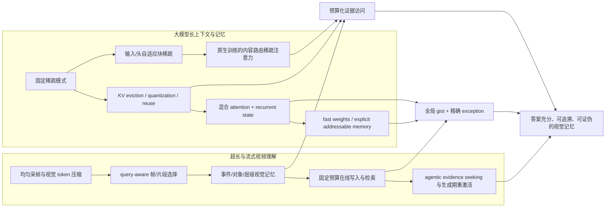

# 面向超长视频理解的视觉记忆：60 篇工作脉络与五套研究方案

> 调研截点：2026-08-20  
> 范围：30 篇稀疏注意力 / KV cache 压缩 / 大模型记忆工作；30 篇超长与流式视频理解工作。优先 2025–2026，同时保留少量无法绕开的奠基性工作。  
> 证据口径：首发年份按 arXiv v1；正式发表状态另列。2026 年尚未正式发表或缺少独立复现的工作统一标作“新预印本”，论文数字仅代表原作者报告。

## 0. 阅读导航

- [附录 A：30 篇稀疏注意力、KV cache 与大模型记忆调研](./appendix_A_memory_sparse_30.md)
- [附录 B：30 篇超长/流式视频理解调研](./appendix_B_long_video_30.md)
- [附录 C：交叉技术空白、五套完整方案与统一评测](./appendix_C_five_research_designs.md)

本文给出总判断、两条技术脉络、交叉矩阵、研究优先级和首个项目的落地路线；三个附录保留逐篇机制、机构、来源、实验边界与局限。

## 1. 结论先行

### 1.1 最重要的研究判断

超长视频理解的关键并不是无差别扩大上下文，而是在以下约束同时存在时维持**答案充分且可验证的视觉证据**：

1. 视频到来时，未来问题通常未知；
2. GPU 活跃记忆必须固定，外存、带宽与延迟也有预算；
3. 相关证据稀疏，且可能是短瞬态、细粒度对象属性或跨时段状态变化；
4. 即使证据已进入上下文，长链生成仍会出现 visual anchoring decay；
5. 最终答对不代表模型找到、保存并真正使用了正确证据。

因此，合适的研究对象不再是单一的 frame selector、token compressor 或 KV eviction，而是一条端到端链：

\[
\text{observe}\rightarrow\text{segment}\rightarrow\text{write}\rightarrow\text{compress}\rightarrow
\text{index}\rightarrow\text{retrieve}\rightarrow\text{inject/reactivate}\rightarrow\text{answer+grounding}.
\]

### 1.2 最值得做的中心命题

首推 **CPLM（Conditional/Complementary Predictive Latent Memory）**：在固定预算下，不保存“看起来重要”的视觉 token，而保存**给定 caption、ASR/OCR、关键帧和近期窗口之后仍不可恢复、且会改变未来答案的时空视觉残差**。

形式化目标为：

\[
\max_{M:\,C(M)\le B} I(M;Y\mid Q,S)-\lambda I(M;S),
\quad S=\{\text{caption, ASR/OCR, keyframes, recent window}\}.
\]

这比 attention top-k、surprise top-k 或整体重建更强：它直接回答“为什么这条信息值得占用昂贵视觉记忆，而不是由廉价侧信息替代”。

### 1.3 五套方案的推荐顺序

| 排名 | 方案 | 核心创新 | 风险 | 适合目标 |
|---:|---|---|---|---|
| 1 | CPLM：条件互补预测残差记忆 | 学习每 byte 的未来反事实答案价值；分离 semantic key 与 visual payload | 中 | 6–12 个月首篇主线 |
| 2 | Causal-Reactivation Grounding Loop | 外部情景记忆与 decoder working memory 闭环；生成中因果触发重读 | 中 | grounded reasoning / VideoZeroBench |
| 3 | Order-Aware Adapter Atlas | 有序片段 LoRA 图谱保存可复用语义，episodic latent 保存精确残差 | 中高 | 同一视频多轮查询与摊销 |
| 4 | WorldGraph-Δ | 对象身份、不确定性、状态转移、关系和事件增量的结构化记忆 | 高 | 时空/因果推理长线项目 |
| 5 | Hippocampal-TTT | fast-weight 语义记忆 + 可回放的稀疏情景残差 | 很高 | 持续学习、高风险架构创新 |

## 2. 两条研究脉络

### 2.1 稀疏注意力：从固定拓扑走向内容路由

第一阶段用 local window、global token、固定 block pattern 将 \(O(N^2)\) 降低，但模式与样本无关。第二阶段用近似得分、块索引或 head-wise pattern 适应具体输入。2025 年的主趋势是：

- 稀疏模式由 prompt、query、head 与 layer 共同决定；
- selector 本身必须比被省掉的 attention 便宜；
- 从 inference-only 插件走向 native sparse training，减少 full-attention teacher 与部署模式不一致；
- 评价从困惑度扩展到 retrieval、reasoning、代码、视频和真实 kernel speedup。

但**访问稀疏不等于存储稀疏**：一个模型可以只访问少量 KV，却仍保存全部历史 KV。把这类工作直接称为“记忆压缩”会混淆计算与容量两个问题。

### 2.2 KV cache：从 token eviction 走向语义单元、跨层共享与多查询复用

KV 路线依次出现四类手段：

1. 按 attention/recency 驱逐 token；
2. 以 chunk、pyramid、cluster 等结构单元保留语义连续性；
3. 对 K/V 做低比特量化、低秩或跨层共享；
4. 在多查询场景下以 query-agnostic reconstruction 或可复用 cache 估计价值。

视频带来三个额外要求：空间 patch 相关、时间连续、同一对象跨帧演化。文本 token 的独立驱逐规则移植到视频后，容易保留许多静态背景 patch，却删除短暂但决定答案的状态变化。

### 2.3 大模型记忆：从瞬态 KV 走向多时间尺度混合系统

可将模型级记忆拆成三类：

- **高分辨率注意力/KV**：精确回忆强，但容量与访问成本随长度增长；
- **recurrent/SSM/fast-weight state**：成本近似常数，适合全局 gist 与规律，但会干扰并丢精确细节；
- **显式可寻址记忆**：能跨片段保存与检索，但写入、索引、检索和注入需要单独训练。

最有前景的是混合分工：recurrent state 消化全部历史，稀疏 KV 或 latent archive 保存 state 解释不了的 exception，显式 memory 负责可追溯访问，近期窗口维持当下感知。

### 2.4 超长视频：从离线压缩走向未知问题下的在线证据管理

视频路线经历了五次重心变化：

1. **扩窗口/均匀采帧**：能回答全局问题，但稀疏瞬态证据命中率低；
2. **query-aware 选择**：问题已知时有效，但 streaming 写入时不能偷看未来问题；
3. **长期文本摘要 + 短期视觉窗口**：高效但未语言化细节不可逆；
4. **KV/latent/事件/对象记忆**：开始显式回答何时写、记什么、如何读；
5. **agentic zoom-in 与生成期重激活**：让模型在推理中主动找证据，但增加工具调用成本与闭环幻觉风险。

必须保留一个强控制：只输入最近 4–16 帧的 recent-window baseline。若复杂记忆在相同 backbone、FPS、分辨率、可见前缀与问题时刻下不能稳定超过它，就不能证明长期记忆带来价值。

## 3. 两个维度的交叉矩阵

| 大模型侧机制 | 能给视频侧带来的能力 | 直接移植的失败点 | 值得研究的结合 |
|---|---|---|---|
| 动态块稀疏注意力 | 只读相关时间块，降低 prefill/decoder attention | selector 依赖当前 query；写入时未来 query 未知 | query-agnostic 写入 + query-aware 稀疏读取 |
| KV eviction / compression | 固定 GPU cache，适合 streaming | token importance 忽略对象轨迹与事件连续性 | event/object/chunk 作为最小压缩单元 |
| KV quantization / cross-layer sharing | 用相同 bytes 保存更长历史 | 各层视觉语义粒度不同，统一量化会破坏层匹配 | 层级异质精度与 payload-to-layer routing |
| recurrent/SSM state | 全量处理、常数状态、低延迟 | 精确属性、计数、短瞬态被平均；延迟相关性难恢复 | recurrent gist + sparse exact exception cache |
| fast weights / LoRA memory | 视频一次内化，多问题摊销成本低 | 干扰、无显式时间顺序、难删除、细节损失 | order-aware adapter atlas + episodic residual |
| gist/latent tokens | 强压缩并可直接注入 decoder | reconstruction 好不代表 QA 因果充分；独立 slot 丢结构 | conditional answer utility + time/object metadata |
| explicit addressable memory | 长期可索引、可追溯、可扩容 | 检索错误、带宽、注入后未真正使用 | semantic key / visual payload 分离 + causal-use tests |
| agent/tool retrieval | 按需 zoom-in，避免全量处理 | 工具成本高；语言子问题可能强化初始幻觉 | value-of-information 控制 + evidence certificate |

## 4. 现有工作共同留下的六个缺口

### G1. “显著/新颖”不等于“不可替代”

attention、motion、feature difference、reconstruction error 会偏向镜头切换、相机抖动或已被字幕表达的事件。真正应优化的是在侧信息存在时 memory removal 导致的答案 regret：

\[
\Delta_i(q)=\mathcal L_{QA}(q,S,M\setminus m_i)-\mathcal L_{QA}(q,S,M).
\]

### G2. query 已知与未知未来 query 被混为一谈

离线 QA 可以先看问题再选帧；实时流在写入时通常不知道数小时后的问题。方法与榜单必须分成 query-aware 与 query-agnostic 两类，后者只能用训练分布上的期望未来效用，不能测试时泄漏。

### G3. 输入期遗忘与生成期失锚没有统一

大多数 streaming memory 管理 query 之前的历史；生成期 cache 工作管理长推理中的视觉 grounding。完整系统需要外部情景记忆与内部工作记忆协同，并允许推理中提出子问题、重检索、刷新 latent cache。

### G4. flat token memory 缺失视频结构

时间顺序、对象身份、遮挡、状态转移、关系与因果不能可靠地由独立 top-k patch 自动保留。至少需要事件边界、时间区间、对象/轨迹索引和 provenance；复杂任务还需要不确定性的 world graph。

### G5. 固定 token 数没有优化每 bit 价值

不同视频与事件的信息密度差异很大。需要将 slot 数、精度、读取次数、注入层和保留期限放入统一预算：

\[
\max_\pi \mathbb E[R_{QA}+\lambda R_{ground}]\quad
\text{s.t.}\quad C_{GPU},C_{CPU},C_{IO},C_{latency}\le B.
\]

### G6. 答案准确率不能证明记忆被使用

文本偏置、常识和近期帧可能足以猜对。必须要求时间/空间证据，并做跨视频替换、时间打乱、matched-random latent、跨层 swap 与删除 top-retrieved memory 等因果干预。

## 5. 五套方案的统一设计原则

五套方案的完整机制、目标函数、三阶段训练、复杂度、基准、消融、失败模式和 kill criteria 见[附录 C](./appendix_C_five_research_designs.md)。它们共享以下接口：

### 5.1 统一记忆单元

\[
m_i=(k_i,z_i,\tau_i,\mathcal O_i,\ell_i,prov_i,c_i,u_i),
\]

其中：

- \(k_i\)：面向自然语言问题的 semantic retrieval key；
- \(z_i\)：面向答案生成的 visual latent/KV payload；
- \(\tau_i,\mathcal O_i\)：时间区间和对象/轨迹结构；
- \(\ell_i\)：适合注入的 decoder layer；
- \(prov_i\)：原帧、box、音频/OCR 来源；
- \(c_i,u_i\)：真实存储/访问成本与预测效用。

key 与 payload 必须分离：一个表示“这段是否与问题相关”，另一个表示“模型需要看到什么视觉状态才能回答”。

### 5.2 统一训练框架

\[
\begin{aligned}
\mathcal L={}&\mathcal L_{QA}
+\lambda_d\mathrm{KL}(p_T(y\mid V,q)\|p_S(y\mid S,M,q))\\
&+\lambda_{ret}\mathcal L_{NCE}
+\lambda_{rec}\mathcal L_{conditional\ reconstruction}
+\lambda_{ground}\mathcal L_{time/box}\\
&+\lambda_{cf}\mathcal L_{counterfactual\ utility}
+\beta[C(M)-B]_+.
\end{aligned}
\]

其中 full-context teacher 只用于训练；student 测试时仅访问 recent window、side information 与固定预算 memory。

### 5.3 统一误差分解

| 检索时间段 | payload | 诊断对象 |
|---|---|---|
| oracle | raw clip | 任务/视觉 backbone 的可达上界 |
| learned | raw clip | retrieval error |
| oracle | latent memory | write/compression/injection error |
| learned | latent memory | 完整系统 |

如果 `oracle latent` 明显落后 `oracle raw`，优先修 codec/注入；如果 `learned raw` 已很差，优先修 index/retriever；不要只调 end-to-end accuracy。

## 6. 首篇工作的最小可发表路线：CPLM

### 6.1 第一阶段 MVP

- backbone：冻结一个开源 7B Video-LLM；
- 输入：1 FPS 或基准官方协议，近期窗口 8 帧；
- side information：ASR/OCR、事件 caption、每事件 1 个 keyframe；
- memory：每事件 4–16 个 Perceiver slots，全视频总预算 512/1024/2048 tokens；
- write：surprise 只负责事件切分与初始预算；counterfactual utility 负责保留与淘汰；
- read：semantic key + 时间图 top-k；每题注入 32/64/128 tokens；
- inject：4 个候选中高层的 gated cross-attention，保留 layer type embedding。

### 6.2 三阶段训练

1. **无 QA 预训练**：side-conditioned masked reconstruction 与 future latent prediction；
2. **teacher distillation**：full-video teacher 产生答案分布、证据 span 和 memory-removal regret；
3. **预算课程**：从宽松预算逐步收紧，最后优化 accuracy–grounding–bytes–latency 的 Pareto。

### 6.3 必须比较的 baseline

- 无 memory、recent 4/8/16 frames、uniform/keyframe/full-context；
- 同 budget 的 random/motion/attention/surprise/top-k 与 k-means diversity；
- 代表性 streaming/KV/latent/object memory；
- oracle segment + raw clip、learned segment + raw clip 两个诊断上界。

### 6.4 核心可证伪预测

如果研究命题成立，在相同 active-token budget 下：

1. CPLM 对字幕不充分、细粒度属性、对象状态变化和跨时段问题的收益应显著高于纯文本/关键帧充分问题；
2. 删除条件项后，memory 与 side information 的冗余上升，accuracy-per-byte 下降；
3. oracle latent 与 oracle raw 的差距应随 codec 训练显著收窄；
4. 跨视频替换或打乱时间后，grounded QA 应明显下降；
5. 在 recent-window 足以回答的问题上，router 应少读或不读长期 memory。

若在至少两个长视频基准、三个随机种子和多个预算点上，CPLM 不能稳定优于同预算 surprise/diversity baseline，或 oracle latent 仍远低于 oracle raw，则应停止堆叠 router，回退到 codec/表示研究。

## 7. 评测协议

### 7.1 基准组合

- **长视频综合**：Video-MME/Video-MME-v2、MLVU、LVBench、LongVideoBench、HourVideo；
- **严格 streaming**：StreamingBench、OVO-Bench，保证只看当前时刻以前的帧；
- **证据 grounding**：VideoZeroBench 与带 temporal span/box 的数据；
- **诊断能力**：对象属性、OCR、计数、空间关系、时间顺序、跨段 multi-hop、因果与稀有 visual needle 分桶。

### 7.2 质量与成本必须同时报告

- QA accuracy/F1、group consistency；
- evidence Recall@K、temporal IoU、spatial IoU、grounded answer accuracy；
- GPU/CPU/SSD memory bytes 分开；active latent/KV 数、archive 大小；
- ingest FPS、写入/合并开销、TTFT、TPOT、每题总时延与 p95；
- 第一次问题包含建库成本，后续第 2–20 问报告摊销曲线；
- 多个预算点的 accuracy–storage–latency Pareto，而不是单点结果。

### 7.3 统计与公平性

- 固定 backbone、视觉分辨率、FPS、可见视频前缀、问题时刻、生成长度、量化与硬件；
- 同一视频多问题时按视频做 cluster bootstrap；
- paired correct/wrong transitions 做 McNemar；至少 3 个 seeds；
- 单独报告 baseline-wrong/new-right 与 baseline-right/new-wrong；
- inference-only 插件报告 selector/ANN/CPU↔GPU I/O 的端到端成本；
- batch=1 latency 与 cache 节省后能扩大 batch 带来的 throughput/TPOT 增益分开。

## 8. 风险判断

1. **2026 frontier 的复现风险**：许多工作尚无独立复现；先把它们视作技术最近邻，不能把论文自报数字当稳定事实。
2. **benchmark saturation 与文本捷径**：高平均准确率可能来自字幕、常识或重复题；应把 grounded answer 和反事实干预作为主结果。
3. **query distribution bias**：从训练 QA 学到的 query-agnostic utility 可能丢掉分布外证据；需 coverage safety channel 与 rare-event reservoir。
4. **side-information error**：ASR/caption 错误可能与视觉冲突；CPLM 应保留 disagreement，而不是把视觉真相错误判为冗余。
5. **系统成本转移**：省 GPU token 但增加离线 caption、ANN、SSD I/O 或多轮工具调用，不等于真正更高效。

## 9. 最终建议

研究主线可分三篇递进推进：

1. **CPLM**：先证明“条件互补视觉残差”在固定预算下比 importance/surprise memory 更有效；
2. **Causal Reactivation**：把 query 前长期记忆与生成期 working cache 连接，解决 visual anchoring decay；
3. **Adapter Atlas 或 WorldGraph-Δ**：前者攻 repeated-query/参数内化，后者攻对象身份与时空因果。

第一篇不要同时加入 fast weights、agent、world graph 和 decoder cache。最强的论文叙事应保持单一：**记忆价值不是绝对显著性，而是相对已有侧信息、面向未来答案的不可替代性。**
