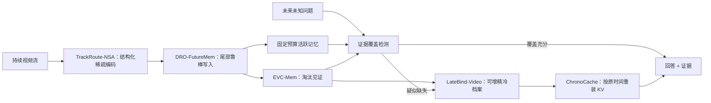

# 大模型视觉记忆 × 超长视频理解：60 项工作调研与 5 个研究方案

> 调研截止：2026-08-20  
> 范围：30 项稀疏注意力 / KV Cache 压缩 / 大模型记忆工作，以及 30 项超长视频理解模型、系统与基准。  
> 年份口径：优先采用正式会议年份；只有预印本的工作采用首次公开年份。2026 年预印本均明确标注，结论需等待同行评审。

## 0. 结论先行

本轮调研最重要的结论不是“把更多帧塞进更长上下文”，而是：**超长视频需要一个能写入、巩固、检索、复原并校验证据的视觉记忆系统**。仅扩大上下文窗口会同时遇到预填充阶段的注意力计算、解码阶段的 KV 带宽、有效上下文衰减，以及稀有事件被冗余帧淹没四个问题。

当前研究已经出现四条合流趋势：

1. 稀疏注意力从固定模式转向可学习、查询相关且硬件对齐的块稀疏，例如 NSA、MoBA、SeerAttention、DeepSeek Sparse Attention。
2. KV Cache 从“删 token”扩展到层、头、通道、比特和跨层表示等多维压缩，并开始支持多查询复用与按需重建，例如 HeadKV、ThinK、MatryoshkaKV、KVzip、REFORM。
3. 长期记忆从外部 RAG 转向模型内部的有界记忆和测试时学习，例如 Titans、MIRAS、ATLAS、Trellis、HOPE。
4. 超长视频从均匀抽帧转向查询自适应选择、层次化事件/实体索引、流式记忆和工具式主动检索，例如 Video-XL、ReWind、VideoTree、Flash-VStream、Video-X²L、FlexMem、HAVEN、VideoTIR。

但现有交叉工作仍有五个共性空缺：

- 多数压缩策略依赖当前问题，难以支持“先看数小时视频、之后才收到未知问题”的 query-late 场景。
- 注意力权重是相关性代理，不等于一段记忆对未来答案、因果链或状态变化的真实价值。
- 视频 token 仍主要按时间/空间网格组织，较少让“同一实体跨镜头轨迹”成为原生稀疏注意力拓扑。
- 淘汰通常不可逆；极高压缩率下缺少低成本、可校验的 KV 重建与回退机制。
- 大多数评价只报 QA 准确率，未同时约束峰值显存、真实延迟、多轮复用、证据定位和压缩诱发幻觉。

因此，最值得优先推进的是本文方案一 **EVC-Mem** 与方案四 **DRO-FutureMem**：前者直接解决“模型能否知道自己忘了必要证据”，最容易形成方法、校准和新评测闭环；后者面向未知未来问题的尾部风险，最贴近真实流式视觉记忆。

## 1. 问题拆解：为什么超长视频不等于长文本

设视频经视觉编码后产生 \(N_v\) 个视觉 token，文本提示和输出分别为 \(N_t,N_o\)。标准自注意力的预填充成本近似随 \((N_v+N_t)^2\) 增长；自回归解码虽然每步不再二次增长，但需要反复读取随历史长度线性增长的 KV Cache。视频进一步放大了问题：相邻帧高度冗余，但关键事件的时间密度极不均匀；细粒度外观、运动、实体身份、音频、字幕和绝对时间又必须在不同问题下以不同粒度恢复。

长视频因此同时包含五种“长度”：

| 长度 | 主要挑战 | 仅增加上下文为何不够 |
|---|---|---|
| 帧/视觉 token 长度 | 预填充计算与显存 | 冗余 token 仍会稀释注意力并拖慢计算 |
| 时间跨度 | 跨事件依赖、状态变化、计数 | 远距离信息即使在窗口内也可能无法有效利用 |
| 实体轨迹长度 | 跨镜头身份、交互、遮挡 | 时间邻近不等于语义邻近 |
| 多模态长度 | 画面、语音、字幕不同步 | 单一视觉相关性会漏掉音频或文字证据 |
| 交互长度 | 多轮问题反复访问同一视频 | 为每个问题重做预填充或重新压缩成本过高 |

## 2. 30 项稀疏注意力、KV Cache 与大模型记忆工作

下面“局限”均为基于论文机制与实验设置的分析，不是作者原话。选择标准是头部企业/实验室、顶会正式论文，或对该方向有明显影响力；其中绝大多数按正式发表口径属于 2025–2026。

| # | 工作、年份与来源 | 路线 | 核心贡献 | 对视觉记忆的启示与主要局限 |
|---:|---|---|---|---|
| 1 | [Native Sparse Attention (NSA)](https://arxiv.org/abs/2502.11089), ACL 2025，DeepSeek-AI | 原生可训练稀疏注意力 | 用压缩、选择和局部窗口三条路径构成动态层次稀疏，并针对现代 GPU 做算术强度与访存协同设计；可从预训练开始使用。 | 视频可将三条路径对应“事件摘要、关键证据、局部运动”。局限是需要改架构并重新训练，稀疏路由仍以序列块而非视觉实体组织。 |
| 2 | [MoBA: Mixture of Block Attention](https://arxiv.org/abs/2502.13189), NeurIPS 2025，Moonshot AI | 可训练块稀疏 | 把 MoE 路由思想用于注意力，让 query 自主选择少量 KV 块，并允许从全注意力平滑切换到稀疏注意力。 | 适合把视频切成可路由事件块；但连续定长块与真实场景/实体边界不一致，路由误差会直接漏证据。 |
| 3 | [DeepSeek-V3.2 / DeepSeek Sparse Attention](https://arxiv.org/abs/2512.02556), 2025 技术报告，DeepSeek-AI | 学习式动态稀疏 | 用轻量索引器近似密集注意力并做 top-k 稀疏访问，在长上下文下显著降低复杂度，同时服务大规模推理模型。 | 说明“密集教师→稀疏索引器”的迁移可在大模型规模成立；视觉域仍需解决多模态索引与稀有帧召回。 |
| 4 | [SeerAttention](https://arxiv.org/abs/2410.13276), NeurIPS 2025，Microsoft Research 等 | 自蒸馏块稀疏 | 训练轻量 AttnGate 预测块级稀疏图，并配合块稀疏 FlashAttention 内核；可在冻结预训练模型后蒸馏。 | 为低成本改造现有 Video-LLM 提供路径；局限是蒸馏教师本身的注意力偏差会被继承。 |
| 5 | [MInference 1.0](https://arxiv.org/abs/2407.02490), NeurIPS 2024 Spotlight，Microsoft Research | 训练免费动态稀疏预填充 | 将不同头归纳为 A-shape、Vertical-Slash、Block-Sparse 三类模式，在线估计稀疏索引并用专用内核加速百万 token 预填充。 | 证明头级模式先验可显著加速长输入；主要优化 prefill，且文本模式不直接等价于视频时空模式。 |
| 6 | [MMInference](https://arxiv.org/abs/2504.16083), ICML 2025，Microsoft Research | 多模态稀疏预填充 | 发现视频具有 Grid 稀疏模式，并用模态感知排列处理视觉/文本边界；在 1M token VLM 上报告最高 8.3× 预填充加速。 | 这是最直接的交叉基线；但它主要降低计算，不压缩长期存储，也未显式建模事件、实体和未知未来问题。 |
| 7 | [ZipVL](https://openaccess.thecvf.com/content/ICCV2025/html/He_ZipVL_Accelerating_Vision-Language_Models_through_Dynamic_Token_Sparsity_ICCV_2025_paper.html), ICCV 2025 | 视觉 token 动态稀疏 | 同时针对 prefill 的计算瓶颈和 decode 的 KV 读取瓶颈，按层动态分配视觉 token 稀疏率。 | 说明视觉 token 的重要性和预算均应分层；但评价以通用 VLM 为主，未解决小时级记忆巩固和多轮复用。 |
| 8 | [Quest](https://arxiv.org/abs/2406.10774), ICML 2024，MIT HAN Lab | 查询感知页级稀疏 | 为每个 KV page 维护 key 的逐维极值，用当前 query 快速给出页级重要性上界，只加载 top-k 页。 | 可作为视频事件页的高效检索底座；查询已知且仍需保存完整 KV，不能单独解决长期存储。 |
| 9 | [MagicPIG](https://arxiv.org/abs/2410.16179), ICLR 2025 Spotlight，Meta/MIT 等 | LSH 采样注意力 | 指出硬 top-k 在注意力不够尖锐时会有偏差，改用带理论保证的 LSH 采样，并以 CPU 承载索引和部分计算。 | 对分散在多个片段的证据比 top-k 更稳健；但 CPU–GPU 异构开销、索引内存和系统复杂度较高。 |
| 10 | [DuoAttention](https://arxiv.org/abs/2410.10819), ICLR 2025，MIT/NVIDIA | 头级混合缓存 | 区分需要完整历史的 retrieval heads 与只需 sink+近期 token 的 streaming heads，仅给前者保留全 KV。 | 视频头也可能分化为实体检索、局部运动、全局语义等角色；但头角色由合成检索任务标定，未必覆盖视觉因果推理。 |
| 11 | [ThinK](https://arxiv.org/abs/2407.21018), ICLR 2025 Spotlight，Salesforce Research 等 | 通道维压缩 | 利用 key 通道幅值与低秩性，按 query 剪除低价值通道，可与 token 淘汰和量化叠加。 | 提醒视觉 KV 不必只沿时间删 token；查询相关通道剪枝不利于复用到未知后续问题。 |
| 12 | [OmniKV](https://proceedings.iclr.cc/paper_files/paper/2025/hash/da1131a86ac3c70e0b7cae89c3d4df22-Abstract-Conference.html), ICLR 2025，蚂蚁集团等 | 无丢弃动态选择/卸载 | 利用相邻层重要 token 的相似性，由过滤层选择上下文并供多层复用；完整 KV 可放在较慢存储中。 | 对要求无损回退的视觉记忆很有价值；它节省 HBM 而非总存储，跨设备不规则读取可能吞掉理论收益。 |
| 13 | [MatryoshkaKV](https://arxiv.org/abs/2410.14731), ICLR 2025 | 特征维低秩投影 | 用可训练正交投影和 Matryoshka 训练，使不同层/头可按预算选择不同压缩维度。 | 可形成“随问题难度伸缩”的视觉 KV 表征；需要额外训练，低维投影仍可能损失细粒度身份/文字。 |
| 14 | [HeadKV / HeadKV-R2](https://arxiv.org/abs/2410.19258), ICLR 2025 | 头级预算分配 | 以检索与推理能力估计每个注意力头的重要性，把有限缓存优先分给关键头；极低预算下优于均匀策略。 | 视频可学习运动头、实体头、时间头的差异预算；现有估计来自文本 QA，且静态头分工会随任务变化。 |
| 15 | [LoRC](https://arxiv.org/abs/2410.03111), ICLR 2025，Microsoft 等 | 权重级低秩 KV | 低秩近似 KV 投影权重，并根据层敏感度渐进压缩，避免测试时逐 token 评分。 | 推理稳定且可与 token 稀疏正交组合；低秩误差会跨深层累积，对视觉长链推理需重新标定。 |
| 16 | [VL-Cache](https://proceedings.iclr.cc/paper_files/paper/2025/hash/00db17c36b5435195760520efa96d99c-Abstract-Conference.html), ICLR 2025，Amazon AWS AI/UCLA | 模态感知 KV 淘汰 | 分析视觉/文本在 prefill 与 decode 的不同稀疏分布，联合层级预算和 post-vision attention 进行视觉 KV 选择。 | 是视觉 KV 压缩的关键基线；它把视觉 token 作为同质集合，未显式维护事件、实体轨迹及跨模态证据一致性。 |
| 17 | [RocketKV](https://arxiv.org/abs/2502.14051), 2025，NVIDIA/CMU 等 | 两阶段压缩 | 先用改进的 SnapKV 做粗粒度淘汰，再用低维 query/key 近似执行细粒度 top-k 稀疏注意力，同时节省容量和带宽。 | “先压缩、再稀疏读取”适合视频；前置淘汰不可逆，且工程收益依赖定制 kernel 和特定硬件。 |
| 18 | [KVzip](https://arxiv.org/abs/2505.23416), NeurIPS 2025，SNU/NAVER AI Lab | 多查询可复用压缩 | 用底层 LLM 从 KV 重建原上下文，以重建重要性做 query-agnostic 淘汰；同一压缩缓存可服务多种未来查询。 | 直接击中 query-late 视频记忆；但文本重建目标不保证保存运动、因果与视觉细节，压缩本身还需额外前向。 |
| 19 | [MorphKV / Dialogue Without Limits](https://arxiv.org/abs/2503.00979), ICML 2025，UT Austin/d-Matrix/UBC | 常数大小缓存 | 依据近期 token 的注意力与相关性反复更新固定容量缓存，兼顾远程依赖和局部连贯。 | 适合真正流式视频；持续覆盖会造成旧稀有事件遗忘，且近期 query 导向不适合未知未来查询。 |
| 20 | [REFORM](https://arxiv.org/abs/2506.01215), NeurIPS 2025，Amazon AGI/KAIST | 压缩—检索—重算 | 压缩 KV 仅用于构造跨层检索表示；收到问题后找出关键原始 token 并按需重算其完整 KV。 | 提供可逆压缩范式；需要保存原始 token/输入且会产生二次计算，视频解码与高分辨率重算成本更高。 |
| 21 | [TurboQuant](https://arxiv.org/abs/2504.19874), ICLR 2026，Google Research | 低比特向量量化 | 随机旋转加近最优标量量化，并用 1-bit QJL 修正内积偏差；面向 KV Cache 报告 2.5–3.5 bit 的高保真压缩。 | 适合作为所有视觉记忆方案的正交组件；量化保持几何不代表保持任务语义，超长视觉推理需单独验证。 |
| 22 | [KIVI](https://arxiv.org/abs/2402.02750), ICML 2024 | 非对称 2-bit KV 量化 | 发现 key 适合逐通道量化、value 适合逐 token 量化，并提供混合精度内核。 | 奠定 KV 量化的强基线；极低比特对视觉 OCR、细粒度属性和长链推理更敏感。 |
| 23 | [SnapKV](https://arxiv.org/abs/2404.14469), NeurIPS 2024 | 观察窗 token 淘汰 | 从提示末尾观察窗估计各头在生成期会关注的历史位置，并聚类保留重要 KV。 | 简单、训练免费、可复现；对问题后到、多轮查询、状态随生成变化的场景不稳。 |
| 24 | [SCBench](https://arxiv.org/abs/2412.10319), ICLR 2025，Microsoft Research | KV 生命周期基准 | 从生成、压缩、检索、加载四阶段评测共享上下文、多请求和多轮复用；揭示 sub-O(n) 方法在多轮中易退化。 | 提醒视频研究必须测同一视频的多问题复用，而不只是一次 QA；本身仍是文本基准。 |
| 25 | [Titans](https://arxiv.org/abs/2501.00663), NeurIPS 2025，Google Research | 测试时神经长期记忆 | 以“惊讶度”决定写入，用测试时梯度更新神经记忆；注意力负责短期精确依赖，神经记忆负责超长历史。 | 非常适合流式视觉记忆；原工作主要是文本/序列任务，视觉写入稳定性、实体覆盖和灾难遗忘未解决。 |
| 26 | [MIRAS](https://arxiv.org/abs/2504.13173), ICLR 2026，Google Research | 统一关联记忆框架 | 用记忆结构、注意偏置目标、保留门和学习算法四个轴统一 Transformer、Titans 与线性 RNN，并提出多种新实例。 | 为设计视觉记忆写入/遗忘规则提供理论坐标系；框架较抽象，缺少大规模视频与真实系统验证。 |
| 27 | [ATLAS](https://arxiv.org/abs/2505.23735), 2025 预印本（Google Research 后续列为 ICML 2026） | 高容量测试时记忆 | 让记忆更新同时利用当前与过去一段上下文，提升容量和固定记忆管理能力，并扩展为 DeepTransformer。 | 可用于事件级批量巩固而非逐帧覆盖；测试时优化计算较重，在线视频的稳定与安全更新仍是风险。 |
| 28 | [Trellis](https://openreview.net/forum?id=r61s1FNYlj), COLM 2025，Google Research | 有界 KV 记忆 | 以固定数量槽位替代线性增长的 KV Cache，用双程递归压缩、在线梯度下降与遗忘门学习写入。 | 提供“KV 本身就是可学习记忆”的范式；固定槽位仍存在容量碰撞，尚未验证视觉细节和多模态同步。 |
| 29 | [Nested Learning / HOPE](https://arxiv.org/abs/2512.24695), NeurIPS 2025，Google Research | 多时间尺度持续记忆 | 将网络与优化器视为嵌套学习问题，提出按不同频率更新的 Continuum Memory System 和自修改 HOPE。 | 与人类式短期/情景/语义记忆最接近；目前是早期架构证据，训练稳定性和大模型扩展成本不明。 |
| 30 | [Infini-attention](https://arxiv.org/abs/2404.07143), 2024，Google | 有界压缩记忆 | 在单个块中结合局部掩码注意力和长期线性压缩记忆，使计算、显存与历史长度解耦。 | 是把视频流压成常数状态的直接先例；线性记忆会产生干扰，精确事件恢复弱于显式随机访问。 |

### 2.1 技术脉络

这 30 项工作可放到一个二维坐标中：横轴是“压缩发生在哪里”，纵轴是“信息能否恢复”。

| 压缩轴 | 代表工作 | 优点 | 对长视频最危险的失真 |
|---|---|---|---|
| 序列/token | SnapKV、KVzip、RocketKV | 压缩比高、接口简单 | 稀有帧和跨片段组合证据被永久删除 |
| 块/页与稀疏读取 | NSA、MoBA、Quest、MagicPIG | 对硬件友好，可避免扫描全部历史 | 路由漏召回；时间块不等于语义块 |
| 层/头 | DuoAttention、HeadKV、OmniKV、VL-Cache | 利用功能异质性 | 头角色会随任务、模态和生成阶段漂移 |
| 通道/低秩 | ThinK、MatryoshkaKV、LoRC | 不必删除时间位置，可与 token 压缩叠加 | OCR、身份属性等细粒度信息被投影抹平 |
| 比特 | KIVI、TurboQuant | 工程通用性强，容易叠加 | 内积近似误差在长链推理中累积 |
| 有界神经记忆 | Infini-attention、Titans、ATLAS、Trellis、HOPE | 支持真正流式和近常数内存 | 记忆碰撞、遗忘、难以给出原始证据 |
| 可恢复压缩 | REFORM | 兼顾极限压缩和精确回看 | 需要保存源输入、索引与二次计算 |

由此可见，适合长视频的目标不应只是最小化 KV 的均方误差，而应优化一个**任务率失真目标**：在给定显存、带宽和延迟预算下，最大化未来问题分布上的答案正确性、证据召回、时间关系和实体一致性。

## 3. 30 项超长视频理解工作

本节收录 24 项模型/系统与 6 项关键基准。按正式发表年份统计，28/30 项来自 2025–2026；仅 LongVideoBench 与 HourVideo 是为交代评价脉络而保留的 2024 高影响力工作。2026 年尚未正式发表的条目会明确写为“预印本”。“局限”仍是基于机制与实验设置的判断。

| # | 工作、年份与来源 | 路线 | 核心贡献 | 对视觉记忆的启示与主要局限 |
|---:|---|---|---|---|
| 1 | [FlexMem](https://openaccess.thecvf.com/content/CVPR2026/html/Chen_Scaling_the_Long_Video_Understanding_of_Multimodal_Large_Language_Models_CVPR_2026_paper.html), CVPR 2026，厦门大学/国防科技大学 | 视觉 KV 记忆 | 把视觉 KV 直接视为记忆源，以双路径压缩进行写入/迁移，并按任务采用不同读取策略；单张 RTX 3090 实证处理超过 1,000 帧。 | 证明无需把 KV 先转成文本；但“无限长度”是架构含义，实证仍为千帧量级，且压缩后的短暂小目标难以恢复。 |
| 2 | [HAVEN](https://openaccess.thecvf.com/content/CVPR2026/html/Yin_Hierarchical_Long_Video_Understanding_with_Audiovisual_Entity_Cohesion_and_Agentic_CVPR_2026_paper.html), CVPR 2026，中科大/微软亚洲研究院 | 视听实体层次记忆 | 建立全局—场景—片段—实体四级索引，用视听实体一致性串联跨镜头内容，再由 Agent 搜索；LVBench 报告 84.1%。 | 实体是比帧更合理的记忆单元；离线描述、ASR、实体匹配和索引成本高，错误会逐层传播。 |
| 3 | [OASIS](https://openaccess.thecvf.com/content/CVPR2026/html/Liang_OASIS_On-Demand_Hierarchical_Event_Memory_for_Streaming_Video_Reasoning_CVPR_2026_paper.html), CVPR 2026 | 按需事件记忆 | 将流式历史组织为层次事件，先用短上下文回答，只在不确定时按高层意图逐级检索；训练免费、可插拔。 | 说明“先粗答、再细取”可约束 token；但回答不确定性不能可靠区分推理困难与关键证据已被遗忘。 |
| 4 | [WorldMM](https://openaccess.thecvf.com/content/CVPR2026/html/Yeo_WorldMM_Dynamic_Multimodal_Memory_Agent_for_Long_Video_Reasoning_CVPR_2026_paper.html), CVPR 2026，KAIST | 多记忆 Agent | 并置多尺度情景记忆、持续更新的语义记忆和保留细节的视觉记忆，由 Agent 迭代决定读哪一种、读到什么粒度。 | 给出多模态、多时间尺度记忆范式；但预处理与多轮检索成本高，停止条件缺少可校准的证据充分性保证。 |
| 5 | [FluxMem](https://openaccess.thecvf.com/content/CVPR2026/papers/Xie_FluxMem_Adaptive_Hierarchical_Memory_for_Streaming_Video_Understanding_CVPR_2026_paper.pdf), CVPR 2026，复旦/UMD | 自适应层次流式压缩 | 先做相邻帧时间选择，再做帧内空间域巩固，并按场景统计量自适应决定压缩率；同时改善流式精度、延迟和显存。 | 写入期无需问题，适合 query-late；仍以冗余为主要代理，罕见但未来可问的事件可能被当作低价值噪声。 |
| 6 | [HERMES: KV Cache as Hierarchical Memory](https://arxiv.org/abs/2601.14724), ACL 2026，复旦/NUS | 流式分层 KV | 通过机制分析将不同粒度的 KV 组织成紧凑层次记忆，查询到来时无需额外处理；报告最高 10× TTFT 改善。 | 强调写入成本与查询时延的共同约束；固定层次压缩缺少丢失证据检测，极端长流中的总信息容量仍有限。 |
| 7 | [StreamingTOM](https://openaccess.thecvf.com/content/CVPR2026/html/Chen_StreamingTOM_Streaming_Token_Compression_for_Efficient_Video_Understanding_CVPR_2026_paper.html), CVPR 2026 | 量化在线记忆 | 用 4-bit 在线量化记忆保存历史 token，按需检索并解量化，使活跃 KV 与视频长度解耦；报告 15.7× KV 压缩。 | 把量化、分组检索和流式更新统一起来；低比特误差与检索误差会叠加，原始证据的可审计性较弱。 |
| 8 | [Streaming Token Compression (STC)](https://openaccess.thecvf.com/content/CVPR2026/html/Wang_Accelerating_Streaming_Video_Large_Language_Models_via_Hierarchical_Token_Compression_CVPR_2026_paper.html), CVPR 2026 | 全链路流式加速 | STC-Cacher 复用相似帧的 ViT 特征，STC-Pruner 再压缩送入 LLM 的时空 token，同时优化视觉编码和 prefill。 | 提醒瓶颈不只在 LLM/KV；但相似特征复用可能忽略微小状态变化，且重点是速度而非长期语义记忆。 |
| 9 | [WeaveTime](https://openaccess.thecvf.com/content/CVPR2026/html/Zhang_WeaveTime_Streaming_from_Earlier_Frames_into_Emergent_Memory_in_VideoLLMs_CVPR_2026_paper.html), CVPR 2026 | 时序感知流式记忆 | 用时间重建目标教授顺序，再以不确定性触发的 Past–Current Dynamic Focus Cache 粗到细读取历史。 | 明确指出 Video-LLM 的 time-agnostic 问题；但没有处理 KV 重排后缓存位置与真实物理时间间隔的冲突。 |
| 10 | [LongVideo-R1](https://openaccess.thecvf.com/content/CVPR2026/html/Qiu_LongVideo-R1_Smart_Navigation_for_Low-cost_Long_Video_Understanding_CVPR_2026_paper.html), CVPR 2026，中科院大学/华为 | RL 视频导航 | Agent 从顶层摘要开始选择下一段最值得查看的片段，证据充分即停止；用 SFT+RL 学习低成本导航。 | 主动读取比静态 Top-K 更灵活；摘要未覆盖的 needle 无法找回，教师生成轨迹和串行工具调用成本高。 |
| 11 | [LongVT](https://openaccess.thecvf.com/content/CVPR2026/html/Yang_LongVT_Incentivizing_Thinking_with_Long_Videos_via_Native_Tool_Calling_CVPR_2026_paper.html), CVPR 2026，MiroMind/NTU/清华/LMMs-Lab | 原生工具调用 | 将模型的时间定位能力变成视频裁剪工具，以“全局浏览—局部放大—证据验证”的 Chain-of-Tool-Thought 推理并配套 SFT/RL 数据。 | 工具策略可适应问题粒度；每个问题反复查看，未形成跨问题复用的持久记忆，尾延迟较高。 |
| 12 | [VITAL / Thinking With Videos](https://openaccess.thecvf.com/content/CVPR2026/html/Zhang_Thinking_With_Videos_Multimodal_Tool-Augmented_Reinforcement_Learning_for_Long_Video_CVPR_2026_paper.html), CVPR 2026，清华/中科院大学/字节跳动 | 多模态工具增强 RL | 让模型按需密集重采样视频，联合学习 QA、时间定位和多模态工具轨迹，并用难度分组策略优化 14 个视频基准。 | 将“看—想—再看”纳入 RL；训练与 rollout 昂贵，奖励捷径和工具调用总算力需严格审计。 |
| 13 | [VideoChat-Flash](https://proceedings.iclr.cc/paper_files/paper/2026/hash/b14d7175755b180dc2163e15e3110cb6-Abstract-Conference.html), ICLR 2026，上海 AI Lab/南京大学/中科院 | 分层 token 压缩 | HiCo 从 clip 到 video 分层压缩，配合短到长训练、LongVid 和多跳 NIAH；约 1/50 token 比且 10,000 帧 NIAH 达 99.1%。 | 显示模型、数据、训练需联合设计；不可逆压缩和 NIAH 成绩不能保证计数、状态演化、因果与反事实能力。 |
| 14 | [VideoNSA](https://arxiv.org/abs/2510.02295), ICLR 2026，UC San Diego 等 | 原生视频稀疏注意力 | 将 NSA 端到端适配到 Qwen2.5-VL：文本保持 dense，视频使用硬件感知的压缩/选择/局部分支，并训练到 128K token。 | 是稀疏注意力与视频的直接结合；主要解决“如何算”，不回答流式场景中应长期记住什么。 |
| 15 | [Video-XL](https://openaccess.thecvf.com/content/CVPR2025/html/Shu_Video-XL_Extra-Long_Vision_Language_Model_for_Hour-Scale_Video_Understanding_CVPR_2025_paper.html), CVPR 2025，SJTU/BAAI/PKU 等 | KV 摘要 token | 每个视频区间用 Visual Summarization Token 的关联 KV 汇总内容，再以课程学习、复合数据和信息密度自适应压缩。 | 把 KV 明确用作视频摘要；单/少量 VST 是固定瓶颈，细粒度时序和短暂目标可能在写入时永久丢失。 |
| 16 | [ReWind](https://openaccess.thecvf.com/content/CVPR2025/html/Diko_ReWind_Understanding_Long_Videos_with_Instructed_Learnable_Memory_CVPR_2025_paper.html), CVPR 2025，华为赫尔辛基/罗马一大 | 指令条件可学习记忆 | read–perceive–write 循环维护指令相关记忆，再由记忆选出少量高分辨率帧补充空间细节。 | “低分辨率记忆+高分辨率回看”很有效；问题必须在写入前已知，换问题常需重算。 |
| 17 | [AdaCM²](https://openaccess.thecvf.com/content/CVPR2025/papers/Man_AdaCM2_On_Understanding_Extremely_Long-Term_Video_with_Adaptive_Cross-Modality_Memory_CVPR_2025_paper.pdf), CVPR 2025 | 跨模态记忆归并 | 结合问题—视觉跨模态注意力与视觉相关性，自回归地合并视频流记忆；报告最高 65% GPU 显存下降。 | 说明写入应看任务而非只看视觉相似；同样不适合问题后到和多问题复用，合并不可逆。 |
| 18 | [DrVideo](https://openaccess.thecvf.com/content/CVPR2025/html/Ma_DrVideo_Document_Retrieval_Based_Long_Video_Understanding_CVPR_2025_paper.html), CVPR 2025，湖南大学/Monash | 文档化检索 Agent | 把长视频转成粗文本长文档，先检索关键帧并补写文档，再让 Agent 循环搜索缺失信息。 | 可复用成熟的文本检索与推理；caption 会成为有偏“假记忆”，运动、音频和未语言化细节易丢失。 |
| 19 | [VideoTree](https://openaccess.thecvf.com/content/CVPR2025/html/Wang_VideoTree_Adaptive_Tree-based_Video_Representation_for_LLM_Reasoning_on_Long_CVPR_2025_paper.html), CVPR 2025，UNC Chapel Hill | 查询自适应视频树 | 以视觉聚类和问题相关度构建可变深度树，对相关分支逐层细化，再聚合多粒度信息供 LLM 推理。 | 证明查询需要不同时间粒度；每个问题都需遍历/重建，早期聚类或 caption 错误会阻断细化。 |
| 20 | [T*: Re-thinking Temporal Search](https://openaccess.thecvf.com/content/CVPR2025/html/Ye_Re-thinking_Temporal_Search_for_Long-Form_Video_Understanding_CVPR_2025_paper.html), CVPR 2025，Stanford/Northwestern/CMU | 时空主动搜索 | 将从数万帧找 1–5 个证据帧形式化为 Long Video Haystack，用时空自适应 zoom 把时间搜索转成视觉定位。 | 揭示长视频关键瓶颈是召回而非只扩窗口；单次查询搜索仍可能漏掉跨片段分布式证据。 |
| 21 | [Video-X²L](https://arxiv.org/abs/2506.21184), 2025 预印本，BAAI 系团队 | 双层 KV 与选择性重载 | prefill 同时生成细节 L-KV 和紧凑 H-KV，decode 时只为关键片段加载 L-KV，其余使用 H-KV。 | 是 KV 压缩与 LVU 的直接交叉；需同时保存两级 KV，总存储并非有界，而且任务在压缩/读取时已知。 |
| 22 | [StreamMem](https://arxiv.org/abs/2508.15717), 2025 预印本，Meta AI/NYU | Query-agnostic 固定 KV | 用 generic query token 对流式视觉 KV 评分，持续压到固定容量，不依赖未来问题。 | 直接面向先看后问与多轮复用；generic query 优化平均显著性，低频问题所需的罕见证据仍会被系统性遗忘。 |
| 23 | [LongVILA](https://openreview.net/forum?id=wCXAlfvCy6), ICLR 2025，NVIDIA/MIT/UC Berkeley/UT Austin | 上下文与训练系统扩展 | 结合长上下文扩展、长视频 SFT 和多模态序列并行，从 8 帧扩展至 2,048 帧训练，并支持更长 NIAH。 | 给出“先扩大可训练窗口”的系统上界；资源要求高，仍未学习有选择的写入、巩固与遗忘。 |
| 24 | [LongVU](https://proceedings.mlr.press/v267/shen25j.html), ICML 2025，Meta AI/KAUST/Korea University | 时空自适应压缩 | 用 DINOv2 去除相似帧，文本查询选择视觉特征，再按跨帧依赖压缩空间 token。 | 奠定 query-aware 时空压缩强基线；细微状态变化可能被相似度删掉，且无法复用于未知后续问题。 |
| 25 | [Video-MME](https://openaccess.thecvf.com/content/CVPR2025/html/Fu_Video-MME_The_First-Ever_Comprehensive_Evaluation_Benchmark_of_Multi-modal_LLMs_in_CVPR_2025_paper.html), CVPR 2025 | 综合基准 | 900 个视频、254 小时、2,700 个人工 QA，覆盖 11 秒到 1 小时，并分开评测画面、字幕和音频。 | 多模态覆盖广；每个视频仅 3 道选择题、最长 1 小时，证据密度与真实多轮记忆差距较大。 |
| 26 | [MLVU](https://openaccess.thecvf.com/content/CVPR2025/html/Zhou_MLVU_Benchmarking_Multi-task_Long_Video_Understanding_CVPR_2025_paper.html), CVPR 2025，BAAI 等 | 多任务基准 | 以电影、监控、第一视角、动画和游戏等长视频覆盖摘要、顺序、计数、异常、推理等多类任务。 | 能区分多种能力；音频覆盖有限，开放式自动评分与不同任务格式的可比性不足。 |
| 27 | [LVBench](https://openaccess.thecvf.com/content/ICCV2025/html/Wang_LVBench_An_Extreme_Long_Video_Understanding_Benchmark_ICCV_2025_paper.html), ICCV 2025，智谱 AI/清华 | 小而精的小时级基准 | 103 个视频、117 小时、1,549 个 QA，平均约 68 分钟；覆盖定位、摘要、推理、实体、事件、关键信息并标注证据区间。 | 很适合证据评测；视频数较少，选择题与公开视频分布可能带来偏差。 |
| 28 | [LongVideoBench](https://proceedings.neurips.cc/paper_files/paper/2024/hash/329ad516cf7a6ac306f29882e9c77558-Abstract-Datasets_and_Benchmarks_Track.html), NeurIPS 2024 Datasets & Benchmarks，Rhymes AI | 交错视频—字幕基准 | 3,763 个最长一小时视频、6,678 个人工选择题、17 类任务，以 referring reasoning 测长上下文检索与组合推理。 | 影响力高且协议成熟；题目引用信息降低开放定位难度，字幕依赖和选择题偏差明显。 |
| 29 | [HourVideo](https://hourvideo.stanford.edu/), NeurIPS 2024 Datasets & Benchmarks，Stanford | 一小时第一视角基准 | 500 个 20–120 分钟 Ego4D 视频、12,976 个五选一问题，覆盖回忆、跟踪、时空/因果/反事实推理和导航；人类 85.0%，Gemini 1.5 Pro 37.3%。 | 长链问题丰富；只覆盖第一视角日常活动，尚未测流式写入与多日巩固。 |
| 30 | [SLVMBench](https://arxiv.org/abs/2607.11312), 2026 预印本 | 从视频记忆学习技能 | 在 2–3 小时干扰视频流中嵌入教程，随后要求模型把程序性知识迁移到实时任务，首次联合测试记忆、提取与技能应用。 | 与“视觉记忆”最对题；场景集中于教程式技能且工作很新，尚缺社区复现和跨域稳定性结论。 |

### 3.1 超长视频理解的技术脉络

| 阶段 | 主导问题 | 代表工作 | 尚未解决 |
|---|---|---|---|
| 2024–2025：窗口扩展 | 能否让 VLM 接受几千帧 | LongVILA、LongVideoBench、HourVideo | 计算/显存线性或超线性增长，有效上下文远小于标称窗口 |
| 2025：压缩与选择 | 在固定 token 预算下保留什么 | Video-XL、LongVU、AdaCM²、ReWind、VideoTree、T* | 大多问题已知、压缩不可逆、多问题复用差 |
| 2025：视频外部化 | 能否把视频变成可检索知识 | DrVideo、Video-X²L | 文本化损失视觉细节；两级 KV/源视频仍占存储 |
| 2025–2026：流式记忆 | 未来帧和问题未知时如何在线写入 | StreamMem、HERMES、FluxMem、StreamingTOM、FlexMem | 平均显著性不保证尾部问题；不知道自己遗漏了什么 |
| 2026：闭环主动理解 | 模型能否边推理边决定看哪里 | OASIS、LongVT、LongVideo-R1、VITAL | 多轮工具成本高，证据充分性和停止规则未校准 |
| 2026：结构化多记忆 | 如何保持实体、情节、语义和原始视觉 | HAVEN、WorldMM、WeaveTime | Writer 可能固化感知错误，真实时间几何和来源审计不足 |

这条脉络可以概括为：

> **dense context → token/frame compression → query-adaptive retrieval → query-agnostic streaming memory → hierarchical multimodal memory + agentic readout**

进步的同时，研究对象也从“输入 token 数”转向了真正的记忆生命周期：**什么时候写、写成什么、何时遗忘、如何召回、遗漏能否被发现、证据能否恢复**。

## 4. 两个维度的结合点

### 4.1 交叉矩阵

| 长上下文技术 | 视频中的天然结构 | 已有结合 | 仍有价值的空缺 |
|---|---|---|---|
| 块稀疏注意力 | shot、event、track、空间 tile | MMInference 的 Grid、VideoNSA 的视频 NSA | block 仍按时空网格切分；“同一实体跨镜头”尚未成为硬件对齐的原生注意力边 |
| token/head/layer/channel 压缩 | 帧冗余、头功能、层语义、OCR/运动通道 | LongVU、VL-Cache、ZipVL、Video-X²L | 多数只估当前相关性；未来未知问题、组合证据和罕见状态变化容易丢失 |
| KV 量化与异构存储 | 小时级视觉 KV、重复多轮提问 | StreamingTOM、OmniKV、Video-X²L | 常只优化数值误差或 HBM；缺少“压缩后还能否回答”的任务率失真与校准 |
| 有界神经/槽位记忆 | 持续视频流、跨小时巩固 | StreamMem、HERMES、FlexMem；文本侧 Titans/Trellis | 固定容量必然遗忘，但系统通常无法知道哪条答案依赖了被忘内容 |
| 可恢复压缩 | 源视频可随机访问，局部可重看 | REFORM、OASIS、LongVT | 现有触发常基于答案熵；没有直接判断“活跃记忆是否覆盖必要证据” |
| 多时间尺度记忆 | 局部运动—事件—人物轨迹—长期技能 | WorldMM、HAVEN、HOPE | 多层结构已较拥挤；真正缺的是不同层的写入准则、来源可信度和跨层失真控制 |
| 多查询缓存复用 | 同一视频上的多轮问题 | KVzip、SCBench、StreamMem | 一次压缩服务未知问题仍弱；多轮关注会使记忆向已问主题塌缩 |
| 位置编码/KV 重排 | 原视频物理时间与召回后缓存顺序不同 | Qwen2.5-VL 的绝对时间、WeaveTime 的顺序学习 | 召回片段重排后，模型常把相隔 80 分钟的事件当成相邻 token，真实时间几何丢失 |
| 证据与不确定性 | 遮挡、同貌人物、OCR/ASR 冲突 | HAVEN 的实体一致性、OASIS 的不确定性触发 | Writer 往往把不确定感知写成确定事实；压缩诱发幻觉和“自信地忘记”缺少度量 |

### 4.2 长视频不是长文本的五个关键差异

1. **信息密度突变。** 大部分帧冗余，但一帧的手势、比分或字幕可能决定答案；平均重要性不可靠。
2. **语义邻近不等于时间邻近。** 同一人物在第 2 分钟与第 80 分钟的状态，比第 80 分钟相邻的背景帧更相关。
3. **问题可能晚于写入。** 监控、第一视角助手和个人视频日志都要求先看后问，不能用问题指导全部压缩。
4. **细节可按需恢复。** 原视频通常仍在磁盘上，因此应研究“便宜记忆 + 选择性增精”，而不是在写入时永久决定唯一粒度。
5. **答案需要证据链。** 时间戳、区域、音频片段和来源应成为记忆的一部分，否则压缩错误会表现成不可审计的幻觉。

### 4.3 新颖性碰撞检查

为避免把已经拥挤的方向包装成新方案，本文还额外检查了未计入两组“各 30 项”清单的最新邻近工作：

- “层次事件/实体记忆 + Agent 粗到细检索”已被 WorldMM、HAVEN、OASIS、[VideoARM](https://openaccess.thecvf.com/content/CVPR2026/html/Yin_VideoARM_Agentic_Reasoning_over_Hierarchical_Memory_for_Long-Form_Video_Understanding_CVPR_2026_paper.html) 等充分覆盖。
- “固定预算、问题无关的视觉/KV 记忆”已有 StreamMem、HERMES、FlexMem、[CausalMem](https://arxiv.org/abs/2606.25658)。
- “围绕实体组织长期语义记录”已出现 [FOLIO](https://arxiv.org/abs/2607.13298)；只把 frame memory 换成 entity memory 已不够新。
- “KV 外存 + 查询时召回”已有 [ReKV](https://arxiv.org/abs/2503.00540)；“可迁移/位置无关 KV 复用”已有 [Kamera](https://arxiv.org/abs/2606.23581)。
- “把流视频写入测试时参数记忆”已有 [video-SALMONN S](https://arxiv.org/abs/2510.11129)。

因此，下文五个方案分别把独立贡献限定在：**遗漏证书、实体轨迹原生稀疏拓扑、查询后可伸缩增精、未来问题尾部风险、物理时间忠实的可重排 KV**。这比泛称“做一个层次记忆 Agent”更容易建立清晰的新颖性边界。

## 5. 五个完整方案设计

### 方案一：EVC-Mem——带“遗漏证书”的可恢复视觉记忆

**核心命题。** 记忆系统不仅要决定保留什么，还要能在问题到来时判断：**当前答案是否可能依赖已经被淘汰的内容**。

#### 动机

StreamMem、HERMES、FlexMem 等会提高保留质量，OASIS 会在答案不确定时继续检索，但它们仍可能发生“静默失败”：关键帧已经消失，模型却基于残缺上下文高置信回答。答案熵高可能来自推理难，也可能来自缺证据；答案熵低更不代表证据完整。因此需要直接学习“证据覆盖”，而不是把模型置信度当成记忆完整度。

#### 架构

`视频流 → 有界活跃 KV/latent memory → 淘汰控制器`

每个被淘汰区间不再完全消失，而是留下一个极小的 **evidence-witness sketch**：

- 学习式语义随机投影；
- 人物/对象/动作/OCR/音频概念哈希；
- 视觉异常与状态变化 sketch；
- 原始时间范围、模态和源文件指针；
- 写入时的感知置信度。

sketch 以时间树组织，目标开销控制在被淘汰表示的 0.1%–1%。完整或较高保真的冷档案可放 CPU/NVMe；若采用严格固定总存储，则只保存有限的高风险冷块。

问题到来后，覆盖检测器

\[
g_\theta(q, M_{\text{active}}, W) \rightarrow P(\text{必要证据缺失})
\]

联合读取问题、活跃记忆和 witness tree，预测是否需要回取，以及最可能缺失在哪些时间区间；这与预测“答案是否正确”是不同任务。

#### 训练

1. 用 full-context teacher 标注答案和最小证据集合。
2. 构造两类反事实：删掉必要证据、删掉等量非必要证据；监督覆盖检测器区分二者。
3. 对瞬时事件、OCR、小目标、相似人物、跨两个远距片段的组合问题做 hard-negative 训练。
4. 用独立 calibration split 对召回阈值做 split conformal 校准；概率保证仅在交换性等假设近似成立时声明。

目标函数可写为：

\[
\mathcal L = \mathcal L_{QA}
+ \lambda_1 \mathcal L_{coverage}
+ \lambda_2 \mathcal L_{witness\_loc}
+ \lambda_3 \operatorname{KL}(p_{full}\Vert p_{rehyd})
+ \lambda_4(C_{GPU}+\alpha C_{IO}).
\]

#### 推理流程

1. 在线压缩；每次淘汰留下 witness 与 provenance。
2. 先仅基于活跃记忆生成候选答案，并做覆盖检测。
3. 风险高时在 witness tree 上粗到细定位，回取极少量 KV、latent 或原帧。
4. 重新检测；达到覆盖阈值、预算上限或证据仍不足时，分别选择回答、继续回取或校准拒答。
5. 输出答案及时间戳/区域/音频来源构成的证据证书。

#### 实验设计

- **基准：** LVBench、LongVideoBench、Video-MME-long、MLVU、SLVMBench，以及流式 OVO-Bench/StreamingBench。
- **新协议：** 问题只在全部视频写入后给出；加入一帧稀有事实、人物长时间消失后重现、相似干扰事件、两段联合证据和字幕—画面冲突。
- **指标：** QA、必要证据召回率、missed-evidence FNR、risk–coverage、ECE、峰值 HBM、冷存储 bytes/min、TTFT、I/O 次数与 p95 延迟。
- **消融：** 无 witness；只有文本/只有视觉 witness；平坦与层次索引；答案熵触发替代覆盖检测；无反事实训练；无 conformal；不同总存储约束。

#### 新颖性边界与风险

- 相对 OASIS：触发量是“记忆是否覆盖必要证据”，不是一般回答不确定性。
- 相对 ReKV/REFORM：它们负责存与取，本方案研究的是淘汰后**缺失是否可检测、能否定位、假阴性风险能否校准**。
- 风险是 witness 自身也可能漏掉细节，且冷档案随时间增长。必须同时报告“固定 GPU + 可增长冷存储”和“严格固定总存储”两个设置，不能用“无限记忆”模糊成本。

**最小可行版本：** 冻结 Qwen2.5-VL/LongVU，只训练 witness encoder、coverage detector 和检索器；这是五个方案中最快形成完整论文闭环的方向。

---

### 方案二：TrackRoute-NSA——以实体轨迹为拓扑的原生视频稀疏注意力

**核心命题。** 视频稀疏注意力不应只在时间网格上选择块；应该让**同一实体跨镜头的轨迹**成为与局部窗口同等原生的注意力边。

#### 动机

NSA、MoBA、VideoNSA 已证明可学习块稀疏能够扩展视频上下文，但块通常仍按 token 顺序或固定时空网格构造。对“某人在 70 分钟后拿回先前的物品”这类问题，语义相关 token 相距很远且不在同一网格；外部 HAVEN 式实体索引虽能检索，却没有让实体关系进入底层 attention topology，也无法直接获得硬件级 prefill/decode 收益。

#### 方法

先将视觉 token 打包成固定 GPU tile 大小的四类块：

1. `Local blocks`：连续帧中的局部运动与空间邻域；
2. `Track blocks`：同一人物/对象的短 tracklet，跨 shot 通过软身份链接；
3. `Event anchors`：镜头/事件边界处的多模态摘要；
4. `Evidence blocks`：字幕、ASR、OCR 及其对齐视觉区域。

每层每头从四类路由中选择不同预算：

\[
\mathcal A_h = \mathcal A^{local}_h \cup
\operatorname{TopK}(r^{track}_h) \cup
\operatorname{TopK}(r^{event}_h) \cup
\operatorname{TopK}(r^{crossmodal}_h).
\]

局部运动头以 sliding window 为主；身份/状态头沿 track 边访问远程块；因果/摘要头读取 event anchors；文本 query 和音频/OCR 头走跨模态证据边。可变长度 tracklet 通过 packing table 填入固定 16/32-token tiles，以避免“语义漂亮但 kernel 不加速”。

#### 训练路线

1. **结构初始化：** 用冻结 tracker、shot detector 和音视频对齐器生成软 track/event 图。
2. **dense-to-sparse 蒸馏：** 冻结底座，训练轻量 router 匹配 dense teacher 的 attention output，而非只拟合注意力权重。
3. **稀疏继续预训练：** 逐步从 dense 混合过渡到 sparse，加入 track consistency、事件覆盖和负载均衡。
4. **长视频 SFT：** 重点训练人物重现、对象状态变化、跨镜头因果、计数和音画冲突任务。

目标函数：

\[
\mathcal L = \mathcal L_{task}
+ \alpha\|O_{dense}-O_{sparse}\|_2^2
+ \beta\mathcal L_{track}
+ \gamma\mathcal L_{coverage}
+ \eta\mathcal L_{load}
+ \mu C_{tiles}.
\]

其中 `C_tiles` 直接惩罚实际访问的 tile 数，而不是理论 token FLOPs。

#### 推理与系统实现

- prefill 时，局部、track 与 event 路由一次构造并缓存；问题 token 到来后只增加 query-conditioned evidence route。
- decode 时以 event/track 为 KV page 单位加载，可叠加 KIVI/TurboQuant 量化和 OmniKV 异构存储。
- 对 tracking 置信度低的片段保留局部/事件兜底边，避免错误身份链接造成硬漏召回。

#### 实验设计

- **任务：** LVBench entity/reasoning、HourVideo tracking/causal、LongVideoBench referring、Video-MME-long，并单独构造跨镜头 re-identification 与状态回环集。
- **系统指标：** prefill tokens/s、decode tokens/s、实际 HBM bytes、活跃 tile 比、索引构造开销、端到端 p95 延迟。
- **质量指标：** QA、证据时间 F1、IDF1、状态变化 recall、远程边召回率。
- **消融：** 去掉 track/event/cross-modal 任一路由；固定时间块；不同 tile 大小；oracle track 与真实 tracker；只蒸馏注意力图 vs 蒸馏 attention output；无硬件成本项。

#### 新颖性边界与风险

- 相对 VideoNSA：不是简单把 NSA 应用于视频，而是改变可路由 block 的语义拓扑和 head 分工。
- 相对 MMInference：不是固定 Grid pattern，而是数据依赖的实体轨迹、事件和多模态证据图。
- 相对 HAVEN：不是外部文本/实体 RAG，而是在原生注意力和 KV page 层面实现同实体远程访问。
- 最大风险是 tracking 错误、tile 填充率低和专用 kernel 工程量。MVP 可先保留视觉 encoder 不变，只改 LLM 中部 1/3 层的 attention，并用离线 track packing 验证收益。

---

### 方案三：LateBind-Video——查询后按需增精的可伸缩语义视频记忆

**核心命题。** 在未来问题未知时，不应在写入阶段永久决定每段视频只有一种表示质量；应把记忆编码成可随机访问、逐层增精的语义码流。

#### 动机

Video-XL、LongVU、VideoChat-Flash 都输出固定粒度表示；Video-X²L 虽有高/低两级 KV，却要同时保留两套表示，且粒度只有两级。未来问题可能突然要求读小字、辨认相似人物、检查一瞬动作或比较音画差异：固定压缩要么提前保存所有细节，要么只能重新解码原视频。神经视频编码提供 progressive coding 的思想，但常优化像素 PSNR，而不是未来问题的回答效用。

#### 表示与架构

每个事件被编码为可独立寻址的四层 memory bitstream：

- `B0 Base`：事件类型、主要实体、粗时序和低频外观；常驻 GPU 或热内存。
- `B1 Motion`：光流/姿态/短动作残差。
- `B2 Identity & OCR`：人物身份、小物体、文字与高频空间细节。
- `B3 Audio`：ASR 不确定片段、非语音声学事件和音画对齐残差。

增强层按“时间段 × 空间 tile × 模态 × 码率层”切成独立 shard，放在 CPU/NVMe。Residual Vector Quantization 或 nested latent 保证读取 `B0:k` 时表示单调增精。Query planner 先读 B0，再选择哪些 shard 值得购买；decoder 将其恢复成 canonical visual tokens，并由 layer/head-conditioned adapter 生成可直接插入的近似 KV。低置信度时回退到原帧重新过视觉编码器。

#### 任务率失真训练

编码时故意隐藏未来问题，训练时再从问题分布中采样问题和随机 bit budget：

\[
\mathcal L = \mathcal L_{QA}
+ \beta R(z)
+ \lambda_1 \operatorname{KL}(p_{full}\Vert p_{bits})
+ \lambda_2\|H_{full}-H_{bits}\|_2^2
+ \lambda_3\mathcal L_{ground}
+ \lambda_4\mathcal L_{nested}.
\]

其中 `R(z)` 用实际 entropy-coded bits；`L_nested` 保证任意前缀层均可用，`L_ground` 保证证据时间/区域不会只在答案 logit 中“碰巧”保存。训练问题按 OCR、运动、身份、时序、计数、音频和因果分组，让不同 enhancement layer 形成可解释专门化。

Query planner 的奖励为单位 I/O 成本带来的答案熵下降和证据覆盖增益：

\[
r(a)=\Delta U_{answer}+\rho\Delta U_{evidence}-\lambda\,\text{bytes}(a)-\eta\,\text{latency}(a).
\]

#### 推理流程

1. 视频只编码一次并写入 B0 与增强 shards。
2. 问题先对 B0 推理，planner 预测所需事件、区域、模态和精度。
3. 部分读取并解码对应增强层；新信息直接增量生成 token/KV，不重算整段。
4. 以证据充分性或预算为停止条件；若 codec 置信度低，则读取原始 GOP/帧作为安全回退。
5. 新增精结果可缓存，服务同一视频的后续问题。

#### 实验设计

- **数据：** LVBench、LongVideoBench、Video-MME、HourVideo；另建 OCR、微动作、look-alike 身份、声音事件和音画冲突子集。
- **核心曲线：** accuracy–bits/min、evidence recall–bits/min、accuracy–random-access latency、TTFT–quality Pareto，而非只报压缩率。
- **等成本基线：** 固定视觉 token、Video-X²L 两级 KV、原帧召回后重跑 ViT、普通神经 codec 同字节、只优化 hidden MSE 的 feature codec。
- **消融：** 非嵌套 autoencoder；没有 entropy model；固定码率；没有 planner；只有像素/feature 重建；取消模态专门化；直接 KV decode 与重新过 ViT。

#### 新颖性边界与风险

- 相对 Video-X²L：从“两级 KV + 当前任务选择”推进到“多级、随机访问、问题后到、实际码率优化的语义码流”。
- 相对 Video-XL/VideoChat-Flash：压缩质量不是写入时永久固定，而是在查询后局部增精。
- 风险是 codec、planner、KV transcoder 和存储系统联合训练昂贵；MVP 应先冻结 ViT，在其 patch/clip feature 上做 B0+B1 两层 codec，以“读取原帧重算”为回退，验证 QA-码率曲线后再做直接 KV 生成。

---

### 方案四：DRO-FutureMem——面向未知未来问题尾部风险的固定预算记忆

**核心命题。** Query-agnostic 不应等于用一个 generic query 优化平均重要性；应在未来问题分布变化时，保护最容易被平均策略遗忘的尾部问题。

#### 动机

真实流式系统先写入、后提问。StreamMem 的 generic query、FluxMem/CausalMem 的冗余或主语义基都倾向保留“经常有用”的内容，却会系统性丢掉低频但合法的问题面，例如一次比分变化、背景小字、短暂手势、物体位置反转或只在音频出现的事实。平均 QA 提升可能掩盖最差问题组几乎不可用。

#### 方法

每个新事件先产生一个紧凑 **future-query basis**，覆盖：`who / what / where / when / count / change / causal / OCR / audio / cross-modal conflict`。它不是生成自然语言问题全集，而是一组可学习的潜在问题向量与证据需求。

用 full-context teacher 训练 utility critic，估计事件或事件组合对每个问题面的反事实边际价值：

\[
u(e,q)=D\big(p_{full}(y|q),p_{M\setminus e}(y|q)\big)
+ \rho\,\Delta\operatorname{Recall}_{evidence}.
\]

固定容量 memory bank 的在线选择写成分布鲁棒 coreset：

\[
\max_{M: C(M)\le B}
\min_{P\in\mathcal U(P_0)}
\mathbb E_{q\sim P}[U(M,q)]-\lambda C_{write}(M),
\]

实现时用 worst-group/CVaR 近似内层最坏分布，以子模边际增益和 DPP 多样性执行 streaming swap；人物—动作—结果等关系证据以超边联合保留，避免分别给单 token 打分。另保留固定的 exploration quota，不允许多轮问题把记忆完全收缩到已经问过的主题。

#### 训练与推理

1. 将真实问题按类型、视频域、证据密度和稀有度分组；部分问题类型完整留作 OOD 测试。
2. 训练时只允许 writer 看过去视频，真实问题在片段淘汰后才揭示。
3. 对问题分布、事件频率和模态可靠性做 adversarial reweighting，学习 CVaR utility。
4. 在线时新事件与当前 bank 竞争，若最坏组覆盖增益更高则执行替换；recent window 单独保留。
5. 问题到来后直接读取 bank，不依赖大型 Agent，目标是低 TTFT；问题历史只更新先验 `P0`，不侵占 exploration quota。

可训练的拉格朗日目标为：

\[
\mathcal L = -\operatorname{CVaR}_{\alpha}(U)
+ \lambda\max(0,C(M)-B)
+ \beta\mathcal L_{utility}
+ \gamma\mathcal L_{diversity}.
\]

#### 实验设计

- **Delayed-query protocol：** 视频写入完成后才给问题；训练和测试的问题类型/频率显著错位。
- **指标：** 平均准确率之外，必须报 worst-group accuracy、CVaR@10%、rare-event recall、evidence recall、domain/query shift、streaming regret、bytes、FPS 和 TTFT。
- **基准：** HourVideo、LVBench、SLVMBench、StreamingBench/OVO-Bench，加稀有瞬时证据和问题分布翻转集。
- **消融：** 平均风险替代 DRO；单 generic query；无关系超边；无 DPP；无 exploration quota；模板式与学习式 query basis；不同 uncertainty set 半径。

#### 新颖性边界与风险

- 相对 StreamMem/CausalMem/FOLIO：独立贡献不是另一种显著性分数，而是**未来问题分布漂移下的最坏组/CVaR 证据覆盖目标**。
- 若覆盖近似单调子模，可进一步给 streaming swap 的近似界；理论成立的假设必须与真实神经 utility 区分报告。
- 风险是 query basis 本身有偏，DRO 过于保守会牺牲平均性能。应混合经验分布与均匀 taxonomy 先验，并展示平均—尾部—成本三维 Pareto，而不是只选一个工作点。

**最小可行版本：** 用冻结 Video-LLM 产生事件 embedding，以固定问题 taxonomy 和离线 teacher utility 做贪心 swap，先验证 worst-group 优势，再把 query basis 与 critic 学习化。

---

### 方案五：ChronoCache——缓存地址与物理视频时间解耦的可重排 KV

**核心命题。** 从第 2 分钟和第 80 分钟召回的两个片段，即使被相邻放进 KV Cache，也不能让模型误以为它们只相隔一个 token block。

#### 动机

长视频检索和 KV 外存通常会 prune、reorder、reinsert 非连续片段。普通 RoPE 只看到召回后的新 token 位置，因而把缓存地址当成事件时间。Qwen2.5-VL 一类模型能在密集输入中编码绝对时间，WeaveTime 能教授顺序，但它们没有系统处理“KV 已压缩并重新布局”后的物理时间保持。Kamera 类方法解决 KV 位置迁移，却不等同于保留原视频的真实时间间隔。

#### 双坐标注意力

每个视频 token 同时携带：

- 可重定位的 cache-address coordinate `p`，服务因果 mask、tile packing 和缓存槽位；
- 不可变的 physical-time coordinate `τ`，取自原视频时间戳，并保留 FPS/音频对齐信息。

将每个 attention head 的位置通道拆成正交子空间：

\[
s_{ij}=q_i^\top
\Big(R_a(\Delta p_{ij})\oplus R_t(\phi(\Delta\tau_{ij}))\Big)k_j
+b(\Delta\tau_{ij}),
\]

其中 `R_a` 编码缓存地址差，`R_t` 编码真实时间差；`φ` 使用线性+对数多频基同时覆盖秒、分钟、小时，`b` 是可学习的连续时间偏置。KV 存储 pre-RoPE key 和原始 `τ`；片段插入任意新槽位时只重算 address phase，physical-time phase 始终由原时间生成。

文本问题 token 可绑定到当前播放时间、查询显式提到的时间或一个 learned global-time anchor；检索片段仍按原时间排序以提供稳定的因果顺序，但相邻地址不再抹去真实间隔。

#### 训练

1. 从完整顺序视频得到 dense chronological teacher。
2. 随机做 block prune、reorder、cache relocation 和 selective reinsertion，要求输出与 teacher 一致。
3. 对同一视频随机改变 FPS、播放速度、插入停顿并保持物理事件时间，做 time-warp equivariance。
4. 强化 before/after、duration、频率、绝对定位、重复事件“第几次/最近一次”和跨片段多跳任务。

目标函数：

\[
\mathcal L = \mathcal L_{QA}
+ \lambda_1\mathcal L_{temporal\_ground}
+ \lambda_2\|H_{dense}-H_{relocated}\|_2^2
+ \lambda_3\mathcal L_{warp}
+ \lambda_4\mathcal L_{order/duration}.
\]

可选地让 sparse block router 同时读取语义相似度和 `Δτ`，避免远距相似片段完全淹没局部因果邻域。

#### 推理流程

1. 视频块只编码一次，保存 pre-RoPE KV、源时间和最小 conditioning state。
2. 检索器返回任意非连续块；系统把它们装入当前可用 cache slot。
3. 地址相位按新槽位旋转，物理时间相位按原始 `τ` 恢复；无需为了位置变化重做完整前向。
4. 生成答案时同时输出使用片段的真实时间戳，便于检查顺序与间隔。

#### 实验设计

- **标准集：** LongVideoBench temporal/referring、LVBench、MLVU、Video-MME、HourVideo。
- **受控集：** 非连续块重排；相同内容但不同时间间隔；不同 FPS/time-warp；“A 后多久发生 B”；重复事件的第几次/最近一次。
- **指标：** 顺序、时长、定位、多跳 QA、warp consistency、KV reuse TTFT、额外 KV 元数据、重旋转开销。
- **基线：** 普通 RoPE；文字时间戳；仅 absolute-time MRoPE；位置迁移 KV；完整重算；普通相对时间 bias。
- **消融：** 只有 address/只有 physical time；不同通道比例；线性与对数时间核；无 relocation/warp 训练；有无 conditioning patch。

#### 新颖性边界与风险

- 相对绝对时间 token/MRoPE：本方案解决的是**压缩、外存、重排后的 KV 仍保留真实时间几何**，不能泛称首次时间编码。
- 相对位置无关 KV 复用：缓存可迁移不代表知道两个源片段相隔多久，本方案把两种坐标显式分离。
- 风险是注意力内核修改、超长时间外推的相位混叠，以及某些底座对 pre-RoPE KV 不开放。MVP 可先用低秩 attention-bias adapter 实现 physical-time 子空间，并保留文字时间戳作为 fallback。

## 6. 五个方案如何组成一条研究主线

| 方案 | 最强论文故事 | 新颖性 | 工程难度 | 主要风险 | 建议顺序 |
|---|---|---:|---:|---|---:|
| EVC-Mem | 首次系统研究“模型是否知道自己忘了必要证据” | 很高 | 中 | witness 也会漏、冷存储增长 | 1 |
| DRO-FutureMem | 面向未来问题分布漂移的 worst-group/CVaR 视觉记忆 | 很高 | 中 | 过保守、query taxonomy 偏差 | 2 |
| ChronoCache | 时间忠实的可重排/复用视频 KV | 高 | 中高 | kernel 与位置编码兼容 | 3 |
| TrackRoute-NSA | 实体轨迹进入原生硬件块稀疏拓扑 | 高 | 高 | tracker 与 tile packing | 4 |
| LateBind-Video | 查询后按需购买语义细节的视觉 memory codec | 极高 | 极高 | codec、I/O、KV 转码联合复杂 | 5 |

如果目标是先形成一篇扎实论文，建议以 **EVC-Mem** 为主线、**DRO-FutureMem** 为第二阶段：前者解决“忘了之后能否发现”，后者解决“写入时如何少忘尾部问题”。两者共享 delayed-query 数据、full-context teacher、反事实删除标注和 evidence metrics，研发投入可复用。

若目标是做持续 2–3 年的“视觉记忆”方向，则五个模块可逐步合并：先做可靠性与评测，再做写入策略和时间忠实召回，最后把底层计算替换为 track-aware sparse attention、把冷档案升级为 progressive memory codec。

## 7. 统一实验协议

### 7.1 必须控制的变量

1. **同一底座。** 所有压缩/记忆基线使用相同视觉 encoder、LLM、输入分辨率、FPS 与解码参数。
2. **同一总预算。** 同时报 GPU HBM、CPU/NVMe 字节、预处理缓存、索引和源视频是否保留；不能只报 active tokens。
3. **端到端时延。** 分别报告视频解码、ViT、writer、prefill、检索 I/O、重算、TTFT、decode 和 p95；Agent 的离线 caption 成本也计入。
4. **问题后到。** 至少一半实验在 writer 完全不知道问题的设置下完成；另测同一视频 1、5、20 个问题的缓存复用。
5. **证据监督。** 答案之外必须有时间段，条件允许时加入区域、实体与音频来源；否则无法区分推理错误和记忆漏召回。

### 7.2 建议的评价矩阵

| 维度 | 数据/构造 | 指标 |
|---|---|---|
| 小时级综合理解 | Video-MME-long、MLVU、LVBench、LongVideoBench | QA、开放式评分、选择题准确率 |
| 因果/状态/人物 | HourVideo、LVBench 子类、自建重现集 | causal QA、IDF1、state-change recall |
| 流式与问题后到 | StreamingBench、OVO-Bench、delayed-query split | backward QA、TTFT、固定预算稳定性 |
| 程序性长期记忆 | SLVMBench | skill recall、transfer、干扰长度曲线 |
| 遗漏与校准 | counterfactual eviction stress set | evidence FNR、risk–coverage、ECE、拒答风险 |
| 系统效率 | 1/10/60/180 分钟与多轮查询 | HBM、bytes/min、writer FPS、prefill/decode、p95、I/O |
| 分布漂移 | 问题类型和视频域翻转 | worst-group、CVaR@10%、regret、OOD evidence recall |

### 7.3 强基线组合

- **窗口扩展上界：** LongVILA/完整上下文或可承受的 dense teacher。
- **固定 token 压缩：** LongVU、VideoChat-Flash、Video-XL。
- **问题条件压缩/搜索：** ReWind、AdaCM²、VideoTree、T*。
- **问题无关流式记忆：** StreamMem、HERMES、FluxMem、FlexMem、StreamingTOM。
- **层次 Agent：** OASIS、WorldMM、HAVEN、LongVT/LongVideo-R1。
- **通用 KV 技术：** KIVI/TurboQuant、DuoAttention/HeadKV、KVzip、REFORM；分别测单用和与新方法叠加。

## 8. 调研口径与结论边界

- 截止日期为 **2026-08-20**。会议年份优先于 arXiv 首发年份；例如 2024 年首发、2025 年正式发表的 LongVU/LongVILA 计为 2025。
- 30+30 主清单优先选择顶会、头部企业/实验室或已成为强基线的工作；为判断新颖性而引用的少数邻近预印本不计入主清单数量。
- 表中的数值来自论文报告，本调研没有逐一复现实验；不同工作在底座、FPS、字幕、分辨率和总成本上并不天然可横向比较。
- 2026 年新论文尤其是预印本尚缺长期引用与多团队复现；因此本文把“作者报告的 SOTA”与“已形成社区共识”严格区分。
- 方案创新性是截至调研日期的一手论文检索判断，不等于专利/FTO 结论；投稿前仍需对 2026 下半年新工作做一次滚动检索。

## 9. 最终判断

超长视频理解的下一步不是单纯把窗口从 1M 扩到 10M，也不是再做一个普通的“层次记忆 + Agent”。真正有研究价值的视觉记忆应同时具备五种能力：

1. **未来安全：** 问题晚到时仍保护低频可问事实；
2. **遗漏可知：** 能识别答案依赖了已被淘汰的证据；
3. **按需增精：** 先以低码率记住，再针对问题恢复运动、身份、OCR 或音频细节；
4. **结构与时间忠实：** 保留实体轨迹、事件关系和真实物理时间，而非只保留 token 顺序；
5. **系统闭环：** 写入、稀疏计算、存储、召回、重算和证据校验在同一预算下优化。

从论文落地性看，**EVC-Mem > DRO-FutureMem > ChronoCache > TrackRoute-NSA > LateBind-Video**；从长期影响上限看，顺序几乎相反。最合理的研究路线是先用 EVC-Mem 建立“可靠视觉记忆”的问题与评测，再用 DRO-FutureMem 改进 writer，随后把 ChronoCache、TrackRoute-NSA 和 LateBind-Video 逐步接入同一系统。
