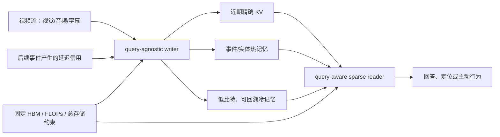

# 大模型视觉记忆与超长视频理解：文献脉络、机制缺口与五个研究方案

> 调研截止：2026-08-21  
> 口径：将“25 年之后”解释为 **2025 年及以后**；年份优先按正式发表年份，尚未正式发表者按首次公开技术报告年份。只采用论文原文、会议页面或机构官方页面作为主链接。

## 0. 结论先行

这两条研究线正在汇合，但尚未真正合流。

- 长上下文研究已经从“固定稀疏模式”发展到 **原生可训练路由、分层 KV、固定容量关联记忆与硬件协同设计**。
- 超长视频研究则从“多采样一些帧”发展到 **输入压缩、循环状态、视觉 KV 记忆、结构化 episodic/semantic memory 与主动重看**。
- 两边最大的错位是：文本方法通常把历史视为一维同质 token；视频记忆真正需要处理的是 **时空不均匀性、实体恒常性、状态变化、未知未来问题和延迟显著性**。
- 因此，最值得做的不是再造一个“抽帧 + caption + RAG + agent”的外围系统，而是改写以下底层原语：
  1. 一个压缩后的 memory token 怎样表示它覆盖的时间区间；
  2. 在未来问题未知时怎样写入、又怎样在问题到来后逐级恢复细节；
  3. 记忆原子应是帧/patch，还是实体状态、状态变化和关系边；
  4. 测试时记忆由什么“语义惊奇”驱动、如何跨时间尺度巩固；
  5. 一个当时不起眼、后来才变重要的事件如何获得延迟信用。

我最推荐的首个项目是 **方案一：压缩等变的时间测度 KV**。它边界最干净、资源要求相对最低，同时可以形成理论命题、机制实验和真实长视频结果。最适合作为长期主线的是 **方案四：多时间尺度语义惊奇记忆**；问题定义最具潜在辨识度、但风险也最高的是 **方案五：回溯式时间信用记忆**。

---

## 1. 调研口径与需要先区分的概念

### 1.1 论文筛选

- **记忆/效率侧 20 篇**：17/20 的正式论文或技术报告来自 2025–2026；保留 3 篇 2024 年工作作为动态稀疏、KV 量化与 query-aware eviction 的必要锚点。
- **超长视频侧 20 篇**：20/20 来自 2025–2026；其中 18 篇为顶会主会论文，2 篇为 Workshop 论文（STORM、StreamMem）。
- 选择标准：头部企业/实验室、顶会论文、已形成后续路线的高影响机制，至少满足一项；不以单一榜单分数作为入选理由。

### 1.2 三类“效率”不能混为一谈

| 机制 | 历史是否仍在 | 主要节省 | 对未来未知问题的风险 |
|---|---:|---|---|
| 稀疏读取 / sparse attention | 是 | attention FLOPs、带宽 | 较低；以后仍可重新读取，但总 KV 仍线性增长 |
| KV 压缩 / eviction / merge / quantization | 部分或低精度保留 | HBM、带宽，有时也省计算 | 中到高；永久删除或错误混合不可逆 |
| 有界关联记忆 / recurrent or fast-weight memory | 原 token 不一定保留 | 总状态可固定 | 高；容量、干扰和精确召回决定上限 |

这一区分对视频尤其重要：**“这次不读”不等于“永远忘掉”**。一闪而过的钥匙、药瓶文字或人物换装，在当前时刻可能低分，却可能在几小时后的问题中成为唯一证据。

### 1.3 一个更合理的问题定义

对于视频流 \(x_{1:T}\)，问题 \(q\) 在视频编码完成后才出现：

\[
M_t=W_\theta(M_{t-1},x_t),\qquad C(M_t)\le B,
\]

\[
\hat a=F_\psi\big(q,R_\phi(q,M_T)\big).
\]

应优化的不是某次 query 下的瞬时 attention 保真，而是未来问题分布下的率失真：

\[
\min_{W,R}\;\mathbb E_{V,q,a}
\left[\ell(\hat a,a)+\beta C_{\rm store}+\gamma C_{\rm read/write}\right],
\quad q\notin\mathcal I(W_t).
\]

最后一个约束表示：在严格流式协议中，writer 不能偷看未来问题。现有 VideoQA 工作经常没有明确区分这一点。

---

## 2. 稀疏注意力、KV cache 压缩与大模型记忆：20 篇核心工作

### 2.1 稀疏注意力与稀疏读取

| # | 工作、年份与机构 | 核心机制 | 对视觉记忆的启发与局限 |
|---:|---|---|---|
| 1 | [MiniMax Sparse Attention](https://arxiv.org/abs/2606.13392)，2026，MiniMax | 每个 GQA group 用轻量 Index Branch 独立选择 Top-k KV blocks，Main Branch 对命中块做精确 attention；配套 exp-free Top-k 与专用 kernel。论文在 109B 原生多模态模型、1M context 上报告 28.4× attention compute 降低。 | clip/shot 可成为 block，不同 GQA 组可学习局部运动、实体或事件检索。仍需原生训练与 kernel；块平均会稀释短暂证据。 |
| 2 | [DeepSeek-V3.2 / DeepSeek Sparse Attention](https://arxiv.org/abs/2512.02556)，2025，DeepSeek-AI | 低维、可 FP8 的 Lightning Indexer 为历史 token 打分，再对 Top-k MLA latent cache 做精确 attention。 | 适合细粒度视觉地址生成；但完整 latent cache 和索引仍随时间增长，解决的是“读哪些”，不是“存多少”。 |
| 3 | [Native Sparse Attention](https://arxiv.org/abs/2502.11089)，2025，DeepSeek-AI | 同时使用压缩全局块、细粒度选择块和局部滑窗，并从训练阶段与硬件共同设计。 | 自然对应“全局摘要—关键原片段—近期工作记忆”；固定块与窗口仍不理解事件边界、实体重现。 |
| 4 | [MoBA](https://arxiv.org/abs/2502.13189)，2025，Moonshot AI | 把 KV blocks 视为 attention experts，query 路由到少量历史块；可以在 full/sparse attention 之间平滑切换。 | shot/scene 可作为专家；但块内短事件容易被聚合表示漏掉，块几何必须视频化。 |
| 5 | [XAttention](https://arxiv.org/abs/2503.16428)，ICML 2025，MIT、清华、上海交大、NVIDIA | 用 strided antidiagonal score 近似 QK block 重要性，训练免费筛除块；已直接测试 VideoMME/VLM。 | 是强大的 plug-in 视频稀疏 prefill 基线；不减少持久 KV，diffuse 多证据可能被阈值漏掉。 |
| 6 | [MMInference](https://arxiv.org/abs/2504.16083)，ICML 2025，Microsoft Research 等 | 发现视频 token 特有 Grid pattern 和跨模态稀疏差异，通过 permutation 变成硬件友好布局；百万 token prefill 最高报告 8.3× 加速。 | 直接证明文本 sparse pattern 不足以描述视频；但主要优化 prefill，不解决长期 cache。 |
| 7 | [SeerAttention](https://www.microsoft.com/en-us/research/publication/seerattention-self-distilled-attention-gating-for-efficient-long-context-prefilling/)，NeurIPS 2025，Microsoft Research 等 | 冻结原模型，以稠密 attention 自蒸馏轻量 block gate，再配套 block-sparse FlashAttention。 | 可只训练视觉 gate 来 retrofit 现有 VLM；teacher attention 的 lost-in-the-middle 偏差也会被继承。 |
| 8 | [MInference 1.0](https://arxiv.org/abs/2407.02490)，NeurIPS 2024 Spotlight，Microsoft Research | 离线将 head 分为 A-shape、Vertical-Slash、Block-Sparse，在线动态估计索引。 | 奠定“head 的结构类型较稳定、具体索引随输入变”的路线；只省 prefill，完整 KV 仍在。 |

### 2.2 KV cache：异构保留、检索、淘汰与量化

| # | 工作、年份与机构 | 核心机制 | 对视觉记忆的启发与局限 |
|---:|---|---|---|
| 9 | [DuoAttention](https://arxiv.org/abs/2410.10819)，ICLR 2025，MIT、清华、上海交大、NVIDIA 等 | 识别少量 Retrieval Heads，仅它们保留 full cache；Streaming Heads 只留 sink 和最近窗口。 | 可让身份/事件检索 head 与局部运动/语言生成 head 使用不同记忆；GQA 共享 KV 时收益下降，retrieval cache 仍线性增长。 |
| 10 | [RetrievalAttention](https://arxiv.org/abs/2409.10516)，NeurIPS 2025，Microsoft Research | 把完整 KV 放在 CPU，用 attention-aware ANNS 解决 Q/K 分布错位，每步只取约 1%–3% KV。 | 提供“低频完整视觉档案 + GPU 工作集”，避免永久删帧；PCIe、索引维护和随机 gather 可能吞掉收益。 |
| 11 | [KVzip](https://arxiv.org/abs/2505.23416)，NeurIPS 2025 Oral，首尔大学、NAVER AI Lab | 通过上下文重建估计 query-agnostic KV 重要性，压缩一次后可服务不同未来问题。 | 比当前-query attention 更符合“先看后问”；但构建代价高、eviction 仍不可逆，文本重建不等于视觉任务价值。 |
| 12 | [Inference-Time Hyper-Scaling / DMS](https://proceedings.neurips.cc/paper_files/paper/2025/hash/0d781fa5f639bf2caf728a68e9678362-Abstract-Conference.html)，NeurIPS 2025，NVIDIA 等 | 为每个 head/token 学习二元 eviction，但延迟一个滑窗再删除，让后续状态有机会吸收信息；约 1K retrofit steps 即可工作。 | 很像事件由工作记忆向长期记忆巩固；延迟结束后仍永久删除，固定延迟未必适配不同视频节奏。 |
| 13 | [KIVI](https://proceedings.mlr.press/v235/liu24bz.html)，ICML 2024，Rice、CMU、JHU 等 | K per-channel、V per-token 的非对称 2-bit 量化。 | 可保留全历史低比特“冷底座”；不减 token 数/FLOPs，视觉 KV 的 outlier 结构未必与文本一致。 |
| 14 | [SnapKV](https://proceedings.neurips.cc/paper_files/paper/2024/hash/28ab418242603e0f7323e54185d19bde-Abstract-Conference.html)，NeurIPS 2024，UIUC、Cohere、Princeton | 用 prompt 末端 observation window 的 attention 预测生成阶段的稳定热点，再 pooling 保留 KV。 | 单次、问题已知的离线 VideoQA 强基线；对未来问题未知或多轮复用会过拟合当前 query。 |

### 2.3 可学习长时记忆与固定容量状态

| # | 工作、年份与机构 | 核心机制 | 对视觉记忆的启发与局限 |
|---:|---|---|---|
| 15 | [Titans](https://proceedings.neurips.cc/paper_files/paper/2025/hash/a4ca07aa108036f80cbb5b82285fd4b1-Abstract-Conference.html)，NeurIPS 2025，Google Research | 局部 attention 作为短时记忆，深 MLP 参数作为测试时可写长期记忆；用梯度 surprise、momentum 和 data-dependent forgetting 更新。 | 给出“参数即记忆”的写入原语；若直接用视觉特征误差，会把镜头抖动当重要事件，且长期干扰/在线更新成本未解决。 |
| 16 | [MIRAS: It’s All Connected](https://arxiv.org/abs/2504.13173)，ICLR 2026，Google Research | 用 memory architecture、attentional-bias objective、retention gate、online optimizer 四个维度统一 Transformer、Titans 与线性 RNN。 | 指出视觉记忆应联合设计结构、写入目标、保持与优化器；目前主要是语言/合成验证，设计空间很大。 |
| 17 | [ATLAS](https://arxiv.org/abs/2505.23735)，ICML 2026，Google Research | 提高 fast-weight memory 容量；Omega rule 在一段上下文而非最后一个 token 上优化，配套更强内部优化器。 | 视频写入单位可由单帧升级为片段内轨迹与状态变化；高阶特征和测试时优化的稳定性、成本较高。 |
| 18 | [Trellis](https://research.google/pubs/trellis-learning-to-compress-key-value-memory-in-attention-models-2/)，COLM 2025，Google Research | 用固定大小状态替代线性增长 KV，两遍 recurrent compression 配合 online gradient descent 与 forget gate。 | 最接近“恒定 HBM 的持续视频”；固定 slots 会发生覆盖、绑定冲突，精确时序细节没有保证。 |
| 19 | [Engram: Conditional Memory via Scalable Lookup](https://arxiv.org/abs/2601.07372)，2026，DeepSeek-AI、北京大学 | 多头 hash 将 N-gram 映射到巨大静态表，O(1) lookup，并用 gate 融入 hidden states；把 memory sparsity 与 compute sparsity 分开。 | 对象—动作—场景 motif 可形成确定性地址；当前 memory 不能在线写入新视频事件，受离散化和碰撞限制。 |
| 20 | [MELODI](https://deepmind.google/research/publications/121073/)，ICLR 2025，Google DeepMind | 跨 Transformer 层反复形成 short-term memory，中间层进一步压缩并跨窗口聚合为 long-term KV memory。 | 可映射为 frame→shot→scene→episode 的 consolidation；层次和压缩率较固定，未来未知问题下的罕见细节保真不足。 |

### 2.4 记忆侧技术脉络

1. **访问稀疏化：历史都在，只少读。**  
   MInference → XAttention/MMInference/SeerAttention → NSA/MoBA → DSA/MSA。趋势是从后处理近似走向原生路由器，并越来越重视 kernel 与块布局。

2. **状态压缩：低比特存、少存或分层存。**  
   SnapKV/KIVI → DuoAttention/KVzip/DMS → RetrievalAttention 的 CPU–GPU 层次。核心矛盾是：显存收益越大，未来未知问题下的不可逆风险越高。

3. **记忆架构化：把历史写进固定状态。**  
   Infini-attention 等早期有界状态 → MELODI/Titans → MIRAS/ATLAS/Trellis。问题从“留哪些 token”上升为“什么触发写入、写到何种结构、怎样保持与遗忘”。

4. **容量与计算解耦。**  
   Engram、RetrievalAttention 表明：超长记忆未必全部驻留在高带宽计算设备；可寻址的冷存储与小型热工作集可能比纯 eviction 更适合未知未来问题。

补充但未计入正式 20 篇的直接相关工作包括 [ShadowKV](https://arxiv.org/abs/2410.21465)、[SALS](https://proceedings.neurips.cc/paper_files/paper/2025/hash/00a0ebcad584c59dbc439c2af8793638-Abstract-Conference.html)、[SpargeAttn](https://arxiv.org/abs/2502.18137)、[Infini-attention](https://arxiv.org/abs/2404.07143)、[Lattice](https://arxiv.org/abs/2504.05646) 与 [VarRate](https://arxiv.org/abs/2607.15498)。后文方案的最近邻对比会使用这些工作。

---

## 3. 超长视频理解：20 篇核心工作

### 3.1 2026：原生稀疏、层次 KV、长期记忆与主动感知汇合

| # | 工作、机构与任务尺度 | 核心机制 | 局限与机制判断 |
|---:|---|---|---|
| 1 | [WorldMM](https://openaccess.thecvf.com/content/CVPR2026/html/Yeo_WorldMM_Dynamic_Multimodal_Memory_Agent_for_Long_Video_Reasoning_CVPR_2026_paper.html)，CVPR 2026 Highlight，KAIST、NTU、DeepAuto.ai；小时至周级 | 构建多尺度 episodic memory、持续更新的 semantic memory 和保留视觉细节的 visual memory；agent 选择记忆类型、时间粒度和停止时机。 | 多尺度多模态记忆代表最新趋势；但 caption/三元组抽取与冲突消解误差累积，预处理和总存储并不有界。 |
| 2 | [FlexMem](https://openaccess.thecvf.com/content/CVPR2026/html/Chen_Scaling_the_Long_Video_Understanding_of_Multimodal_Large_Language_Models_CVPR_2026_paper.html)，CVPR 2026，厦门大学、国防科大；单 3090 处理 1K+ 帧 | 直接把视觉 KV 作为记忆源；双通路压缩形成跨 clip 的 context memory 与最终召回的 local memory，支持 MemIndex。 | 把通用 KV 压缩真正落到长视频；“无限”是迭代输入意义，不是无损无限保留，压缩仍可能永久丢稀有证据。 |
| 3 | [WeaveTime](https://openaccess.thecvf.com/content/CVPR2026/html/Zhang_WeaveTime_Streaming_from_Earlier_Frames_into_Emergent_Memory_in_VideoLLMs_CVPR_2026_paper.html)，CVPR 2026，香港大学；实时流 | Temporal Reconstruction 训练顺序感知；Past–Current Dynamic Focus Cache 由预测不确定性触发粗到细历史召回。 | 明确指出 VideoLLM 的“时间无知”；依赖不确定性校准，且更像片段召回，尚未解决长期语义整合。 |
| 4 | [Agentic Very Long Video Understanding / EGAgent](https://aclanthology.org/2026.acl-long.2161/)，ACL 2026 Main，Meta Reality Labs、UW–Madison；50+ 小时/周级 | 从人物、地点、物体及时间关系构建 entity scene graph，规划 agent 联合视觉、音频和图检索进行多跳推理。 | 实体图适合组合推理；抽取/说话人识别误差会污染图，每题分钟级延迟，不是模型内部记忆原语。 |
| 5 | [LongVideo-R1](https://openaccess.thecvf.com/content/CVPR2026/html/Qiu_LongVideo-R1_Smart_Navigation_for_Low-cost_Long_Video_Understanding_CVPR_2026_paper.html)，CVPR 2026，中科院大学、华为；十余小时展示 | 层次时间树上学习下钻、横移、回溯和停止；用 SFT+RL 优化定位与工具成本。 | 主动导航优于一次性输入；强依赖层次 caption 和大型底层 VLM，且不同问题不能自然复用内部状态。 |
| 6 | [VideoNSA](https://arxiv.org/abs/2510.02295)，ICLR 2026，UCSD、Princeton、NYU、Lambda | 将 NSA 原生训练进 Qwen2.5-VL：文本保持 dense GQA，视频使用压缩、选择、滑窗三分支；216K 指令数据，可靠扩展至 128K context。 | 直接证明“视频原生稀疏”已是成熟基线；仍需端到端训练，frame-aligned 固定块会稀释瞬时事件，完整 KV/索引随长度增长。 |
| 7 | [HERMES](https://aclanthology.org/2026.acl-long.381/)，ACL 2026 Main，复旦、上海创新研究院、NUS | 由 mechanistic attention 分析把 KV cache 解释为多粒度层次记忆，训练免费地复用紧凑 cache；报告 10× TTFT 加速、最多减少 68% video tokens。 | query 到来时无额外检索计算很实用；但层次写入/合并主要是手工规则，压缩不可逆且没有未来未知问题的保真保证。 |
| 8 | [MuKV](https://openaccess.thecvf.com/content/CVPR2026/html/Xiao_MuKV_Multi-Grained_KV_Cache_Compression_for_Long_Streaming_Video_Question-Answering_CVPR_2026_paper.html)，CVPR 2026，中科大、NUS | 离线构建 patch/frame/segment 三粒度 KV，以 attention 与频率双信号压缩；在线先并行召回再跨粒度重排。 | 是 KV compression × streaming VideoQA 的直接交叉点；三粒度需多路 prefill，总存储仍次线性增长，剪枝和固定粒度会丢未知问题证据。 |
| 9 | [LongVT](https://openaccess.thecvf.com/content/CVPR2026/html/Yang_LongVT_Incentivizing_Thinking_with_Long_Videos_via_Native_Tool_Calling_CVPR_2026_paper.html)，CVPR 2026，MiroMind、NTU、HKUST(GZ)、清华、LMMs-Lab | 把模型自身 temporal grounding 作为 crop-video 工具，形成全局浏览→定位→高帧率重看的多轮视觉 Chain-of-Tool-Thought。 | 解决“先粗看再细看”；递归视觉 token 和交互历史仍会增长，属于读策略而非可靠写入机制。 |
| 10 | [M3-Agent](https://seed.bytedance.com/en/public_papers/seeing-listening-remembering-and-reasoning-a-multimodal-agent-with-long-term-memory)，ICLR 2026，ByteDance Seed、浙大、上海交大 | 在线构造 entity-centric episodic memory，并持续抽象 semantic memory；RL 学习多轮跨模态检索、推理和停止。 | 向真正长期多模态助手迈进；文本化 memory 会丢失空间布局和一次性细节，作者也把选择性视觉记忆列为开放问题。 |
| 11 | [VideoChat-Flash](https://proceedings.iclr.cc/paper_files/paper/2026/hash/b14d7175755b180dc2163e15e3110cb6-Abstract-Conference.html)，ICLR 2026，上海 AI Lab、南京大学、中科院深圳先进院 | HiCo 在 clip 内做时空聚合与 token merge，再在 LLM 浅/深层分别均匀或文本相关地剪枝，约 1/50 压缩。 | 分层压缩影响很大；深层 query-aware pruning 对隐式或未来问题不安全，训练依赖大规模数据。 |
| 12 | [StreamMem](https://arxiv.org/abs/2508.15717)，CVPR 2026 VidLLMs Workshop（2025 首报），Meta AI、NYU | 用 generic query token 对视觉 token 的 attention 作为未知未来问题下的通用显著性，结合帧过滤与 frame-wise KV prototype merge，保持固定 KV。 | 明确瞄准 query-agnostic streaming；平均显著性不等于未来任务价值，一次性低频证据仍会被删。 |

### 3.2 2025：从密集上下文过渡到输入压缩、循环状态和有界 KV

| # | 工作、机构与任务尺度 | 核心机制 | 局限与机制判断 |
|---:|---|---|---|
| 13 | [LongVILA](https://openreview.net/forum?id=wCXAlfvCy6)，ICLR 2025，NVIDIA、MIT、UC Berkeley、UT Austin | 五阶段上下文扩展与长视频 SFT；MM-SP 支持 2M token 训练、2048 帧，另测 6000 帧 NIAH。 | “记住全部输入”的系统路线，是重要上界；attention/KV 成本随帧数增长，硬件门槛高，NIAH 不等于整体理解。 |
| 14 | [LongVU](https://proceedings.mlr.press/v267/shen25j.html)，ICML 2025，Meta AI、KAUST、高丽大学 | DINOv2 去除时序冗余，文本 query 决定高保真帧，再按跨帧依赖压缩空间 token。 | 强时空自适应基线；压缩时必须已知问题，不适合严格“先看后问”，罕见事件可在第一步即被删除。 |
| 15 | [STORM](https://openaccess.thecvf.com/content/ICCV2025W/CLVL/html/Jiang_STORM_Token-Efficient_Long_Video_Understanding_for_Multimodal_LLMs_ICCVW_2025_paper.html)，ICCV 2025 Workshop，NVIDIA、Rutgers、UC Berkeley、MIT 等 | 压缩前用 Mamba temporal projector 让视觉 token 先吸收动态，再做时空 pooling/sampling；流式变体可复用状态。 | “先建模再压缩”比直接删帧合理；固定 pooling 会模糊细节，流式长期写入和遗忘尚未系统设计。 |
| 16 | [Video-XL](https://openaccess.thecvf.com/content/CVPR2025/html/Shu_Video-XL_Extra-Long_Vision_Language_Model_for_Hour-Scale_Video_Understanding_CVPR_2025_paper.html)，CVPR 2025，上海交大、BAAI、人大、中科院等 | 每个区间插入 Visual Summarization Token，在 LLM 内聚合本段视觉 KV；配合动态压缩率和课程学习，约 16× 压缩。 | 重要的内部 KV 摘要路线；摘要误差随长度累积，论文的超长 NIAH 也暴露信息衰减。 |
| 17 | [AuroraLong](https://openaccess.thecvf.com/content/ICCV2025/html/Xu_Bringing_RNNs_Back_to_Efficient_Open-Ended_Video_Understanding_ICCV_2025_paper.html)，ICCV 2025，浙大、UW、HKUST(GZ)、上海 AI Lab | 用线性 RWKV 将历史压入固定隐藏状态，结合按 cluster 大小排序的视觉 token merge；24GB GPU 报告可处理 1.6 万帧。 | 提供固定状态对照；信息瓶颈和复杂检索/组合推理能力是固有限制。 |
| 18 | [ReWind](https://openaccess.thecvf.com/content/CVPR2025/html/Diko_ReWind_Understanding_Long_Videos_with_Instructed_Learnable_Memory_CVPR_2025_paper.html)，CVPR 2025，Huawei Helsinki、Sapienza | read–perceive–write 循环压缩写回，第二遍由 memory 与问题选择高分辨率关键帧。 | 可学习读写和 rewind 很有启发；instruction 在首次观看时已知，且需保留/重访高分辨率 buffer，不是严格单遍有界 memory。 |
| 19 | [VideoLLaMB](https://openaccess.thecvf.com/content/ICCV2025/html/Wang_VideoLLaMB_Long_Streaming_Video_Understanding_with_Recurrent_Memory_Bridges_ICCV_2025_paper.html)，ICCV 2025，BIGAI、北理工、UCSC、北大 | SceneTiling 语义分段，Memory Bridge Layers 以 recurrent memory token 跨段传递，并从 memory cache 检索刷新。 | 把场景边界引入循环记忆；总显存仍可能线性增长，训练和测试长度距离真正全天流较远。 |
| 20 | [InfiniPot-V](https://proceedings.neurips.cc/paper_files/paper/2025/hash/caef5f5e658aa1f7565f063a2cd99726-Abstract-Conference.html)，NeurIPS 2025，Hanyang、Sungkyunkwan、Qualcomm AI Research Korea | 训练无关、query-agnostic、固定 KV 上限；按 Key 的跨时间 patch 相似度删除冗余，以 Value norm 保留显著 token，并逐层自适应 pooling。 | 罕见地同时考虑 K 冗余与 V 显著性；永久驱逐仍不安全，同 patch 位置假设不耐镜头运动/目标位移。 |

### 3.3 超长视频路线图

1. **密集扩展上界**：LongVILA（LongVILA-R1 是其后续 RL 路线）。  
   解决训练和系统扩展，但没有解决记忆选择。

2. **输入侧提高信息密度**：LongVU / VideoChat-Flash / STORM / Video-XL（另见 ReMoRa 的 codec 路线）。  
   路线从删帧和 token merge，走向“先建模运动/事件，再压缩”。

3. **模型内部循环状态或视觉 KV**：AuroraLong / VideoLLaMB / ReWind / FlexMem / VideoNSA / HERMES / MuKV。  
   从固定隐藏状态、recurrent tokens，发展到原生稀疏、层次压缩和可召回的视觉 KV memory。

4. **未知问题下的有界流式 memory**：InfiniPot-V / StreamMem / WeaveTime。  
   核心问题变成：没有 query 时，哪些状态足以覆盖未来任务？

5. **外部 episodic / semantic / entity graph memory**：M3-Agent / EGAgent / WorldMM。  
   长视频被重新表述为持续形成事件、实体关系和稳定规律，但仍主要是外围数据库与 agent。

6. **主动感知与 test-time computation**：LongVideo-R1 / LongVT（另见 MemVid）。  
   先建廉价索引，再由问题决定“下一眼看哪里、看多细、何时停止”。

必要的 2024 历史锚点虽未计入 20 篇，包括 [MovieChat](https://openaccess.thecvf.com/content/CVPR2024/html/Song_MovieChat_From_Dense_Token_to_Sparse_Memory_for_Long_Video_CVPR_2024_paper.html)、[MA-LMM](https://openaccess.thecvf.com/content/CVPR2024/html/He_MA-LMM_Memory-Augmented_Large_Multimodal_Model_for_Long-Term_Video_Understanding_CVPR_2024_paper.html) 与 [LongVideoBench](https://papers.nips.cc/paper_files/paper/2024/hash/329ad516cf7a6ac306f29882e9c77558-Abstract-Datasets_and_Benchmarks_Track.html)。它们分别奠定了稀疏记忆、在线 memory bank 和长视频评测的基础。

另外几篇没有计入正式 20 篇、但做底层机制时必须持续跟踪：

- [ReMoRa](https://openaccess.thecvf.com/content/CVPR2026/html/Yashima_ReMoRa_Multimodal_Large_Language_Model_based_on_Refined_Motion_Representation_CVPR_2026_paper.html)（CVPR 2026）把 I-frame 与 motion vector 作为更底层的视频表示；[LongVILA-R1](https://arxiv.org/abs/2507.07966)（NeurIPS 2025）则给出长视频 RL 的密集扩展上界。
- [MemVid](https://arxiv.org/abs/2503.09149)（2025）学习由全局 memory 生成检索线索；[StreamingVLM](https://proceedings.iclr.cc/paper_files/paper/2026/hash/6445dd88ebb9a6a3afa0b126ad87fe41-Abstract-Conference.html)（ICLR 2026）以 sink、短视觉窗和长文本窗维持紧凑 KV。
- [Memento](https://proceedings.iclr.cc/paper_files/paper/2026/hash/3b5f4587a0bdb81ecc6ce9d82320a5c2-Abstract-Conference.html)（ICLR 2026）把评测推进到最长 7 小时的主动流式助手；[ScaleLong](https://proceedings.iclr.cc/paper_files/paper/2026/hash/fa1cfe4e956d85e016b1f8f49b189a0b-Abstract-Conference.html)（ICLR 2026）显示 clip/shot/event/story 中间时间尺度存在明显短板。
- 截止日最近的交叉预印本 [ViSAGE](https://arxiv.org/abs/2607.28678)（2026-07）用延迟身份线索双向修正历史 entity memory；[Event-Causal RAG](https://arxiv.org/abs/2605.06185)（2026-05）以 State–Event–State 图和双向因果检索支持长间隔推理。二者直接约束了后文 RD-KV/RTC-Mem 的新颖性边界。

---

## 4. 两个维度真正的结合点

### 4.1 不是“把文本 KV 压缩搬到视频”，而是八个结构性错位

| 错位 | 文本长上下文中的常见假设 | 超长视频中的真实要求 | 研究机会 |
|---|---|---|---|
| token 几何 | 一维、近似同质 blocks | 时间×空间×实体轨迹，冗余高度各向异性 | 事件/轨迹对齐的块与路由，而非固定 token block |
| query 时序 | prompt 已知后压缩 | 全天视频先被观看，问题可能数小时后出现 | query-agnostic write + query-aware read |
| 显著性 | 当前 attention/重建误差近似未来价值 | 早期伏笔可能直到结局才重要 | 延迟信用与可回溯冷层 |
| K/V 作用 | key 相似度或 attention score 足够 | 颜色、OCR、计数、身份细节主要存在 V 中 | value-aware retention 与输出误差证书 |
| 记忆原子 | token 或连续块 | 实体状态、状态变化、关系、事件区间 | relational/delta KV primitive |
| 时间位置 | 每 token 一个离散位置 | 一个摘要 token 可能覆盖 0.5 秒或 10 分钟 | 区间/时间测度编码与 merge-equivariance |
| head 功能 | 同一种 cache 原语、不同预算 | 局部运动、OCR、身份、事件检索 head 功能不同 | head/group-wise memory primitive |
| 评测 | NIAH、perplexity | 多证据、顺序、持续时间、实体重现、主动提醒 | 固定资源的 retention–delay 曲线 |

### 4.2 五个关键判断

1. **写入时无 query、读取时有 query，是视觉记忆的第一性不对称。**  
   LongVU、ReWind、SnapKV 一类 query-aware 方法可作为 oracle 上界，但不能代表持续视觉记忆。

2. **不可逆删除不应是第一层决策。**  
   更合理的是“所有事件至少保留极低码率可发现性 + 少量事件保留增强层 + query 到来后再增量恢复”。

3. **视频的有效信息量更接近状态变化次数，而不是帧数。**  
   静止背景即便变化巨大（镜头运动）也可能不重要；“把钥匙放进口袋”像素变化很小，却改变了未来可回答状态。

4. **固定 HBM 不等于固定总存储，“无限输入”也不等于无限信息保留。**  
   论文必须分别报告 GPU resident bytes、CPU/NVMe bytes、索引大小和视频原文件是否允许重访。

5. **prefill 与 decode 必须分开优化。**  
   一次视频、一个短答案通常受视频编码/prefill 支配；KV decode compression 的价值主要出现在多轮问答、流式交互和持续 agent。

### 4.3 汇合后的总体架构

接下来的五个方案分别改造这张图中的 **时间地址、编码方式、记忆原子、在线更新律和延迟信用律**。

---

## 5. 五个底层机制方案

### 方案一：TM-KV——压缩等变的时间测度 KV

#### 研究问题与动机

压缩后，一个 memory token 可能代表单帧、一个 shot 或十分钟事件。标准 M-RoPE/时间戳仍把它当作一个离散点；不同 fps、block 大小或 merge 顺序会改变相对距离，导致顺序、持续时间和跨区间关系漂移。[TIE](https://arxiv.org/abs/2605.10543) 已在视频生成中把时间区间引入 RoPE，因此仅做 interval embedding 已不足够。真正可区分的新点是：**让时间表示对层次压缩满足可组合代数，并近似保持 attention kernel。**

#### 核心机制

对事件块 \(B\) 不只存中心时刻，而存 content-weighted temporal measure 的少量 Fourier moments：

\[
\mathcal K_B(\omega_r)=\frac{1}{Z_B}\sum_{i\in B}w_i k_i e^{\mathrm i\omega_r t_i},\quad
\mathcal V_B(\omega_r)=\frac{1}{Z_B}\sum_{i\in B}w_i v_i e^{\mathrm i\omega_r t_i},\quad
Z_B=\sum_iw_i.
\]

两个记忆块合并时仅做加权相加：

\[
Z_{B_1\cup B_2}\mathcal K_{B_1\cup B_2}
=Z_{B_1}\mathcal K_{B_1}+Z_{B_2}\mathcal K_{B_2}.
\]

这里的结合律有一个必要约束：\(w_i\) 必须在叶级 token 上一次确定、之后不随摘要内容重算，并且每个节点同步保存同一组频率下的未归一化矩与 \(Z_B\)。在此约束下，无论先按帧→shot→scene 合并，还是直接 frame→scene，时间签名严格一致；若每层重算 content weight，则路径不变性不成立。query 在时刻 \(t_q\) 对粗块的路由分数为：

\[
s(q,B)=q^\top\bar k_B+
\sum_r\operatorname{Re}\left[(U_rq)^*\mathcal K_B(\omega_r)e^{-\mathrm i\omega_rt_q}\right].
\]

粗路由只负责找到 top-k 块；命中后再展开其中原始或增强 KV。另加 before/after/overlap/contains 四种 interval relation bias。有限 Fourier moments 能否近似保持 full attention 的时间核是待检验假设，而非由结合律自动推出；理论部分应在带限/平滑时间核假设下给出截断误差界，实验部分直接测 routing recall 与 attention-output error。

#### 训练方案

- 冻结或轻量微调 Qwen2.5-VL-3B/7B；把模块插入 VideoNSA/FlexMem 的 compression/routing branch。
- 对同一视频随机改变 fps、block size、merge tree 和压缩率，施加压缩路径不变蒸馏：

\[
\mathcal L_{\rm inv}=\mathbb E_{C_1,C_2}
\operatorname{KL}\big(p(y|C_1(V),q)\|p(y|C_2(V),q)\big).
\]

- 辅助任务：顺序、持续时间、区间包含/重叠、temporal grounding；主任务保持普通 QA loss。
- 频率采用 log-spaced 固定频率起步，再比较可学习频率；moment 只存在少数 routing heads，并量化到 FP8。

#### 实验与可证伪假设

- 基准：ScaleLong、LongVideoBench、LVBench、Video-MME、LV-Haystack；另构造内容完全相同、只改变顺序/持续时间/间隔的反事实视频。
- 基线：center timestamp、start/end embedding、M-RoPE、ALiBi、TIE、VideoNSA、普通 event pooling。
- 核心指标：跨 fps 准确率方差、跨 merge tree 一致性、时间顺序准确率、grounding mIoU、routing recall、额外 KV bytes 与 kernel latency。
- 关键消融：1/2/4/8/16 个 moments；无 content weight；无 invariance loss；只编码区间端点；固定块 vs 事件块。
- **可证伪点**：若压缩路径变化并不会显著影响现有 VLM 的时序能力，或 2–4 个 moments 不能提高路由 recall，则该机制不成立。

#### 最近邻差异、风险与定位

- 相对 TIE：从均匀时间区间推广到 **内容加权时间测度**，并要求 merge associativity；任务从生成控制转向理解、KV 压缩和稀疏读取。
- 相对 VideoNSA：不再只改稀疏预算，而改 memory token 的时间代数。
- 风险是长达数小时后 Fourier aliasing；可用对数频率、端点特征与近期精确窗口兜底。
- **定位**：最适合先做；理论清楚、模块独立、算力相对可控。

---

### 方案二：SR-EventKV——带局部 attention 误差证书的逐级细化事件 KV 编码器

#### 研究问题与动机

hard eviction 对未知未来问题不可逆；统一低秩又把相同预算浪费在简单和复杂事件上。[VarRate](https://arxiv.org/abs/2607.15498) 已提出每 token 至少保留非零 rank，[DeltaKV](https://arxiv.org/abs/2602.08005) 存历史参考的语义残差，[MuKV](https://openaccess.thecvf.com/content/CVPR2026/html/Xiao_MuKV_Multi-Grained_KV_Cache_Compression_for_Long_Streaming_Video_Question-Answering_CVPR_2026_paper.html) 已做多粒度视频 KV。仍缺少的是：**一个 query 到来前保证所有事件可发现、query 到来后只给相关事件逐级增加比特/秩，并能控制遗漏 attention 输出误差的 codec。**

#### 核心机制

对事件 \(j\) 的 \(X_j=[K_j,V_j]\) 编码为基础层和多个残差增强层：

\[
c_j^0,c_j^1,\ldots,c_j^R=E(X_j),\qquad
\hat X_j(r)=D_0(c_j^0)+\sum_{s=1}^{r}D_s(c_j^s).
\]

- \(c^0\)：所有事件必留的超低码率 base sketch，包含 key centroid、时间区间、实体/OCR hash、value norm 与残差半径；只用于 coarse retrieval。
- \(c^{1:R}\)：外观、运动、OCR、关系等逐层残差，可存 CPU/NVMe。
- query 到来后，allocator 根据 coarse relevance、答案熵和估计的 attention-output 误差逐层加载。

对 page \(p\) 维护 token 数 \(n_p\)，并将 exact key 写成
\(k_i=\mu_p+U_pa_i+r_i\)，其中
\(\|a_i\|_2\le r_p^\parallel,\|r_i\|_2\le r_p^\perp\)。
以下令 \(q\) 已吸收 attention 的 \(1/\sqrt d\) 缩放，于是每个未加载 token 的 exact logit 都有确定性上界：

\[
u_p(q)=q^\top\mu_p
+\|U_p^\top q\|_2r_p^{\parallel}
+\|q\|_2r_p^{\perp}.
\]

设已加载页集合为 \(\mathcal P_S\)（对应 token 集 \(S\)），其第 \(p\) 页在当前 refinement level 的重建残差满足
\(\|k_i-\hat k_i\|\le\delta_p^K,\|v_i-\hat v_i\|\le\rho_p^V\)。
不需要知道未加载 token 的真实 logit，也能构造：

\[
L_S(q)=\sum_{p\in\mathcal P_S}\sum_{i\in p}
\exp\!\left(q^\top\hat k_i-\|q\|_2\delta_p^K\right),\qquad
U_{\bar S}(q)=\sum_{p\notin\mathcal P_S}n_p e^{u_p(q)},
\]

\[
\alpha(q)=\frac{U_{\bar S}(q)}{L_S(q)+U_{\bar S}(q)},\quad
\epsilon_K=\max_{p\in\mathcal P_S}\|q\|_2\delta_p^K,\quad
\rho_S^V=\max_{p\in\mathcal P_S}\rho_p^V.
\]

若所有 exact value 都满足 \(\|v_i\|\le V_{\max}\)，则单个 attention head 的 exact full-cache 输出 \(o\) 与当前只在 \(S\) 上计算的重建输出 \(\hat o_S\) 满足保守上界：

\[
\|o-\hat o_S\|_2
\le 2\alpha(q)V_{\max}
+2V_{\max}\tanh(\epsilon_K)+\rho_S^V.
\]

第一项显式包含所有遗漏页、每页 token 数和 selected-set 分母下界；后两项分别覆盖已加载 K、V 的重建误差。allocator 每次加载使右式下降最多的 page/refinement layer，直到低于 \(\epsilon\)。这是 **单层、单 head 的确定性 attention-output certificate**；传播到整个网络仍需层间 Lipschitz 界或经验风险校准，不能把它直接称为答案正确性证书。

#### 训练方案

- 阶段一：masked visual feature、motion、OCR/object reconstruction 预训练 codec。
- 阶段二：用 full-cache VideoLLM 蒸馏逐层 attention output 和答案 logits；失真目标以任务输出而不是像素重建为主：

\[
\mathcal L=\operatorname{KL}(p_{\rm full}\|p_{\rm codec})
+\lambda\sum_l\|o_l^{\rm full}-o_l^{\rm codec}\|_2^2
+\beta\sum_j \operatorname{bits}(c_j^{0:r_j}).
\]

- 阶段三：随机 memory budget 与“问题隐藏/问题可见”混合训练 refinement policy。只有用真实 supremum radii 时上式才是确定性证书；若用 learned/conformal residual 收紧上界，必须改称具有给定覆盖率的概率风险估计。
- 存储按连续事件 page 布局；GPU 只驻留 base index 和当前 working set。

#### 实验与可证伪假设

- 数据：Video-MME、LVBench、LongVideoBench、ScaleLong、MMR-V，以及同一视频多 query 复用设置。
- 基线：full KV、SnapKV、KVzip、KIVI、SALS、ShadowKV、VarRate、DeltaKV、Video-XL/FlexMem/MuKV。
- 公平比较三套资源：固定 HBM bytes、固定总存储 bytes、固定端到端 FLOPs；必须把 PCIe/NVMe 传输计入。
- 指标：accuracy–byte Pareto、evidence recall、证书违反率、TTFT、PCIe traffic、多 query 摊销收益。
- 消融：只有 base；固定 rank；无 residual；key-only 与 key+value 证书；无 query refinement；逐 token 与逐 event codec。
- **可证伪点**：若 base sketch 无法高 recall 找回稀有 OCR/动作证据，或增强层加载延迟超过重新编码原片段，则方案不成立。

#### 风险与定位

- base 太弱会让相关事件永远不可发现：为所有事件保留最小非零 rank 与多种 hash；这也是方案优于 hard eviction 的底线。
- 确定性上界可能过松：论文需同时报告 bound tightness 与违反率；conformal 版本只声明概率覆盖，不与 deterministic certificate 混用。
- 旧 base 仍随视频线性增长；论文必须诚实声明它解决的是 bounded HBM，而非无条件 bounded total information。
- **定位**：系统价值最高，也最容易和现有推理框架形成端到端速度结果。

---

### 方案三：RD-KV——实体关系差分 KV 记忆

#### 研究问题与动机

相似度 merge 擅长删静态背景，却会同时抹掉“状态发生了什么变化”。超长视频问题往往依赖同一实体离场重现、物体被移动、交互对象变化、次数和顺序。WorldMM/EGAgent 已证明实体图有用，但它们是外围数据库；真正的机制空白是：**把实体状态、状态差分与关系边变成 VideoLLM 内部可稀疏寻址的 KV primitive。**

#### 核心机制

先用带先验的 slot/Sinkhorn binding 将 patch 绑定到持久实体 \(e_i^t\)，另保留 anonymous event slots 处理人群、背景和无法跟踪的事件。学习实体动力学：

\[
\delta_i^t=e_i^t-F(e_i^{t-1},a_t),\qquad
g_i^t=\sigma\!\left(h(e_i^t,\delta_i^t,u_i^t)\right).
\]

只有 \(g_i^t\) 高时写入新状态；稳定实体只保留 anchor，之后存预测残差。memory 中出现三类 typed KV：

\[
k_{i\rightarrow j,t}=W_k[e_i^t,e_j^t,\delta_i^t,\delta_j^t,a_t,\tau_t],
\quad
v_{i\rightarrow j,t}=W_v[\delta_i^t,r_{ij}^t].
\]

query 先找实体/事件 seeds，再进行 2–3 次有类型约束的 path-sparse attention；邻接只保留同实体跨时连接、事件内交互和每实体 top-m 关系，避免图平方增长。

为避免查询旧状态时串行重放一条很长的 delta 链，每个实体每 \(D\) 次有效写入保存一次量化绝对 checkpoint；区间内再保存二进制 prefix-delta skip nodes。这样任意状态最多经 \(O(\log D)\) 次组合恢复，且 \(D\) 固定（如 8/16），不会随视频长度增加；若累计重建残差越过阈值则提前 checkpoint。训练时对不同重建深度蒸馏绝对状态，并显式报告 checkpoint 额外字节与误差随 hop 的曲线。

#### 训练方案

- 自监督：跨遮挡/离场重入 identity cycle consistency、action-conditioned next-state prediction、状态残差重建。
- 弱监督：开放词汇 detector/tracker、caption、ASR 仅作为 teacher；最终 slot 与 KV projection 可端到端训练。
- QA 训练加入顺序打乱、实体替换、关系边删除等反事实样本，防止模型只靠语言先验。

\[
\mathcal L=\mathcal L_{\rm QA}
+\lambda_{id}\mathcal L_{cycle}
+\lambda_{dyn}\|\hat e_i^{t+1}-e_i^{t+1}\|^2
+\lambda_{sp}\|A\|_0
+\lambda_{cf}\mathcal L_{counterfactual}.
\]

#### 实验与可证伪假设

- 数据：EgoSchema、Ego4D NLQ、EgoMem、MMR-V、V-STaR、Perception Test；另合成实体离场重入、交换对象、状态恢复、长间隔 setup–payoff。
- 基线：full-context VLM、通用 KV compression、ReWind、WorldMM/EGAgent 类实体图、普通 slot memory。
- 指标：QA/grounding、entity-ID consistency、relation recall、每次“语义状态变化”产生的 KV 数，而非仅每帧 token 数。
- 消融：无 entity binding；存绝对状态而非 delta；无关系边；1/2/3-hop；无 anonymous slots；无反事实训练。
- **可证伪点**：若自然视频中的 binding error 随时间快速累积，导致 relation memory 不如简单 frame KV，则“实体是更好记忆原子”的假设被否定。

#### 风险与定位

- tracker 一次错配会污染长链：保留多假设 slots、identity uncertainty 和 frame-level fallback。
- 开放世界实体不能穷举：anonymous event memory 必须是正式组件，不能只在附录兜底。
- [ViSAGE](https://arxiv.org/abs/2607.28678) 已用双向 refinement 让延迟身份线索回写外部 entity-centric memory；[Event-Causal RAG](https://arxiv.org/abs/2605.06185) 已有 State–Event–State 图和双向因果检索。因此论文新意必须严格落在 **端到端可微的实体绑定、模型内部 typed KV、checkpointed 状态差分与 path-sparse attention**，而不是“又建一张图”或“让后续身份证据修正历史”。
- **定位**：最适合攻实体恒常性与长程组合推理，训练/数据难度较高。

---

### 方案四：SSCM——多模态语义惊奇的快慢连续谱记忆

#### 研究问题与动机

Titans 用梯度 surprise 驱动测试时写入，但视频中的 feature/pixel surprise 很容易把镜头切换、抖动和模糊视作“值得长期记忆”；相反，“把钥匙放进口袋”可能变化很小，却改变了未来状态。单一 fast-weight memory 也容易在数小时后被重复场景覆盖。核心问题是：**什么是视觉语义惊奇，以及它应写入哪一个时间尺度的记忆？**

#### 核心机制

对视觉、音频和字幕表征 \(x_t^v,x_t^a,x_t^s\)，用语义预测残差而不是像素误差定义 surprise：

\[
s_t=\sum_{m\in\{v,a,s\}}\pi_t^m
D\big(y_t^m,f_{W_{t-1}}(k_t^m)\big)
+\lambda D_{cross}(x_t^v,x_t^a,x_t^s).
\]

预测目标包含 object/action/audio-event 分布、实体状态变化和多步未来 latent；\(\pi_t^m\) 是不确定性校准权重。维护 \(L\) 个不同半衰期的低秩 fast-weight memories：

\[
r_t^\ell=\operatorname{softmax}_\ell g_\theta
(s_t,\bar s_t^{(\tau_\ell)},\Delta s_t,
\text{duration},\text{modal agreement}).
\]

短暂 surprise 写入快层；只有持续、跨模态一致且在 eligibility trace 中稳定的残差才晋升到慢层。每层只保留固定 \(K_A^\ell\) 个 anchors，以 reservoir/prioritized sampling 更新；每次写入再抽固定 \(k_A\ll K_A^\ell\) 个形成 \(\tilde{\mathcal A}_{t,\ell}\)。不求解无界的全量 argmin，而是对下式做固定 \(S\in[1,4]\) 步 optimizer update：

\[
\mathcal J_t^\ell(W)=r_t^\ell\ell_{mem}(W;x_t)
+\lambda_\ell\|W-W_{t-1}^\ell\|^2
+\frac{\gamma_\ell}{k_A}\sum_{a\in\tilde{\mathcal A}_{t,\ell}}
\|f_W(k_a)-v_a\|^2,\qquad
W_t^\ell=\operatorname{Opt}_{1:S}(W_{t-1}^\ell,\nabla\mathcal J_t^\ell).
\]

因此 persistent state、每事件抽样数和 optimizer steps 都固定；近期精确 KV 作为短时工作记忆，长历史才进入参数化多时钟 memory。

#### 训练方案

- 阶段一：短/中视频上的 masked feature、未来动作/事件预测和跨模态对齐。
- 阶段二：对更新律做 meta-learning；随机隐藏问题，强制 writer 学会“先看后问”。
- 阶段三：以 full-context teacher 蒸馏答案分布和中间 attention output，从 4K→16K→64K 逐步延长。
- 推理只更新低秩 adapter 或小型 memory MLP，限制 update norm，并周期性保存 rollback checkpoint。

#### 实验与可证伪假设

- 数据：MementoBench、RIVER、ScaleLong、LVBench、Ego4D/ELViM；将视觉、音频、字幕线索分别以 10 秒到 7 小时的 log-spaced delay 插入。
- 基线：Titans、MIRAS、ATLAS、Trellis、Vamba/AuroraLong、Memento/StreamMem，以及“单一 TTT memory”的视频实现。
- 指标：固定状态大小下的 retention–delay AUC、干扰后恢复、写入次数、每帧更新成本、在线稳定性和回答准确率。
- 消融：单时间尺度；纯 latent surprise；去跨模态项；去晋升；去 anchor；固定更新频率；允许 writer 看 query。
- **可证伪点**：若语义 surprise 不能比简单事件边界/feature distance 更好预测未来证据价值，或多时钟层没有减轻干扰，则不应扩展到大模型。

#### 风险与定位

- 在线梯度不稳定：低秩更新、gradient clipping、短截断 meta-gradient 和状态回滚。
- 慢层被错误事件污染：晋升必须满足跨多个 chunk 持续与跨模态一致。
- 相对 Titans/视频 TTT 的创新必须同时包含 **多模态语义 surprise、可学习多时钟路由、跨层晋升和显式抗干扰**；少一项都容易被视为直接迁移。
- **定位**：最适合作为博士主线，高风险高收益，真正改写 memory update law。

---

### 方案五：RTC-Mem——回溯式时间信用记忆

#### 研究问题与动机

早期“拿起钥匙”在当时并不突出；半小时后看到“用钥匙开门”，才知道早期事件需要长期保存。当前 attention score、local surprise、KVzip reconstruction 与 query-agnostic eviction 都只能依据写入当时的信息。问题是：**后续事件能否给更早 memory 分配信用，使其被晋升、重编码或避免淘汰？**

#### 核心机制

事件 \(j\) 初始拥有 local surprise \(s_j\)、低码率 cold sketch 和 active-cache utility \(u_j\)。新事件 \(t\) 到来时，定义旧事件对未来预测的条件贡献：

\[
c_{t,j}=\mathcal L_{pred}(z_t\mid M_{<t}\setminus m_j)
-\mathcal L_{pred}(z_t\mid M_{<t}).
\]

精确 leave-one-out 只在少量 teacher step 计算，用于训练 influence critic \(\hat c_\phi(z_t,m_j)\)；在线时只对 top candidate memories 做稀疏 credit sweep。local surprise 只在事件创建时注入一次，之后每个时刻只加入该时刻的新 credit：

\[
u_j^j=s_j,\qquad
u_j^t=\gamma u_j^{t-1}
+\eta[\hat c_\phi(z_t,m_j)]_+,\quad t>j.
\]

预算选择同时考虑信用和多样性：

\[
S^*=\arg\max_{|S|\le B}\sum_{j\in S}u_j
-\kappa\sum_{j,k\in S}\operatorname{sim}(m_j,m_k).
\]

若被降级事件后来获得高信用：

- 离线视频：通过时间 pointer 重新编码原片段；
- 严格流式且原像素不可访问：只能晋升 cold sketch，不能声称恢复已丢失细节；
- 为所有老事件保留极低码率 forensic tier（缩略 patch、OCR/object code），作为最低可恢复层。

#### 训练方案

- 多时间跨度 future prediction 产生无标注 credit；full-context teacher 和已知证据标注产生 task-aware influence 标签。
- selector 用 straight-through top-k 或 submodular relaxation；一部分训练样本只提供视频、不提供问题。
- 离线 after-video QA 可进行一次 sparse backward sweep；在线结果严格按 query timestamp 截断 credit 来源，防止未来泄漏。
- 可与方案二组合：credit 决定哪些事件从 base layer 晋升到 enhancement layer。

#### 实验与可证伪假设

- 数据：MMR-V、RIVER retrospective/live/proactive、MementoBench、ScaleLong、LongVideoBench；专门构造 setup–payoff、伏笔、物体先出现后使用、长程序步骤和多跳因果。
- 基线：local surprise、historical attention、KVzip、DMS、StreamMem、问题出现后的 VideoZoomer/LongVT 式 backtracking，以及文本 RetroAttention 的视频改造版。
- 指标：关键 setup evidence recall、随 lag 的 retention AUC、credit calibration、第二遍/credit sweep 成本、在线与离线准确率差。
- 消融：无 future credit；只看一步未来；精确 leave-one-out vs critic；无 cold sketch；无多样性；forward-only vs forward+backward；不同 credit horizon。
- **可证伪点**：若 future prediction 贡献主要捕获重复频率而非因果依赖，或 critic 无法跨视频域泛化，则该信用定义不成立。

#### 风险与定位

- 高频重复内容会得到虚高信用：必须使用条件增益、减去 event-frequency baseline，并加入反事实遮蔽。
- cold tier 仍随时间增长：可层次 merge，但严格常数总内存不可能无损保留任意未来问题所需的所有细节，这是信息论限制而非工程缺陷。
- 离线 backward sweep 与在线 causal credit 必须分别报告，不能混合成绩。
- [RetroAttention](https://proceedings.iclr.cc/paper_files/paper/2026/hash/f4daa773a5bb2d562a9204a7e2225a67-Abstract-Conference.html) 已在文本生成中用后续加载的 KV 修订过去 attention output；ViSAGE 已做延迟身份证据的双向回写；Event-Causal RAG 已做双向因果链检索。因此 RTC-Mem 的可辩护新意必须锁定为：**用旧事件对未来预测的反事实边际贡献分配 temporal credit，并让该 credit 直接决定视觉 memory 的 retention/promotion**，同时遵守 query-hidden causal writer 协议。
- **定位**：问题定义有辨识度、风险较高；适合先在小模型和合成长依赖任务上快速证伪。

---

## 6. 五个方案的优先级

| 方案 | 主要改造原语 | 新颖性 | 算力 | 主要风险 | 建议 |
|---|---|---:|---:|---:|---|
| TM-KV | 时间位置与压缩代数 | 高 | 低–中 | Fourier 截断/别名 | **最适合第一篇**；理论、机制、应用三条证据都可做 |
| SR-EventKV | KV 表示与分层读取 | 高 | 中 | base recall 与 I/O | **系统价值最高**；适合与推理引擎合作 |
| RD-KV | 记忆原子与关系寻址 | 很高 | 中–高 | entity binding 累积错误 | 适合实体恒常性、状态与多跳推理主线 |
| SSCM | 测试时写入/遗忘律 | 很高 | 高 | 在线更新稳定性、干扰 | **长期旗舰方向**；成功则是新 memory architecture |
| RTC-Mem | 延迟信用分配 | 很高 | 中 | influence critic 偏差 | **问题定义最具辨识度**；需与 RetroAttention/ViSAGE 严格切开，先小规模证伪 |

如果希望形成连续的博士课题而不是五个孤立项目，推荐：

1. **TM-KV**：先解决“压缩后时间还代表什么”；
2. **RTC-Mem 或 SR-EventKV**：再解决“什么应被保留、怎样可恢复”；
3. **SSCM**：最后把显式 KV 经验上升为多时间尺度参数记忆更新律；
4. RD-KV 可作为横向语义结构，与第二或第三阶段组合，但不建议一开始同时实现全部模块。

---

## 7. 统一实验协议：Video Memory Gym

现有 benchmark accuracy 不足以验证底层视觉记忆。建议同时建立一个小型、可控的诊断套件。

### 7.1 三种协议必须分开

1. **q-before-write**：问题在编码视频前已知；代表离线 VideoQA，是 query-aware 方法的有利设置。
2. **q-after-stream**：视频流结束或中途才出现问题；writer 严格看不到未来 query，是视觉记忆主设置。
3. **multi-query reuse / proactive**：同一视频状态支持多个后续问题或主动提醒，测试是否值得维护持久 memory。

### 7.2 线索与干扰轴

- 线索：单帧 OCR、颜色/外观、对象重现、状态改变、动作顺序、持续时间、audio-only、setup–payoff、程序步骤、多证据组合。
- 延迟：10 秒、30 秒、1/3/10/30 分钟、1/3/7 小时，按对数尺度。
- 干扰：重复场景、镜头切换、同类实体、相似字幕/音频、无关高运动片段、不同 fps 与压缩路径。

核心曲线：

\[
R(B,\Delta,z)=\Pr(\text{correct}\mid
\text{memory budget}=B,\text{delay}=\Delta,\text{evidence type}=z).
\]

报告其对 \(\log\Delta\) 的 AUC，而不是只给一个平均准确率。

### 7.3 公共 benchmark 组合

- 通用长视频：[Video-MME](https://openaccess.thecvf.com/content/CVPR2025/html/Fu_Video-MME_The_First-Ever_Comprehensive_Evaluation_Benchmark_of_Multi-modal_LLMs_in_CVPR_2025_paper.html)、[MLVU](https://openaccess.thecvf.com/content/CVPR2025/html/Zhou_MLVU_Benchmarking_Multi-task_Long_Video_Understanding_CVPR_2025_paper.html)、[LVBench](https://openaccess.thecvf.com/content/ICCV2025/html/Wang_LVBench_An_Extreme_Long_Video_Understanding_Benchmark_ICCV_2025_paper.html)、[LongVideoBench](https://papers.nips.cc/paper_files/paper/2024/hash/329ad516cf7a6ac306f29882e9c77558-Abstract-Datasets_and_Benchmarks_Track.html)。
- 多时间尺度/时间搜索：[ScaleLong](https://proceedings.iclr.cc/paper_files/paper/2026/hash/fa1cfe4e956d85e016b1f8f49b189a0b-Abstract-Conference.html)、[LV-Haystack](https://openaccess.thecvf.com/content/CVPR2025/html/Ye_Re-thinking_Temporal_Search_for_Long-Form_Video_Understanding_CVPR_2025_paper.html)。
- 流式与全天：OVBench/StreamingBench、[RIVER](https://proceedings.iclr.cc/paper_files/paper/2026/hash/1022661f3f43406065641f16ce25eafa-Abstract-Conference.html)、MementoBench、Inf-Streams-Eval。
- 多证据/实体/因果：[MMR-V](https://proceedings.iclr.cc/paper_files/paper/2026/hash/6f1989abe9562c5cd306e070725fe0a3-Abstract-Conference.html)、EgoSchema、Ego4D、V-STaR/自建 setup–payoff 子集。

### 7.4 公平资源报告

- 任务：QA、temporal grounding、evidence recall、entity consistency。
- 内存：GPU KV bytes、峰值 HBM、CPU/NVMe bytes、索引 bytes；是否保留原视频/feature buffer。
- 计算：视频 encoder、prefill、memory write、read、decode 分项 FLOPs 与 wall-clock。
- 延迟：TTFT、TPOT、每帧在线更新成本、PCIe traffic、多 query 摊销。
- 稳健性：训练长度的 2×/4×/8× 外推；不同 fps、block/merge tree、audio/subtitle 开关。
- 质量：answer accuracy 之外，必须报告 evidence recall、attention-output error 或 certificate violation。

### 7.5 必做基线

- 密集上界：full attention / LongVILA（在可承受长度内）。
- 输入压缩：uniform sampling、LongVU、VideoChat-Flash、Video-XL。
- 稀疏读取：XAttention、MMInference、NSA/VideoNSA。
- KV 压缩：KIVI、SnapKV、KVzip、DMS、InfiniPot-V、StreamMem、FlexMem。
- 有界状态：AuroraLong/Vamba 类线性状态、Titans/Trellis 的视频化实现。
- 主动读取：ReWind、LongVT/LongVideo-R1 或 WorldMM。

---

## 8. 可执行的起步路线

### 阶段 0：4–6 周机制诊断

在 Qwen2.5-VL-3B/7B 或同级开源 VideoLLM 上先测五件事：

1. 不同层/head 的视觉 attention 稀疏性与低秩性；
2. K 相似度、V norm、attention score 与真实未来证据价值的相关性；
3. query-before 与 query-after 的重要 token 排名漂移；
4. frame/shot/event merge 对时间顺序和持续时间的破坏；
5. 一个事件的 salience 是否会在后续事件出现后显著反转。

如果第 4 点最强，直接做 TM-KV；第 3 点最强，做 SR-EventKV；第 5 点最强，做 RTC-Mem。

### 阶段 1：8–12 周最小论文原型

- 冻结主干，只训练 routing/encoding 小模块；
- 先在 4K–32K visual tokens 和合成反事实视频上证明机制；
- 再扩到两个真实长视频 benchmark；
- 第一版不追求 agent 或超大 RL，优先形成可解释的因果消融。

### 阶段 2：系统与规模化

- 把事件 page、量化、CPU/GPU 层次和 kernel 计入；
- 多 query、流式和小时级外推；
- 仅在机制已被小规模验证后，进入 7B 原生训练或 test-time memory meta-learning。

---

## 9. 最终判断

视觉记忆的核心不是“能输入多少帧”，而是：**在未来问题未知、预算固定、证据可能延迟显现的条件下，系统能否形成可寻址、可巩固、可修订、保留时间与实体结构的充分统计量。**

最值得避免的三个坑是：

1. 把 query-aware VideoQA 压缩误称为通用长期记忆；
2. 把 bounded HBM 或可持续输入误称为无损“无限记忆”；
3. 只报保留 token 比例和 benchmark accuracy，不报证据召回、总存储、I/O 与 retention–delay 曲线。

如果目标偏底层机制，我的优先级是：**TM-KV > RTC-Mem ≈ SR-EventKV > SSCM > RD-KV**（按第一篇的可执行性排序）；若按长期学术上限排序，则是：**SSCM ≈ RTC-Mem > RD-KV > TM-KV > SR-EventKV**。
