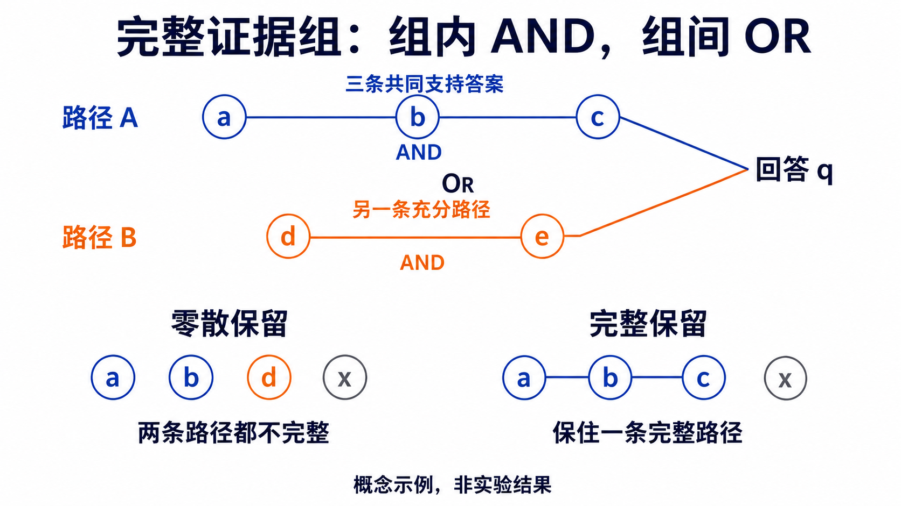
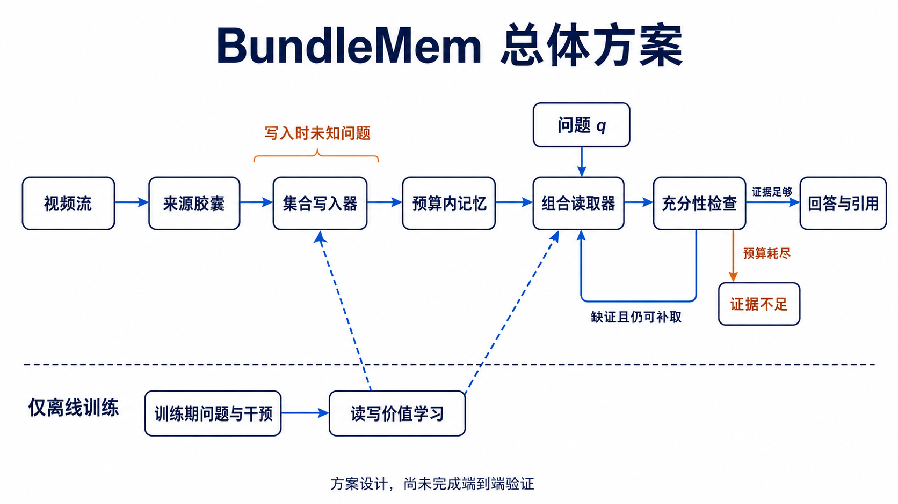
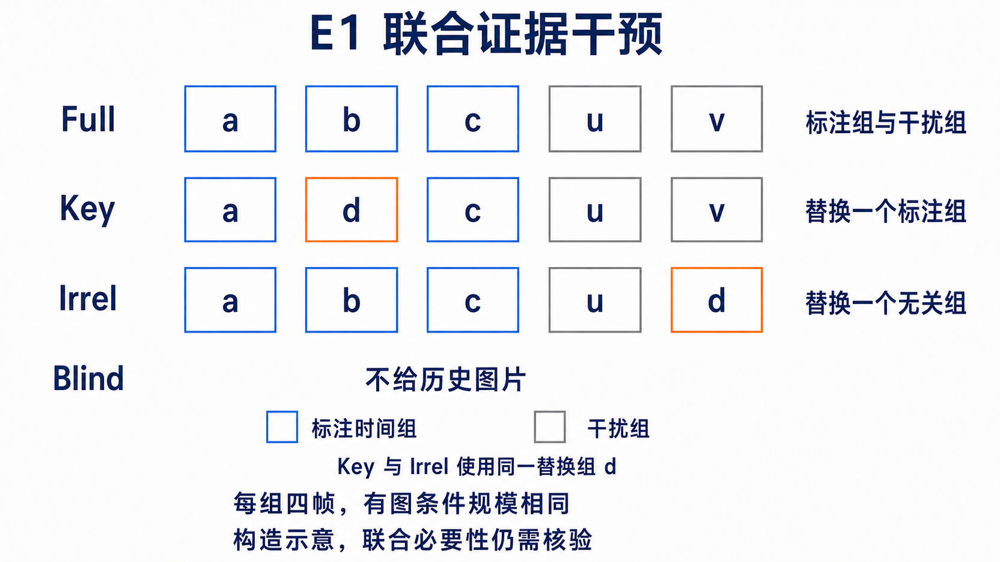

# BundleMem：15 页 PPT 内容稿

资料截止：2026-09-07。含封面共 15 页。

文字参考《具身感知与规划组周报-包睿-20260824.pptx》，采用“背景、目的、设计、指标、结果”等短标题和完整说明句。表格仅用于第 12、13 页的实验结果。

每页的“上屏文字”“配图”“表格”可直接用于 PPT。“备注与来源”用于讲解和追溯，不必上屏。三张图均为方法或实验构造示意。

## 第 01 页｜BundleMem：组合证据视觉记忆

### 上屏文字

**BundleMem：组合证据视觉记忆**

相关调研、方法设计与初步实验

2026/9/7

### 备注与来源（不上屏）

方法以 9 月 6 日闭环设计为准，结果来自 9 月 7 日 pilot 及后续审计。完整方法与本轮实际实现分别说明。

来源：[闭环方法设计](../../../docs/plan/cvpr2027_bundlemem_closed_loop_design.md)、[探索实验](../../../experiments/EXP-20260907-egvqa-15h-pilot/README.md)、[失败审计](../../../experiments/EXP-20260907-egvqa-failure-audit/README.md)。

## 第 02 页｜研究背景

### 上屏文字

**任务形式**

模型连续接收视频，在固定存储预算内建立记忆。未来问题出现后，只能依靠保留的记忆回答，不能回看原视频。

**任务意义**

长期运行的视觉助手和机器人需要反复利用早期观察。有限资源下的历史信息保留与调用，是支持长时程理解和决策的基础。

**核心问题**

写入时不知道未来会问什么，而答案可能依赖相隔很远的多个事件。需要判断哪些信息值得保留，以及如何在问题到来后取齐所需证据。

**研究动机**

单条片段的显著性或相关性不能直接反映证据是否完整。希望以完整证据组为优化单位，提高有限记忆对未来问答的支持能力。

### 备注与来源（不上屏）

本页直接介绍问题出现晚于记忆写入的任务形式。视觉助手和机器人用于说明长期记忆的应用意义，本工作的当前验证仍以视频问答为主。研究动机是同时考察完整证据的保留与取回，预期收益需要实验验证。

来源：[方法设计，第 1、4 节](../../../docs/plan/cvpr2027_bundlemem_closed_loop_design.md)、[组合证据动机，第 1 节](../../../research/ideas/fqr_candidate_motivation_and_nearest_work_2026-09-02.md)、[EMBER](https://arxiv.org/abs/2606.05894v2)。

## 第 03 页｜相关研究与动机：视频选择与记忆压缩

### 上屏文字

**1. 问题引导的选择：LongVU、VideoTree**

LongVU 根据文本查询和帧间冗余压缩视觉特征。VideoTree 根据问题逐层细化视频树，提取相关关键帧。

不足：选择过程依赖已知问题，不能直接用于未来问题未知时的在线写入。

**2. 流式视觉记忆：StreamMem、CausalMem、Flash-VStream**

StreamMem 用通用查询选择 KV，CausalMem 根据语义冗余更新记忆。Flash-VStream 分离概要记忆与细节记忆，支持快速读取。

不足：重要性、冗余和信息密度能够指导压缩，但不能直接衡量多段证据是否共同支持一个答案。

**研究动机**

在问题未知时，根据证据间的互补关系分配记忆预算，减少关键证据组因局部删减而不完整的情况。

### 备注与来源（不上屏）

按各方法的主要作用分类，不将它们视为严格互斥的技术路线。

第一类解决问题已知后的选择效率。LongVU 先用 DINOv2 去冗余帧，再进行文本引导的特征选择及跨帧空间压缩；VideoTree 通过自适应广度和相关性引导的深度扩展组织视频。它们可作为读取阶段的参考，但问题依赖部分不能直接用于测试问题不可见的写入。

第二类中，StreamMem 通过视觉 token 与通用 query token 的注意力压缩固定大小 KV；CausalMem 以在线语义基估计冗余；Flash-VStream 用低容量概要记忆估计信息密度，再引导高容量细节记忆的读取。这里只概括其机制，不将三者都描述为相同总字节预算或相同无回放协议。

对证据完整性的不足是本项目从这些选择目标出发提出的研究判断，并非已复现的共同失败结论。需要用多段联合必要性和同预算集合干预检验，不能从方法结构直接断言它们一定丢失关键证据。

来源：[LongVU，ICML 2025](https://proceedings.mlr.press/v267/shen25j.html)、[VideoTree](https://arxiv.org/abs/2405.19209)、[StreamMem](https://arxiv.org/abs/2508.15717)、[CausalMem](https://arxiv.org/abs/2606.25658)、[Flash-VStream，ICCV 2025](https://www.openaccess.thecvf.com/content/ICCV2025/papers/Zhang_Flash-VStream_Efficient_Real-Time_Understanding_for_Long_Video_Streams_ICCV_2025_paper.pdf)。仓库调研：[长视频工作表](../../../research/ideas/survey_1/appendix_B_long_video_30.md)、[视觉记忆调研](../../../research/ideas/survey_2/视觉记忆与超长视频理解调研报告_2026-08.md)。

## 第 04 页｜相关研究与动机：任务价值与证据读取

### 上屏文字

**3. 任务驱动的记忆保留：EMBER、OSL-MR、TaskMem**

EMBER 用检索和回答反馈训练写入。OSL-MR 学习逐条证据价值。TaskMem 根据环境任务反馈调整记忆策略。

不足：任务奖励或逐条证据标签，没有直接区分哪些视觉证据必须共同保留、哪些证据组可以相互替代。

**4. 证据验证与读写协同：REVEAL、Mem-T**

REVEAL 检查证据充分性并针对缺口补检索。Mem-T 通过操作树将最终反馈分配到各步，联合训练记忆构建与多轮检索。

不足：补检索无法恢复已删除的证据，已有读写协同还需在视觉证据和存储、读取双预算下验证。

**研究动机**

以完整证据组的可用性为共同目标，联合学习保留与读取，并分别检查证据是否存下、取齐和真正支持回答。

### 备注与来源（不上屏）

第三类已经使用任务监督，不能概括为只按显著性保留。EMBER 保存来源证据，并沿保留、读取、回答过程训练 writer。OSL-MR 明确讨论非可分的长期效用，但实际以逐 memory 的 evidence-membership 标签训练。TaskMem 在环境任务反馈下调整多模态记忆重点，其流式问答评估也禁止回看原视频。TaskMem 还包含部署后的 adapter 更新，不能直接等同于本项目测试权重冻结的协议。

这里的不足指缺少对 AND / OR 证据结构的显式区分，不表示总体任务奖励无法间接学到互补性。BundleMem 需要证明集合级监督相对这些已有机制的额外收益。

第四类按读取与协同机制归纳：REVEAL 已实现充分性检查和针对性再检索，Mem-T 已实现联合优化读写。本项目不能将一般 retrieve–verify 循环或读写联合训练作为首次贡献。REVEAL 的可检索视频集合与本任务已经压缩、不可回放的有限记忆不同；Mem-T 的语言记忆结果也不能直接视为视觉证据组可用性的验证。

本页的研究动机承接上一页：写入保住互补证据，读取在预算内取齐这些证据，最后用来源支持和问答表现验证收益。该闭环方案尚未完成端到端实验。

来源：[EMBER v2](https://arxiv.org/abs/2606.05894v2)、[OSL-MR v6](https://arxiv.org/html/2606.10616v6)、[TaskMem](https://arxiv.org/abs/2605.31075)、[REVEAL v1](https://arxiv.org/html/2608.08612v1)、[Mem-T v2](https://arxiv.org/abs/2601.23014v2)。本项目定位：[方法设计，第 3 节](../../../docs/plan/cvpr2027_bundlemem_closed_loop_design.md)、[组合证据动机，第 1 节](../../../research/ideas/fqr_candidate_motivation_and_nearest_work_2026-09-02.md)。

## 第 05 页｜证据组定义

### 上屏文字

**Evidence bundle**

将能够共同支持一个答案的证据集合定义为一个 bundle。组内证据共同发挥作用，不同充分组可以提供替代路径。

**原理**

组内是 AND 关系，组间是 OR 关系。记忆至少需要保住一组完整证据，才能保留对应的答案路径。

### 配图

图注：同样保留四项，右侧保住了完整路径 {a,b,c}。x 为无关项。

### 备注与来源（不上屏）

图为概念示意，不是真实视频结果。充分性相对于任务、表示和验证标准定义。自然数据通常只能核验部分充分组，不能假定已找到所有替代路径。完整组存活也不保证消费者一定能够答对。

来源：[配图记录](assets/bundlemem_2026-09-07/prompts.md)、[第 4.4 节](../../../docs/plan/cvpr2027_bundlemem_closed_loop_design.md)。

## 第 06 页｜任务设置

### 上屏文字

**写入阶段**

系统按时间顺序接收视频，只能使用当前观察和已有记忆，不能访问未来问题。

**读取阶段**

问题出现后，只从保留的记忆中检索证据，不能回看原视频。同一视频的多个问题共享一个冻结快照。

**预算与评价**

统一核算记忆载荷、索引和元数据的存储字节，以及累计读取 token 和模型调用次数。

分别检查证据是否存下、是否取齐，以及回答是否有来源支持。

### 备注与来源（不上屏）

协议面向预先声明的任务族。问题之间重置 reader 临时状态，避免跨题信息积累。存储覆盖、读取覆盖、答案准确率和实际来源支持需分别测量。时间覆盖和合法引用不足以证明模型使用了必要事实。

来源：[方法设计，第 4 节](../../../docs/plan/cvpr2027_bundlemem_closed_loop_design.md)。

## 第 07 页｜BundleMem 方法框架

### 上屏文字

**设计思路**

将视频表示为带有来源和时间信息的记忆单元，通过集合写入策略保留证据，在问题到达后进行组合读取。

**优化目标**

以完整证据能否被取回并用于回答作为共同目标，训练写入和读取模块。

### 配图

图注：训练问题只用于离线监督，部署时的写入模块不接收未来问题。

### 备注与来源（不上屏）

本页介绍完整方案，尚未完成端到端训练验证。E1 隔离检查证据依赖，E2 使用 reservoir 写入和规则式读取。学习写入器、学习读取头及停止策略尚未运行。方案中的来源 capsule 保存真实观察载荷，充分性模块决定继续补取、回答或标记证据不足。

来源：[配图记录](assets/bundlemem_2026-09-07/prompts.md)、[方法设计，第 5 节](../../../docs/plan/cvpr2027_bundlemem_closed_loop_design.md)。

## 第 08 页｜集合写入策略

### 上屏文字

**设计目的**

根据证据之间的互补和替代关系，判断当前片段是否值得保留。

**实现方式**

将当前记忆和新片段输入集合评价器，比较跳过、插入和替换后的整体价值，选择满足预算的更新动作。

**延迟价值**

早期证据可能要与很久之后的片段结合才有用。训练时回放后续视频，根据最终问答结果学习早期保留决策的价值。

### 备注与来源（不上屏）

例如已有 b、c 时，加入 a 可以补齐 {a,b,c}。但 a 先出现时，评价器也需要估计它与后续证据结合的价值。实际未来片段只用于训练期标签，不作为部署输入。集合评价器可以输出标量，比较对象是不看集合上下文的独立评分方法。

来源：[方法设计，第 5.2、6.5 节](../../../docs/plan/cvpr2027_bundlemem_closed_loop_design.md)。

## 第 09 页｜组合读取策略

### 上屏文字

**设计目的**

根据当前证据缺少的事实或关系，补取能够共同支持答案的片段。

**实现方式**

先读取初始证据，生成缺失事实的检索需求，再比较单片段与小集合扩展。读取真实图像后，检查来源和证据充分性。

**组合读取的作用**

若回答需要 {a,b,c}，当前只取到 a，单独加入 b 或 c 仍不完整。联合取回 {b,c} 才可能补齐答案路径。

### 备注与来源（不上屏）

完整设计使用有限 beam 与小组扩展，并根据剩余预算和补取收益停止。当前 E2 仅实现最多两条缺口查询和规则式三项组合，还未训练集合读取头或停止策略。读取只能利用存活记忆，无法恢复已经删除的载荷。

来源：[方法设计，第 5.3–5.5 节](../../../docs/plan/cvpr2027_bundlemem_closed_loop_design.md)、[pilot 读取协议](../../../docs/plan/egvqa_15h_single_gpu_validation_plan.md)。

## 第 10 页｜训练方案

### 上屏文字

**监督构造**

利用已有问答和历史恢复任务提出证据组。比较完整组与删除、替换后的同预算集合，获得组级价值标签。

**读取模块训练**

学习证据集合的排序、充分性判断，以及继续补取能否改善回答。

**写入模块训练**

对同一视频前缀执行不同记忆更新，回放后续视频，用最终任务表现评价保留决策。

**当前进展**

已完成训练方案设计，先通过探索实验检验联合依赖和组合读取的有效性。

### 备注与来源（不上屏）

训练前需确认完整包可答、证据有真实来源，且无记忆对照不能轻易完成任务。已有 QA、VLM 伪标签与纯自监督应分别披露。低置信集合标 unknown。首先冻结大模型并学习小模块，本轮 E3 集合重排学习未启动。

来源：[方法设计，第 6 节](../../../docs/plan/cvpr2027_bundlemem_closed_loop_design.md)、[pilot E3 条件](../../../docs/plan/egvqa_15h_single_gpu_validation_plan.md)。

## 第 11 页｜验证性探索实验设置

### 上屏文字

**实验总目的**

验证自然视频中是否存在可测的联合证据依赖，以及组合补取能否改善固定记忆上的问答。

**数据与模型**

使用 EG-VQA 官方 train 内的 12 个视频、48 道题。冻结 Qwen3-VL-8B-Instruct，使用 CLIP 构造检索表示。

**记忆与读取设置**

E2 使用 64 槽 reservoir 记忆，每段 2 秒、4 帧、224×224。最终最多读取 6 段、24 帧，每题累计上限 12,288 token。

**实验范围**

本轮验证数据、表示和规则式读取，尚未训练完整 BundleMem。

### 备注与来源（不上屏）

数据选择 seed=17；差值区间按视频聚类 bootstrap 2,000 次、seed=43。人工评分与语义校准尚未完成，因此本轮是工程探索，不是官方测试集成绩。E1 对每个标注时间组取四帧，时间尺度不同于 E2 的两秒 capsule。

来源：[实验 README](../../../experiments/EXP-20260907-egvqa-15h-pilot/README.md)、[EG-VQA 官方仓库](https://github.com/HCPLab-SYSU/EG-VQA)。

## 第 12 页｜1. 联合证据依赖验证实验

### 上屏文字

**实验目的**

判断回答是否需要多个证据组共同支持。

**实验设计**

比较完整包 Full、标注组替换 Key、无关组替换 Irrel 和无图 Blind。所有有图条件保持相同输入规模。

**原理与指标**

D 衡量替换标注组相对替换无关组的额外影响：D = Irrel 平均准确率 − Key 平均准确率。

### 配图

### 表格

评测范围：48 道计划题中，44 道完成全部配对条件。下表统一使用这 44 道题。

| 实验条件 | 输入变化 | 平均准确率（44题） |
|---|---|---:|
| Full | 完整证据包 | 25.00% |
| Key | 替换一个标注证据组 | 26.89% |
| Irrel | 替换一个无关组 | 27.27% |
| Blind | 无历史图片 | 4.55% |

### 上屏文字

**结果分析**

完整包可答率低，两类替换差异小且估计不确定。没有题目通过预设联合依赖筛选，当前未检出预定联合信号。

图表脚注：Key、Irrel 先在题内平均，再对 44 题平均。D = +0.38 个百分点，95% 置信区间为 −10.23 至 +10.61 个百分点，跨过 0。本地 judge 尚未完成人工校准。

### 备注与来源（不上屏）

图采用三个标注组和两个无关组的五组例子。Key 与 Irrel 使用同一个替换组 d，图仅说明条件构造。实际对每个标注组分别替换，并设置两种无关组替换。

D 原定义为 (Full−Key)−(Full−Irrel)，Full 项相消后就是 Irrel−Key。每题先平均该题各次 Key 或 Irrel 替换的分数，再对 44 题平均；因不同题的 Key 次数不同，26.89% 不能换写成一个整数答对题数／44。Full=11/44、Blind=2/44，本页统一显示两位小数。

**D 怎样计算：**27.2727%−26.8939%=+0.3788 个百分点，四舍五入为 +0.38 个百分点。D 大于 0 表示标注组替换比无关组替换造成了更大的平均下降；D 等于 0 表示两种替换的平均影响相同；D 小于 0 表示方向相反。D 很小不能单独证明没有作用，还要看估计的不确定性。

**95% 表示什么：**这是区间估计方法采用的置信水平。按频率学解释，如果在相同条件下反复抽样并用同样规则构造区间，在方法成立的条件下，约 95% 的区间会覆盖真实差值。它不是模型准确率，也不是对“当前这个固定区间含真值的概率”为 95% 的断言。本实验用按视频聚类的 bootstrap 近似估计区间，共重采样 2,000 次，seed=43。

**区间怎样理解：**−10.23 是下界，+10.61 是上界，单位都是百分点。区间跨过 0，说明当前数据对差值方向的判断仍不确定，无法明确支持标注组替换的影响稳定大于无关组替换。它不是单题得分范围，也不意味着再做实验一定落在这个范围内。

**联合依赖筛选：**要求 Full 正确、Blind 错误、两次 Irrel 均正确，而且至少两次不同 Key 变错。自动候选为 0 题。人工确认还需核验各组是否提供不同必要事实、干扰组有无替代答案路径。统计区间仅刻画视频抽样不确定性，不能消除评分冲突和语义标注问题。

来源：[实验结果](../../../experiments/EXP-20260907-egvqa-15h-pilot/results.md)、[后续分析，第 2 节](../../../experiments/EXP-20260907-egvqa-failure-audit/analysis.md)。图的提示词见 [配图记录](assets/bundlemem_2026-09-07/prompts.md)。

## 第 13 页｜2. 组合读取验证实验

### 上屏文字

**实验目的**

判断固定记忆中，组合补取是否优于普通二轮检索。

**实验设计**

R1、R2 先读取相同的三段，再补取三段。R1 按单条查询检索，R2 根据缺口查询联合选择三段证据。

**原理与指标**

比较问答准确率与完整时间组覆盖率。R1、R2 的平均累计 token 差为 1.1%。

### 表格

| 方法 | 答对题数 | 准确率 | 完整时间组覆盖率 |
|---|---:|---:|---:|
| R0：单轮 top-6 | 11／48 | 22.9% | 29.2% |
| R1：普通二轮 | 16／48 | 33.3% | 33.3% |
| R2：组合补取 | 10／48 | 20.8% | 33.3% |
| R*：时间组注入参考 | 11／48 | 22.9% | 87.5% |

### 上屏文字

**结果分析**

R2 比 R1 低 12.5 个百分点，时间覆盖没有提高。当前规则式组合补取未表现出优势。

图表脚注：保留原 judge 分数；时间覆盖仅为代理，R* 不是准确率上界。

### 备注与来源（不上屏）

R0 是单轮 top-6。R1 使用一条查询，R2 最多两条缺口查询，从最多八项候选中联合选三项。R* 只注入同一快照内满足标注时间覆盖规则的存活载荷。

覆盖计数为 14/48、16/48、16/48、42/48。本页将计数换算为百分比，保持同一分母。原 R2−R1 95% CI=[−22.92,−2.08] pp，2 题改善、8 题退步，显著性受下一页的评分冲突影响。可行子集上 R* 覆盖 42/42，仅答对 9/42，时间覆盖不保证关键动作可见。

来源：[原结果主表](../../../experiments/EXP-20260907-egvqa-15h-pilot/results.md)、[原逐题分数](../../../experiments/EXP-20260907-egvqa-15h-pilot/paired_scores.json)、[后续审计](../../../experiments/EXP-20260907-egvqa-failure-audit/analysis.md)。

## 第 14 页｜实验结果分析

### 上屏文字

**评分一致性**

57 个同题同答重复组中，6 组出现判分冲突。仅统一相扑题的 R1/R2 分数，差值置信区间就跨过零。

**视觉表示**

E1 每个标注组仅取四帧，区间跨度中位数为 33 秒。覆盖标注时间段仍可能漏掉关键动作。

**检索目标**

R2 两条缺口查询的 CLIP 相似度中位数为 0.944。查询匹配和外观去重未必能够区分需要补充的事实。

**独立重答**

四道诊断题的 42 个不同输入经独立 AI 重答，仍有动作和关系遗漏。当前结果受多个环节共同影响。

### 备注与来源（不上屏）

相扑题四种 E2 方法都回答“Sumo wrestling match”，原 judge 单独判 R2 错；其中 R0/R2 图像包相同。仅让 R1/R2 同答同分后，差值为 −10.42 pp，95% CI=[−22.92,+2.08] pp。此为敏感性分析，不回写原主结果。对所有冲突进行一致赋值的情景仍有负点估计，评分缺陷不是全部原因。

重答选择相扑、布料、自行车和火坑四题，共 44 个条件、42 个不同输入。选例依据原结果事后分层，模型和呈现方式也不同于原 Qwen，不能据此估计总体提升。

来源：[失败审计 README](../../../experiments/EXP-20260907-egvqa-failure-audit/README.md)、[评分诊断](../../../experiments/EXP-20260907-egvqa-failure-audit/scoring_diagnostics.md)、[表示与读取分析](../../../experiments/EXP-20260907-egvqa-failure-audit/analysis.md)、[逐例画面观察](../../../experiments/EXP-20260907-egvqa-failure-audit/case_observations.md)。

## 第 15 页｜总结与下一步

### 上屏文字

**当前结论**

已完成相关调研、BundleMem 方案和两项探索实验。当前未验证出稳定的联合依赖信号，规则式组合读取也未表现出优势。

**评价与表示检查**

先统一同题同答的评分，人工核验完整包可答性和必要事实，再检查当前选帧能否显示关键动作。

**后续实验**

在独立样本上比较选帧、缺口查询和集合选择目标。前提成立后训练集合模块，通过 writer × reader 交叉实验区分读写贡献。

### 备注与来源（不上屏）

后续沿用相同前端、回答模型及成本口径，同时检查事实覆盖和任务表现。当前结果不足以否定组合证据假设，也不能作为完整 BundleMem 有效的证据。人工校准、学习 writer、学习 reader 和端到端验证仍未完成。

来源：[失败分析，第 7 节](../../../experiments/EXP-20260907-egvqa-failure-audit/analysis.md)、[方法设计，第 8 节](../../../docs/plan/cvpr2027_bundlemem_closed_loop_design.md)。
