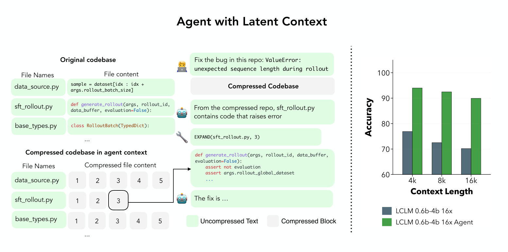
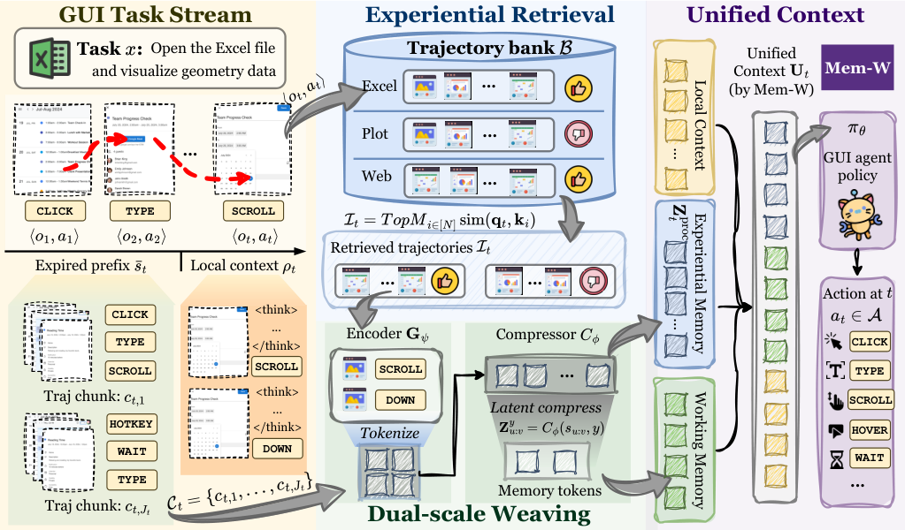
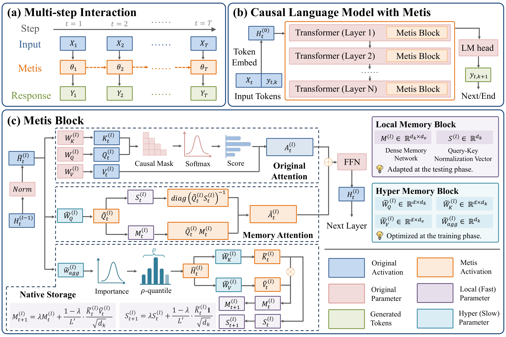
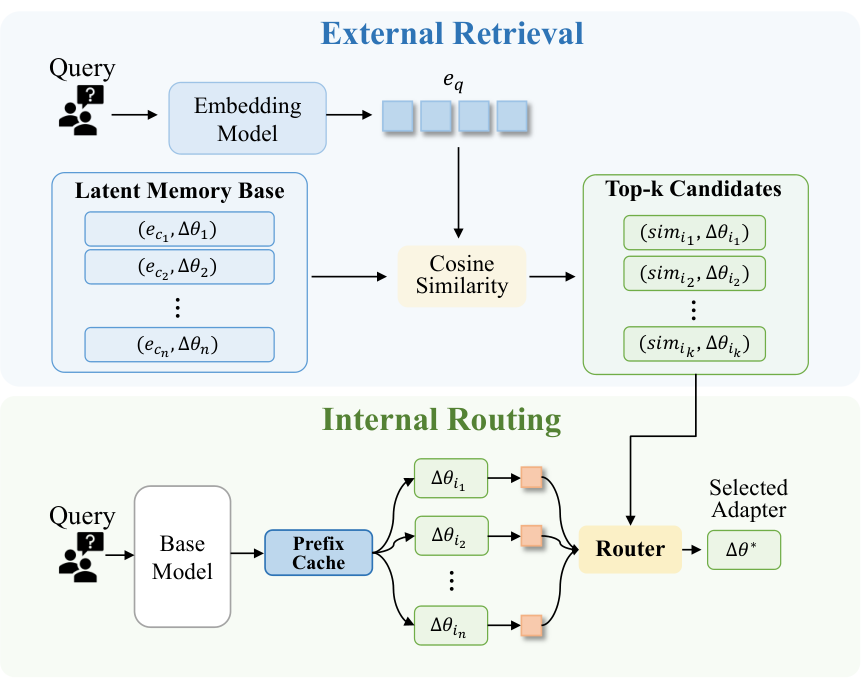

# 潜记忆：从视频流到大模型与 Agent｜12 页周报内容稿

资料截止：2026-09-09。**封面 1 页＋正文 10 页＋结束 1 页，共 12 页。**

沿用[上一期周报](../2026-09-07/bundlemem_15slides_2026-09-07.md)的短标题、完整说明句，以及“上屏文字／配图／备注与来源”结构。正文按五条技术分支组织，每条恰好两页：总体介绍和代表工作。表格用于路线对照，公式采用 LaTeX。图来自论文原文，未改写数值；完整 40 篇逐篇介绍见[联合调研报告](../../../research/literature/latent_memory_followup_2026-09-09.md)。

## 第 01 页｜潜记忆：从视频流到大模型与 Agent

### 上屏文字

**2026 年潜记忆研究进展**

20 篇新增工作与 20 篇视频流工作的联合梳理

五条技术路线：压缩读取、任务编排、递归状态、KV 补偿、参数与条件查表

2026/9/9

### 备注与来源（不上屏）

新增 20 篇均为 2026 年首发，且不与旧 79 篇目录重复。MemGen、VisMem 首发于 2025 年，只作为团队脉络前作。正文第 02–11 页共 10 页，每条路线先概述再讲代表论文。选择依据是署名中的知名企业或领域研究团队，不宣称每篇新作均已获得高引用。

来源：[完整报告与逐篇链接](../../../research/literature/latent_memory_followup_2026-09-09.md)。

## 第 02 页｜路线一：潜表示压缩与事实读取

### 上屏文字

**背景**

视频或文本历史越来越长，模型不能反复读取全部内容。潜记忆用较短的连续表示保存信息，供后续问题使用。

**设计**

关键是同时设计“怎样压缩”和“怎样读回”。直接读取节省输入；先重建有利于核查事实；按需展开则保留精确回查的机会。

**方法脉络**

MovieChat、Video-XL 的稀疏／总结表示，连接到 LCLM 的联合读写训练、NextMem 的事实重建，以及 One Token 的多模态证据读取。

**核心问题**

压缩后的记忆是否仍保留实体、属性和顺序？token 数量减少，不直接等于事实完整或总存储受控。

### 备注与来源（不上屏）

本分支还包含 LycheeMemory 和 EvoEmbedding。前者是潜 KV 长期库与文本工作记忆的混合系统；后者让潜状态参与检索表示的更新。分类依据是主要贡献，不要求所有构件形态相同。

来源：[MovieChat](https://arxiv.org/abs/2307.16449)、[Video-XL](https://arxiv.org/abs/2409.14485)、[LCLM](https://arxiv.org/html/2606.09659v1)、[NextMem](https://arxiv.org/html/2603.15634v1)、[One Token](https://arxiv.org/html/2606.10572v1)、[LycheeMemory](https://aclanthology.org/2026.acl-long.365/)、[EvoEmbedding](https://arxiv.org/html/2606.21649v2)。

## 第 03 页｜代表工作：LCLM

### 上屏文字

**目的**

End-to-End Context Compression at Scale（2026/6）：让解码器学会直接阅读压缩上下文，并在需要精确事实时展开原文。

**设计**

分块文本 → 编码与池化 → 投影后的潜 token → 解码器。先对齐接口，再逐步解冻编码器和解码器；agent 通过 EXPAND 调用原始片段。

**证据与边界**

0.6B 编码器＋4B 解码器，比较 4／8／16 倍压缩，每种配置继续预训练超过 350B token。精确回查改善检索，但需要额外保存原文。

### 配图

图源：原论文 Fig.6。左侧展示 EXPAND 流程，右侧为原文检索实验。

### 备注与来源（不上屏）

团队包括 NYU、Princeton、UMD、Columbia、Harvard、Meta FAIR、LLNL 等。论文的四阶段训练为 adapter warmup、encoder training、end-to-end continual pretraining、SFT；不是只训练一个小 adapter。EXPAND 在 RULER 的 NIAH 任务上验证，不能写成已经完成真实软件工程或视频记忆评测。

本页启发：潜表示可负责低成本浏览，原始证据负责精确核对。迁移到不允许回看的视频协议时，需要关闭外部回查，或把回查库纳入同一预算。

来源：[LCLM §3–7](https://arxiv.org/html/2606.09659v1)。

## 第 04 页｜路线二：按任务生成与编排潜记忆

### 上屏文字

**背景**

同一段历史，对不同任务、角色和当前步骤的价值不同。记忆接口需要选择来源、调用时机与分配容量。

**设计**

先检索或积累经验，再根据当前状态生成潜 token。Mem-W 管理经验和工作历史，LatentMem 按角色定制，ElasticMem 学习可变读取预算。

**团队脉络**

颜水成／NUS 相关工作从 MemGen、VisMem，扩展到 L²-VMAS、Mem-W、LaMem-VLA，再连接 StreamFlow 与 LatentStream 的视频流记忆。

**核心问题**

读取策略的收益与存储表示的收益需要分开。按任务生成的潜记忆，还应保留关键证据的身份和来源。

### 备注与来源（不上屏）

这里的团队连线是主题上的归纳，不表示每篇严格继承前篇。MemGen、VisMem 为 2025 首发的补充前作。L²-VMAS 按视觉／思考分记忆；LaMem-VLA 按短／长期历史组织，二者不能都描述成同一个“双库”。LatentMem 本次按 v2 署名归为同济、上海 AI Lab、CUHK 等合作，未直接归入颜水成团队。HyMEM 用概念图组织连续轨迹，是这一分支中的结构混合路线。

来源：[MemGen](https://arxiv.org/abs/2509.24704)、[VisMem](https://arxiv.org/abs/2511.11007)、[L²-VMAS](https://arxiv.org/html/2602.00471v2)、[Mem-W](https://arxiv.org/html/2605.09317v1)、[LaMem-VLA](https://arxiv.org/html/2607.07608v1)、[LatentMem](https://arxiv.org/html/2602.03036v2)、[ElasticMem](https://arxiv.org/html/2605.30690v1)、[StreamFlow](https://arxiv.org/abs/2608.10949)、[LatentStream](https://arxiv.org/abs/2609.04131)、[HyMEM](https://arxiv.org/html/2603.10291v1)。

## 第 05 页｜代表工作：Mem-W

### 上屏文字

**目的**

Mem-W: Latent Memory-Native GUI Agents（2026/5，LV-NUS Lab）：让 GUI agent 同时利用过去任务的经验与本次任务的早期步骤。

**设计**

共享压缩器将两类观察—动作轨迹变为潜 token，前置给冻结的 agent；当前画面和近期原始步骤继续提供精确上下文。

**训练与边界**

先从长历史 teacher 自蒸馏，再用任务结果训练压缩器。双记忆消融显示互补性；外部轨迹库和检索成本仍需计入系统预算。

### 配图

图源：原论文 Fig.1，共享压缩器与双来源潜记忆。

### 备注与来源（不上屏）

压缩器采用 Q-Former 风格的可学习查询。历史成功／失败轨迹带结果信息；在线工作片段使用未知结果标记，不能注入尚未发生的终局反馈。论文冻结 policy，仅训练 compressor；Top-M 检索采用冻结编码器，不通过离散选择反向传播。评测覆盖 Web 和移动端四组任务。

与视频流的连接：工作记忆可承担当前观察历史，经验记忆可提供可复用策略，但“过去怎么做”不能取代“这次看到了什么”。来源消融与事实保持应分别检验。

来源：[Mem-W §3.2–3.4、§4.4](https://arxiv.org/html/2605.09317v1)。

## 第 06 页｜路线三：递归状态与在线关联记忆

### 上屏文字

**背景**

持续输入下，逐条保存历史会使记忆库增长。递归方法把过去信息反复写入固定维度状态，让后续计算直接读取。

**设计**

用训练得到的更新器吸收当前表示，再依当前问题读取状态。这里的状态变化，与基础模型参数变化是两回事。

$$
M_t=U_\phi(M_{t-1},h_t),\qquad r_t=R_\psi(M_{t-1},q_t).
$$

**方法脉络**

VideoLLaMB、VideoStreaming 的跨片段传播，连接到 Metis 的原生记忆程序与 δ-mem 的在线关联矩阵。

**核心问题**

状态容量有限，必须检验干扰写入和旧事实覆盖。持续运行时长与历史事实保留时长应分开报告。

### 备注与来源（不上屏）

公式是本周报的路线抽象，不是任何单篇论文的完整方程。$M_t$ 是动态状态；$\phi,\psi$ 是训练得到的静态更新／读取参数。旧 MA-LMM、WeaveTime 也提供历史特征融合或时间表征的参照。δ-mem 在冻结全注意力骨干旁加入关联状态，并以其读出修正注意力，不是纯递归骨干替换。

来源：[VideoLLaMB](https://arxiv.org/abs/2409.01071)、[VideoStreaming](https://arxiv.org/abs/2405.16009)、[Metis](https://arxiv.org/html/2607.26760v2)、[δ-mem](https://arxiv.org/html/2605.12357v1)。

## 第 07 页｜代表工作：Metis

### 上屏文字

**目的**

Metis: Memory Foundation Model（2026/7）：将持久状态及其读写程序嵌入模型，使跨交互历史直接参与计算。

**设计**

local memory 保存动态矩阵和归一化状态；hyper memory 从输入隐藏表示中选择信息，执行状态更新。读取结果再参与后续层计算。

**训练与边界**

联合学习重建、记忆操作与正则目标。交互时更新动态状态、保持静态权重冻结；状态有界仍需面对干扰和事实混叠。

### 配图

图源：原论文 Fig.2，Metis block 及记忆读写构件。

### 备注与来源（不上屏）

团队包括 MemTensor、人大、NUS、上海交大、同济等；NUS 相关作者为 Tat-Seng Chua、Yang Zhang，与前述颜水成合作线分别标注。论文将 local memory 中的矩阵称为 dynamic parameters；它们由前向记忆程序更新，不等于测试时对完整基础模型反向传播。

官方实现提供具体状态更新器选项；周报按论文的 local / hyper memory 分工介绍，避免把某一代码默认配置当作整个方法的唯一形式。模型和代码公开，本文未复现实验。

来源：[Metis §3、§5–6](https://arxiv.org/html/2607.26760v2)、[官方代码](https://github.com/MemTensor/Metis)。

## 第 08 页｜路线四：KV 的选择、凝固与淘汰补偿

### 上屏文字

**背景**

KV 可复用已完成的编码，但缓存随历史增长。只保留高分 token，可能删除当前低显著、之后却关键的证据。

**设计**

部分 KV 保持较精确的局部信息；被淘汰内容进入紧凑潜状态，再以补偿通道参与计算。另一方向是复用已有 KV 生成潜记忆。

**方法脉络**

ReKV、StreamMem、MuKV、HERMES 研究检索、选择与分层；IndexMem、RetentiveKV 增加淘汰补偿；FlashMem、MemRoPE 分别关注计算复用和位置一致性。

**核心问题**

固定 GPU cache 不等于固定总存储。近似补偿能否保住短暂细节，需要在同预算下单独检验。

### 备注与来源（不上屏）

旧表 OmniMem、CausalMem、FlexMem、StreamingVLM 也属于本页涉及的缓存管理范畴。ReKV 可将完整历史放在 CPU／磁盘，必须计入外部存储。RetentiveKV 侧重多模态解码时的延迟重要性；MemRoPE 评测视频生成，不直接提供历史问答的证据。

来源：[ReKV](https://arxiv.org/abs/2503.00540)、[StreamMem](https://arxiv.org/abs/2508.15717)、[MuKV](https://arxiv.org/abs/2605.22269)、[HERMES](https://arxiv.org/abs/2601.14724)、[IndexMem](https://arxiv.org/html/2605.25475v2)、[RetentiveKV](https://arxiv.org/html/2605.04075v1)、[FlashMem](https://aclanthology.org/2026.findings-acl.230/)、[MemRoPE](https://arxiv.org/html/2603.12513v1)。

## 第 09 页｜代表工作：IndexMem

### 上屏文字

**目的**

IndexMem（2026/5，HKUST、浙大）：在限定 KV 预算内学习保留关键 token，并减少直接淘汰造成的信息损失。

**设计**

indexer 预测保留价值；淘汰内容写入潜状态；读出以残差方式补偿注意力，避免潜摘要与精确 KV 直接竞争 softmax 权重。

$$
M_t=U(M_{t-1},\mathrm{KV}_{\mathrm{evicted}}),
$$
$$
o_t=\operatorname{Attention}(q_t,K_{\mathrm{keep}},V_{\mathrm{keep}})+R(M_t,q_t).
$$

**证据与边界**

RULER、NIAH、LongBench 检验检索和长文本任务。补偿是近似，仍需测试极端压缩、分布外问题和精确多段证据。

### 备注与来源（不上屏）

公式为简化结构，省略原文归一化、门控与层间处理。IndexMem 的两个贡献是 learnable indexer 与 evicted-token latent memory；不能把全部增益归因于潜状态。原文解释了 prefix memory-as-tokens 可能产生 attention sink，以及 softmax 放大近似误差的问题。

迁移视频时可比较“精确 KV＋潜补偿”和同预算的纯压缩／纯保留。需要把参数、普通 KV、潜状态和外部库分别记账。本页不引用跨配置最大提升来作横向排名。

来源：[IndexMem §3.1–3.2、§4、§6](https://arxiv.org/html/2605.25475v2)、[微软研究院官方条目](https://www.microsoft.com/en-us/research/publication/indexmem-learned-kv-cache-eviction-with-latent-memory-for-long-context-llm-inference/)。

## 第 10 页｜路线五：参数与条件查表中的潜知识

### 上屏文字

**背景**

记忆也可以保存在模型模块或向量表中。此时需要区分：存入的是通用知识，还是某次观察的新经历。

### 表格

| 方式 | 写入与读取 | 代表工作 |
|---|---|---|
| 上下文蒸馏 | 每份上下文训练一个 adapter，查询时检索并选择 | Context Distillation |
| 条件向量查表 | 训练知识向量，按局部 token 模式访问 | Engram |
| 离线表征迁移 | 从冻结模型抽取 n-gram 表征，再供接收模型查表 | Memory Grafting |

### 上屏文字

**核心问题**

参数与查表扩展知识容量，尚不等于在线记住新视频。比较时需计入写入训练、索引、完整模块库及调用成本。

### 备注与来源（不上屏）

该分支补充旧视觉综述较少覆盖的“训练知识记忆”。Engram 的地址是离散 token 模式，读出的值是连续向量；它不是潜状态递归，也不是逐条事件检索。Memory Grafting 的构库模型离线运行，不能据此认定推理时仍调用大模型生成记忆。Context Distillation 的模块是参数式实例记忆，写入需要训练。

来源：[Context Distillation](https://arxiv.org/html/2605.28889v1)、[Engram](https://arxiv.org/html/2601.07372v2)、[Memory Grafting](https://arxiv.org/html/2605.20948v1)。

## 第 11 页｜代表工作：上下文蒸馏的潜记忆管理

### 上屏文字

**目的**

Context Distillation as Latent Memory Management（2026/5，CUHK、华为诺亚）：让多份上下文各自形成可选择、可启停的 LoRA 记忆。

**设计**

外部 embedding 检索候选 → 内部路由选择 adapter → 首 token 熵门控是否启用；共享基础模型的前缀 KV，降低候选比较成本。

**证据与边界**

在 SQuAD、NarrativeQA 等任务中分开检验存储、选择与启用策略。模块化减少混写，但每份上下文仍需蒸馏，门控可靠性依赖分布。

### 配图

图源：原论文 Fig.5，独立 adapter 的外部检索与内部路由。

### 备注与来源（不上屏）

Self-Gating 用候选 adapter 的首生成 token 熵决定继续用 adapter 或退回基础模型；内部路由另外结合外部相似度、隐藏状态等信号。不是只凭一次 embedding 相似度就完成全部选择。首 token 熵是经验代理指标，不能等同模型正确率。

与视频记忆的连接：若未来考虑把片段事实写入参数模块，应先核算逐片段写入成本和事件版本管理；该论文没有验证持续视频中的低成本在线参数记忆。

来源：[Context Distillation §3.1–3.3、§4.2–4.6](https://arxiv.org/html/2605.28889v1)。

## 第 12 页｜讨论与下一步

### 上屏文字

**接下来优先验证**

潜表示是否保住实体、属性与时序证据；精确缓存与潜补偿是否在同预算下互补；未知未来问题时，写入策略是否仍然有效。

**统一比较口径**

分别记录总存储、写入成本、读取成本、事实保持和任务表现，并明确是否允许原始证据回查。

**谢谢，欢迎讨论**

### 备注与来源（不上屏）

本页为结束页，不计入 10 页正文。三个验证问题是本次综述提出的待验证方向，并非实验结论。完整逐篇介绍、团队证据、分类和统一预算公式见调研报告。

来源：[联合报告 §7](../../../research/literature/latent_memory_followup_2026-09-09.md)。
